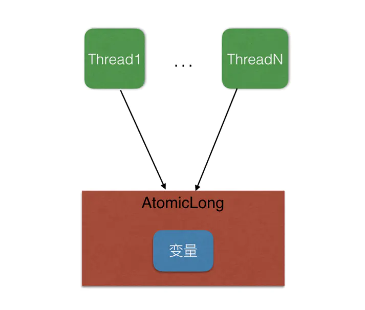
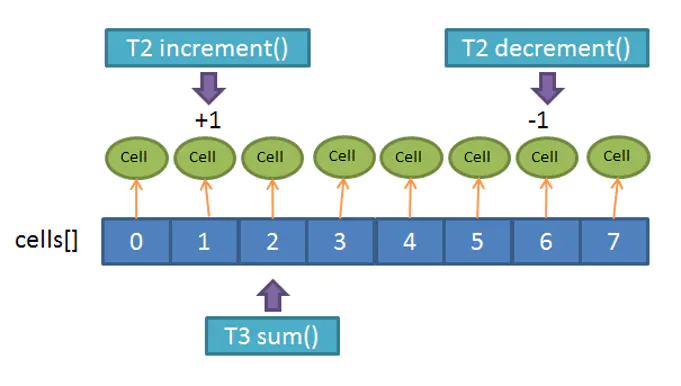
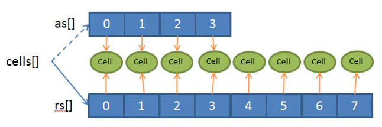

# Table of Contents

* [背景](#背景)
* [原理图](#原理图)
* [increment/decrement/add()](#incrementdecrementadd)
* [longAccumulate](#longaccumulate)
* [参考资料](#参考资料)


# 背景

`AtomicLong` 高并发下，cas失败几率增大，越多线程重试，导致恶性循环，AtomicLong效率降低。 

那怎么解决？ LongAdder给了我们一个非常容易想到的解决方案：

减少并发，**将单一value的更新压力分担到多个value中去**，降低单个value的 “热度”，分段更新！！！

> 高并发：分而治之。


# 原理图





# increment/decrement/add()




```java
public void add(long x) {
        Cell[] as; long b, v; int m; Cell a;
        if ((as = cells) != null || !casBase(b = base, b + x)) {
            boolean uncontended = true;
            if (as == null || (m = as.length - 1) < 0 ||
                (a = as[getProbe() & m]) == null ||
                !(uncontended = a.cas(v = a.value, v + x)))
                longAccumulate(x, null, uncontended);
        }
    }
```


第一次Cell数组为空,进入casBase()

> 这一步可以省略吗？
> casBase操作保证了在低并发时，不会立即进入分支做分段更新操作，因为低并发时，casBase操作基本都会成功，只有并发高到一定程度了，才会进入分支

```java
final boolean casBase(long cmp, long val) {
        return UNSAFE.compareAndSwapLong(this, BASE, cmp, val);
    }
```

即原子更新,成功则直接返回,失败则说明**出现并发了**
if的三个判断

- 数组为空
- 或者数组长度小于1
- 或者位置上没有Cell对象,即getProbe()&m其实相当于hashMap里面的tab[i = (n - 1) & hash]
- 或者修改cell的值失败

才会最终进入到longAccumulate()方法中


# longAccumulate




- 如果Cells表为空，尝试获取锁之后初始化表（初始大小为2）；
- 如果Cells表非空，对应的Cell为空，自旋锁未被占用，尝试获取锁，添加新的Cell；
- 如果Cells表非空，找到线程对应的Cell，尝试通过CAS更新该值；
- 如果Cells表非空，线程对应的Cell CAS更新失败，说明存在竞争，尝试获取自旋锁之后扩容,将cells数组扩大，降低每个cell的并发量后再试


> Q:线程怎么找到之前更新的CEll呢
>
> A: 


# 参考资料

https://www.jianshu.com/p/b3c5b05055de
