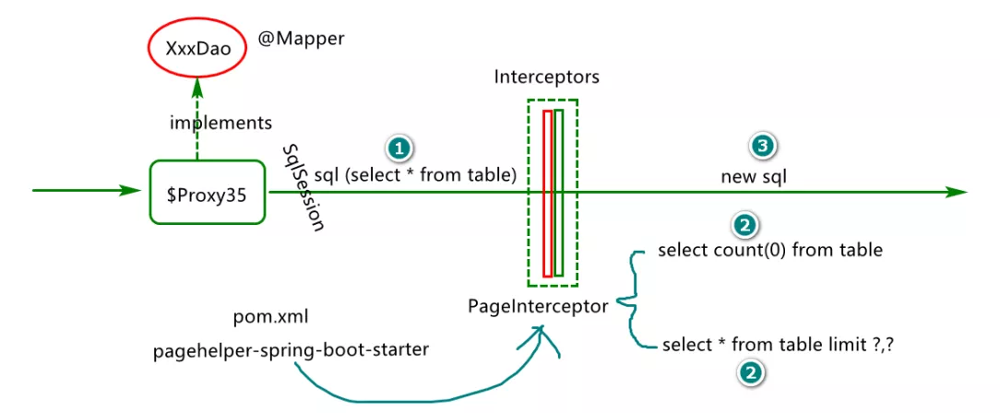

# 原理图



PageHelper 是较为常用的分页插件，通过实现 Mybatis 的 Interceptor 接口完成对 query sql 的动态分页，其中分页参数由 ThreadLocal 进行保存。

**简单的 分页执行过程：**

1. 设置 page 参数

   ```java
   PageMethod.startPage(1,10)
   public static <E> Page<E> startPage(int pageNum, int pageSize) {
       return startPage(pageNum, pageSize, DEFAULT_COUNT);
   }
   ```

2. 执行 query 方法

3. Interceptor 接口 中校验 `ThreadLocal` 中是否存在有设置的 page 参数

4. 存在 page 参数，重新生成 `count sql` 和 `page sql`，并执行查询。不存在 page 参数，直接返回 查询结果

5. 执行 `LOCAL_PAGE.remove()`清除 page 参数


# ThreadLocal的问题

观察上述的执行过程，可以发现，如果在第 1 步和第 2 步 之间发生异常，那么 `LOCAL_PAGE` 中当前线程对应的 page 参数并不会 remove。

在不使用线程池的情况下，当前线程在执行完毕后会被销毁，这时 当前线程 中的 threadLocals 参数 将会被情况，也就清空 了 `LOCAL_PAGE` 中 当前线程的 page 参数。

**但是如果使用了线程池，当前线程执行完毕，并不会被销毁，而是会将当前线程再次存放到池中，标记为空闲状态，以便后续使用。在后续使用这个线程的时候，由于 线程 的 threadLocals 依旧存在有值，尽管我们在第 1 步时未设置 page 参数，第 3 步 的也能获取到page参数，从而生成 `count sql` 和 `page sql`，从而影响我们的正常查询。**

SpringBoot 项目中会使用内置的 Tomcat 作为服务器，而Tomcat会默认使用线程来处理请求，从而便引发了上述问题。


## 解决方案

+ 对所有线程请求加拦截，清除`ThreadLocal`的数据。记得需要注册拦截器

  ```java
  public class PageLocalWebInterceptor implements HandlerInterceptor {
      @Override
      public void afterCompletion(HttpServletRequest request, HttpServletResponse response, Object handler, Exception ex) throws Exception {
  
          // PageHelper.clearPage() 内部调用 LOCAL_PAGE.remove()
          PageHelper.clearPage();
  
      }
  }
  @Configuration
  public class FrameworkAutoConfig implements WebMvcConfigurer {
  
      @Override
      public void addInterceptors(InterceptorRegistry registry) {
          registry.addInterceptor(new PageLocalWebInterceptor());
      }
  }
  ```

  

