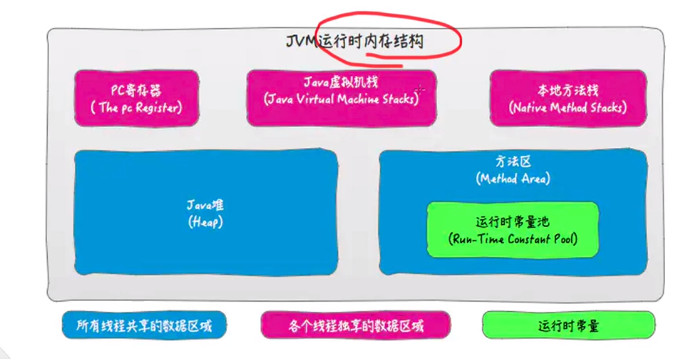
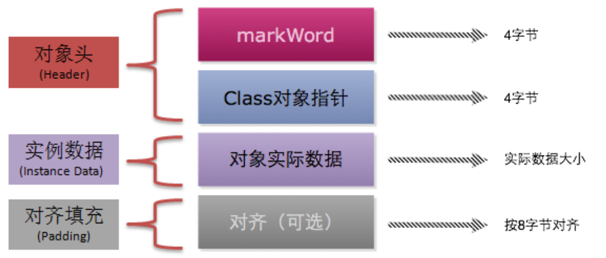
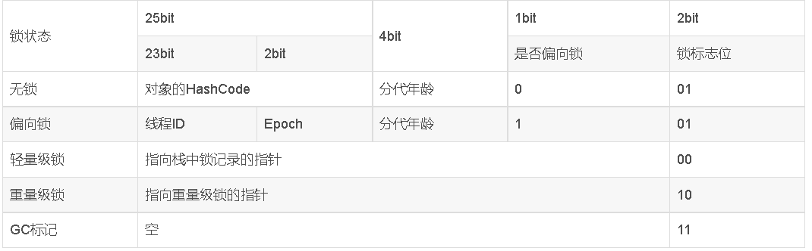
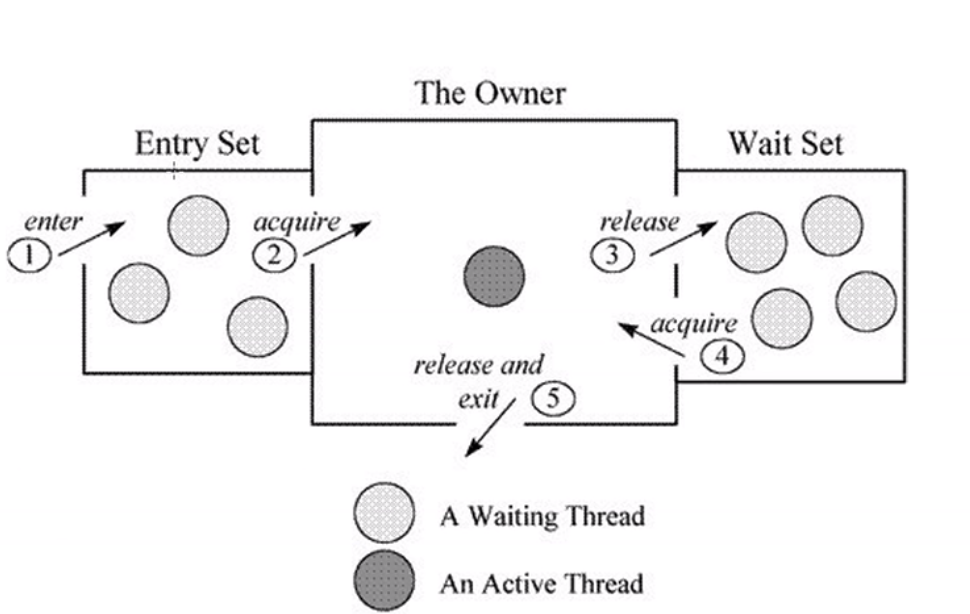
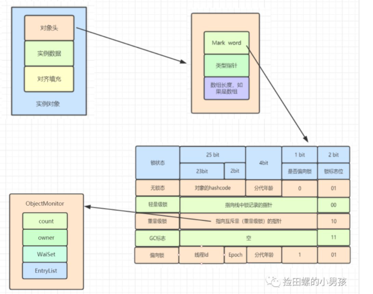
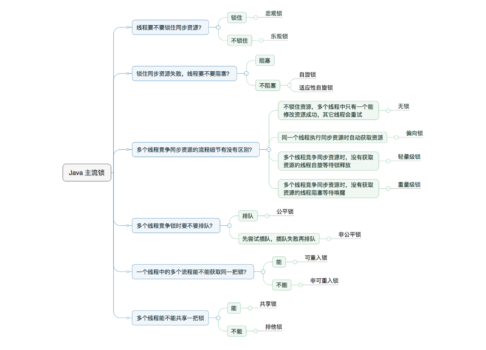

# Table of Contents

* [什么是锁](#什么是锁)
* [对象头](#对象头)
* [Synchronized](#synchronized)
  * [原子性](#原子性)
  * [可见性](#可见性)
  * [有序性](#有序性)
* [**monitorenter、monitorexit、ACC_SYNCHRONIZED**](#monitorentermonitorexitacc_synchronized)
* [Monitor](#monitor)
  * [工作原理](#工作原理)
* [对象与monitor关联](#对象与monitor关联)
* [锁优化](#锁优化)
  * [自旋锁 VS 适应性自旋锁](#自旋锁-vs-适应性自旋锁)
  * [锁消除](#锁消除)
  * [锁粗化](#锁粗化)
  * [无锁](#无锁)
  * [偏向锁](#偏向锁)
  * [轻量级锁](#轻量级锁)
  * [重量级锁](#重量级锁)
* [问题](#问题)
  * [1. mark word 非结构化后`分代年龄`去哪里了？](#1-mark-word-非结构化后分代年龄去哪里了)
  * [2.monitore和Lock Record 的关系](#2monitore和lock-record-的关系)


这边文章理解难度有点大 可以慢慢看

https://www.cnblogs.com/three-fighter/p/14396208.html
https://blog.csdn.net/MichaelSuns/article/details/108055895

https://tech.meituan.com/2018/11/15/java-lock.html

# 什么是锁

​		  在并发情况下，多个线程队会对一个资源进行争抢，可能会导致数据不一致的问题，为了解决这个问题，很多编程语言都引入了锁机制这个概念。来对资源进行锁定。java锁机制是怎么实现的？

我们需要先了解下Java虚拟机内存结构：

<div align=left>
	
</div>


多个线程对共享数据区进行竞争时，数据会发生难以预料的情况，因此需要锁机制对其进行限制。


+ 锁是一种抽象的概念，代码层面是怎么实现的？
  
    简单来说，在java中，每个object，也就是每个对象都拥有一把锁。这把锁存放在<font color=red>对象头中</font>,记录了当前对象被哪个线程所占用，
那么对象头是什么？


# 对象头

以Hotspot(是Jvm的一种实现)为例，JAVA对象 = 对象头 + 实例数据 + 对象填充(java对象必须是8byte的倍数)。

<div align=left>
	
</div>


Hotspot对象头主要包括俩部分数据：Mark Word(标记字段)、klass pointer(类型指针)

+ Mark Word:默认存储对象的<font color=red>HashCode，分代年龄和锁标志位信息</font>。这些信息都是与对象自身定义无关的数据，所以Mark Word被设计成一个非固定的数据结构以便在极小的空间内存存储尽量多的数据。<font color=red>它会根据对象的状态复用自己的存储空间</font>，也就是说在运行期间Mark Word里存储的数据会随着锁标志位的变化而变化。

+ Klass Point:对象指向它的类元数据的指针，虚拟机通过这个指针来确定这个对象是哪个类的实例。

+ 数组长度：数组对象才有


<div align=left>
	
</div>
这里我有2个疑问

1. 为什么hashCode只在`无锁`的时候才会有？
2. 为什么分代年龄在`轻量级锁`之后就没有了？


通过这张表我们可以看到Mark Word只有32bit(32位机器下），并且是非结构化的。在不同锁标志位下，不同的字段可以重用不同的比特位。因此可以节省空间。


# Synchronized

大家都知道Synchronized是可以同步线程。

+ 修饰方法上

  对于第一种情况，编译器会为其自动生成了一个 `ACC_SYNCHRONIZED` 关键字用来标识。

  在 JVM 进行方法调用时，当发现调用的方法被 `ACC_SYNCHRONIZED` 修饰，则会先尝试获得锁。

+ 修饰同步代码块

  对于第二种情况，编译时在代码块开始前生成对应的1个 `monitorenter` 指令，代表同步块进入。2个 `monitorexit` 指令，代表同步块退出。

  这两种方法底层都需要一个 reference 类型的参数，指明要锁定和解锁的对象。

  如果 `synchronized` 明确指定了对象参数，那就是该对象。

  如果没有明确指定,那就根据修饰的方法是实例方法还是类方法，取对应的对象实例或类对象（Java 中类也是一种特殊的对象）作为锁对象。


`synchronized` 关键字加到 `static` 静态方法和 `synchronized(class)` 代码块上都是是给 Class 类上锁。

`synchronized` 关键字加到实例方法上是给对象实例上锁。

- 同步代码块是通过monitorenter和monitorexit来实现，当线程执行到monitorenter的时候要先获得monitor锁，才能执行后面的方法。当线程执行到monitorexit的时候则要释放锁。
- 同步方法是通过中设置ACCSYNCHRONIZED标志来实现，当线程执行有ACCSYNCHRONI标志的方法，需要获得monitor锁。
- 每个对象维护一个加锁计数器，为0表示可以被其他线程获得锁，不为0时，只有当前锁的线程才能再次获得锁。
- 同步方法和同步代码块底层都是通过monitor来实现同步的。
- 每个对象都与一个monitor相关联，线程可以占有或者释放monitor。


## 原子性
加锁肯定是原子性
## 可见性

JMM对synchronized关键字有两条规定：

- 线程解锁前，必须将共享变量的值刷新到主内存当中
- 线程加锁时，将清空工作内存中共享变量的值，在使用共享变量时就需要从主内存中重新获取最新的值
## 有序性

有效解决重排序问题，即 “一个unlock操作先行发生(happen-before)于后面对同一个锁的lock操作”；


# **monitorenter、monitorexit、ACC_SYNCHRONIZED**

如果**synchronized**作用于**代码块**，反编译可以看到两个指令：`monitorenter、monitorexit`，JVM使用`monitorenter和monitorexit`两个指令实现同步；如果作用synchronized作用于**方法**,反编译可以看到`ACCSYNCHRONIZED标记`，JVM通过在方法访问标识符(flags)中加入`ACCSYNCHRONIZED`来实现同步功能。

- 同步代码块是通过`monitorenter和monitorexit`来实现，当线程执行到monitorenter的时候要先获得monitor锁，才能执行后面的方法。当线程执行到monitorexit的时候则要释放锁。
- 同步方法是通过中设置`ACCSYNCHRONIZED`标志来实现，当线程执行有ACCSYNCHRONIZED标志的方法，需要获得monitor锁。每个对象都与一个monitor相关联，线程可以占有或者释放monitor。


# Monitor

Monitor常常被翻译成监视器或者管程。可以理解为一个同步工具或一种同步机制，通常被描述为一个对象。每一个Java对象就有一把看不见的锁，称为内部锁或者Monitor锁。

而Monitor机制则是指任何**一个对象都会有一个Monitor与之关联**，当且一个Monitor被持有后，它将处于锁定状态。在字节码方面，使用synchronized的同步代码块的字节码前后会被插入monitorenter和monitorexit指令，通过monitorenter来获得Monitor对象，通过monitorexit来释放Monitor对象。而使用synchronized修饰的关键字则会在该方法的字节码的标志位中增加ACC_SYNCRHONIZED标志。JVM每次调用方法时会检查该标志位是否存在，如果存在则表明需要获得Monitor对象，才能进入该方法。


```java
public synchronized void method2 () {
    System.out.println("Hello");
}

// method2的字节码
 public synchronized void method2();
    descriptor: ()V
    flags: ACC_PUBLIC, ACC_SYNCHRONIZED		// 方法标志位中有ACC_SYNCHRONIZED标志
    Code:
      stack=2, locals=1, args_size=1
         0: getstatic     #2                  // Field java/lang/System.out:Ljava/io/PrintStream;
         3: ldc           #3                  // String Hello
         5: invokevirtual #4                  // Method java/io/PrintStream.println:(Ljava/lang/String;)V
         8: return
```


##  工作原理


在Hotspot虚拟机中，Monitor机制是通过ObjectMonitor来实现的，ObjectMonitor中维护了一个EntryList即锁池和WaitSet即等待池。ObjectMonitor锁的竞争过程：

1. 所有到达的线程都会被放入到EntryList中去竞争锁
2. ObjectMonitor会将Owner标记为竞争成功的线程，并且将count+1（可重入：只是重新进入，则进入monitor的进入数加1）
3. 如果线程调用了Object.wait()方法，将会释放Monitor并放入到WaitSet等待池中，等待其他线程唤醒
4. 当其他线程调用了Object.notify()或者Object.notifyAll()方法时，处于WaitSet中的进程将会重新尝试获得Monitor对象
5. 当线程执执行完同步代码块后，便会释放Monitor对象。**随机？**

<div align=left>
	
</div>


这样会存在性能问题，`monitor`是靠依赖操作系统的`mutex  lock`来实现的。<font color=red>每当挂起或者唤醒一个线程，都要操作操作系统内核，这种操作是比较重量级的，在一些情况下切换本身将会超过池线程执行任务的时间。</font>内存模型是$$1:1$$


```java
这里说一下自己的理解。因为自己是先看了AQS在回头看Synchronized，
monitor enter  lock.lock()
记录当前线程     setExclusiveOwnerThread
count+1         state
moiter exit     lock.unlock()

```


# 对象与monitor关联

对象是如何跟monitor关联的呢？直接先看图：




- 对象里有对象头
- 对象头里面有Mark Word
- Mark Word指针指向了monitor


从java6开始，`Synchronized`引入了优化，引入了偏向锁、轻量级锁。所以目前锁是有4中状态。


#  锁优化

## 自旋锁 VS 适应性自旋锁

自旋就是CPU空转->适应性自旋：自旋的时间不在固定，而是由前一次在同一个锁上的自旋时间及锁的拥有者的状态来决定。如果在同一个锁对象上，自旋等待刚刚成功获得过锁，并且持有锁的线程正在运行中，那么虚拟机就会认为这次自旋也是很有可能再次成功，进而它将允许自旋等待持续相对更长的时间。如果对于某个锁，自旋很少成功获得过，那在以后尝试获取这个锁时将可能省略掉自旋过程，直接阻塞线程，避免浪费处理器资源。


## 锁消除

**何为锁消除？**

锁削除是指虚拟机即时编译器在运行时，对一些代码上要求同步，但是被检测到不可能存在共享数据竞争的锁进行削除。

**锁消除一些思考**

在这里，我想引申到日常代码开发中，有一些开发者，在没并发情况下，也使用加锁。如没并发可能，直接上来就ConcurrentHashMap。


## 锁粗化

**何为锁租化？**

锁粗话概念比较好理解，就是将多个连续的加锁、解锁操作连接在一起，扩展成一个范围更大的锁。

**为何需要锁租化？**

在使用同步锁的时候，需要让同步块的作用范围尽可能小—仅在共享数据的实际作用域中才进行同步，这样做的目的是 为了使需要同步的操作数量尽可能缩小，如果存在锁竞争，那么等待锁的线程也能尽快拿到锁。**但是如果一系列的连续加锁解锁操作，可能会导致不必要的性能损耗，所以引入锁粗话的概念。**

**锁租化比喻思考**

举个例子，买门票进动物园。老师带一群小朋友去参观，验票员如果知道他们是个集体，就可以把他们看成一个整体（锁租化），一次性验票过，而不需要一个个找他们验票。


## 无锁

无锁是没有对资源进行加锁，所有线程都可以访问并修改同一个资源，但同时只能有一个线程修改成功。

无锁的缺点就是修改操作在循环类进行，利用CAS就是无锁的实现。

## 偏向锁

偏向锁是指一段同步代码一直被一个线程所访问，那么该线程会自动获取锁，降低获取锁的代价。

<font color=red>当一个线程访问同步代码块并获取锁时，会在`Mark Word`里存储偏向锁的`threadId`</font>
在线程进入和退出同步块时不再通过CAS操作来加锁和解锁，而是检测Mark Word里是否存储着指向当前线程的偏向锁。

引入偏向锁是为了在无多线程竞争的情况下尽量减少不必要的轻量级锁执行路径，因为轻量级锁的获取及释放依赖多次CAS原子指令，而偏向锁只需要在置换ThreadID的时候依赖一次CAS原子指令即可。

偏向锁只有遇到其他线程尝试竞争偏向锁时，持有偏向锁的线程才会释放锁，线程不会主动释放锁。需要等待全局安全点(这个时间点没有字节码执行)，会首先暂停拥有偏向锁的线程，判断对象是否处于被锁定状态。

<font color=red>偏向锁撤销后恢复到无锁(标志位`01`)或轻量级锁`00`的状态</font>

## 轻量级锁


是指当锁是偏向锁的时候，被另外的线程所访问，<font color=red>偏向锁就会升级为轻量级锁，其他线程会通过自旋的形式尝试获取锁，不会阻塞，从而提高性能。</font>


若当前只有一个等待线程，则该线程通过自旋进行等待。但是当自旋超过一定的次数，或自旋等待线程数超过一个，轻量级锁升级为重量级锁。

## 重量级锁

自旋锁重试之后如果抢锁依然失败，同步锁会升级至重量级锁，锁标志位改为10。在这个状态下，未抢到锁的线程都会被阻塞。


# 问题

## 1. mark word 非结构化后`分代年龄`去哪里了？

   


## 2.monitore和Lock Record 的关系


<div align=left>
	
</div>


<div align=left>
	
</div>
