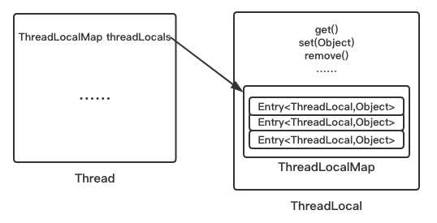
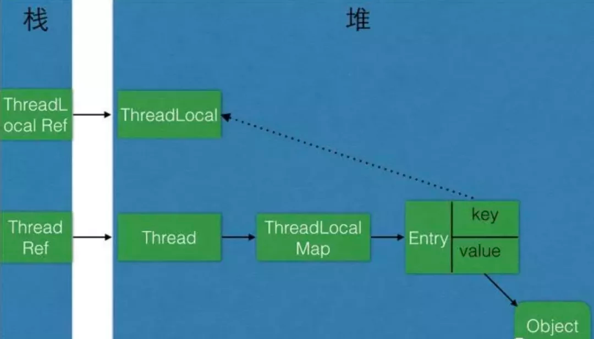

# Table of Contents

* [带着问题理解](#带着问题理解)
* [什么是ThreadLocal](#什么是threadlocal)
* [ThreadLocal理解](#threadlocal理解)
* [ThreadLocal原理](#threadlocal原理)
* [ThreadLocalMap](#threadlocalmap)
  * [set()](#set)
  * [getEntry()](#getentry)
* [如何实现线程隔离](#如何实现线程隔离)
* [内存泄露问题](#内存泄露问题)
* [使用ThreadLocal场景](#使用threadlocal场景)
* [ThreadLocal是如何解决hash冲突的](#threadlocal是如何解决hash冲突的)
* [为什么要用ThreadLocal做key，而不是Thread](#为什么要用threadlocal做key而不是thread)
  * [为什么Entry的value不被设计为弱引用？](#为什么entry的value不被设计为弱引用)
* [父子线程如何共享数据/线程池中如何共享数据？](#父子线程如何共享数据线程池中如何共享数据)
  * [TransmittableThreadLocal](#transmittablethreadlocal)


# 带着问题理解

+ 什么是ThreadLocal? 用来解决什么问题的?

+ 说说你对ThreadLocal的理解

+ ThreadLocal是如何实现线程隔离的?

+ 为什么ThreadLocal会造成内存泄露? 如何解决

+ 还有哪些使用ThreadLocal的应用场景?


# 什么是ThreadLocal


总结而言：ThreadLocal是一个将在多线程中为每一个线程创建单独的变量副本的类; 当使用ThreadLocal来维护变量时, ThreadLocal会为每个线程创建单独的变量副本, **避免因多线程操作共享变量而导致的数据不一致的情况**。


> 有点像操作系统中线程自己的寄存器

# ThreadLocal理解


以数据库连接为列

如果在单线程情况下，

```java

private static Connection connect = null;

public static Connection openConnection() {
    if (connect == null) {
        connect = DriverManager.getConnection();
    }
    return connect;
}
public static void closeConnection() {
    if (connect != null)
        connect.close();
}
```

显然多线程下有线程安全问题，一个线性开启，并不一定是这个线程关闭。互斥锁可以解决，但是有必要上互斥锁吗？

这个时候问个问题，<font color=red>Connection需不需要被共享？</font>

事实上，是不需要的。假如每个线程中都有一个connect变量，各个线程之间对connect变量的访问实际上是没有依赖关系的，即一个线程不需要关心其他线程是否对这个connect进行了修改的。


<font color=red>如果变量是需要保证线程私有的（线程互相看不到对方的value），就用ThreadLocal</font>

但是要注意，虽然ThreadLocal能够解决上面说的问题，但是由于在每个线程中都创建了副本，所以要考虑它对资源的消耗，比如内存的占用会比不使用ThreadLocal要大。

> 这样保证一次事务的所有操作是在同一个数据库连接上。


# ThreadLocal原理


+ `ThreadLocal`只是一个`壳子`，真正存储结构是`ThreadLocal`中的内部类：`ThreadLocalMap`

+ `ThreadLocalMap`引用是在Thread上定义的。(也就是随着线程的消亡而消亡)

  ```text
  每个线程 都有一个自己的ThreadLocalMap
  最开始没理解这个，想的有点歪！！
  ```

+ `ThreadLocal`本身不存储值，它只是作为key来让线程从`ThreadLocalMap`获取Value





> 这个图多看几遍！！！！！！！

# ThreadLocalMap

```jav
static class ThreadLocalMap {
        static class Entry extends WeakReference<ThreadLocal<?>> {
            /** The value associated with this ThreadLocal. */
            Object value;

            Entry(ThreadLocal<?> k, Object v) {
                super(k);
                value = v;
            }
        }
```


本质上来讲, 它就是一个Map, 但是这个ThreadLocalMap与我们平时见到的Map有点不一样

- 它没有实现Map接口;
- 它没有public的方法, 最多有一个default的构造方法, 因为这个ThreadLocalMap的方法仅仅在ThreadLocal类中调用, 属于静态内部类
- ThreadLocalMap的Entry实现继承了WeakReference<ThreadLocal<?>>
- 该方法仅仅用了一个Entry数组来存储Key, Value; Entry并不是链表形式, 而是每个bucket里面仅仅放一个Entry;

## set()

```java

private void set(ThreadLocal<?> key, Object value) {

    // We don't use a fast path as with get() because it is at
    // least as common to use set() to create new entries as
    // it is to replace existing ones, in which case, a fast
    // path would fail more often than not.

    Entry[] tab = table;
    int len = tab.length;
    int i = key.threadLocalHashCode & (len-1);

    for (Entry e = tab[i];
         e != null;
         e = tab[i = nextIndex(i, len)]) {
        ThreadLocal<?> k = e.get();

        if (k == key) {
            e.value = value;
            return;
        }

        if (k == null) {
            replaceStaleEntry(key, value, i);
            return;
        }
    }

    tab[i] = new Entry(key, value);
    int sz = ++size;
    if (!cleanSomeSlots(i, sz) && sz >= threshold)
        rehash();
}
```

看下当前threadLocal的在数组中的索引位置 比如: `i = 2`, 看 `i = 2` 位置上面的元素(Entry)的`Key`是否等于threadLocal 这个 Key, 如果等于就很好说了, 直接将该位置上面的Entry的Value替换成最新的就可以了;

如果当前位置上面的 Entry 的 Key为空, 说明ThreadLocal对象已经被回收了, 那么就调用replaceStaleEntry

如果清理完无用条目(ThreadLocal被回收的条目)、并且数组中的数据大小 > 阈值的时候对当前的Table进行重新哈希 所以, 该HashMap是处理冲突检测的机制是向后移位, 清除过期条目 最终找到合适的位置;


## getEntry()

```java

private Entry getEntry(ThreadLocal<?> key) {
    int i = key.threadLocalHashCode & (table.length - 1);
    Entry e = table[i];
    if (e != null && e.get() == key)
        return e;
    else
        return getEntryAfterMiss(key, i, e);
}
```

先找到ThreadLocal的索引位置, 如果索引位置处的entry不为空并且键与threadLocal是同一个对象, 则直接返回; 否则去后面的索引位置继续查找。

# 如何实现线程隔离

> ThreadLocal能实现线程数据的隔离，不在于他自己本身，而在于Thread的ThreadLocalMap!!!


```java
    public void set(T value) {
        Thread t = Thread.currentThread();
        ThreadLocalMap map = getMap(t);
        if (map != null)
            map.set(this, value);
        else
            createMap(t, value);
    }

  void createMap(Thread t, T firstValue) {
        t.threadLocals = new ThreadLocalMap(this, firstValue);
    }

    public T get() {
        Thread t = Thread.currentThread();
        ThreadLocalMap map = getMap(t);
        if (map != null) {
            ThreadLocalMap.Entry e = map.getEntry(this);
            if (e != null) {
     
                T result = (T)e.value;
                return result;
            }
        }
        return setInitialValue();
    }
```


其实就是用了Map的数据结构给当前线程缓存了, 要使用的时候就从本线程的threadLocals对象中获取就可以了, key就是当前线程;

当然了在当前线程下获取当前线程里面的Map里面的对象并操作肯定没有线程并发问题了, 当然能做到变量的线程间隔离了;


# 内存泄露问题


如果一个ThreadLocal不存在外部强引用时，Key(ThreadLocal)势必会被GC回收，这样就会导致ThreadLocalMap中key为null， 而value还存在着强引用，

只有thead线程退出以后,value的强引用链条才会断掉。? 因为ThreadLocalMap是依附在Thread上的。

但如果当前线程再迟迟不结束的话，这些key为null的Entry的value就会一直存在一条强引用链：

```java
Thread Ref -> Thread -> ThreaLocalMap -> Entry -> value
```

永远无法回收，造成内存泄漏。

> 解决办法

+ 所以, 为了避免出现内存泄露的情况, ThreadLocal提供了一个清除线程中对象的方法, 即 remove, 其实内部实现就是调用 ThreadLocalMap 的remove方法
+ `remove`**方法中会把Entry中的key和value都设置成null**，这样就能被GC及时回收，无需触发额外的清理机制，所以它能解决内存泄露问题。
+ 使用了线程池，可以达到“线程复用”的效果。但是归还线程之前记得清除`ThreadLocalMap`，要不然再取出该线程的时候，`ThreadLocal`变量还会存在。这就不仅仅是内存泄露的问题了，整个业务逻辑都可能会出错。



[垃圾回收基础](../F.Jvm/垃圾回收基础.md)


# 使用ThreadLocal场景

+ 每个线程维护一个序列号
+ session管理
+ 时间工具类


# ThreadLocal是如何解决hash冲突的


开放地址法

为什么不用链表法?没必要


ThreadLocal 往往存放的数据量不会特别大（而且key 是弱引用又会被垃圾回收，及时让数据量更小），这个时候开放地址法简单的结构会显得更省空间，同时数组的查询效率也是非常高，加上第一点的保障，冲突概率也低。


# 为什么要用ThreadLocal做key，而不是Thread

1. 理论上是没问题，**但是一个线程有多个私有变量**，还需要另外标识Value
2. 解决上一步后，所有线程都会访问`同一个Map`,体积膨大，导致性能下降。
3. 这个`Map`,什么时候销毁呢？`ThreadLocalMap`是随着线程的消亡而消亡。


## 为什么Entry的value不被设计为弱引用？

Entry的value可能被其他地方引用，如果改为弱引用，被GC回收，会影响其他业务数据的使用。


# 父子线程如何共享数据/线程池中如何共享数据？


但在实际工作中，有可能是在父子线程中共享数据的。即在父线程中往ThreadLocal设置了值，在子线程中能够获取到。

使用`InheritableThreadLocal`，它是JDK自带的类，继承了ThreadLocal类。


+ 单线程

```java
public class ThreadLocalTest {

    public static void main(String[] args) {
        InheritableThreadLocal<Integer> threadLocal = new InheritableThreadLocal<>();
        threadLocal.set(6);
        System.out.println("父线程获取数据：" + threadLocal.get());

        new Thread(() -> {
            System.out.println("子线程获取数据：" + threadLocal.get());
        }).start();
    }
}

父线程获取数据：6
子线程获取数据：6
```


+ 线程池

  ```java
  private static void fun1() {
      InheritableThreadLocal<Integer> threadLocal = new InheritableThreadLocal<>();
      threadLocal.set(6);
      System.out.println("父线程获取数据：" + threadLocal.get());
  
      ExecutorService executorService = Executors.newSingleThreadExecutor();
  
      threadLocal.set(6);
      executorService.submit(() -> {
          System.out.println("第一次从线程池中获取数据：" + threadLocal.get());
      });
  
      threadLocal.set(7);
      executorService.submit(() -> {
          System.out.println("第二次从线程池中获取数据：" + threadLocal.get());
      });
  }
  父线程获取数据：6
  第一次从线程池中获取数据：6
  第二次从线程池中获取数据：6
  ```

  **由于这个例子中使用了单例线程池，固定线程数是1。**

  第一次submit任务的时候，该线程池会自动创建一个线程。因为使用了InheritableThreadLocal，**所以创建线程时，会调用它的init方法**，将父线程中的inheritableThreadLocals数据复制到子线程中。所以我们看到，在主线程中将数据设置成6，第一次从线程池中获取了正确的数据6。

  之后，在主线程中又将数据改成7，但在第二次从线程池中获取数据却依然是6。

  因为第二次submit任务的时候，**线程池中已经有一个线程了，就直接拿过来复用，不会再重新创建线程了**。所以不会再调用线程的init方法，所以第二次其实没有获取到最新的数据7，还是获取的老数据6。

  那么，这该怎么办呢？

  答：使用`TransmittableThreadLocal`，它并非JDK自带的类，而是阿里巴巴开源jar包中的类。
  

## TransmittableThreadLocal

```java
<dependency>
   <groupId>com.alibaba</groupId>
   <artifactId>transmittable-thread-local</artifactId>
   <version>2.11.0</version>
   <scope>compile</scope>
</dependency>
```

```java
private static void fun2() throws Exception {
    TransmittableThreadLocal<Integer> threadLocal = new TransmittableThreadLocal<>();
    threadLocal.set(6);
    System.out.println("父线程获取数据：" + threadLocal.get());

    ExecutorService ttlExecutorService = TtlExecutors.getTtlExecutorService(Executors.newFixedThreadPool(1));

    threadLocal.set(6);
    ttlExecutorService.submit(() -> {
        System.out.println("第一次从线程池中获取数据：" + threadLocal.get());
    });

    threadLocal.set(7);
    ttlExecutorService.submit(() -> {
        System.out.println("第二次从线程池中获取数据：" + threadLocal.get());
    });

}
```

如果你仔细观察这个例子，你可能会发现，代码中除了使用`TransmittableThreadLocal`类之外，还使用了`TtlExecutors.getTtlExecutorService`方法，去创建`ExecutorService`对象。

这是非常重要的地方，如果没有这一步，`TransmittableThreadLocal`在线程池中共享数据将不会起作用。

创建`ExecutorService`对象，底层的submit方法会`TtlRunnable`或`TtlCallable`对象。


以TtlRunnable类为例，它实现了`Runnable`接口，同时还实现了它的run方法：

```JAVA
public void run() {
    Map<TransmittableThreadLocal<?>, Object> copied = (Map)this.copiedRef.get();
    if (copied != null && (!this.releaseTtlValueReferenceAfterRun || this.copiedRef.compareAndSet(copied, (Object)null))) {
        Map backup = TransmittableThreadLocal.backupAndSetToCopied(copied);

        try {
            this.runnable.run();
        } finally {
            TransmittableThreadLocal.restoreBackup(backup);
        }
    } else {
        throw new IllegalStateException("TTL value reference is released after run!");
    }
}
```

这段代码的主要逻辑如下：

1. 把当时的ThreadLocal做个备份，然后将父类的ThreadLocal拷贝过来。
2. 执行真正的run方法，可以获取到父类最新的ThreadLocal数据。
3. 从备份的数据中，恢复当时的ThreadLocal数据。
