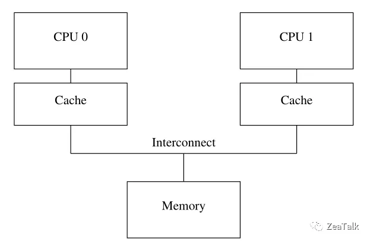
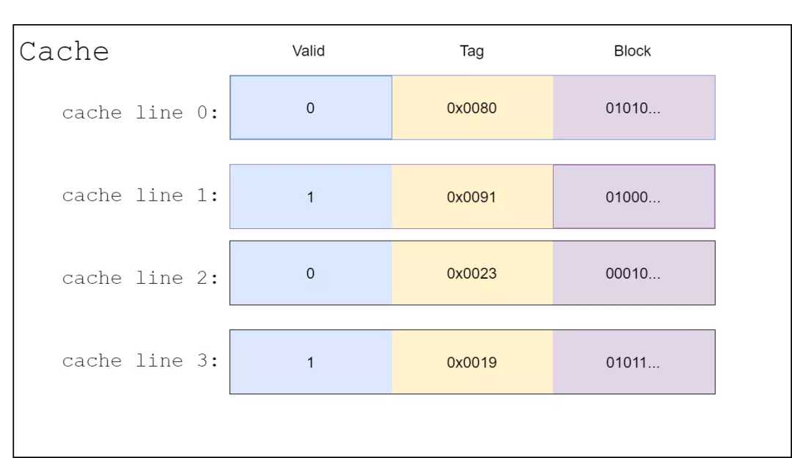
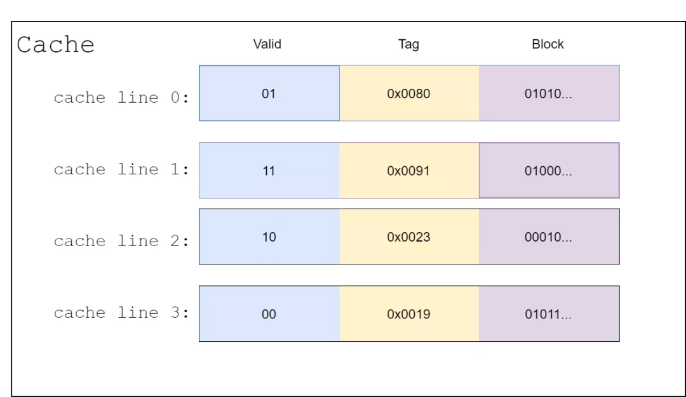
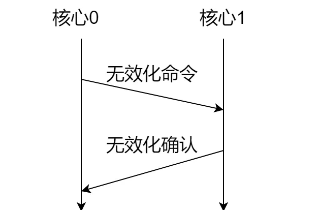

# Table of Contents

* [JMM(java内存模型)](#jmmjava内存模型)
* [CPU缓存](#cpu缓存)
* [缓存一致性协议](#缓存一致性协议)
  * [Invalidate和Invalidate Acknowledge](#invalidate和invalidate-acknowledge)
  * [Store Buffer 和  Invalidate Queue](#store-buffer-和--invalidate-queue)
* [缓存一致性协议优化存在的问题](#缓存一致性协议优化存在的问题)
* [内存屏障](#内存屏障)
* [volatile中的内存屏障](#volatile中的内存屏障)
* [不保证原子性](#不保证原子性)
* [总结](#总结)
* [面试题](#面试题)


+ 是java虚拟机提供的==轻量级==的==同步==机制

+ 可见性：当一个线程修改了由volatile关键字修饰的变量的值时，其它线程能够立即得知这个修改。
+ 有序性：禁止编译器关于操作volatile关键词修饰的变量的指令重排序。
+ 不保证原子性


# JMM(java内存模型)


Java 内存模型简称 JMM，其实是一个抽象模型，并非具体的存在。如上图想表达的，线程的读写都是直接跟 work memory 打交道，CPU 会通过一种机制将数据 flush 到 main memory 中。那么在 flush 发生之前，不同 CPU 之间就会出现**可见性**的问题，这很好理解。


# CPU缓存


一个极简的 CPU 缓存结构是这样的（先不考虑多级缓存）。




看到这个图你是否会想起什么？这似乎就是 JMM 抽象概念的具体写照。显然这里的 Cache 就是所谓的“working memory”，这里的 Memory 就是所谓的 “main memory”，不同的 CPU 核心对应不同线程。


# 缓存一致性协议

我们知道，现代CPU都是多核处理器。由于cpu核心（Kernel）读取内存数据较慢，于是就有了缓存的概念。我们希望针对频繁读写的某个内存变量，提升本核心的访问速率。因此我们会给每个核心设计缓存区(Cache)，缓存该变量。由于缓存硬件的读写速度比内存快，所以通过这种方式可以提升变量访问速度。
缓存的结构可以如下设计：




其中，一个缓存区可以分为N个缓存行(Cache line)，缓存行是和内存进行数据交换的最小单位。每个缓存行包含三个部分，其中valid用于标识该数据的有效性。如果有效位为false，CPU核心就从内存中读取，并将对应旧的缓存行数据覆盖，否则使用旧缓存数据；tag用于指示数据对应的内存地址；block则用以存储数据，

所以为了保证缓存的一致性，业界有两种思路：

1. 写失效(Write Invalidate)：当一个核心修改了一份数据，其它核心如果有这份数据，就把valid标识为无效；
2. 写更新(Write update)：当一个核心修改了一份数据，其它核心如果有这份数据，就都更新为新值，并且还是标记valid有效。

业界有多种实现缓存一致性的协议，诸如MSI、MESI、MOSI、Synapse、Firefly Dragon Protocol等，其中最为流行的是MESI协议。

**MESI协议就是根据写失效的思路，设计的一种缓存一致性协议。为了实现这个协议，原先的缓存行修改如下：**




原先的valid是一个比特位，代表有效/无效两种状态。在MESI协议中，该位改成两位，不再只是有效和无效两种状态，而是有四个状态，分别为：

1. M（Modified）：表示核心的数据被修改了，缓存数据属于有效状态，但是数据只处于本核心对应的缓存，还没有将这个新数据写到内存中。由于此时数据在各个核心缓存区只有唯一一份，不涉及缓存一致性问题；
2. E（Exclusive）：表示数据只存在本核心对应的缓存中，别的核心缓存没这个数据，缓存数据属于有效状态，并且该缓存中的最新数据已经写到内存中了。同样由于此时数据在各个核心缓存区只有一份，也不涉及缓存一致性问题；
3. **S（Shared）：表示数据存于多个核心对应的缓存中，缓存数据属于有效状态，和内存一致。这种状态的值涉及缓存一致性问题；**
4. I（Invalid）：表示该核心对应的缓存数据无效。

看到这里，大家想必知道为什么这个协议称为MESI协议了吧，它的命名就是取了这四个状态的首字母而已。

> 主要关注的是 ‘S’


## Invalidate和Invalidate Acknowledge

 为了保证缓存一致性，每个核心要写新数据前，**需要确保其他核心已经置同一变量数据的缓存行状态位为Invalid后，再把新数据写到自己的缓存行**，并之后写到内存中。 

> 这就涉及到了2个操作，通知，收到确认回复。

MESI协议包含以下几个行为：

- 读（Read）：当某个核心需要某个变量的值，并且该核心对应的缓存没这个变量时，就会发出读命令，希望别的核心缓存或者内存能给该核心最新的数据；
- 读命令反馈（Read Response）：读命令反馈是对读命令的回应，包含了之前读命令请求的数据。举例来说，Kernel0发送读命令，请求变量a的值，Kernel1对应的缓存区包含变量a，并且该缓存的状态是M状态，所以Kernel1会给Kernel0的读命令发送读命令反馈，给出该值；
- **无效化（Invalidate）：无效化指令是一条广播指令，它告诉其他所有核心，缓存中某个变量已经无效了。如果变量是独占的，只存在某一个核心对应的缓存区中，那就不存在缓存一致性问题了，直接在自己缓存中改了就行，也不用发送无效化指令；**
- **无效化确认（Invalidate Acknowledge）：该指令是对无效化指令的回复，收到无效化指令的核心，需要将自己缓存区对应的变量状态改为Invalid，并回复无效化确认，以此保证发送无效化确认的缓存已经无效了；**
- 读无效（Read Invalidate）:这个命令是读命令和无效化命令的综合体。它需要接受读命令反馈和无效化确认；
- 写回（Writeback）这个命令的意思是将核心中某个缓存行对应的变量值写回到内存中去。


 下图给了个一个应用MESI读写数据的例子。在该图中，假设CPU有两个核心，Kernel0表示第一个核心，Kernel1表示第二个核心。这里给出了Kernel0想写新数据到自己缓存的例子。 




1. 首先Kernel0先完成新数据的创建；
2. Kernel0向全体其他核心发送无效化指令，告诉其他核心其所对应的缓存区中的这条数据已经过期无效。本图例中只有一个其他核心，为Kernel1；
3. 其他核心收到广播消息后，将自己对应缓存的数据的标志位记为无效，然后给Kernel0回确认消息；
4. 收到所有其他Kernel的确认消息后，Kernel0才能将新数据写回到它所对应的缓存结构中去。

根据上图，我们可以发现，影响MESI协议的时间瓶颈主要有两块：

1. 无效化指令：Kernel0需要通知所有的核心，该变量对应的缓存在其他核心中是无效的。在通知完之前，该核心不能做任何关于这个变量的操作。
2. 确认响应：Kernel0需要收到其他核心的确认响应。在收到确认消息之前，该核心不能做任何关于这个变量的操作，需要持续等待其他核心的响应，直到所有核心响应完成，将其对应的缓存行标志位设为Invalid，才能继续其它操作。


##  Store Buffer 和  Invalidate Queue 

+  针对无效化指令的加速：在缓存的基础上，引入Store Buffer这个结构。Store Buffer是一个特殊的硬件存储结构。通俗的来讲，**核心可以先将变量写入Store Buffer，然后再处理其他事情。**如果后面的操作需要用到这个变量，就可以从Store Buffer中读取变量的值，核心读数据的順序变成Store Buffer → 缓存 → 内存。这样在任何时候核心都不用卡住，做不了关于这个变量的操作了。 

+  针对确认响应的加速：在缓存的基础上，引入Invalidate Queue这个结构。其他核心收到Kernel0的Invalidate的命令后，**立即给Kernel0回Acknowledge**，并把Invalidate这个操作，先记录到Invalidate Queue里，当其他操作结束时，再从Invalidate Queue中取命令，进行Invalidate操作。**所以当Kernel0收到确认响应时，其他核心对应的缓存行可能还没完全置为Invalid状态** 

> 可以看到变成异步操作了。


# 缓存一致性协议优化存在的问题

 两种缓存一致性协议的加速方式。但是这两个方式却会对缓存一致性导致一定的偏差 。

说白了，由原来的源自操作变成了非原子操作，就会带来数据不一致的问题。


举例：CPU1修改了A值，写道Store Buffer，并通知CPU2进行invalid操作，但是CPU2做其他事情了，读的还是旧值。


# 内存屏障

既然刚刚我们遇到了问题，那如何改正呢？这里就终于到了今天的重头戏，内存屏障了。内存屏障简单来讲就是一行命令，规定了某个针对缓存的操作。这里我们来看一下最常见的写屏障和读屏障。

1. 针对Store Buffer：核心在后续变量的新值写入之前，把Store Buffer的所有值刷新到缓存；核心要么就等待刷新完成后写入，要么就把后续的后续变量的新值放到Store Buffer中，直到Store Buffer的数据按顺序刷入缓存。这种也称为内存屏障中的写屏障（Store Barrier）。
2. 针对Invalidate Queue：执行后需等待Invalidate Queue完全应用到缓存后，后续的读操作才能继续执行，保证执行前后的读操作对其他CPU而言是顺序执行的。这种也称为内存屏障中的读屏障（Load Barrier）。

> 这样强制的效率比最开始的同步会快多少？


# volatile中的内存屏障

对于JVM的内存屏障实现中，也采取了内存屏障。JVM的内存屏障有四种，这四种实际上也是上述的读屏障和写屏障的组合。我们来看一下这四种屏障和他们的作用：

1. LoadLoad屏障：对于这样的语句

   ```
   第一大段读数据指令; LoadLoad; 第二大段读数据指令;
   ```

LoadLoad指令作用：在第二大段读数据指令被访问前，保证第一大段读数据指令执行完毕

1. StoreStore屏障：对于这样的语句

   ```
   第一大段写数据指令; StoreStore; 第二大段写数据指令;
   ```

StoreStore指令作用：在第二大段写数据指令被访问前，保证第一大段写数据指令执行完毕

1. LoadStore屏障：对于这样的语句

   ```
   第一大段读数据指令; LoadStore; 第二大段写数据指令;
   ```

LoadStore指令作用：在第二大段写数据指令被访问前，保证第一大段读数据指令执行完毕。

1. StoreLoad屏障：对于这样的语句

   ```
   第一大段写数据指令; StoreLoad; 第二大段读数据指令;
   ```

StoreLoad指令作用：在第二大段读数据指令被访问前，保证第一大段写数据指令执行完毕。

针对volatile变量，JVM采用的内存屏障是：

1. 针对volatile修饰变量的写操作：在写操作前插入StoreStore屏障，在写操作后插入StoreLoad屏障；
2. 针对volatile修饰变量的读操作：在每个volatile读操作前插入LoadLoad屏障，在读操作后插入LoadStore屏障；

通过这种方式，就可以保证被volatile修饰的变量具有线程间的可见性和禁止指令重排序的功能了。


# 不保证原子性

在多线程环境下，volatile 关键字可以保证共享数据的可见性，**但是并不能保证对数据操作的原子性**。也就是说，多线程环境下，使用 volatile 修饰的变量是**线程不安全的**。

原子性和可见性不冲突！


**有可能在内存屏障之前，值已经被其他线程读取，从来带来数据不一致问题。**

> 如何解决呢？

1. 可以借助`atomicInteger`,来保证原子性。
2. 加锁
3. 如果Volatile修改的变量不参与**非原子性**操作，那么修饰的变量就不会有数据不一致的情况，

# 总结

volatile关键字保证了两个性质：

- 可见性：可见性是指当多个线程访问同一个变量时，一个线程修改了这个变量的值，其他线程能够立即看得到修改的值。
- 有序性：对一个volatile变量的写操作，执行在任意后续对这个volatile变量的读操作之前。

单单缓存一致性协议无法实现volatile。

缓存一致性可以通过Store Buffer和Invalidate Queue两种结构进行加速，但这两种方式会造成一系列不一致性的问题。

因此后续提出了内存屏障的概念，分为读屏障和写屏障，以此修正Store Buffer和Invalidate Queu产生的问题。

通过读屏障和写屏障，又发展出了LoadLoad屏障，StoreStore屏障，LoadStore屏障，StoreLoad屏障JVM也是利用了这几种屏障，实现volatile关键字。


# 面试题

1. volatile修改变量和数组/对象有什么区别？
    修饰对象或者数组，对象的引用地址是可见性，对象里的字段属性修改并不可见。

