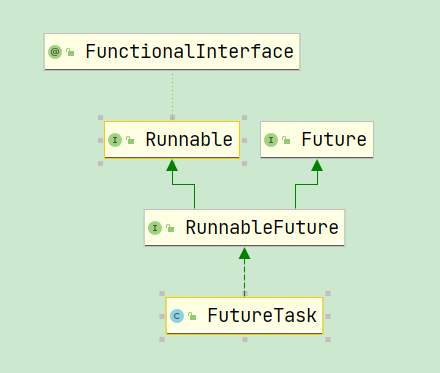

# Table of Contents

* [Runnable和Callable](#runnable和callable)
* [注意](#注意)
* [Future](#future)
* [FutureTask](#futuretask)
* [创建线程方式](#创建线程方式)
  * [Future](#future-1)
  * [FutureTask](#futuretask-1)
  * [利用 Thread](#利用-thread)
  * [Runnable](#runnable)
* [总结](#总结)


新建线程的两种方式，一种是直接继承Thread类，重写run方法，另外一种是继承Runnable接口。但是这两种方式都有一个缺陷就是：在执行完任务之后无法获取执行结果。于是java后面又增加了Callable和Future，通过它们可以在任务执行完毕之后得到任务执行结果


# Runnable和Callable

```java
@FunctionalInterface
public interface Runnable {
    public abstract void run();
}
```

Runnable只是一个接口，里面只是声明了一个run方法，可以看到方法的返回值是void，所以线程执行完了没有任何的返回值

```java
public interface Callable<V> {
    /**
     * Computes a result, or throws an exception if unable to do so.
     *
     * @return computed result
     * @throws Exception if unable to compute a result
     */
    V call() throws Exception;
}
```

Callable也是一个接口，它里面声明了一个call方法，可以看到它是一个泛型接口，call()函数返回的类型就是传递进来的V类型。线程的执行是异步的，一个线程和另外一个线程的执行是互不干扰的，所以你不可能从别的线程中获得返回值，所以要想获得Callable的返回值就需要用到Future这个接口，Futrue可以监视目标线程调用call的情况，当你调用Future的get()方法以获得结果时，当前线程就开始阻塞，直接call方法结束返回结果。

#  注意

Runnable只是一个接口，里面只是声明了一个run方法。

**真正开启线程的是Thread**

这句话多读几遍。


```java
//    
private native void start0();
```

`Thread`实现`Runnbale`,实现了`Run`方法，只是一个行为而已

```java
  @Override
    public void run() {
        if (target != null) {
            target.run();
        }
    }
```


# Future

Future就是对于具体的Runnable或者Callable任务的执行结果进行取消、查询是否完成、获取结果。必要时可以通过get方法获取执行结果，该方法会阻塞直到任务返回结果。

```java
public interface Future<V> {
    boolean cancel(boolean mayInterruptIfRunning);
    boolean isCancelled();
    boolean isDone();
    V get() throws InterruptedException, ExecutionException;
    V get(long timeout, TimeUnit unit)
        throws InterruptedException, ExecutionException, TimeoutException;
}
```

下面我们讲解下这五个方法的作用

**cancel方法**：用来取消任务，如果取消任务成功则返回true，如果取消任务失败则返回false。参数mayInterruptIfRunning表示是否允许取消正在执行却没有执行完毕的任务，如果设置true，则表示可以取消正在执行过程中的任务。如果任务已经完成，则无论mayInterruptIfRunning为true还是false，此方法肯定返回false，即如果取消已经完成的任务会返回false；如果任务正在执行，若mayInterruptIfRunning设置为true，则返回true，若mayInterruptIfRunning设置为false，则返回false；如果任务还没有执行，则无论mayInterruptIfRunning为true还是false，肯定返回true。

**isCancelled方法**：表示任务是否被取消成功，如果在任务正常完成前被取消成功，则返回 true

**isDone方法**：表示任务是否已经完成，若任务完成，则返回true

**get()方法**：用来获取执行结果，这个方法会产生阻塞，会一直等到任务执行完毕才返回。这里的阻塞需要解释一下，阻塞的是当前调用get方法的线程，直到get方法返回结果才能继续向下执行，如果get方法一直没有返回值，那么当前线程会一直阻塞下去

**get(long timeout, TimeUnit unit)方法**：获取执行结果，如果在指定时间内，还没获取到结果，就直接返回null，这个就避免了一直获取不到结果使得当前线程一直阻塞的情况发生

# FutureTask

首先看下FutureTask的继承关系图



可以看出RunnableFuture继承了Runnable接口和Future接口，而FutureTask实现了RunnableFuture接口。所以它既可以作为Runnable被线程执行，又可以作为Future得到Callable的返回值。

**FutureTask内部的几种状态值**

```java
private volatile int state;
//新建状态
private static final int NEW          = 0;
//执行完成状态
private static final int COMPLETING   = 1;
//执行正常并返回结果状态
private static final int NORMAL       = 2;
//执行异常状态
private static final int EXCEPTIONAL  = 3;
//被取消状态
private static final int CANCELLED    = 4;
//正在被终止状态
private static final int INTERRUPTING = 5;
//已经被终止状态
private static final int INTERRUPTED  = 6;
```

再根据注释，可以得知当创建一个 FutureTask对象时，初始状态是 `NEW`，在运行过程中，运行状态仅在方法set，setException和 cancel 中转换为终端状态。有四种状态转换过程：

- `NEW -> COMPLETING -> NORMAL`：正常执行并返回结果（`run` 执行成功再设置状态为 `COMPLETING`）
- `NEW -> COMPLETING -> EXCEPTIONAL`：执行过程中出现异常（`setException` 先设置状态为 `COMPLETING`）
- `NEW -> CANCELLED`：执行前被取消
- `NEW -> INTERRUPTING -> INTERRUPTED`：执行时被中断（`cancel` 参数为 `true` 才可能出现这个状态）

**FutureTask构造器**

```java
//传入的参数是Callable具有返回值，这就说明可以通过FutureTask获取Callable的返回值
public FutureTask(Callable<V> callable) {
    if (callable == null)
        throw new NullPointerException();
    //将传入的callable赋值给callable
    this.callable = callable;
    //将初始状态设置为new状态
    this.state = NEW;       // ensure visibility of callable
}
//这个传入d额是Runnable，通过Executors.callable方法转换成Callable可以进行返回值
public FutureTask(Runnable runnable, V result) {
     //将Runnable转换成Callable
    this.callable = Executors.callable(runnable, result);
    //将初始状态设置为new状态
    this.state = NEW;       // ensure visibility of callable
}
```


# 创建线程方式


## Future

第一种方式是使用继承了`ExecutorService`的线程池`ThreadPoolExecutor`中的`submit`方法，将`Callable`直接提交创建`Future`。

```java
import java.util.concurrent.*;
public class FutureExample {
    static class MyCallable implements Callable<String> {
        @Override
        public String call() throws Exception {
            System.out.println("do something in callable");
            Thread.sleep(5000);
            return "Ok";
        }
    }
    public static void main(String[] args) throws InterruptedException, ExecutionException {
        ExecutorService executorService = Executors.newCachedThreadPool();
        Future<String> future = executorService.submit(new MyCallable());
        System.out.println("do something in main");
        Thread.sleep(1000);
        String result = future.get();
        System.out.println("result: " + result);
    }
}
```

## FutureTask

第二种方法是创建一个写好`Callable`的`FutureTask`对象实例，再`submit`。因为`FutureTask`内部本身拥有`run`方法，也可以直接创建线程`Thread`运行。

**利用 ExecutorService**

```java
import java.util.concurrent.*
public class FutureTaskWithExecutorService {
    public static void main(String[] args) throws InterruptedException, ExecutionException {
        FutureTask<String> futureTask = new FutureTask<>(() -> { // java 8 函数式写法
            System.out.println("do something in callable");
            Thread.sleep(5000);
            return "Ok";
        });
        ExecutorService executorService = Executors.newCachedThreadPool();
        executorService.submit(futureTask);
        System.out.println("do something in main");
        Thread.sleep(1000);
        String result = futureTask.get();
        System.out.println("result: " + result);
    }
}
```

## 利用 Thread

```java
import java.util.concurrent.*
public class FutureTaskWithThread {
    public static void main(String[] args) throws InterruptedException, ExecutionException {
        FutureTask<String> futureTask = new FutureTask<>(new Callable<String>() {
            @Override
            public String call() throws Exception {
                System.out.println("do something in callable");
                Thread.sleep(5000);
                return "Ok";
            }
        });
        new Thread(futureTask).start();
        System.out.println("do something in main");
        Thread.sleep(1000);
        String result = futureTask.get();
        System.out.println("result: " + result);
    }
}
```

## Runnable 


# 总结

1. Thread是Runnable的一个实现类,实现了run方法，
2. 真正开启线程的是Thread的start方法，run只是运行。
3. Callable 只是一个接口，里面有一个call方法,可以返回运行结果。
4. future也只是一个接口，里面定义了具体的Runnable或者Callable任务的执行结果进行取消、查询是否完成、获取结果。必要时可以通过get方法获取执行结果，该方法会阻塞直到任务返回结果。
5. futureTask实现了future和runnable，Callable做一个成员变量。执行run方法，其实是执行Callable的call方法。并放入outcome 变量中，get()获取的就是outcome 变量。
    1. 只要状态值小于 COMPLETING, 就说明任务还未完成, 去等待完成。
