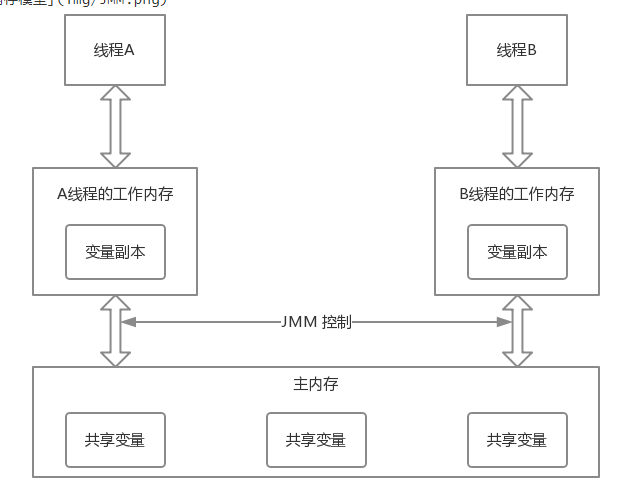

# Table of Contents

* [前提](#前提)
* [Java内存模型（JMM）](#java内存模型jmm)
* [happens-before规则（代码层面）](#happens-before规则代码层面)
* [Volatile](#volatile)
* [总结](#总结)

# 前提

+ [为什么需要Java内存模型](为什么需要Java内存模型.md)

JAVA内存模型，主要有以下几块。

# Java内存模型（JMM）

Java内存模型本身是一个抽象的概念，实际上并不存在。其描述的是一组规则或规范，通过这些规则或规范定义了程序中的各个变量的访问方式。JMM主要是围绕如何处理原子性、可见性和有序性这三个特性来建立的。Java当中的基本工作单位是线程，每创建一个线程，JVM都会为之创建一个线程工作空间。在JVM中，所有的变量都存储在主内存当中，如果一个线程需要读取或者修改某个变量，则必须先将该变量拷贝到自己的工作内存当中，在工作内存中完成操作后再写回到主内存当中。而工作内存属于线程私有的区域，不同线程之间的工作内存不允许相互访问，如果线程间需要通信，则必须通过主内存来完成。

	

#  happens-before规则（代码层面）

> 【操作之间】的内存可见性。

由于编译器在编译时会对代码进行优化和重排序，但重排序需要遵循一定的规则，否则重排序将会导致程序不按照我们所指定的逻辑运行。指令重排序需要满足以下两个条件：

- 在单线程环境下不能改变程序运行的结果
- 存在数据依赖关系的不允许重排序

重排序时所遵循的这些规则就是happens-before规则

happens-before 表达的并不是说前面一个操作发生在后面一个操作的前面，尽管从程序员编程角度来看也并不会出错，但它其实表达的是，**前一个操作的结果对后续操作时可见的**。

**happens-before八大原则：**

1. 程序顺序规则：一个线程内，按照代码顺序，书写在前面的操作happends-before书写在后面的操作。
2. 监视器锁规则：对于一个锁的解锁操作，happens-before随后对于这个锁的加锁操作。
3. volatile变量规则：对于一个volatile域的写操作，happens-before任意后续对于这个volatile域的读操作。
4. 传递性：如果A操作happens-before于B操作，B操作happens-before于C操作，则A操作happens-before于C操作。
5. 线程启动规则：一个线程的start()操作happens-before于这个线程的所有操作。
6. 线程中断规则：对线程的interrupt()的操作happens-before于被中断线程的代码检测到中断事件的发生。
7. 线程终结规则：一个线程中的所有操作都happens-before于线程的终止检测。
8. 对象终结规则：一个对象的初始化完成happens-before这个对象的finalize()方法开始。

总结
在 Java 语言里面，Happens-Before 的语义本质上是一种可见性，A Happens-Before B 意味着 A 事件对 B 事件来说是可见的，无论 A 事件和 B 事件是否发生在同一个线程里。例如 A 事件发生在线程 1 上，B 事件发生在线程 2 上，Happens-Before 规则保证线程 2 上也能看到 A 事件的发生。

# Volatile

volatile是Java的关键字，修饰的变量是可见性且有序的（不会被重排序）。可见性&&有序性由Java内存模型定义的「内存屏障」完成，实际HotSpot虚拟机实现Java内存模型规范，汇编底层是通过Lock指令来实现。

# 总结

**为什么存在Java内存模型**：Java为了屏蔽硬件和操作系统访问内存的各种差异，提出了「Java内存模型」的规范，保证了Java程序在各种平台下对内存的访问都能得到一致效果

**Java内存模型抽象结构**：线程之间的「共享变量」存储在「主内存」中，每个线程都有自己私有的「本地内存」，「本地内存」存储了该线程以读/写共享变量的副本。线程对变量的所有操作都必须在「本地内存」进行，而「不能直接读写主内存」的变量

**happen-before规则**：Java内存模型规定在某些场景下（一共8条），前面一个操作的结果对后续操作必须是可见的。这8条规则成为happen-before规则

**volatile**：volatile是Java的关键字，修饰的变量是可见性且有序的（不会被重排序）。可见性&&有序性由Java内存模型定义的「内存屏障」完成，实际HotSpot虚拟机实现Java内存模型规范，汇编底层是通过Lock指令来实现。
