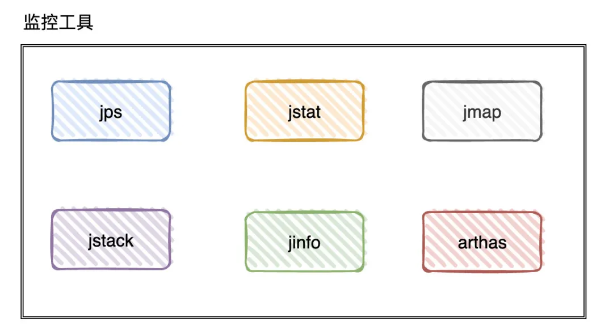
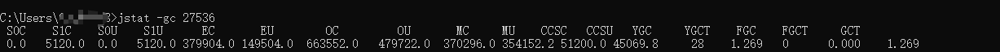
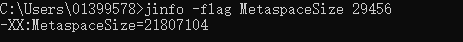
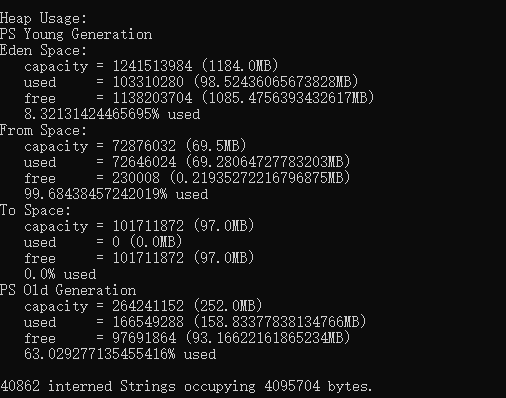
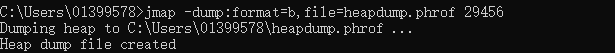
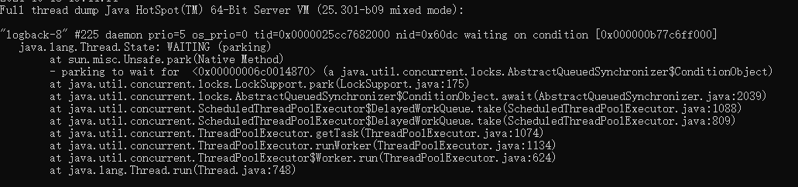
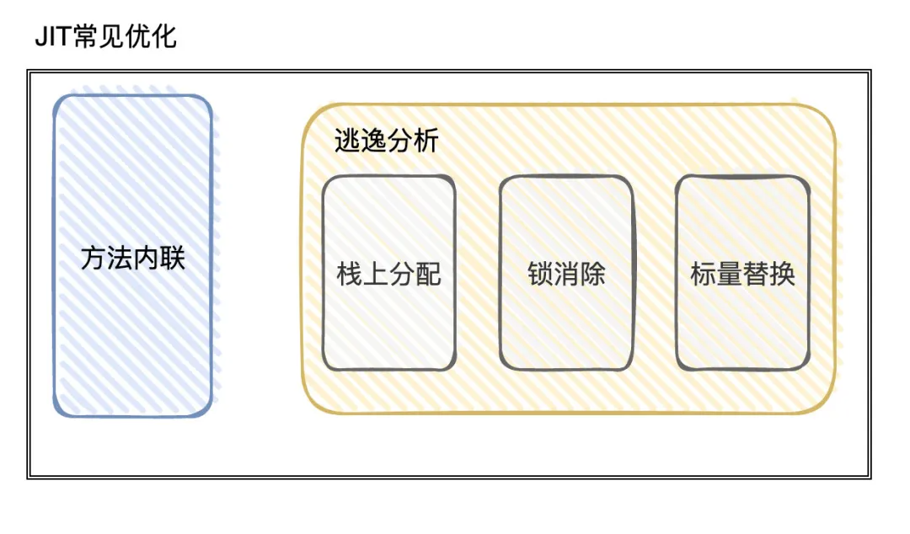

# Table of Contents

* [调优思路](#调优思路)
* [基础故障处理工具](#基础故障处理工具)
  * [jps：虚拟机进程状况工具](#jps虚拟机进程状况工具)
  * [jstat：虚拟机统计信息监视工具](#jstat虚拟机统计信息监视工具)
  * [jinfo：Java配置信息工具](#jinfojava配置信息工具)
  * [jmap：Java内存映像工具](#jmapjava内存映像工具)
  * [jhat：虚拟机堆转储快照分析工具](#jhat虚拟机堆转储快照分析工具)
  * [jstack：Java堆栈跟踪工具](#jstackjava堆栈跟踪工具)
* [**可视化故障处理工具**](#可视化故障处理工具)
  * [VisualVM：多合-故障处理工具](#visualvm多合-故障处理工具)
  * [Arthas](#arthas)
* [JIT优化](#jit优化)
* [JVM调优的步骤](#jvm调优的步骤)
* [**常用的 JVM 调优的参数都有哪些？**](#常用的-jvm-调优的参数都有哪些)
* [常用调优策略](#常用调优策略)
* [参考资料](#参考资料)

在进行Jvm调优之前，一般都是先优化其他的。

1. 评估数据库是否到了瓶颈，【索引是否合理，是否需要引入缓存】
2. 是否对数据库进行扩容
3. 对应用层代码进行排查并进行优化。
4. 以上步骤排查完后，看Jvm是否存在多次GC问题。
5. 最后，网络和操作系统层面排查。【查看内存、网络、CPU等读写指标是否正常】

【绝大多数情况】到第三步就结束了，一般经过【运维团队】给我们设置的JVM和机器上的参数，可以满足大多数需求。

# 调优思路

调优JVM其实就是在【理解】JVM内存结构以及各种垃圾回收器的前提下，结合现有业务来【调整参数】，使自己的应用能够正常稳定运行。

相关指标：

+ 吞吐量

  内存区域大小，年青代和老年代的比例、晋升老年代的条件。

  堆的初始值，xms 最大值 xmx【可以通过】

  > · -Xmx其数值可以根据下面的方法推算：
  >
  > o 在应用正常执行时使用jmap手动触发一次full GC, jmap -histo:live pid
  >
  > o 然后观察GC日志里面Full GC之后整个heap的剩余空间，jmap -heap pid 这个可以估算为活跃数据的总大小LDS (Live Data Set)
  >
  > o 然后整个heap的大小可以用经验公式 Xmx = LDS * f 来计算，其中f因子按照经验一般是取3~4。

+ 停顿时间

  选择合适的垃圾回收器和对应的参数。

+ 垃圾回收频率

#  基础故障处理工具

## jps：虚拟机进程状况工具

> 可以列出正在运行的虚拟机进程，并显示虚拟机执行主类（Main Class，main()函数所在的类）名称以及这些进程的本地虚拟机唯一ID

jps命令格式：

jps [ options ] [ hostid ]

## jstat：虚拟机统计信息监视工具

> jstat是用于监视虚拟机各种运行状态信息的命令行工具。它可以显示本地或者远程[1]虚拟机进程中的类加载、内存、垃圾收集、即时编译等运行时数据，在没有GUI图形界面、只提供了纯文本控制台环境的服务器上，它将是运行期定位虚拟机性能问题的常用工具。

jstat命令格式为：

jstat [ option vmid [interval[s|ms] [count]] ]

对于命令格式中的VMID与LVMID需要特别说明一下：如果是本地虚拟机进程，VMID与LVMID是一致的；如果是远程虚拟机进程，那VMID的格式应当是：

[protocol:][//]lvmid[@hostname[:port]/servername]

参数interval和count代表查询间隔和次数，如果省略这2个参数，说明只查询一次。假设需要每250毫秒查询一次进程2764垃圾收集状况，一共查询20次，那命令应当是：

选项option代表用户希望查询的虚拟机信息，主要分为三类：类加载、垃圾收集、运行期编译状况。

jstat -gc 27536

jstat -gcutil  27536

**可以看到每个区域内存使用情况，以及ygc和fgc的回收次数**

**不过还是建议使用 保存gc日志的方法 查看，添加gc日志保存参数**

## jinfo：Java配置信息工具

> jinfo的作用是实时查看和调整虚拟机各项参数。

jinfo的-flag  获得指定的参数的系统默认值

jinfo命令格式：

jinfo [ option ] pid

执行样例：查询CMSInitiatingOccupancyFraction参数值

jinfo -flag CMSInitiatingOccupancyFraction 1444

-XX:CMSInitiatingOccupancyFraction=85

## jmap：Java内存映像工具

> jmap命令用于生成堆转储快照

jmap的作用并不仅仅是为了获取堆转储快照，它还可以查询finalize执行队列、Java堆和方法区的详细信息，如空间使用率、当前用的是哪种收集器等。

jmap命令格式：

jmap [ option ] vmid

+ jmap 29456 :查看当前进程基本信息
+ jmap-heap 29456 :  打印一个堆的摘要信息，包括使用的GC算法、堆配置信息和各内存区域内存使用信息。

+ 使用jmap生成dump文件

  jmap -dump:format=b,file=heapdump.phrof 29456

  

## jhat：虚拟机堆转储快照分析工具

JDK提供jhat命令与jmap搭配使用，来分析jmap生成的堆转储快照。

不常用

## jstack：Java堆栈跟踪工具

> jstack（Stack Trace for Java）命令用于生成虚拟机当前时刻的线程快照（一般称为threaddump或者javacore文件）。

线程快照就是当前虚拟机内每一条线程正在执行的方法堆栈的集合，生成线程快照的目的通常是定位线程出现长时间停顿的原因，如线程间死锁、死循环、请求外部资源导致的长时间挂起等，都是导致线程长时间停顿的常见原因。线程出现停顿时通过jstack来查看各个线程的调用堆栈，就可以获知没有响应的线程到底在后台做些什么事情，或者等待着什么资源。

jstack命令格式：

jstack [ option ] vmid

# **可视化故障处理工具**

## VisualVM：多合-故障处理工具

jdk自带工具，位于bin目录下，

**JHSDB****：基于服务性代理的调试工具**

JDK中提供了JCMD和JHSDB两个集成式的多功能工具箱，整合了上一节介绍到的所有基础工具所能提供的专项功能

Version:0.9 StartHTML:0000000105 EndHTML:0000000658 StartFragment:0000000141 EndFragment:0000000618

JConsole：Java监视与管理控制台

是一款基于JMX的可视化监视、管理工具它的主要功能是通过JMX的MBean对系统进行信息收集和参数动态调整

具体用法可以浏览书上内容

Java Mission Control：可持续在线的监控工具

**说一下 JVM 的主要组成部分及其作用？**

**JVM包含两个子系统和两个组件，两个子系统为Class loader(类装载)、Execution engine(执行引擎)；两个组件为Runtime data area(运行时数据区)、Native Interface(本地接口)。**

· Class loader(类装载)：根据给定的全限定名类名(如：java.lang.Object)来装载class文件到Runtime data area中的method area。

· Execution engine（执行引擎）：执行classes中的指令。

· Native Interface(本地接口)：与native libraries交互，是其它编程语言交互的接口。

· Runtime data area(运行时数据区域)：这就是我们常说的JVM的内存。

 

## Arthas

[Arthas](Arthas.md)

# JIT优化

在【解释】阶段，会有2种方式把字节码信息转化为机器指令码，一个是字节码解释器，一个使JIT。

JIT优化技术比较出名的2种：方法内联和逃逸分析。

所谓方法内链就是把【目标方法】的代码复制到【调用方法中】，避免发生真实的方法调用，（因为会产生栈帧，带来性能损耗）

# JVM调优的步骤

- 分析GC日志及dump文件，判断是否需要优化，确定瓶颈问题点；
- 确定JVM调优量化目标；
- 确定JVM调优参数（根据历史JVM参数来调整）；
- 依次调优内存、延迟、吞吐量等指标；
- 对比观察调优前后的差异；
- 不断的分析和调整，直到找到合适的JVM参数配置；
- 找到最合适的参数，将这些参数应用到所有服务器，并进行后续跟踪。

# **常用的 JVM 调优的参数都有哪些？**

+  -Xms2g：初始化推大小为 2g；
+  -Xmx2g：堆最大内存为 2g；
+  -Xmn：young年代大小 官方推荐为堆大小的3/8 如果是G1不需要指定，因为G1会动态更改y
+  -Xss300K：设置每个线程的堆栈大小。JDK5.0以后每个线程堆栈大小为1M，以前每个线程堆栈大小为256K。
+  -XX:MetaspaceSize：元空间发生GC的最小阀值
+  -XX:MaxMetaspaceSize 元空间的最大值
+  -XX:+PrintGC：开启打印 gc 信息；
+  -XX:+PrintGCDetails：打印 gc 详细信息。
+  -XX:+DisableExplicitGC 禁止代码中显示调用GC
+  `-XX:G1NewSizePercent` (默认:5) Young region 最小值
+  `-XX:G1MaxNewSizePercent` (默认: 60) Young region 最大值
+  `-XX:+UseG1GC` 使用G1垃圾回收器
+  -XX:NewRatio=4：设置年轻的和老年代的内存比例为 1:4；
+  -XX:SurvivorRatio=8：设置新生代 Eden 和 Survivor 比例为 8:2；
+  -XX:ConcGCThreads=8            　　　　并发垃圾收集器使用的线程数量
+  -XX:+UseStringDeduplication  G1下使用删除  重复字符串
+  -XX:ReservedCodeCacheSize=512m  代码缓存

+  -XX:+UseConcMarkSweepGC：指定使用 CMS + Serial Old 垃圾回收器组合；

· –XX:+UseParNewGC：指定使用 ParNew + Serial Old 垃圾回收器组合；

· -XX:+UseParallelOldGC：指定使用 ParNew + ParNew Old 垃圾回收器组合；

# 常用调优策略

- 选择合适的垃圾回收器
- 调整内存大小(垃圾收集频率非常频繁,如果是内存太小，可适当调整内存大小)
- 调整内存区域大小比率（某一个区域的GC频繁，其他都正常。）
- 调整对象升老年代的年龄（老年代频繁GC，每次回收的对象很多。）
- 调整大对象的标准(老年代频繁GC，每次回收的对象很多,而且单个对象的体积都比较大。)
- 调整GC的触发时机(CMS，G1 经常 Full GC，程序卡顿严重。)
- 调整 JVM本地内存大小(GC的次数、时间和回收的对象都正常，堆内存空间充足，但是报OOM)

# 参考资料

https://mp.weixin.qq.com/s?__biz=MzU4NzA3MTc5Mg==&mid=2247485031&idx=1&sn=d1a456a1dde946eb8001a5f0b04f6533&chksm=fdf0ee38ca87672e3ddffe98fbdae813e31dd63419c25bd7387282fe4665af4f6d5826c46b9b&scene=178&cur_album_id=1657204970858872832#rd
