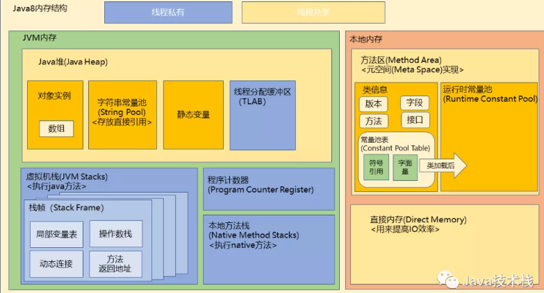
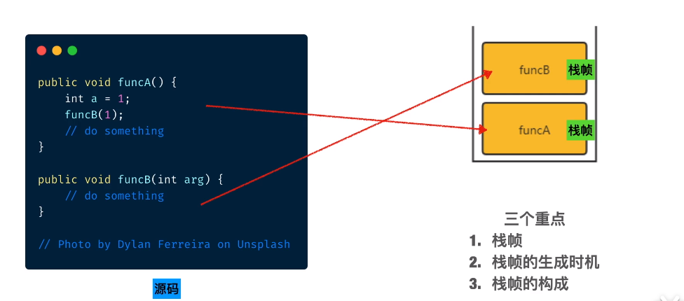
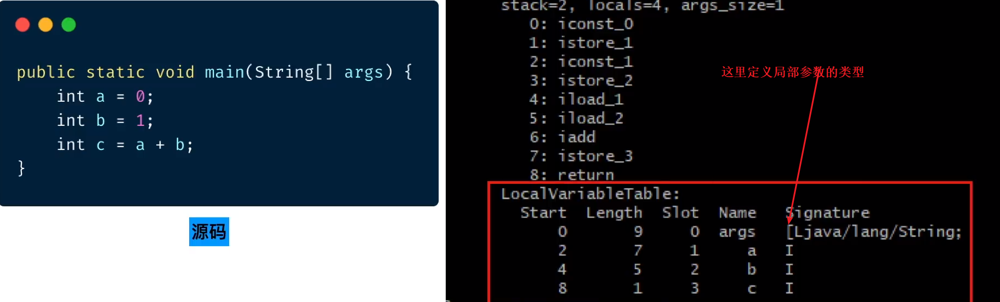
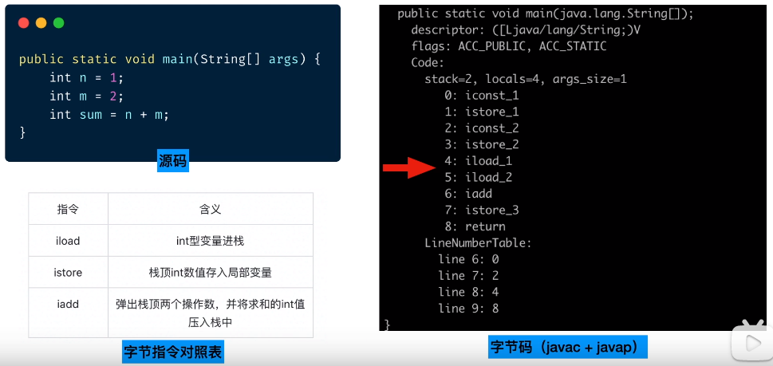
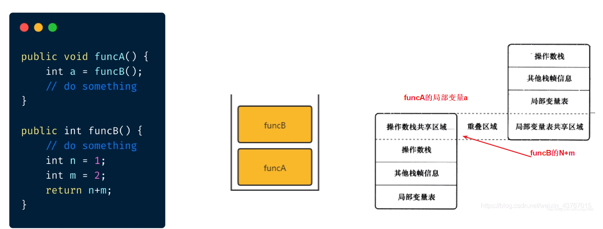
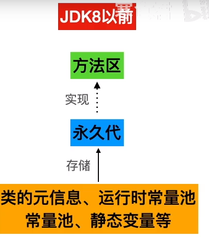
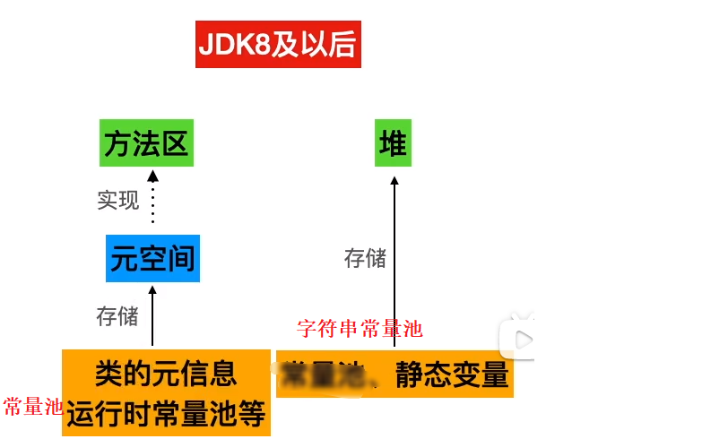
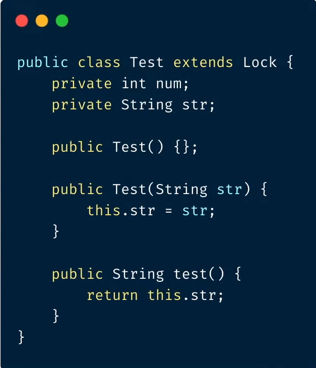
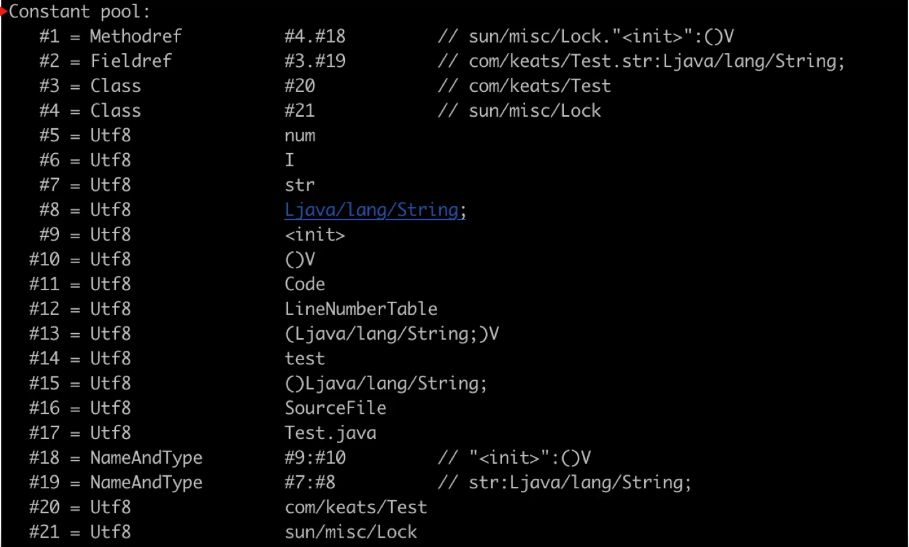
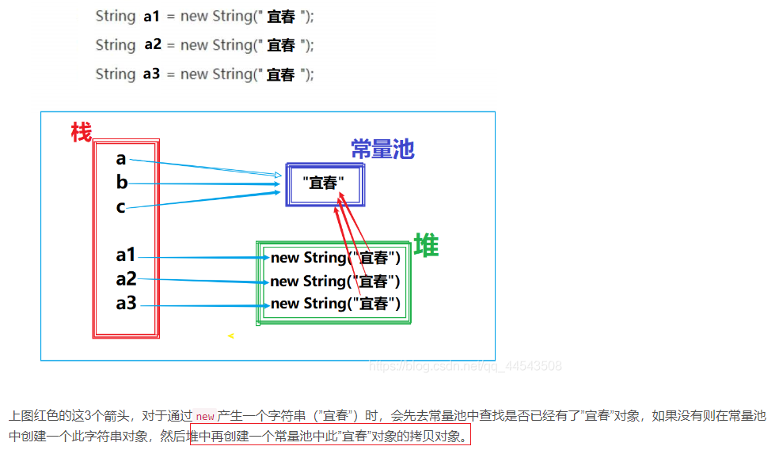

# Table of Contents

* [什么是本地内存和虚拟机内存](#什么是本地内存和虚拟机内存)
  * [JVM内存](#jvm内存)
  * [本地内存](#本地内存)
* [Jvm内存分区(图片是精髓)](#jvm内存分区图片是精髓)
* [程序计数器](#程序计数器)
* [虚拟机栈(Java 方法栈)](#虚拟机栈java-方法栈)
  * [局部变量表(Local Variable Table)](#局部变量表local-variable-table)
  * [操作数栈(OPerand Stack)](#操作数栈operand-stack)
  * [动态链接(Dynamic Linking)](#动态链接dynamic-linking)
  * [返回地址(Return Address)](#返回地址return-address)
* [本地方法栈](#本地方法栈)
* [方法区](#方法区)
  * [永久代](#永久代)
  * [元空间](#元空间)
  * [类的元信息](#类的元信息)
  * [常量池](#常量池)
  * [常量池和运行时常量池](#常量池和运行时常量池)
  * [垃圾回收](#垃圾回收)
* [堆内存](#堆内存)
* [相关问题](#相关问题)
  * [String s = new String(" a ") 到底产生几个对象？](#string-s--new-string-a--到底产生几个对象)
  * [String a = new String("a"+"b")](#string-a--new-stringab)

# 什么是本地内存和虚拟机内存

 Java虚拟机在执行的时候会把管理的内存分配成不同的区域，这些区域被称为**虚拟机内存**。

对于虚拟机没有直接管理的物理内存，也有一定的利用，这些被利用却不在虚拟机内存数据区的内存，我们称它为**本地内存**

## JVM内存

- 受虚拟机内存大小的参数控制，当大小超过参数设置的大小时就会报OOM

## 本地内存

- 本地内存不受虚拟机内存参数的限制，只受物理内存容量的限制
- 虽然不受参数的限制，但是如果内存的占用超出物理内存的大小，同样也会报OOM

# Jvm内存分区(图片是精髓)

# 程序计数器

> 在硬件层面，程序计数器是一种寄存器，用来存储指令地址提供处理器执行。
>
> 在Jvm软件层面，程序计数器也是一样的作用
>
> 实现方式不一样，但是思想是类似的。
> 

程序计数器是一块较小的内存空间，可以看作是当前线程所执行的字节码的**行号指示器**。

 **作用**

PC 寄存器用来存储指向下一条指令的地址，即将要执行的指令代码。由执行引擎读取下一条指令。

+ 它是一块很小的内存空间，几乎可以忽略不计。也是运行速度最快的存储区域

+ 在 JVM 规范中，每个线程都有它自己的程序计数器，是线程私有的，生命周期与线程的生命周期一致

+ 任何时间一个线程都只有一个方法在执行，也就是所谓的**当前方法**。如果当前线程正在执行的是 Java 方法，程序计数器记录的是 JVM 字节码指令地址，如果是执行 native 方法，则是未指定值（undefined）

+ 它是程序控制流的指示器，分支、循环、跳转、异常处理、线程恢复等基础功能都需要依赖这个计数器来完成

+ 字节码解释器工作时就是通过改变这个计数器的值来选取下一条需要执行的字节码指令

+ **它是唯一一个在 JVM 规范中没有规定任何 OutOfMemoryError 情况的区域**

我们是否在程序运行时，监控程序计数器的值？

不能， 因为Jvm并没有提供接口供上层调用，不过可以看字节码来进行观察。

# 虚拟机栈(Java 方法栈)

> 保存了局部变量、操作数栈、方法调用、返回地址

程序执行过程对应方法的调用，而方法的调用实际上**对应栈帧的入栈出栈**。

+ A方法被封装成栈帧入栈
+ B方法被封装成栈帧入栈
+ B方法出栈
+ A方法出栈

栈帧主要存在4种数据结构

##  局部变量表(Local Variable Table)

  + 是在编译期间决定下来的，运行时时不会改变的
  + 存储方法的参数、定义在方法的局部变量，包括**基本数据类型、对象应用地址、返回值地址。**
  + 通过变量槽(Slot)，32位一个 64位2个

  

##  操作数栈(OPerand Stack)

  在操作系统层面，操作数是指令的一部分。
  在Jvm,这里的操作数大多是方法内的变量。

  那为什么需要操作数栈来对操作数进行入栈出栈？

  + 存储操作数，包括中间结果

  + 方便指令顺序读取操作数

    > 联想用栈实现计算机功能 简直了~

    

+ 如果有栈帧，先执行完方法的返回值，会被当作后执行方法的入参

  ​    

需要从栈帧B的局部变量表将该值复制到栈帧A的操作数栈。

Jvm实现种，将两个栈帧的一部分重叠，让**下面的操作数栈**和**上面栈帧的部分局部变量表**重叠在一起，在进行方法调用可以共享数据。

> 一种优化

##  动态链接(Dynamic Linking)

>  Java中的多态是通过栈帧中的动态链接来实现的！
> 栈帧中的动态链接使得java可以实现多态 
>
> 或者说 栈帧中的动态链是Java多态的必要条件

类加载中的连接，Jvm将会**部分符号引用**替换位直接引用(静态解析)，有些方法因为**多态的存在**(动态连接)。

无法在类加载阶段被确定调用的具体类型，在调用的时候，根据具体调用信息来进行连接。

使用了什么字节码进行动态解析？

## 返回地址(Return Address)

  

> 返回地址：调用方法返回的行数 
>
> 返回值地址：当前方法返回值地址

+ 正常执行
+ 异常情况

# 本地方法栈

简单的讲，一个 Native Method 就是一个 Java 调用非 Java 代码的接口。我们知道的 Unsafe 类就有很多本地方法。

Java 使用起来非常方便，然而有些层次的任务用 Java 实现起来也不容易，或者我们对程序的效率很在意时，问题就来了

- 与 Java 环境外交互：有时 Java 应用需要与 Java 外面的环境交互，这就是本地方法存在的原因。
- 与操作系统交互：JVM 支持 Java 语言本身和运行时库，但是有时仍需要依赖一些底层系统的支持。通过本地方法，我们可以实现用 Java 与实现了 jre 的底层系统交互， JVM 的一些部分就是 C 语言写的。
- Sun's Java：Sun的解释器就是C实现的，这使得它能像一些普通的C一样与外部交互。jre大部分都是用 Java 实现的，它也通过一些本地方法与外界交互。比如，类 `java.lang.Thread` 的 `setPriority()` 的方法是用Java 实现的，但它实现调用的是该类的本地方法 `setPrioruty()`，该方法是C实现的，并被植入 JVM 内部。

# 方法区

> 方法区是虚拟机规范中的抽象概念，可以理解为java中的抽象类。

## 永久代

JDK8之前使用'`永久代`'来作为HotSpot上方法区的实现，但是后来发现设计并不好。

可能有以下缺点
+ 可能引起内存溢出

  因为常量池在变化

+ 本身复杂的设计并不是方法区所需要的，可能带来未知异常

  本地是面向堆设计的，对象不是内存连续的，需要通过额外对象查找机制来定位对象。

> 最开始使用，是为了代码复用。

## 元空间
+ JDK8之后，借鉴了一些JRockit的设计思路，使用`元空间`**来代替**`永久代`
+ 注意只有方法区是**基于本地内存的**

> Q:常量池和运行时常量池什么区别？
>
> A:

## 类的元信息

类加载过程的第一个阶段叫`加载`,虚拟机会将`Class`文件生产`Class`对象，`Class`对象存储了一些类型信息，这些信息就是存储在方法区的。

+ 类签名
+ 属性
+ 方法

## 常量池

> 常量池的作用？

大部分类都是相互依赖的，最无脑就是把所有依赖的都放在一起编译，但是很蠢。

比较合理的方式，是通过类似指针的方式，在类A的字节码中留一个指针，指向调用的类B,这里就是类加载中`链接`把`符合引用`转化了`直接引用`。

**常量池的数据就体现了符号引用和一些其他的静态引用。**

> 常量池更像一张`链接表`

我们可以看到第一行和第二行分别对应了方法和属性所需使用到的外部链接。

## 常量池和运行时常量池

常量池：编译期间产生的，也包含字符串常量池

> Int a=10  10就是字面量

运行时常量池：运行期间产生的

## 垃圾回收

当方法区内存占用一定阈值，还是需要回收的。

对部分类进行卸载，需要的时候，在重新加载。

# 堆内存

通过参数-Xmx和-Xms设定

+ 对象实例
    + 类初始化
    + 数组对象

+ 字符串常量池
    + 1.7 放入堆中
    + 存放的是String对象的引用

+ 静态变量
    + 1.7 放入堆中
+ 线程分配缓冲区

# 相关问题

## String s = new String(" a ") 到底产生几个对象？

严谨的来说是一个或者两个。因为在这之前你不能确定常量池中是否有这个常量

对于通过`new`产生一个字符串（”宜春”）时，会先去常量池中查找是否已经有了”宜春”对象，如果没有则在常量池中创建一个此字符串对象，然后堆中再创建一个常量池中此”宜春”对象的拷贝对象。

堆中分配了3块内存空间

## String a = new String("a"+"b")

在编译后会直接等同于String a = new String("ab")，接着就可以套用你文章中的内容了；先查找"ab"是否已在常量池中，若无则创建字面量+堆上建引用对象

