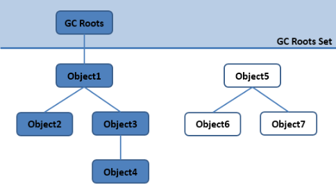
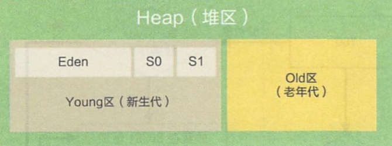
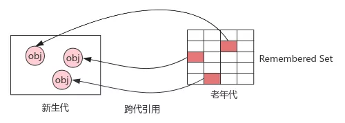
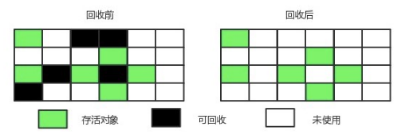
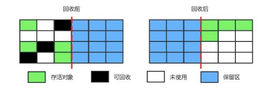

# Table of Contents

* [简述Java垃圾回收机制](#简述java垃圾回收机制)
* [哪些内存需要回收？](#哪些内存需要回收)
* [判断一个对象是否可以回收](#判断一个对象是否可以回收)
  * [引用计数法](#引用计数法)
  * [可达性分析算法](#可达性分析算法)
* [GC Roots 有哪些?](#gc-roots-有哪些)
  * [finalize()](#finalize)
* [引用类型](#引用类型)
  * [强引用](#强引用)
  * [软引用](#软引用)
  * [弱引用](#弱引用)
  * [虚引用](#虚引用)
* [说一说分代收集理论](#说一说分代收集理论)
* [为什么划分年轻代和老年代](#为什么划分年轻代和老年代)
* [年轻代和老年代是怎么划分的(JDK8之前)](#年轻代和老年代是怎么划分的jdk8之前)
* [年青代什么时间进入老年代](#年青代什么时间进入老年代)
  * [Minor GC(YGC)](#minor-gcygc)
  * [年轻代GC的时候，从GC ROOTS出发，不也会扫描到[老年代]对象吗](#年轻代gc的时候从gc-roots出发不也会扫描到老年代对象吗)
  * [老年代引用年轻代怎么办？](#老年代引用年轻代怎么办)
  * [Major GC(FGC)](#major-gcfgc)
  * [什么时候发生FGC](#什么时候发生fgc)
* [垃圾回收算法](#垃圾回收算法)
  * [标记-清除](#标记-清除)
  * [标记-整理](#标记-整理)
    * [吞吐量和延迟](#吞吐量和延迟)
    * [折中解决](#折中解决)
  * [标记-复制](#标记-复制)
* [什么是 STW ?](#什么是-stw-)
* [为什么需要 STW?](#为什么需要-stw)
* [垃圾回收器是怎样寻找 GC Roots 的？](#垃圾回收器是怎样寻找-gc-roots-的)
* [OopMap 是做什么的?有什么好处?](#oopmap-是做什么的有什么好处)
* [什么是安全点?](#什么是安全点)
* [安全区域是什么?解决了什么问题](#安全区域是什么解决了什么问题)
* [内存分配与回收策略](#内存分配与回收策略)
* [空间分配担保](#空间分配担保)
  * [谁进行空间担保？](#谁进行空间担保)
  * [什么是空间分配担保？](#什么是空间分配担保)
  * [为什么要进行空间担保？](#为什么要进行空间担保)


# 简述Java垃圾回收机制


+ GC 可分解为 3 个子问题：**which（哪些内存可被回收）、when（什么时候回收）、how（如何回收）**

  + 堆内存和方法去
  + 年轻代和老年代
  + 标记-复制-清楚-整理


在java中，程序员是不需要显示的去释放一个对象的内存的，而是由虚拟机自行执行。在JVM中，有一个垃圾回收线程，它是低优先级的，在正常情况下是不会执行的，**只有在虚拟机空闲或者当前堆内存不足时**，才会触发执行，扫面那些没有被任何引用的对象，并将它们添加到要回收的集合中，进行回收。


+ 有什么办法主动通知虚拟机进行垃圾回收？

程序员可以手动执行System.gc()，通知GC运行，但是Java语言规范并不保证GC一定会执行。


#  哪些内存需要回收？

程序计数器、虚拟机栈、本地方法栈3个区域随线程而生，随线程而灭，栈 中的栈帧随着方法的进入和退出而有条不紊地执行着出栈和入栈操作。每一个栈帧中分配多少内存基 本上是在类结构确定下来时就已知的因此这几个区域的内存分配和回收都具备确定性，在这几个区域内就不需要过多考虑如何回收的问题，当方法结束或者线程结束时，内存自然就跟随着 回收了。

**而Java堆和方法区**这两个区域则有着很显著的不确定性：一个接口的多个实现类需要的内存可能会不一样，一个方法所执行的不同条件分支所需要的内存也可能不一样，只有处于运行期间，我们才 能知道程序究竟会创建哪些对象，创建多少个对象，**这部分内存的分配和回收是动态的**。垃圾收集器 所关注的正是这部分内存该如何管理

 

+ 堆垃圾回收

  堆区的垃圾收集主要发生在年轻代，FG才会回收老年代。

+ 方法区的垃圾回收

方法区的垃圾收集主要回收两部分内容：废弃的常量和不再使用的类型，但是回收成果是比较低的。

 


# 判断一个对象是否可以回收


## 引用计数法


给对象添加一个引用计数器，当对象增加一个引用时计数器加 1，引用失效时计数器减 1。引用计数为 0 的对象可被回收。

两个对象出现循环引用的情况下，此时引用计数器永远不为 0，导致无法对它们进行回收。

正因为循环引用的存在，因此 Java 虚拟机不使用引用计数算法。

> 以下是个简单的例子

主流的Java虚拟机里面都没有选用引用计数算法来管理内存，主要原因是，这个看似简单的算法有很多例外情况要考虑，必须要配合大量额外处理才能保证正确地工作，譬如单纯的引用计数 就很难解决对象之间相互循环引用的问题。 （对象objA和objB都有字段instance，赋值令objA.instance=objB及objB.instance=objA，**除此之外，这两个对象再无任何引用，实际上这两个对象已经不可能再被访问，但是它们因为互相引用着对方，导致它们的引用计数都不为零，引用计数算法也就无法回收它们**。 ）

> 可达性分析怎么解决循环依赖的呢？


## 可达性分析算法


通过一系列称为“GC Roots”的根对象作为起始节点集，从这些节点开始，根据引用关系向下搜索，搜索过程所走过的路径称为“引用链”（Reference Chain），如果某个对象到GC Roots间没有任何引用链相连，或者用图论的话来说就是从GC Roots到这个对象不可达时，则证明此对象是不可能再被使用的。

> 举例说明：
>
> `GC Roots`是一组必须【活跃】的【引用】
>
> 栈帧中有局部变量，存储的引用 就是【GC ROOT】的体现
>
> 当前活跃的【栈帧指向堆里的对象引用】可以是GC ROOT


<div align=left>
	
</div>


# GC Roots 有哪些?

在java中，有「**「固定的GC Roots 对象」**」和「**「不固定的临时GC Roots对象」**:」

「**「固定的GC Roots:」**」

- 1.在「**「虚拟机栈(栈帧的本地变量表)中所引用的对象」**」，譬如各个线程被调用的方法堆栈中使用到的参数、局部变量、临时变量等。
- 在方法区中「类静态属性引用的对象」，譬如 Java 类的**「引用静态变量」**。
- 在方法区中「**「常量引用的对象」**」，譬如字符串常量池中的引用。
- 在方法区栈中 **「「JNI (譬如 Native 方法)引用的对象」」**。
- Java **「「虚拟机内部的引用」」**，如基本数据类型对应的 Class 对象，一些常驻的异常对象(空指针异常、OOM等)，还有类加载器。
- 所有「**「被 Synchronized 持有的对象」**」。
- 反应 Java 虚拟机内部情况的 **「「JMXBean、JVMTI 中注册的回调本地代码缓存等」」**。

「**「临时GC Roots:」**」

- 「**「为什么会有临时的 GC Roots ？」**」:目前的垃圾回收大部分都是「**「分代收集和局部回收」**」，如果只针对某一部分区域进行局部回收，那么就必须要考虑的「**「当前区域的对象有可能正被其他区域的对象所引用」**」，这时候就要将这部分关联的对象也添加到 GC Roots 中去来确保根可达算法的准确性。这种算法是利用了「**「逆向思维」**」，找到使用的对象，剩下的就是垃圾，也被称为"间接垃圾收集"。


## finalize()

finalize() 类似 C++ 的析构函数，用来做关闭外部资源等工作。但是 try-finally 等方式可以做的更好，并且该方法运行代价高昂，不确定性大，无法保证各个对象的调用顺序，因此最好不要使用。

当一个对象可被回收时，如果需要执行该对象的 finalize() 方法，那么就有可能通过在该方法中让对象重新被引用，从而实现自救。**自救只能进行一次**，如果回收的对象之前调用了 finalize() 方法自救，后面回收时不会调用 finalize() 方法。


# 引用类型

无论是通过引用计算算法判断对象的引用数量，还是通过可达性分析算法判断对象是否可达，判定对象是否可被回收都与引用有关。

Java 具有四种强度不同的引用类型。

## 强引用

强引用是最传统的“引用”的定义，是指在程序代码之中普遍存在的引用赋值，即类似“Object obj=new Object()”这种引用关系。无论任何情况下，**只要强引用关系还存在，垃圾收集器就永远不会回收掉被引用的对象。** 

使用 new 一个新对象的方式来创建强引用。

```java
Object obj = new Object();
```

## 软引用

软引用是用来描述一些还有用，但非必须的对象。只被软引用关联着的对象，在系统将要发生内存溢出异常前，会把这些对象列进回收范围之中进行第二次回收，如果这次回收还没有足够的内存，才会抛出内存溢出异常。在JDK 1.2版之后提供了SoftReference类来实现软引用。 

**被软引用关联的对象只有在内存不够的情况下才会被回收。**

使用 SoftReference 类来创建软引用。

```java
Object obj = new Object();
SoftReference<Object> sf = new SoftReference<Object>(obj);
obj = null;  // 使对象只被软引用关联
```

## 弱引用

·弱引用也是用来描述那些非必须对象，但是它的强度比软引用更弱一些，被弱引用关联的对象只能生存到下一次垃圾收集发生为止。**当垃圾收集器开始工作，无论当前内存是否足够，都会回收掉只被弱引用关联的对象。**在JDK 1.2版之后提供了WeakReference类来实现弱引用。 

使用 WeakReference 类来实现弱引用。

**应用场景**：`ThreadLocal`

```java
Object obj = new Object();
WeakReference<Object> wf = new WeakReference<Object>(obj);
obj = null;
```

## 虚引用

又称为幽灵引用或者幻影引用。一个对象是否有虚引用的存在，完全不会对其生存时间构成影响，也无法通过虚引用取得一个对象。 **为一个对象设置虚引用关联的唯一目的就是能在这个对象被回收时收到一个系统通知**。 使用 PhantomReference 来实现虚引用。


```java
Object obj = new Object();
PhantomReference<Object> pf = new PhantomReference<Object>(obj);
obj = null;
```


即使在可达性分析算法中判定为不可达的对象，也不是“非死不可”的，这时候它们暂时还处于“缓刑”阶段，**要真正宣告一个对象死亡，至少要经历两次标记过程**：如果对象在进行可达性分析后发现没有与GC Roots相连接的引用链，那它将会被第一次标记，随后进行一次筛选，筛选的条件是此**对象是否有必要执行finalize()方法**。假如对象没有覆盖finalize()方法，或者finalize()方法已经被虚拟机调用 过，那么虚拟机将这两种情况都视为“没有必要执行”。 


​    Finalize（）方法是对象脱逃死亡命运的最后一次机会，稍后GC将对F-Queue中的对象进行第二次小规模标记，如果对象要在finalize（）中成功拯救自己----只要重新与引用链上的任何的一个对象建立关联即可，譬如把自己赋值给某个类变量或对象的成员变量，那在第二次标记时它将移除出“即将回收”的集合。如果对象这时候还没逃脱，那基本上它就真的被回收了。


# 说一说分代收集理论

大多数的垃圾回收器都遵循了分代收集的理论进行设计，它建立在两个分代假说之上:

- **「「弱分代假说」」**:绝大多数对象都是朝生夕灭的。
- **「「强分代假说」」**:熬过越多次数垃圾回收过程的对象就越难消亡。

这两种假说的设计原则都是相同的:垃圾收集器「**「应该将jvm划分出不同的区域」**」，把那些较难回收的对象放在一起（一般指老年代），这个区域的垃圾回收频率就可以降低，减少垃圾回收的开销。剩下的区域(一般指新生代)可以用较高的频率去回收，并且只需要去关心那些存活的对象，也不用标记出需要回收的垃圾，这样就能够以较低的代价去完成垃圾回收。

- **「「跨代引用假说」」**：如果某个新生代的对象存在了跨代引用，但是老年代的对象是很难消亡的，那么随着时间的推移，这个新生代对象也会慢慢晋升为老年代对象，那么这种跨代引用也就被消除了。

由于跨代引用是很少的，所以我们不应该为了少量的跨代引用去扫描整个老年代的数据，只需要在新生代对象建立一个「**「记忆集」**」来记录引用信息。记忆集:「**「将老年代分为若干个小块，每块区域中有 N 个对象」**」，在对象引用信息发生变动的时候来维护记忆集数据的准确性，这样每次发生了 「**「"Minor GC"」**」 的时候只需要将记忆集中的对象添加到 「**「"GC Roots"」**」 中就可以了。


# 为什么划分年轻代和老年代

研究表明：**大部分对象生命周期很短，而只有少部分对象可能会存货很长时间**

又因为【垃圾回收】的时候，会导致【STOP THE WORD】

**目的**： 为了使【STOP THE WORD】持续的时间尽可能短以及提高并发式GC所能应对的分配速率。

**措施**： 在很多垃圾器都会在【物理】或【逻辑】上，把这2类对象进行区分。


# 年轻代和老年代是怎么划分的(JDK8之前)

 **一般是把java堆分成新生代和老年代，这样就可以根据各个年待的特点采用最适合的收集算法。**

+ 年轻代就是存放那种使用完就立马回收的对象。

+ 而老年代则用来存放那些长期驻留在内存中的对象。

  在**新生代**中，每次垃圾收集时都发现有大批对象死去，只有少量存活，那就选用“**复制算法”**，只需要付出少量存活对象的复制成本就可以完成收集。

​     在**老年代**中，因为对象存活率高、没有额外空间对它进行分配担保，就必须使用“**标记-清理**”或“**标记-整理**”算法来进行回收。


下图展示的是：新生代和老年代在堆中的内存分布(**G1之前，G1后是分区的，只有逻辑上的新生代和老年代**)




# 年青代什么时间进入老年代

1. **对象太大了**，就会直接进入老年代(创建时很大||没办法放入survivor)
2. **对象太老了**,没发生依次YGC，年龄就会加1，默认是15进去


## Minor GC(YGC)

> YGC` 是在 **Eden 区快满的情况下才会触发**

1. 在GC未开始的时候，对象只会存在于Eden区和名为“From”的Survivor区，Survivor区“To”是空的。

2. Eden区快满的时候，触发YGC

3. Eden区中所有存活的对象都会被复制到“To”

4. 而在“From”区中，仍存活的对象会根据他们的年龄值来决定去向。年龄达到一定值(年龄阈值，可以通过-XX:MaxTenuringThreshold来设置)的对象会被移动到年老代中，没有达到阈值的对象会被复制到“To”区域

5. 经过这次GC后，Eden区和From区已经被清空。

6. **From”和“To”会交换他们的角色**，重复上面过程。

7. 直到【TO】被填满，会将对象移动到老年代中。

   

> 但是这里会产生一个问题，
>
> Q:为啥会有两个 Survivor 区？
>
> A:年青代都是标记复制，目的就是为了有一块完整的内存空间供垃圾回收器进行移动


## 年轻代GC的时候，从GC ROOTS出发，不也会扫描到[老年代]对象吗

(G1以下)是要求整个GC堆在连续的地址空间上，所以会有一条分界线，可以通过地址，判断对象在哪个分代上。


## 老年代引用年轻代怎么办？

1. 首先这些被引用对象时不能回收的？

   个人觉得如果被老年代所引用，应该是不可以被回收的。

   **所以我们要避免这种情况，将年轻代消灭在eden区。**

2. 现在问题时，怎么找到这些被引用的的？

   **解决跨代引用：记忆集**

   实现是用卡表实现的。


## Major GC(FGC)

发生在老年代的GC ，基本上发生了一次Major GC 就会发生一次 Minor GC。并且Major GC 的速度往往会比 Minor GC 慢 10 倍。

 **回收的是整个新生代和老年代**


## 什么时候发生FGC

既然我们已经知道了 `YGC` 是在 **Eden 区快满的情况下才会触发**

那么`FGC`呢？

1. 对于**一个大对象**，我们会首先在Eden 尝试创建，如果创建不了，就会触发Minor GC
2. 随后继续尝试在Eden区存放，发现仍然放不下
3. 尝试直接进入老年代，老年代也放不下
4. 触发 Major GC 清理老年代的空间
5. 放的下 成功
6. 放不下 OOM

**发生 FGC 会严重阻碍系统的运行，所以我们要避免FGC!!!**


# 垃圾回收算法

分代收集理论

**当前商业虚拟机的垃圾收集器，大多数都遵循了****“****分代收集****”****的理论**

1）弱分代假说：绝大多数对象都是朝生夕灭的。 

2）强分代假说：熬过越多次垃圾收集过程的对象就越难以消亡。

3）跨代引用假说：跨代引用相对于同代引用来说仅占极少数。

- 问题：老年代会引用新生代，新生代 GC 时需遍历老年代中大量的存活对象，分析可达性，时间复杂度高

- 背景：相互引用的对象倾向于同时存亡，比如跨代引用关系中的新生代必然会逐步晋升，最终消除跨代关系

- 假说：跨代引用相比同代引用只占极少数，无需全量扫描老年代

- 实现：新生代维护全局数据结构：记忆集（Remembered Set），将老年代分为多个子块，标记存在跨代引用的子块，等待后续扫描；代价：为保证记忆集的正确性，需在跨代引用建立或断开时保持同步

   

垃圾收集分代名词：

部分收集（Partial GC）：指目标不是完整收集整个Java堆的垃圾收集，其中又分为： 

新生代收集（Minor GC/Young GC）：指目标只是新生代的垃圾收集。 

老年代收集（Major GC/Old GC）：指目标只是老年代的垃圾收集。目前只有CMS收集器会有单独收集老年代的行为。另外请注意“Major GC”这个说法现在有点混淆，在不同资料上常有不同所指，读者需按上下文区分到底是指老年代的收集还是整堆收集。 

混合收集（Mixed GC）：指目标是收集整个新生代以及部分老年代的垃圾收集。目前只有G1收集器会有这种行为。 

·整堆收集（Full GC）：收集整个Java堆和方法区的垃圾收集。 

## 标记-清除

> 产生大量内存碎片


<div align=left>
	
</div>
1.标记阶段：首先标记出所有需要回收的对象

2.清除阶段：在标记完成后，统一回收掉所有被标记的对象，也可以反过来，标记存活的对象，统一回收所有未被标记的对象。

不足:

+ 标记和清除过程效率都不高；如果Java堆中包含大量对象，而且其中大部分是需要被回收的，这时必须进行大量标记和清除的动作，导致标记和清除两个过程的执行效率都随对象数量增长而降低
+ 会产生大量不连续的内存碎片，导致无法给大对象分配内存。空间碎片太多可能会导致当以后在程序运行过程中需要分配较大对象时无法找到足够的连续内存而不得不提前触发另一次垃圾收集动作。

## 标记-整理

> 造成STW


<div align=left>
	
</div>
首先标记出所有需要回收的对象/标记存活的对象，让所有存活的对象都向内存空间一端移动，然后直接清理掉边界以外的内存

 

如果移动存活对象，尤其是在老年代这种每次回收都有大量对象存活区域，移动存活对象并更新所有引用这些对象的地方将会是一种极为负重的操作，而且这种对象移动操作必须全程暂停用户应用程序才能进行，这样的停顿被描述为“Stop The World”。 

 

但如果跟标记-清除算法那样完全不考虑移动和整理存活对象的话，弥散于堆中的存活对象导致的空间碎片化问题就只能依赖更为复杂的内存分配器和内存访问器来解决。内存的访问是用户程序最频繁的操作，假如在这个环节上增加了额外的负担，势必会直接影响应用程序的吞吐量。 

 

基于以上两点，是否移动对象都存在弊端，移动则内存回收时会更复杂，不移动则内存分配时会更复杂。从垃圾收集的停顿时间来看，不移动对象停顿时间会更短，甚至可以不需要停顿，但是从整个程序的吞吐量来看，移动对象会更划算。


### 吞吐量和延迟

+ HotSpot虚拟机里面关注吞吐量的ParallelScavenge收集器是基于标记-整理算法的，
+ 而关注延迟的CMS收集器则是基于标记-清除算法的，这也从侧面印证这点。 

 

### 折中解决

另外，还有一种“和稀泥式”解决方案可以不在内存分配和访问上增加太大额外负担，做法是让虚拟机平时**多数时间都采用标记-清除算法**，暂时容忍内存碎片的存在，直到内存空间的碎片化程度已经**大到影响对象分配时，再采用标记-整理算法收集一次**，以获得规整的内存空间。前面提到的基于标记-清除算法的CMS收集器面临空间碎片过多时采用的就是这种处理办法。 

## 标记-复制

<div align=left>
	
</div>


1.把新生代分为一块较大的Eden空间和两块较小的Survivor空间，每次分配内存只使用Eden和其中一块Survivor。

2.发生垃圾收集时，将Eden和Survivor中仍然存活的对象一次性复制到另外一块Survivor空间上

3.然后直接清理掉Eden和已用过的那块Survivor空间。

HotSpot虚拟机默认Eden和Survivor的大小比例是8∶1，也即每次新生代中可用内存空间为整个新生代容量的90%（Eden的80%加上一个Survivor的10%），只有一个Survivor空间，即10%的新生代是会被“浪费”的。当然，98%的对象可被回收仅仅是“普通场景”下测得的数据，任何人都没有办法百分百保证每次回收都只有不多于10%的对象存活，因此Appel式回收还有一个充当罕见情况的“逃生门”的安全设计，当Survivor空间不足以容纳一次Minor GC之后存活的对象时，就需要依赖其他内存区域（实际上大多就是老年代）进行**分配担保**（Handle Promotion）。 

 

内存的分配担保：如果另外一块Survivor空间没有足够空间存放上一次新生代收集下来的存活对象，这些对象便将通过分配担保机制直接进入老年代，这对虚拟机来说就是安全的。

 

优点：每次都是针对整个半区进行内存回收，分配内存时也就不用考虑有空间碎片的复杂情况，只要移动堆顶指针，按顺序分配即可

缺点：如果内存中多数对象都是存活的，这种算法将会**产生大量的内存间复制的开销**。其次是可用内存缩小了


# 什么是 STW ?

Java 中「**「Stop-The-World机制简称 STW」**」 ，是在执行垃圾收集算法时，Java 应用程序的其他所有线程都被挂起（除了垃圾收集帮助器之外）。**「Java 中一种全局暂停现象，全局停顿」**，所有 Java 代码停止，native 代码可以执行，但不能与 JVM 交互。

# 为什么需要 STW?

在 java 应用程序中「**「引用关系」**」是不断发生「**「变化」**」的，那么就会有会有很多种情况来导致「**「垃圾标识」**」出错。想想一下如果 Object a  目前是个垃圾，GC 把它标记为垃圾，但是在清除前又有其他对象指向了 Object a，那么此刻 Object a 又不是垃圾了，那么如果没有 STW 就要去无限维护这种关系来去采集正确的信息。再举个例子，到了秋天，道路上洒满了金色的落叶，环卫工人在打扫街道，却永远也无法打扫干净，因为总会有不断的落叶。


# 垃圾回收器是怎样寻找 GC Roots 的？

我们在前面说明了根可达算法是通过 GC Roots 来找到存活的对象的，也定义了 GC Roots，那么垃圾回收器是怎样寻找GC Roots 的呢？首先，**「「为了保证结果的准确性，GC Roots枚举时是要在STW的情况下进行的」」**，但是由于 JAVA 应用越来越大，所以也不能逐个检查每个对象是否为 GC Root，那将消耗大量的时间。一个很自然的想法是，能不能用空间换时间，在某个时候把栈上代表引用的位置全部记录下来，这样到真正 GC 的时候就可以直接读取，而不用再一点一点的扫描了。事实上，大部分主流的虚拟机也正是这么做的，比如 HotSpot ，它使用一种叫做 **「「OopMap」」** 的数据结构来记录这类信息。

# OopMap 是做什么的?有什么好处?

我们知道，一个线程意味着一个栈，一个栈由多个栈帧组成，**一个栈帧对应着一个方法，一个方法里面可能有多个安全点。gc 发生时，程序首先运行到最近的一个安全点停下来，然后更新自己的 OopMap** ，记下栈上哪些位置代表着引用。枚举根节点时，递归遍历每个栈帧的 OopMap ，通过栈中记录的被引用对象的内存地址，即可找到这些对象（ GC Roots ）。使用 OopMap 可以「**「避免全栈扫描」**」，加快枚举根节点的速度。但这并不是它的全部用意。它的另外一个更根本的作用是，可以帮助 HotSpot 实现准确式 GC (即使用准确式内存管理，虚拟机可用知道内存中某个位置的数据具体是什么类型) 。


# 什么是安全点?

从线程角度看，安全点可以理解成是在「**「代码执行过程中」**」的一些「**「特殊位置」**」，当线程执行到这些位置的时候，说明「**「虚拟机当前的状态是安全」**」的。比如：「**「方法调用、循环跳转、异常跳转等这些地方才会产生安全点」**」。如果有需要，可以在这个位置暂停，比如发生GC时，需要暂停所有活动线程，但是线程在这个时刻，还没有执行到一个安全点，所以该线程应该继续执行，到达下一个安全点的时候暂停，等待 GC 结束。那么如何让线程在垃圾回收的时候都跑到最近的安全点呢？这里有「**「两种方式」**」：

- **「抢先式中断」**

- - 抢先式中断：就是在stw的时候，先让所有线程「**「完全中断」**」，如果中断的地方不在安全点上，然后「**「再激活」**」，「**「直到运行到安全点的位置」**」再中断。

- **「主动式中断」**

- - 主动式中断：在安全点的位置打一个标志位，每个线程执行都去轮询这个标志位，如果为真，就在最近的安全点挂起。


# 安全区域是什么?解决了什么问题

刚刚说到了主动式中断,但是如果有些线程处于sleep状态怎么办呢？

为了解决这种问题，又引入了安全区域的概念安全区域是指「**「在一段代码片中，引用关系不会发生改变」**」，实际上就是一个安全点的拓展。当线程执行到安全区域时，首先标识自己已进入安全区域，那样，当在这段时间里 JVM 要发起 GC 时，就不用管标识自己为“安全区域”状态的线程了，该线程只能乖乖的等待根节点枚举完或者整个GC过程完成之后才能继续执行。


# 内存分配与回收策略

基于用Serial加Serial Old

- 对象优先在Eden分配

大多数情况下，对象在新生代Eden区中分配。当Eden区没有足够空间进行分配时，虚拟机将发起一次Minor GC。如果本次 GC 后还是没有足够的空间，则将启用分配担保机制在老年代中分配内存。

- 大对象直接进入老年代 

大对象就是指需要大量连续内存空间的Java对象，最典型的大对象便是那种很长的字符串，或者元素数量很庞大的数组，本节例子中的byte[]数组就是典型的大对象。大对象对虚拟机的内存分配来说就是一个不折不扣的坏消息，比遇到一个大对象更加坏的消息就是遇到一群“朝生夕灭”的“短命大对象”，我们写程序的时候应注意避免。**在****Java****虚拟机中要避免大对象的原因是，在分配空间时，它容易导致内存明明还有不少空间时就提前触发垃圾收集，以获取足够的连续空间才能安置好它们，而当复制对象时，大对象就意味着高额的内存复制开销。**HotSpot虚拟机提供了-XX：PretenureSizeThreshold参数，指定大于该设置值的对象直接在老年代分配，这样做的目的就是避免在Eden区及两个Survivor区之间来回复制，产生大量的内存复制操作。 

- 长期存活的对象将进入老年代

HotSpot虚拟机中多数收集器都采用了**分代收集来管理堆内存**，那内存回收时就必须能决策哪些存活对象应当放在新生代，哪些存活对象放在老年代中。为做到这点，虚拟机给每个对象定义了一个对象年龄（Age）计数器，存储在对象头中（详见第2章）。对象通常在Eden区里诞生，如果经过第一次Minor GC后仍然存活，并且能被Survivor容纳的话，该对象会被移动到Survivor空间中，并且将其对象年龄设为1岁。对象在Survivor区中每熬过一次Minor GC，年龄就增加1岁，当它的年龄增加到一定程度（默认为15），就会被晋升到老年代中。对象晋升老年代的年龄阈值，可以通过参数-XX：MaxTenuringThreshold设置。

- 动态对象年龄判定 

为了能更好地适应不同程序的内存状况，HotSpot虚拟机并不是永远要求对象的年龄必须达到-XX：MaxTenuringThreshold才能晋升老年代，如果在Survivor空间中相同年龄所有对象大小的总和大于Survivor空间的一半，年龄大于或等于该年龄的对象就可以直接进入老年代，无须等到-XX：MaxTenuringThreshold中要求的年龄。 

# 空间分配担保

## 谁进行空间担保？

JVM使用分代收集算法，将堆内存划分为年轻代和老年代，两块内存分别采用不同的垃圾回收算法，空间担保指的是老年代进行空间分配担保

## 什么是空间分配担保？

在发生Minor GC之前，虚拟机会检查老年代最大可用的连续空间是否大于新生代所有对象的总空间，

如果大于，则此次Minor GC是安全的

如果小于，则虚拟机会查看HandlePromotionFailure设置值是否允许担保失败。如果HandlePromotionFailure=true，那么会继续检查老年代最大可用连续空间是否大于历次晋升到老年代的对象的平均大小，如果大于，则尝试进行一次Minor GC，但这次Minor GC依然是有风险的；如果小于或者HandlePromotionFailure=false，则改为进行一次Full GC。

## 为什么要进行空间担保？

是因为新生代采用复制收集算法，假如大量对象在Minor GC后仍然存活（最极端情况为内存回收后新生代中所有对象均存活），而Survivor空间是比较小的，这时就需要老年代进行分配担保，把Survivor无法容纳的对象放到老年代。老年代要进行空间分配担保，前提是老年代得有足够空间来容纳这些对象，但一共有多少对象在内存回收后存活下来是不可预知的，因此只好取之前每次垃圾回收后晋升到老年代的对象大小的平均值作为参考。使用这个平均值与老年代剩余空间进行比较，来决定是否进行Full GC来让老年代腾出更多空间。
