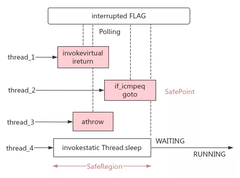
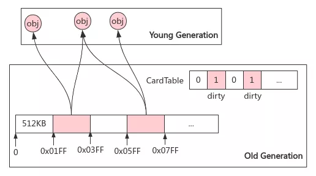
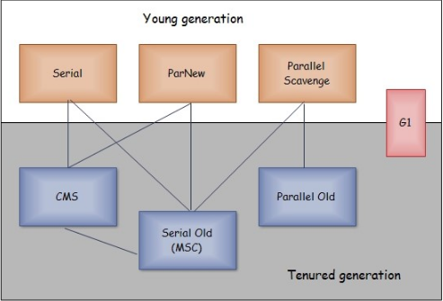
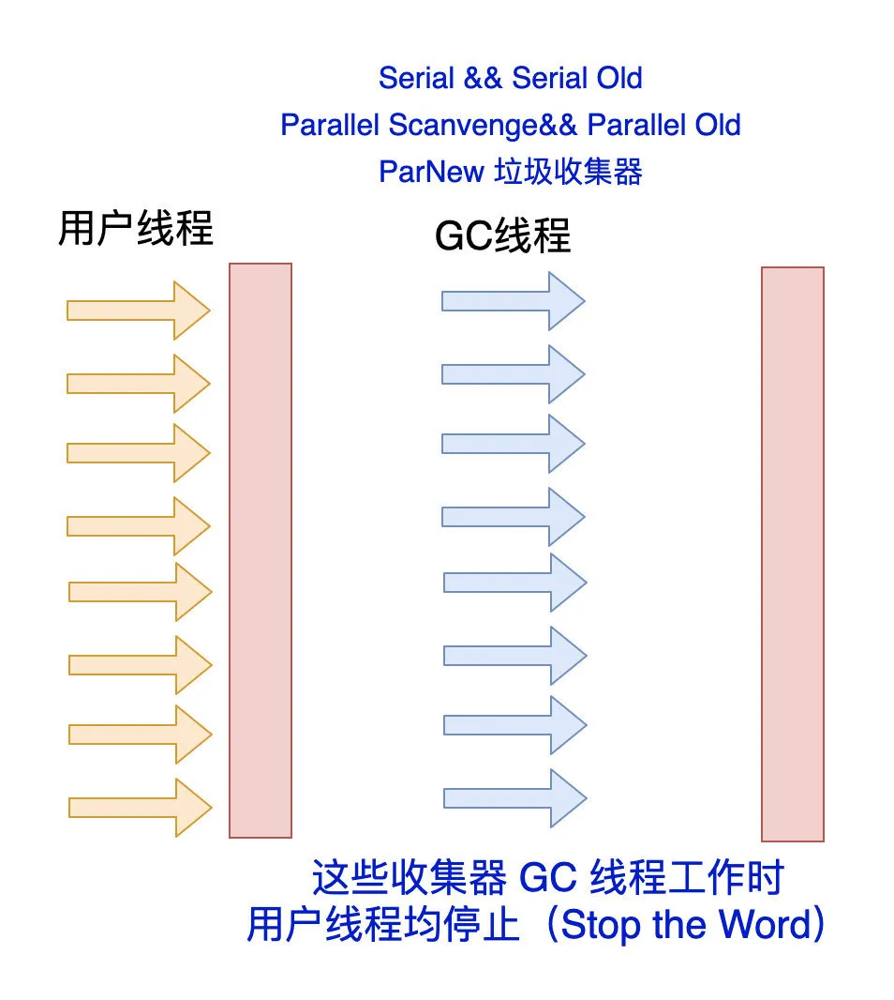
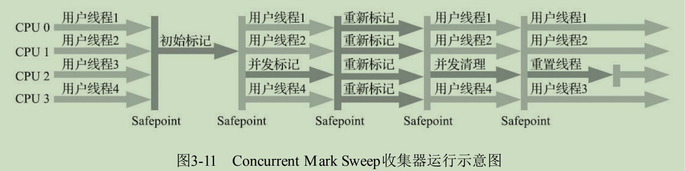
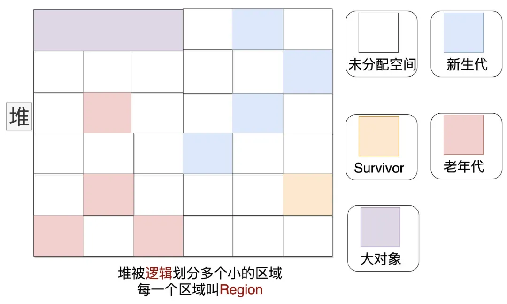
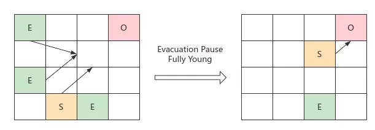
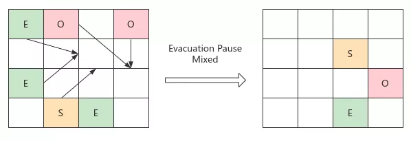
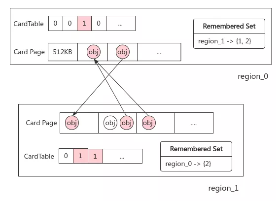

# Table of Contents

* [前提知识](#前提知识)
  * [发起 GC：安全点与安全区域](#发起-gc安全点与安全区域)
  * [加速 GC：CardTable](#加速-gccardtable)
  * [正确 GC：并发可达性分析](#正确-gc并发可达性分析)
* [垃圾回收整体概述](#垃圾回收整体概述)
  * [Other](#other)
* [CMS](#cms)
* [**Garbage First收集器**(重点)](#garbage-first收集器重点)
  * [YGC](#ygc)
  * [Mixed GC](#mixed-gc)
  * [FGC](#fgc)
  * [G1收集器关键的细节问题：](#g1收集器关键的细节问题)
  * 
  * [·譬如，怎样建立起可靠的停顿预测模型？](#譬如怎样建立起可靠的停顿预测模型)
  * [时间是越低越好吗](#时间是越低越好吗)
  * [如何调优GC](#如何调优gc)
* [为什么使用G1来代替CMS](#为什么使用g1来代替cms)
* [**ZGC**(目前最NB的垃圾回收器没有之一)](#zgc目前最nb的垃圾回收器没有之一)
* [说说三色标记](#说说三色标记)
* [参考资料](#参考资料)

# 前提知识

## 发起 GC：安全点与安全区域

- 问题：为保证可达性分析结果的准确性，需挂起用户线程（STW），再从各线程的执行上下文中收集 GC Root，如何通知线程挂起？
- 安全点：HotSpot 内部有线程中断标记；在各线程的方法调用、循环跳转、异常跳转等会长时间执行的指令处，额外插入检查该标记的`test`高效指令；若轮询发现标记为真，线程会主动在最近的 SafePoint 处挂起，此时其栈上对象的引用关系不再变化，可收集 GC Root 对象
- 安全区域：引用关系不会变化的指令区域，可安全地收集 GC Root；线程离开此区域时，若 GC Root 收集过程还未结束，则需等待

## 加速 GC：CardTable

问题：非收集区域（老年代）会存在到收集区域（新生代）的跨代引用，如何避免对前者的全量扫描？

卡表：记忆集的字节数组实现；将老年代内存划分为 Card Page（512KB）大小的子内存块，若新建跨代引用，则将对应的 Card 标记为 dirty，GC 时只需扫描老年代中被标记为 dirty 的子内存块

写屏障：有别于`volatile`禁用指令重排的内存屏障，GC 中的写屏障是在对象引用更新时执行额外 hook 动作的机制。
使用写屏障保证 CardTable 的实时更新

## 正确 GC：并发可达性分析

**问题：**GC Roots 的对象源固定，故枚举时 STW 时间短暂且可控。但后续可达性分析的时间复杂度与堆中对象数量成正相关，即堆中对象越多，对象图越复杂，堆变大后 STW 时间不可接受

**解决：**并发标记。引出新问题：用户线程动态建立、解除引用，标记过程中图结构发生变化，结果不可靠；证明：用三色法描述对象状态

- 白色：未被回收器访问过的对象；分析开始都是白色，分析结束还是白色则不可达
- 灰色：被回收器访问过，但其上至少还有 1 个引用未被扫描（中间态）
- 黑色：被回收器访问过，其上引用全部都已被扫描，存在引用链，为存活对象；若其他对象引用了黑色对象，则不必再扫描，肯定也存活；黑色不可能直接引用白色

STW 无并发的正确标记：顶部 3 个对象将被回收

.png)

用户线程并发修改引用，会导致标记结果无效，分 2 种情况：

- 少回收，对象标记为存活，但用户解除了引用：产生浮动垃圾，可接受，等待下次 GC

-1635343621983.png)

+ 误回收，对象标记为可回收，但用户新建了引用：实际存活对象被回收，内存错误

-1635343701698.png)

论文《Uniprocessor Garbage Collection Techniques - Paul R. Wilson》§3.2 证明了「实际存活的对象被标记为可回收」必须同时满足两个条件（有时间序）

- 插入一条或多条从黑色到*白色*的新引用
- 删除所有灰色到*该白色*的直接、间接引用

为正确实现标记，打破其中一个条件即可（类比打破死锁四个条件之一的思想），分别对应两种方案：

- 增量更新 Increment Update：记录黑到白的引用关系，并发标记结束后，以黑为根，重新扫描；A 直接存活
- 原始快照 SATB（Snapshot At The Begining）：记录灰到白的解引用关系，并发标记结束后，以灰为根，重新扫描；B 为灰色，最后变为黑色，存活。需注意，若没有步骤 3，则 B,C 变为浮动垃圾

	

# 垃圾回收整体概述

+ Serial收集器（复制算法): **新生代**单线程收集器，**标记复制，**都是单线程，优点是简单高效；

+ ParNew收集器 (复制算法): **新生代**收并行集器，**标记复制**，实际上是Serial收集器的多线程版本，在多核CPU环境下有着比Serial更好的表现；

+  Parallel Scavenge收集器 (复制算法): **新生代**并行收集器，**标记复制**，**追求高吞吐**量。

  >  吞吐量 = 用户线程时间/(用户线程时间+GC线程时间)

  虚拟机会根据当前系统的运行情况收集性能监控信息，动态调整这些参数以提供最合适的停顿时间或者最大的吞吐量。这种调节方式称为垃圾收集的自适应的调节策略；

+  Serial Old收集器 (标记-整理算法): **老年代**单线程收集器，**标记整理**，Serial收集器的老年代版本；

+  Parallel Old收集器 (标记-整理算法)： **老年代**并行收集器，**标记整理**，**吞吐量优先**，Parallel Scavenge收集器的老年代版本；

+  CMS(Concurrent Mark Sweep)收集器（**标记-清除**算法）： **老年代**并行收集器，初始标记-并发标记-重新标记-并发清除，以获取**最短回收停顿时间**为目标的收集器，具有高并发、低停顿的特点，追求最短GC回收停顿时间。

+  G1(Garbage First)收集器 (**标记-整理**算法 整体来看)： **Java堆并行收集器**，G1收集器是JDK1.7提供的一个新收集器，G1回收的范围是整个Java堆(包括新生代，老年代)，**可预测停顿时间的收集器**。

+ ZGC（The Z Garbage Collector）是JDK 11中推出的一款追求极致低延迟的实验性质的垃圾收集器，它曾经设计目标包括：

  - 停顿时间不超过10ms；
  - 停顿时间不会随着堆的大小，或者活跃对象的大小而增加；
  - 支持8MB~4TB级别的堆，未来支持16TB。

Serial收集器(新生代收集器)

这个收集器是一个单线程工作的收集器，但它的“单线程”的意义并不仅仅是说明它只会使用一个处理器或一条收集线程去完成垃圾收集工作，更重要的是强调在它进行垃圾收集时，必须暂停其他所有工作线程，直到它收集结束。是HotSpot虚拟机运行在客户端模式下的默认新生代收集器

**优点**：对于内存资源受限的环境，它是所有收集器里额外内存消耗（Memory Footprint）[1]最小的对于单核处理器或处理器核心数较少的环境来说，Serial收集器由于没有线程交互的开销，专心做垃圾收集自然可以获得最高的单线程收集效率

 ## Other

ParNew收集器(新生代收集器)

ParNew收集器实质上是Serial收集器的多线程并行版本，除了同时使用多条线程进行垃圾收集之外，其余的行为包括Serial收集器可用的所有控制参数，收集算法、Stop The World、对象分配规则、回收策略等都与Serial收集器完全一致，在实现上这两种收集器也共用了相当多的代码。

**目前只有它能与CMS收集器配合工作。**

随着垃圾收集器技术的不断改进，更先进的G1收集器带着CMS继承者和替代者的光环登场。G1是一个面向全堆的收集器，不再需要其他新生代收集器的配合工作。所以自JDK 9开始，ParNew加CMS收集器的组合就不再是官方推荐的服务端模式下的收集器解决方案了

 

Parallel Scavenge收集器 (新生代收集器)

基于标记-复制算法，也是能够并行收集的多线程收集器。而Parallel Scavenge收集器的目标则是达到一个可控制的吞吐量（Throughput）。所谓吞吐量就是处理器用于运行用户代码的时间与处理器总消耗时间(用户代码时间+垃圾回收时间)的比值，Parallel Scavenge收集器提供了两个参数用于精确控制吞吐量

 

Serial Old收集器 

Serial Old是Serial收集器的老年代版本，它同样是一个单线程收集器，使用标记-整理算法。这个收集器的主要意义也是供客户端模式下的HotSpot虚拟机使用。

 

Parallel Old收集器

Parallel Old是Parallel Scavenge收集器的老年代版本，支持多线程并发收集，基于标记-整理算法实现。

# CMS

是一种以获取**最短回收停顿时间为目标**的收集器。 

最大不同点是【并发】：在GC线程工作的时候，用户线程【不会完全停止】，用户线程在【部分场景下】与GC线程一起并发执行。

目前很大一部分的Java应用集中在互联网网站或者基于浏览器的B/S系统的服务端上，这类应用通常都会较为关注服务的响应速度，希望系统停顿时间尽可能短，以给用户带来良好的交互体验。CMS收集器就非常符合这类应用的需求。 

CMS收集器是基于**标记-清除算法**实现的整个过程分为四个步骤，包括： 

+ 初始标记：标记一下GC Roots能直接关联到的对象，会“Stop The World”

+ 并发标记：GC Roots Tracing，可以和用户线程并发执行。

+ 重新标记：标记期间产生的对象存活的再次判断，修正对这些对象的标记，执行时间相对并发标记短，会“Stop The World”。

+ 并发清除：清除对象,可以和用户线程并发执行。

由于在整个过程中耗时最长的并发标记和并发清除阶段中，垃圾收集器线程都可以与用户线程一起工作，所以从总体上来说，CMS收集器的内存回收过程是与用户线程一起并发执行的。

+ 如何开启

   **-XX:UseConcMarkSweepGC**参数可以开启CMS,年轻代使用ParNew，老年代使用CMS，同时Serial Old收集器将作为CMS收集器出现Concurrent Mode Failure失败后的后备收集器使用。 

+ 优点：并发低停顿

+ 缺点：

  **1.对处理器资源非常敏感，它虽然不会导致用户线程停顿，但却会因为占用了一部分线程而导致应用程序变慢，降低总吞吐量**

  CMS默认启动的回收线程数是（处理器核心数量+3）/4，也就是说，如果处理器核心数在四个或以上，并发回收时垃圾收集线程只占用不超过25%的处理器运算资源，并且会随着处理器核心数量的增加而下降。但是当处理器核心数量不足四个时，CMS对用户程序的影响就可能变得很大。如果应用本来的处理器负载就很高，还要分出一半的运算能力去执行收集器线程，就可能导致用户程序的执行速度忽然大幅降低。

 

2. 浮动垃圾

   **垃圾对象不断产生，但这一部分垃圾对象是出现在标记过程结束以后，CMS无法在当次收集中处理掉它们，只好留待下一次垃圾收集时再清理掉。这一部分垃圾就称为浮动垃圾。**同样也是由于在垃圾收集阶段用户线程还需要持续运行，那就还需要预留足够内存空间提供给用户线程使用，因此CMS收集器不能像其他收集器那样等待到老年代几乎完全被填满了再进行收集，**必须预留一部分空间**供并发收集时的程序运作使用。CMS收集器的启动阈值（-XX：CMSInitiatingOccupancyFraction）用户应在生产环境中根据实际应用情况来权衡设置。太高：

   CMS运行期间预留的内存无法满足程序分配新对象的需要，就会出现一次“**并发失败**”（Concurrent Mode Failure），这时候虚拟机将不得不启动后备预案：冻结用户线程的执行，临时启用Serial Old收集器来重新进行老年代的垃圾收集，但这样停顿时间就很长了。

​	3.有大量空间碎片产生

​	空间碎片过多时，将会给大对象分配带来很大麻烦，往往会出现老年代还有很多剩余空间，但就是无法找到足	够大的连续空间来分配当前对象，**而不得不提前触发一次Full GC的情况。**

# **Garbage First收集器**(重点)

CMS垃圾处理器的弊端：会产生内存碎片和预留内存空间，这2个问题在处理的时候，很可能会导致【STW】过长，说白了就是CMS的停顿时间是不可预知的。

G1可以理解为在CMS进行升级。

**G1****是一款主要面向服务端应用的垃圾收集器。是****“****停顿时间模型****”****的收集器**，停顿时间模型的意思是能够支持指定在一个长度为M毫秒的时间片段内，消耗在垃圾收集上的时间大概率不超过N毫秒这样的目标。它可以面向堆内存任何部分来组成回收集（Collection Set，一般简称CSet）进行回收，衡量标准不再是它属于哪个分代，而是哪块内存中存放的垃圾数量最多，回收收益最大，这就是G1收集器的Mixed GC模式。

**JDK 9发布之日，G1宣告取代Parallel Scavenge加Parallel Old组合，成为服务端模式下的默认垃圾收集器，而CMS则沦落至被声明为不推荐使用（Deprecate）的收集器**

 

> G1垃圾收集器，堆的划分不再是物理的形式，而是以逻辑的形式进行划分。
> 每个分区都可能是年轻代也可能是老年代，但是在同一时刻只能属于某个代。 年轻代、幸存区、老年代这些概念还存在，成为逻辑上的概念

https://zhuanlan.zhihu.com/p/54048685 这个写的比较深奥，建议先看下面文字 

G1开创的基于**Region的堆内存布局**是它能够实现这个目标的关键。

G1不再坚持固定大小以及固定数量的分代区域划分，而是把连续的Java堆划分为多个大小相等的独立区域（Region），每一个Region都可以根据需要，扮演新生代的Eden空间、Survivor空间，或者老年代空间。

**收集器能够对扮演不同角色的Region采用不同的策略去处理**，这样无论是新创建的对象还是已经存活了一段时间、熬过多次收集的旧对象都能获取很好的收集效果。 

 

Region中还有一类特殊的Humongous区域，专门用来存储大对象。G1认为只要大小超过了一个Region容量一半的对象即可判定为大对象。每个Region的大小可以通过参数-XX：G1HeapRegionSize设定，取值范围为1MB～32MB，且应为2的N次幂。而对于那些超过了整个Region容量的超级大对象，将会被存放在N个连续的Humongous Region之中，G1的大多数行为都把Humongous Region作为老年代的一部分来进行看待。

一旦没有引用指向大对象，就可以直接在年轻代的YGC中被回收掉。

 

虽然G1仍然保留新生代和老年代的概念，但新生代和老年代不再是固定的了，它们都是一系列区域（不需要连续）的动态集合。**G1收集器之所以能建立可预测的停顿时间模型，是因为它将Region作为单次回收的最小单元，即每次收集到的内存空间都是Region大小的整数倍，这样可以有计划地避免在整个Java堆中进行全区域的垃圾收集。**更具体的处理思路是让G1收集器去跟踪各个Region里面的垃圾堆积的“价值”大小，价值即回收所获得的空间大小以及回收所需时间的经验值，然后在后台维护一个优先级列表，每次根据用户设定允许的收集停顿时间（使用参数-XX：MaxGCPauseMillis指定，默认值是200毫秒），优先处理回收价值收益最大的那些Region，这也就是“Garbage First”名字的由来。这种使用Region划分内存空间，以及具有优先级的区域回收方式，保证了G1收集器在有限的时间内获取尽可能高的收集效率。

## YGC

Eden区满后会出发YGC,同样也会STW,但是时间是可以配置的，一般会200ms

+ 扫描：初始标记。

+ 更新处理Rset：

  G1是通过RSET来解决跨代引用的

  + 年轻代：只保存老年代
  + 老年代：只保存老年代

+ 复制对象

  将存活对象往空的s区和e区存放。

  CSET:存放一次GC中【将执行垃圾回收的】Region。CSet所有存货对象都会被转移到别的可用Region上。

##  Mixed GC

+ 新生代 GC：Eden 区占比超阈值触发；标记存活对象并复制到 Survivor 区，其内可能有对象会晋升到 Old 区

  

- 老年代 GC：Old 区占比达到阈值后触发，执行标记整理

- 初始标记：枚举 GC Roots，已在新生代 GC 时顺带完成

- 并发标记：并发执行可达性分析，使用 SATB 记录，在引用变更

  在GC开始的时候，为存活的对象做了【快照】，在并发阶段，**把每一次发生引用关系变化是旧的引用值给记录下。**

- 重新标记：SATB 分析，避免误回收

  只扫描【发生变化的引用】，看对象有没有存活，然后加入CSet。

  >  缺点

  SATB有个小问题，如果在开始的时候认为他是活的，就是在并发阶段变成了垃圾，也不会回收，也会有【浮动垃圾】

  不过G1追求的是可预测时间。

- 筛选回收：将 region 按回收价值和时间成本筛选组成回收集，STW 将存活对象拷贝到空 regions 后清理旧 regions，完成回收

  因为我们配置了时间，一般会选择【回收价值高】的，也就是一次回收未必是回收所有垃圾，会根据时间做选择。

  

## FGC

如果mixed GC无法跟上用户线程分配内存的速度，导致老年代填满无法继续MGC,就会降级到 serial old GC,来回收整个GC Heap。

## G1收集器关键的细节问题：

跨代引用：各 region 除了用卡表标记各卡页是否为 dirty 之外，还用哈希表记录了各卡页正在被哪些 region 引用，通过这种“双向指针”机制，能直接找到 Old 区，避免了全量扫描（G1 自身内存开销大头）

将Java堆分成多个独立Region后，Region里面存在的跨Region引用对象如何解决？

解决的思路我们已经知道：使用记忆集避免全堆作为GC Roots扫描，但在G1收集器上记忆集的应用其实要复杂很多，**它的每个Region都维护有自己的记忆集，这些记忆集会记录下别的Region指向自己的指针，并标记这些指针分别在哪些卡页的范围之内**。G1的记忆集在存储结构的本质上是一种哈希表，Key是别的Region的起始地址，Value是一个集合，里面存储的元素是卡表的索引号。这种“双向”的卡表结构（卡表是“我指向谁”，这种结构还记录了“谁指向我”）比原来的卡表实现起来更复杂，同时由于Region数量比传统收集器的分代数量明显要多得多，**因此G1收集器要比其他的传统垃圾收集器有着更高的内存占用负担**。根据经验，G1至少要耗费大约相当于Java堆容量10%至20%的额外内存来维持收集器工作。 

 

在并发标记阶段如何保证收集线程与用户线程互不干扰地运行？

这里首先要解决的是用户线程改变对象引用关系时，必须保证其不能打破原本的对象图结构，导致标记结果出现错误，该问题的解决办法笔者已经抽出独立小节来讲解过（见3.4.6节）：CMS收集器采用增量更新算法实现，而G1收集器则是通过原始快照（SATB）算法来实现的。此外，垃圾收集对用户线程的影响还体现在回收过程中新创建对象的内存分配上，程序要继续运行就肯定会持续有新对象被创建，G1为每一个Region设计了两个名为TAMS（Top at Mark Start）的指针，把Region中的一部分空间划分出来用于并发回收过程中的新对象分配，并发回收时新分配的对象地址都必须要在这两个指针位置以上。G1收集器默认在这个地址以上的对象是被隐式标记过的，即默认它们是存活的，不纳入回收范围。与CMS中的“Concurrent Mode Failure”失败会导致Full GC类似，如果内存回收的速度赶不上内存分配的速度，G1收集器也要被迫冻结用户线程执行，导致Full GC而产生长时间“Stop The World”。 

## 

 

## ·譬如，怎样建立起可靠的停顿预测模型？

> 个人觉得 面试官肯定会问你，G1是怎么实现时间可预测的？

用户通过-XX：MaxGCPauseMillis参数指定的停顿时间只意味着垃圾收集发生之前的期望值，但G1收集器要怎么做才能满足用户的期望呢？G1收集器的停顿预测模型是以衰减均值（Decaying Average）为理论基础来实现的，在垃圾收集过程中，**G1收集器会记录每个Region的回收耗时、每个Region记忆集里的脏卡数量等各个可测量的步骤花费的成本，并分析得出平均值、标准偏差、置信度等统计信息。**这里强调的“衰减平均值”是指它会比普通的平均值更容易受到新数据的影响，平均值代表整体平均状态，但衰减平均值更准确地代表“最近的”平均状态。换句话说，Region的统计状态越新越能决定其回收的价值。然后通过这些信息预测现在开始回收的话，由哪些Region组成回收集才可以在不超过期望停顿时间的约束下获得最高的收益。

 

**G1****收集器的 运作过程大致可划分为以下四个步骤：** 

·初始标记（Initial Marking）：仅仅只是标记一下GC Roots能直接关联到的对象，并且修改TAMS指针的值，让下一阶段用户线程并发运行时，能正确地在可用的Region中分配新对象。这个阶段需要停顿线程，但耗时很短，而且是借用进行Minor GC的时候同步完成的，所以G1收集器在这个阶段实际并没有额外的停顿。 

·并发标记（Concurrent Marking）：从GC Root开始对堆中对象进行可达性分析，递归扫描整个堆里的对象图，找出要回收的对象，这阶段耗时较长，但可与用户程序并发执行。当对象图扫描完成以后，还要重新处理SATB记录下的在并发时有引用变动的对象。 

·最终标记（Final Marking）：对用户线程做另一个短暂的暂停，用于处理并发阶段结束后仍遗留下来的最后那少量的SATB记录。 

·筛选回收（Live Data Counting and Evacuation）：负责更新Region的统计数据，对各个Region的回收价值和成本进行排序，根据用户所期望的停顿时间来制定回收计划，可以自由选择任意多个Region构成回收集，然后把决定回收的那一部分Region的存活对象复制到空的Region中，再清理掉整个旧Region的全部空间。这里的操作涉及存活对象的移动，是必须暂停用户线程，由多条收集器线程并行完成的。

 

## 时间是越低越好吗

除了并发标记外，其余阶段也是要完全暂停用户线程的。而这个总体的停顿是用户指定期望的停顿时间。

默认的停顿目标为两百毫秒，一般来说，回收阶段占到几十到一百甚至接近两百毫秒都很正常，但如果我们把停顿时间调得非常低，譬如设置为二十毫秒，很可能出现的结果就是由于停顿目标时间太短，导致每次选出来的回收集只占堆内存很小的一部分，**收集器收集的速度逐渐跟不上分配器分配的速度**，导致垃圾慢慢堆积。很可能一开始收集器还能从空闲的堆内存中获得一些喘息的时间，但应用运行时间一长就不行了，**最终占满堆引发Full GC反而降低性能，所以通常把期望停顿时间设置为一两百毫秒或者两三百毫秒会是比较合理的。**

 

G1对比CMS优点：

**1.****可以指定最大停顿时间、分****Region****的内存布局、按收益动态确定回收集**

**2.与****CMS****的****“****标记****-****清除****”****算法不同，****G1****从**整体来看是基于标记-整理**算法实现的收集器，但从局部（两个****Region****之间）上看又是基于**标记-复制**算法实现，**不会产生内存空间碎片，有利于程序长时间运行，在程序为大对象分配内存时不容易因无法找到连续内存空间而提前触发下一次收集。

 

G1对比CMS缺点：

**1.**G1为了垃圾收集产生的内存占用和额外执行负载都要比CMS要高

(就内存占用来说，虽然G1和CMS都使用卡表来处理跨代指针，但G1的卡表实现更为复杂，而且堆中每个Region，无论扮演的是新生代还是老年代角色，都必须有一份卡表，这导致G1的记忆集可能会占整个堆容量的20%乃至更多的内存空间；相比起来CMS的卡表就相当简单，只有唯一一份，而且只需要处理老年代到新生代的引用，反过来则不需要，由于新生代的对象具有朝生夕灭的不稳定性，引用变化频繁，能省下这个区域的维护开销是很划算的)

 

## 如何调优GC

关键参数

- `-XX:+UseG1GC`，告诉JVM使用G1垃圾收集器
- `-XX:MaxGCPauseMillis=200`，设置GC暂停时间的目标最大值，这是个柔性的目标，JVM会尽力达到这个目标
- `-XX:INitiatingHeapOccupancyPercent=45`，如果整个堆的使用率超过这个值，G1会触发一次并发周期。记住这里针对的是整个堆空间的比例，而不是某个分代的比例。

1. 不要自己显式设置新生代的大小（用`Xmn`或`-XX:NewRatio`参数），如果显式设置新生代的大小，会导致目标时间这个参数失效。
2. 由于G1收集器自身已经有一套预测和调整机制了，因此我们首先的选择是相信它，即调整`-XX:MaxGCPauseMillis=N`参数，这也符合G1的目的——让GC调优尽量简单，这里有个取舍：如果减小这个参数的值，就意味着会调小新生代的大小，也会导致新生代GC发生得更频繁，同时，还会导致混合收集周期中回收的老年代分区减少，从而增加FULL GC的风险。这个时间设置得越短，应用的吞吐量也会受到影响。
3. 针对混合垃圾收集的调优。如果调整这期望的最大暂停时间这个参数还是无法解决问题，即在日志中仍然可以看到FULL GC的现象，那么就需要自己手动做一些调整，可以做的调整包括：

- **调整G1垃圾收集的后台线程数**，通过设置`-XX:ConcGCThreads=n`这个参数，可以增加后台标记线程的数量，帮G1赢得这场你追我赶的游戏；
- **调整G1垃圾收集器并发周期的频率**，如果让G1更早得启动垃圾收集，也可以帮助G1赢得这场比赛，那么可以通过设置`-XX:InitiatingHeapOccupancyPercent`这个参数来实现这个目标，如果将这个参数调小，G1就会更早得触发并发垃圾收集周期。这个值需要谨慎设置：如果这个参数设置得太高，会导致FULL GC出现得频繁；如果这个值设置得过小，又会导致G1频繁得进行并发收集，白白浪费CPU资源。通过GC日志可以通过一个点来判断GC是否正常——在一轮并发周期结束后，需要确保堆剩下的空间小于InitiatingHeapOccupancyPercent的值。
- **调整G1垃圾收集器的混合收集的工作量**，即在一次混合垃圾收集中尽量多处理一些分区，可以从另外一方面提高混合垃圾收集的频率。在一次混合收集中可以回收多少分区，取决于三个因素：（1）有多少个分区被认定为垃圾分区，`-XX:G1MixedGCLiveThresholdPercent=n`这个参数表示如果一个分区中的存活对象比例超过n，就不会被挑选为垃圾分区，因此可以通过这个参数控制每次混合收集的分区个数，这个参数的值越大，某个分区越容易被当做是垃圾分区；（2）G1在一个并发周期中，最多经历几次混合收集周期，这个可以通过`-XX:G1MixedGCCountTarget=n`设置，默认是8，如果减小这个值，可以增加每次混合收集收集的分区数，但是可能会导致停顿时间过长；（3）期望的GC停顿的最大值，由`MaxGCPauseMillis`参数确定，默认值是200ms，在混合收集周期内的停顿时间是向上规整的，如果实际运行时间比这个参数小，那么G1就能收集更多的分区。

# 为什么使用G1来代替CMS

# **ZGC**(目前最NB的垃圾回收器没有之一)

ZGC（The Z Garbage Collector）是JDK 11中推出的一款追求极致低延迟的实验性质的垃圾收集器，它曾经设计目标包括：

- 停顿时间不超过10ms；
- 停顿时间不会随着堆的大小，或者活跃对象的大小而增加；
- 支持8MB~4TB级别的堆，未来支持16TB。

基于最新的JDK15来看，“停顿时间不超过10ms”和“支持16TB的堆”这两个目标已经实现，并且官方明确指出JDK15中的ZGC不再是实验性质的垃圾收集器，且建议投入生产了。

“这JDK16中，ZGC的停顿时间已经为常数。（O(1)）正常情况下，ZGC停顿时间不会超过1ms，约为0.5ms。不超过10ms将成为历史。”

+ 多重映射
  当应用程序创建对象时，首先在堆空间申请一个虚拟地址，ZGC同时会为该对象在Marked0、Marked1和Remapped三个视图空间分别申请一个虚拟地址，且这三个虚拟地址对应同一个物理地址。

  这就是ZGC的高明之处，利用虚拟空间换时间，这三个空间的切换是由垃圾回收的不同阶段触发的，通过限定三个空间在同一时间点有且仅有一个空间有效，高效的完成了GC过程的并发操作

+ 染色指针

  > 染色指针是一种将信息存储在指针中的技术。

  我们都知道，之前的垃圾收集器都是把GC信息（标记信息、GC分代年龄..）存在对象头的Mark Word里。
  

  **使用地址视图和染色指针可以加快标记和转移的速度。**

  以前的垃圾回收器通过修改对象头的标记位来标记GC信息，这是有内存存取访问的，而ZGC通过地址视图和染色指针技术，无需任何对象访问，只需要设置地址中对应的标志位即可。这就是ZGC在标记和转移阶段速度更快的原因。

+ **读屏障**

  ZGC中的读屏障更像是一种AOP技术，在字节码层面或者编译代码层面给读操作增加一个额外的处理。

  GC线程和应用线程是并发执行的，所以存在应用线程去A对象内部的引用所指向的对象B的时候，这个对象B正在被GC线程移动或者其他操作，加上读屏障之后，**应用线程会去探测对象B是否被GC线程操作，然后等待操作完成再读取对象，确保数据的准确性。**

+ 并发处理

# 说说三色标记

这里我们又提到了一个概念叫做 **「「SATB 原始快照」」**，关于SATB会延伸出有一个概念，**「「三色标记算法」」**，也就是垃圾回收器标记垃圾的时候使用的算法，这里我们简单说下：将对象分为「**「三种颜色」**」：

- 白色：没被 GC 访问过的对象(被 GC 标记完后还是白色代表是垃圾)
- 黑丝：存活的对象
- 灰色：被 GC 访问过的对象，但是对象引用链上至少还有一个引用没被扫描过

我们知道在 **「「并发标记」」** 的时候 **「「可能会」」** 出现 **「「误标」」** 的情况，这里举两个例子：

- 1.刚开始标记为 **「「垃圾」」** 的对象，但是在并发标记过程中 **「「变为了存活对象」」**
- 2.刚开始标记为 **「「存活」」** 的对象，但是在并发标记过程中  **「「变为了垃圾对象」」**

第一种情况影响还不算很大，只是相当于垃圾没有清理干净，待下一次清理的时候再清理一下就好了。第二种情况就危险了，正在使 **「「用的对象的突然被清理掉」」** 了，后果会很严重。那么 **「「产生上述第二种情况的原因」」** 是什么呢？

- 1.**「「新增」」** 一条或多条 **「「黑色到白色」」** 对象的新引用
- 2.删除 **「「了」」** 灰色 **「「对象」」** 到该白色对象 **「「的直接」」** 引用或间接引用。

当这两种情况 **「「都满足」」** 的时候就会出现这种问题了。所以为了解决这个问题，引入了 **「「增量更新」」** (Incremental Update)和 **「「原始快照」」** (SATB)的方案：

- 增量更新破坏了第一个条件：**「「增加新引用时记录」」** 该引用信息，在后续 STW 扫描中重新扫描(CMS的使用方案)。
- 原始快照破坏了第二个条件：**「「删除引用时记录下来」」**，在后续 STW 扫描时将这些记录过的灰色对象为根再扫描一次(G1的使用方案)。

# 参考资料

https://blog.csdn.net/lijingyao8206/article/details/80513383
