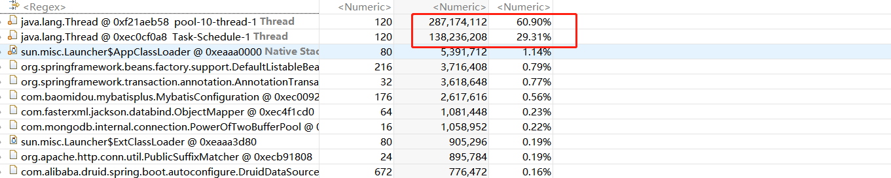
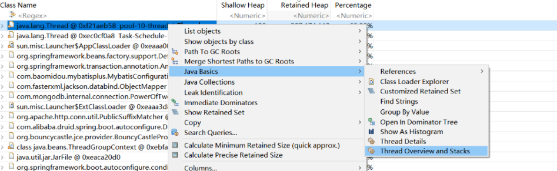
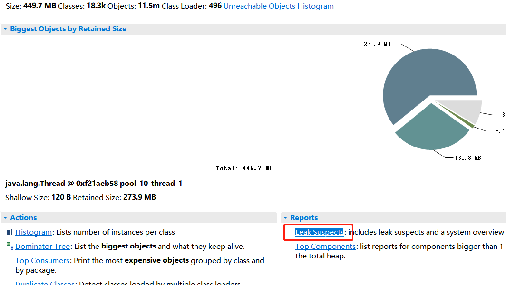
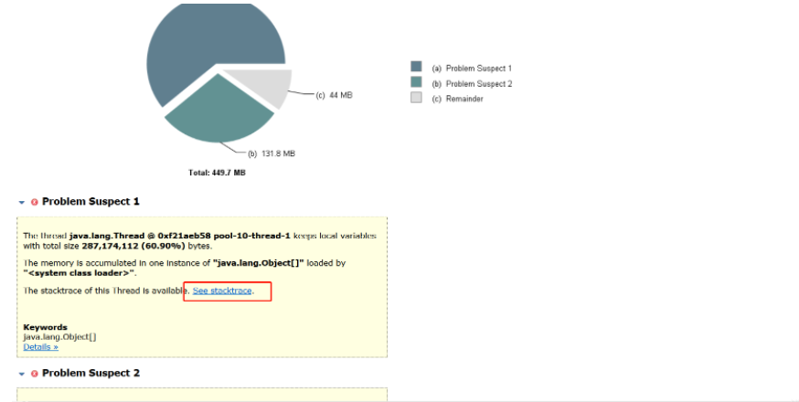
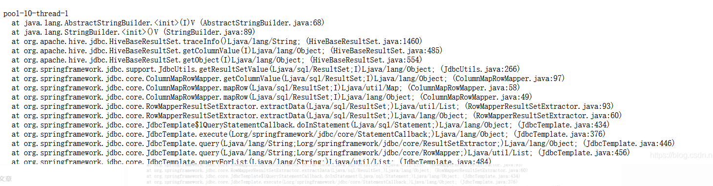

# Table of Contents

* [查看堆栈1](#查看堆栈1)
* [查看堆栈2](#查看堆栈2)
* [参考链接](#参考链接)

如何dump内存就不说了，我们说下dump堆内存后，如何分析问题点所在。

使用的工具是MAT

# 查看堆栈1

第一步：使用**MAT**打开dump文件

第二步：点击Dominator Tree

可以看到内存占用比较高的线程有2个

​	第三部：选中需要查看的线程，查看stack

第四部：此时显示的就是发生[堆栈](https://so.csdn.net/so/search?q=堆栈&spm=1001.2101.3001.7020)溢出时的栈信息，并且有占用大小，就能找到对应的代码位置，未截图的部分就是项目中的代码位置了

# 查看堆栈2 

如果想快速的查看stack，还有另外一个方式，Leak Suspects，生成分析报告

然后会出现如下画面，点击See stacktrace就可以查看了

# 参考链接

https://blog.csdn.net/frwcode/article/details/106197713?spm=1001.2101.3001.6650.3&utm_medium=distribute.pc_relevant.none-task-blog-2%7Edefault%7ECTRLIST%7Edefault-3-106197713-blog-106365672.pc_relevant_multi_platform_whitelistv1&depth_1-utm_source=distribute.pc_relevant.none-task-blog-2%7Edefault%7ECTRLIST%7Edefault-3-106197713-blog-106365672.pc_relevant_multi_platform_whitelistv1&utm_relevant_index=6
