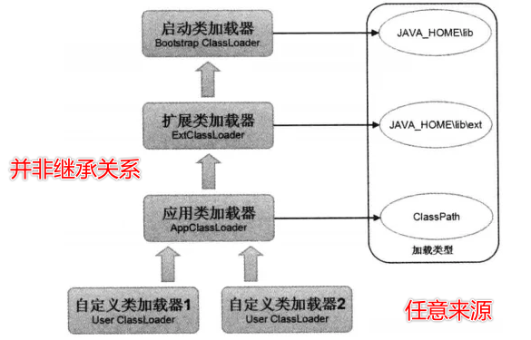
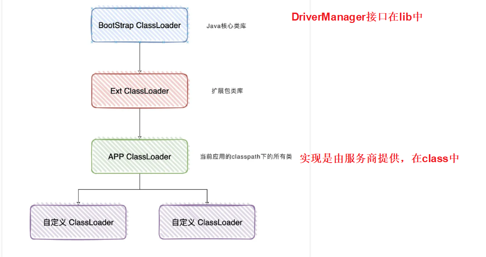
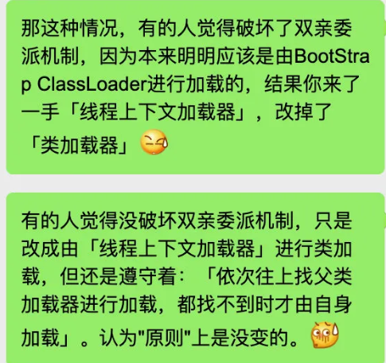

# Table of Contents

* [类加载器](#类加载器)
* [双亲委派](#双亲委派)
* [为什么需要破坏双亲委派？(JDBC原因)](#为什么需要破坏双亲委派jdbc原因)
* [破坏双亲委派](#破坏双亲委派)
* [问题](#问题)
  * [SPI 具体是怎么破坏了双亲委派机制](#spi-具体是怎么破坏了双亲委派机制)
* [Tomcat](#tomcat)


# 	类加载器

​		只有类加载机制中的<font color=red>加载</font>，能够被上层开发者，也就是大部分的程序员控制，<font color=red>剩下的步骤，都是由JVM掌控</font>,

对上层人员来说是一个黑盒，是符合面向对象思想

​		不同的虚拟机实现方式不太一样，我们目前只看HosSpot实现。

​         Java的类加载是通过ClassLoader及其子类来完成的

+ HosSpot实现

  + Bootstrap ClassLoader： 无法被对象程序引用 <javaHome>/lib ，由**C++** 实现

  + other

    + Extension ClassLoader

      ExtClassLoader继承ClassLoader类，负载加载`JAVA_HOME/lib/ext`目录中的所有类型，或者由参数`-Xbootclasspath`指定路径中的所有类型；

    + Application CLassLoader

      Application  ClassLoader继承 Extension  ClassLoader类，负责加载用户类路径`ClassPath`下的所有类型，一般情况下为程序的默认类加载器；

    + User ClassLoader
      任意来源


+ 问题

  1. 不同的类加载器，除了读取二进制流的动作和范围不一样，后续的加载逻辑是不是也不一样？

     ​	JVM规范：每个类加载器都有属于自己的命名空间

  2. 遇到限定类名一样的，这么多类加载器会不会产生混乱？

+ 解决
  1. 我们认为除了Bootstrap ClassLoader,所有的非Bootstrap都继承了java.lang.ClassLoader,都由这个类的defineClass进行处理
  2. 越核心的类库被约上层的类加载器加载，一旦某类被加载过，被动情况下，是不会主动加载相同限定名的类。


# 双亲委派

需求：默认情况下，一个限定的类只会被一个类加载器加载并解析使用，这样在程序中就是唯一的，不会产生歧义。





双亲委派的具体过程如下：

1. 当一个类加载器接收到类加载任务时，**先查缓存**里有没有，如果没有，将任务**委托给它的父加载器**去执行。
2. 父加载器也做同样的事情，一层一层往上委托，直到**最顶层的启动类加载器**为止。
3. 如果启动类加载器没有找到所需加载的类，便将此加载任务**退回给下一级类加载器**去执行，而下一级的类加载器也做同样的事情。
4. 如果最底层类加载器仍然没有找到所需要的class文件，则抛出异常。

双亲委派解决了什么问题？

1. **确保类的全局唯一性，避免核心api被篡改**


#  为什么需要破坏双亲委派？(JDBC原因)

因为在某些情况下**父类加载器需要委托子类加载器去加载class文件**。受到加载范围的限制，父类加载器无法加载到需要的文件，以Driver接口为例，由于Driver接口定义在jdk当中的，而其实现由各个数据库的服务商来提供，

比如mysql的就写了`MySQL Connector`，那么问题就来了，DriverManager（也由jdk提供）要加载各个实现了Driver接口的实现类，然后进行管理，

**但是DriverManager由启动类加载器加载，只能记载JAVA_HOME的lib下文件，而其实现是由服务商提供的，由系统类加载器加载**，这个时候就需要启动类加载器来委托子类来加载Driver实现，从而破坏了双亲委派，这里仅仅是举了破坏双亲委派的其中一个情况。



# 破坏双亲委派

+ 继承classLoader,重写其loadClass,

除非是特殊要求，一般是不建议破坏双亲委派模型的

推荐使用findClass

 + SPI机制
 + 热部署


# 问题

##  SPI 具体是怎么破坏了双亲委派机制

+ 什么是SPI?

  Java SPI的具体约定为：当服务的提供者提供了服务接口的一种实现之后，在jar包的META-INF/services/目录里同时创建一个以服务接口命名的文件。该文件里就是实现该服务接口的具体实现类。而当外部程序装配这个模块的时候，就能通过该jar包META-INF/services/里的配置文件找到具体的实现类名，并装载实例化，完成模块的注入。基于这样一个约定就能很好的找到服务接口的实现类，而不需要再代码里制定。jdk提供服务实现查找的一个工具类：**java.util.ServiceLoader。**

+ SPI到底破坏了双亲委派吗

  

+ 具体怎么破坏的?以JDBC为列

  ```java
  Connection conn = java.sql.DriverManager.getConnection(url, "name", "password"); 
  
    static {
          loadInitialDrivers();
          println("JDBC DriverManager initialized");
      }
  
     private static void loadInitialDrivers() {
          String drivers;
          try {
              drivers = AccessController.doPrivileged(new PrivilegedAction<String>() {
                  public String run() {
                      return System.getProperty("jdbc.drivers");
                  }
              });
          } catch (Exception ex) {
              drivers = null;
          }
          // If the driver is packaged as a Service Provider, load it.
          // Get all the drivers through the classloader
          // exposed as a java.sql.Driver.class service.
          // ServiceLoader.load() replaces the sun.misc.Providers()
  
          AccessController.doPrivileged(new PrivilegedAction<Void>() {
              public Void run() {
  
                  ServiceLoader<Driver> loadedDrivers = ServiceLoader.load(Driver.class);
                  Iterator<Driver> driversIterator = loadedDrivers.iterator();
  ```

具体的ServiceLoader

```java
  public static <S> ServiceLoader<S> load(Class<S> service) {
      //使用了线程上下文加载器
        ClassLoader cl = Thread.currentThread().getContextClassLoader();
        return ServiceLoader.load(service, cl);
    }
```

使用ServiceLoader去加载，内部使用了当前线程上下文加载器，一般TCCL默认为ApplicationClassLoader，所以第三方类可以被正常加载。

于它是在运行时被放在了线程中，所以不管当前程序处于何处（BootstrapClassLoader或是ExtClassLoader等），在任何需要的时候都可以用Thread.currentThread().getContextClassLoader()取出应用程序类加载器来完成需要的操作。


这里就用到了**BootStrap调用了ApplicationClassLoader**  ？这句话待有疑问


#  Tomcat

-1637192949251.png)
