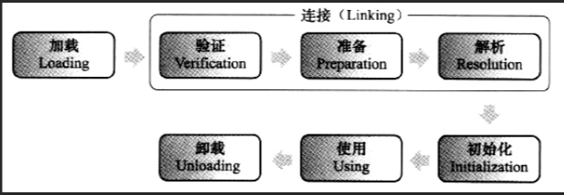

# Table of Contents

* [类加载机制](#类加载机制)
  * [加载](#加载)
  * [连接](#连接)
    * [验证](#验证)
    * [准备](#准备)
    * [解析](#解析)
  * [初始化](#初始化)

个人理解:学习语言有三个层次
+ 了解基本的语法、写法(也就是我们俗称的API调用工程师)
+ 了解语言的劣势、生态
+ 了解底层运行机制(有利于程序调优、出现问题时，可以从源头上解决问题)

# 类加载机制

​		举个通俗点的例子来说，JVM在执行某段代码时，遇到了class A， 然而此时内存中并没有class A的相关信息，于是JVM就会到相应的class文件中去寻找class A的类信息，并加载进内存中，这就是我们所说的类加载过程。

​	由此可见，**JVM不是一开始就把所有的类都加载进内存中**，而是只有第一次遇到某个需要运行的类时才会加载，且**只加载一次**。

​	 Java虚拟机把描述类的数据从Class文件加载到内存，并对数据进行校验、转换解析和初始化，最终形成可以被虚拟机直接使用的Java类型，这就是虚拟机的加载机制。

	

+ 这张图表示一个类的生命周期,类加载只包括`加载` 、`连接`、`初始化`三个过程。
+ 注意`加载`和`类加载`。`加载`是`类加载`的第一步。
+ 解析部分是灵活的，可以在初始化环节之后在进行，实现所谓的“后期绑定”。其他环节顺序不可改变

## 加载

加载是一个读取calss文件,将其转化为某种静态数据结构存储在方法区内,并在堆中生成一个便于用户调用的java.lang.Class类型的对象的过程。

+ 字节码来源：本地class文件、jar包class文件、远程网络、动态代理
+ 类加载器：启功、扩展、应用、自定义

## 连接
### 验证
+ 第一步对文件格式的校验是发生在加载阶段，通过才加载
+ 元数据的验证
+ 字节码验证
+ 符号引用阶段（解析阶段）
简单来说就是对class静态结构进行语法和语义上的分析，保证其不会产生危害虚拟结构的行为。
  
### 准备

为该类型中静态变量赋0值,而不是成员变量
特别需要注意，**初值，不是代码中具体写的初始化的值**，而是Java虚拟机根据不同变量类型的默认初始值。

这里顺便说下方法区的相关知识

	

虚拟机内存规范中定义了方法区这种抽象概念
永久代和元空间只是实现方式的不同,不能说1.8后，元空间替代方法区

### 解析

​	解析阶段主要做的是：将符合引用替换为直接引用

	

+ 将符合引用替换为直接引用

  ​		当一个java类被编译成class后，A中引用了B,那么在编译阶段，A是不知道B有没有被编译的。而且此时，B一定没有被加载。所以A不知道B的实际地址，那么A是怎么找到B的？

  ​		在A的class文件中，将使用一个字符串"S"来代表B的地址，S就被称为符号引用，在运行时，如果A发生了类加载，到了解析阶段发现B还未被加载，那么将会触发B的类加载，将B加载到虚拟机中，此时A的符合引用会被替换为B的内存地址，这样被称为直接引用。

+ java通过后期绑定实现多态，后期绑定是怎么实现的？
    + 如果A调用的B是一个具体实现类,那么就称为静态解析
    + 如果A调用的B是一个抽象类或接口，有2个具体的实现类C和D,此时B的实现类并不明确,只能等一等。直到运行过程中发生了调用,此时虚拟机调用栈中会得到具体的类型信息,这时候进行解析，就能用明确的直接引用替换符合引用。这就解释了为什么解析阶段有时候会发生在初始化之后.
      底层对应了InvokeDynamic这条字节码指令

## 初始化 

​		判断代码中是否存在主动的资源初始化操作，如果有执行，这里并不是指的是构造函数，而是成员变量、静态变量、静态代码块的赋值动作。

只有显示的调用NEW，才会进行对象实例化，这是对象层面的。

	

