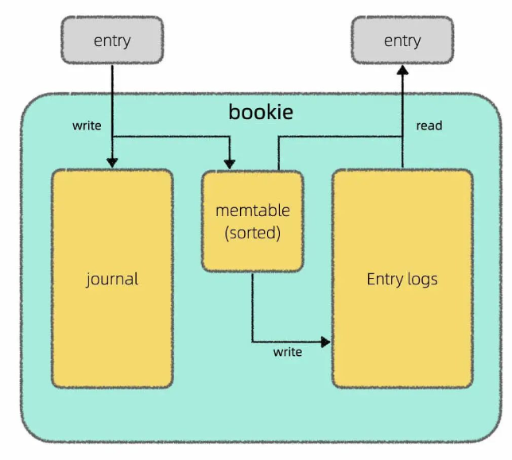
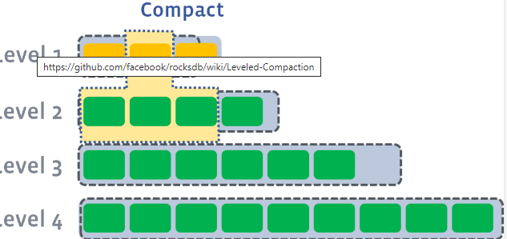

# Table of Contents

* [内存数据结构 vs 磁盘数据结构](#内存数据结构-vs-磁盘数据结构)
* [数据可变 vs 数据不可变](#数据可变-vs-数据不可变)
* [有序 vs 无序](#有序-vs-无序)
* [LSM 树的设计](#lsm-树的设计)

我在上篇文章 [Apache Pulsar 的架构设计](https://mp.weixin.qq.com/s?__biz=MzAxODQxMDM0Mw==&mid=2247498023&idx=1&sn=b3ca224a1e1e2bd0fdb733547a6dd6d5&scene=21#wechat_redirect) 中介绍了 Pulsar 存算分离的架构，其中 broker 只负责计算，由 BookKeeper 负责底层的存储，我还画了这样一张图说明 BookKeeper 读写分离的设计：

但是再深究下去，`memtable`具体是以怎样的格式持久化到磁盘上的呢？又是用什么算法高效查找一条消息的呢？

通过学习相关资料，我发现 Apache BookKeeper 底层存储引擎用的是 Facebook 开源的 RocksDB，而 RocksDB 又是基于 Google 开源的 LevelDB 改造的，而 LevelDB 的核心是一个叫做 LSM 树（Log Structured Merge Tree）的结构。

LevelDB 整个库的代码只有几百 KB，所以我去研究了 LSM 树的代码实现，总结了这篇文章，带你了解 LSM 树的设计原理。

什么是 LSM 树呢？如果说到 B+ 树大家应该不陌生，像 MySQL 这样的关系型数据库底层一般用 B+ 树结构来存储数据。LSM 树其实就是另一种存储数据的结构，常见于日志存储系统中。

首先，我们先来聊聊存储系统。

# 内存数据结构 vs 磁盘数据结构

正如前文 [学习数据结构和算法的框架思维](https://mp.weixin.qq.com/s?__biz=MzAxODQxMDM0Mw==&mid=2247484852&idx=1&sn=85b50b8b0470bb4897e517955f4e5002&scene=21#wechat_redirect) 所说，**一切数据结构从根本上讲都是增删查改，但在具体实现上，磁盘数据结构和内存数据结构会有比较大的差异。**

内存数据结构你直接 new 一个出来就行了，不用关心这个结构在内存中是如何布局的，这些都由操作系统和编程语言代劳了。

但磁盘就不一样，考虑到磁盘读取的操作效率相对比较低，且每次只能读取固定大小的磁盘数据，你要自己设计数据的存储布局，规定每个字节存什么信息，然后基于你设计的存储布局实现增删查改的 API，比较枯燥琐碎。

比如说，学过 MySQL 的话应该比较熟悉 B+ 树结构，但你肯定不容易看懂 B+ 树的代码。因为 B+ 树是磁盘数据结构，虽然原理上可以理解为 BST 的加强版，但考虑到数据文件格式的设计，真正的代码实现非常复杂。

所以一般来说，我们了解磁盘数据结构的原理，了解各个操作的时间复杂度就可以了，没必要特别纠结它的具体实现。

# 数据可变 vs 数据不可变

**存储结构可以粗略分为两类：数据可变的和数据不可变的**。所谓可变，就是说已经插入的数据还可以原地进行修改，不可变就是说已经插入的数据就不能再修改了。

**B 树是数据可变的代表结构**（B+ 树等衍生结构都归为 B 树一族）。你就想想 BST 吧，数据存在节点上，我们可以随意插入、删除、修改 BST 中的节点。

B 树的理论增删查改性能和 BST 一样都是 logN，但 B 树的实际写入效率并不是特别高：

一方面是因为 B 树需要分裂合并等操作保证整棵树的平衡性，这里面涉及很多磁盘随机读写的操作，性能会比较差；另一方面考虑到并发场景，修改 B 树结构时需要比较复杂的锁机制保证并发安全，也会一定程度影响效率。

**综上，B 树的难点在于平衡性维护和并发控制，一般用在读多写少的场景**。

**LSM 树是数据不可变的代表结构**。你只能在尾部追加新数据，不能修改之前已经插入的数据。

如果不能修改以前的数据，是不是就不能提供删、查、改的操作 API 呢？其实是可以的。

我们只需要提供`set(key, val)`和`get(key)`两个 API 即可。查询操作靠`get(key)`，增删改操作都可以由`set(key, val)`实现：

如果`set`的`key`不存在就是新增键值对，如果已经存在，就是更新键值对；如果把`val`设置为一个特殊值（比如 null）就可以代表`key`被删掉了（墓碑机制）。

那么我对某个键`key`做了一系列操作后，我只要找到最近一次的操作，就能知道这个键当前的值是多少了。

从磁盘的角度来说，在尾部追加的写入效率非常高，因为不需要像 B 树那样维护复杂的树形结构嘛。但代价就是，查找效率肯定比较低，因为只能通过线性遍历去查找操作记录。

后面我会讲讲真正的 LSM 树如何针对读场景进行优化，但再怎么优化，肯定也达不到 B 树的读取效率。

同时，LSM 树还有一个明显弊端就是存在空间放大。在 B 树中一个键值对就占用一个节点，我更新这个键 100 次，它还是只占用一个节点。但在 LSM 树中，如果我更新一个键 100 次，就相当于写入了 100 条数据，会消耗更多空间。

后面会讲到，这个问题的解决方案是**压实（compact）**，把操作序列中失效的历史操作消除掉，只保留最近的操作记录。

**综上，LSM 树的难点在于 compact 操作和读取数据时的效率优化，一般用在写多读少的场景**。

# 有序 vs 无序

**读性能越强，但相应的，维护有序性的成本也越高，写入性能也就会越差**。

你看 B 树，作为 BST 的加强版，实际上是维护了所有数据的有序性，读取性能必然起飞，但写入性能你也别抱太大希望。

LSM 树不可能向 B 树那样维护所有数据的有序性，但可以维护局部数据的有序性，从而一定程度提升读性能。

# LSM 树的设计

就我的理解，LSM 树其实不是一种数据结构，而是一种存储方案。这里面涉及三个重要的数据组件：`log`，`memtable`，`SSTable`

其中`Journal`就是`log`，`Entry Log`就是若干`SSTable`的集合，叫法不同罢了。

`memtable`是红黑树或者跳表这样的有序内存数据结构，起到缓存和排序的作用，把新写入的数据按照键的大小进行排序。当`memtable`到达一定大小之后，会被转化成`SSTable`格式刷入磁盘持久化存储。

`SSTable`（Sorted String Table）说白了就是一个特殊格式的文件，其中的数据按照键的大小排列，你可以把它类比成一个有序数组。而 LSM 树，说白了就是若干`SSTable`的集合。

`log`文件记录操作日志，在数据写入`memtable`的同时也会刷盘写入到`log`文件，作用是数据恢复。比如在`memtable`中的数据还没转化成`SSTable`持久化到磁盘时，如果突然断电，那么`memtable`里面的数据都会丢失，但有`log`文件在，就可以恢复这些数据。当然，等`memtable`中的数据成功转化成`SSTable`落盘之后，`log`文件中对应的操作日志就没必要存在了，可以被删除。

LSM 树的`set`写入过程并不复杂：写入`log`和`memtable`，最后转化成一个`SSTable`持久化到磁盘就行了。

最关键的应该是读取和 compact 的过程：`SSTable`要如何组织，才能快速`get`到一个`key`对应的`val`呢？如何定期对所有 SSTable 做 compact 瘦身呢？

其实有多种方案，其中比较常用的方案是按照层级组织`SSTable`：

图中每个绿色方块代表一个`SSTable`，若干个`SSTable`构成一层，总共有若干层，每层能够容纳的`SSTable`数量上限依次递增。

新刷入的`SSTable`在第 0 层，如果某一层的`SSTable`个数超过上限，则会触发 compact 操作，从该层选出若干`SSTable`合并成一个更大的`SSTable`，移动下一层：

每个`SSTable`就好比一个有序数组/链表，多个`SSTable`的合并就是前文 [链表双指针技巧汇总](https://mp.weixin.qq.com/s?__biz=MzAxODQxMDM0Mw==&mid=2247492022&idx=1&sn=35f6cb8ab60794f8f52338fab3e5cda5&scene=21#wechat_redirect) 中合并多个有序链表的逻辑。

这样，越靠上层的数据越新，越靠下层的数据越旧，且算法保证同一层的若干`SSTable`的`key`不存在重叠：

那么假设给一个目标键`key27`，我们只需要从上到下遍历层，并在每一层中使用 [二分查找算法](https://mp.weixin.qq.com/s?__biz=MzAxODQxMDM0Mw==&mid=2247485044&idx=1&sn=e6b95782141c17abe206bfe2323a4226&scene=21#wechat_redirect) 找到键区间包含`key27`的`SSTable`，然后用布隆过滤器快速判断一下`key27`是否不存在这个`SSTable`中。如果可能存在，由于`SSTable`中的键也是有序的，可以再次运用 [二分查找算法](https://mp.weixin.qq.com/s?__biz=MzAxODQxMDM0Mw==&mid=2247485044&idx=1&sn=e6b95782141c17abe206bfe2323a4226&scene=21#wechat_redirect) 在`SSTable`中找到键对应的值。

这样，借助 LSM 树的层级结构和`SSTable`的有序性，就能利用二分搜索提升查找效率，避免线性查找键值对。

以上就是本文的全部内容，LSM 树的设计思路比较易于理解，但实现起来还有不少细节，如果你对具体实现感兴趣，我可以推荐一些学习资料：

LevelDB 的代码仓库：

https://github.com/google/leveldb/issues

RocksDB 的 wiki：

https://github.com/facebook/rocksdb/wiki

《数据库系统内幕》和《精通 LevelDB》这两本书也不错：
