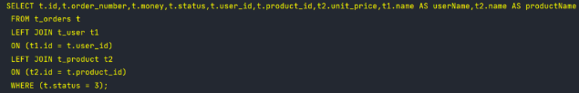
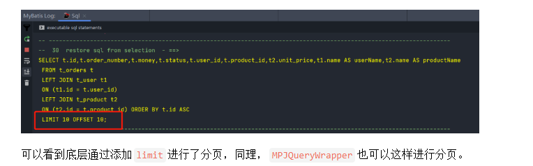

# Table of Contents

* [官方文档： [MyBatis-Plus (baomidou.com)](https://baomidou.com/)](#官方文档-mybatis-plus-baomidoucomhttpsbaomidoucom)
* [如何进行连表查询](#如何进行连表查询)
  * [MPJQueryWrapper](#mpjquerywrapper)
* [**分页查询**](#分页查询)


# 官方文档： [MyBatis-Plus (baomidou.com)](https://baomidou.com/)


# 如何进行连表查询

+ 引入依赖

  ```java
  <dependency>
      <groupId>com.github.yulichang</groupId>
      <artifactId>mybatis-plus-join</artifactId>
      <version>1.2.4</version>
  </dependency>
  <dependency>
      <groupId>com.baomidou</groupId>
      <artifactId>mybatis-plus-boot-starter</artifactId>
      <version>3.5.1</version>
  </dependency>
  ```

  

+ 修改Mapper

以往在使用`myatis-plus`的时候，我们的`Mapper`层接口都是直接继承的`BaseMapper`，使用`mpj`后需要对其进行修改，改为继承`MPJBaseMapper`接口。

```java
@Mapper
public interface OrderMapper extends MPJBaseMapper<Order> {
}
```

+  查询

`Mapper`接口改造完成后，我们把它注入到`Service`中，虽然说我们要完成3张表的联表查询，但是以`Order`作为主表的话，那么只注入这一个对应的`OrderMapper`就可以，非常简单。

```java
public void getOrder() {
    List<OrderDto> list = orderMapper.selectJoinList(OrderDto.class,
     new MPJLambdaWrapper<Order>()
      .selectAll(Order.class)
      .select(Product::getUnitPrice)
      .selectAs(User::getName,OrderDto::getUserName)
      .selectAs(Product::getName,OrderDto::getProductName)
      .leftJoin(User.class, User::getId, Order::getUserId)
      .leftJoin(Product.class, Product::getId, Order::getProductId)
      .eq(Order::getStatus,3));

    list.forEach(System.out::println);
}
```

+ 原理

  接下来的`MPJLambdaWrapper`就是构建查询条件的核心了，看一下我们在上面用到的几个方法：

  - `selectAll()`：查询指定实体类的全部字段
  - `select()`：查询指定的字段，支持可变长参数同时查询多个字段，但是在同一个`select`中只能查询相同表的字段，所以如果查询多张表的字段需要分开写
  - `selectAs()`：字段别名查询，用于**数据库字段与接收结果的`dto`中**属性名称不一致时转换
  - `leftJoin()`：左连接，其中第一个参数是参与联表的表对应的实体类，第二个参数是这张表联表的`ON`字段，第三个参数是参与联表的`ON`的另一个实体类属性

  除此之外，还可以正常调用`mybatis-plus`中的各种原生方法，文档中还提到，默认主表别名是`t`，其他的表别名以先后调用的顺序使用`t1`、`t2`、`t3`以此类推。

  我们用插件读取日志转化为可读的sql语句，可以看到两条左连接条件都被正确地添加到了sql中：




## MPJQueryWrapper

和`mybatis-plus`非常类似，除了`LamdaWrapper`外还提供了普通`QueryWrapper`的写法，改造上面的代码：

```java
public void getOrderSimple() {
    List<OrderDto> list = orderMapper.selectJoinList(OrderDto.class,
     new MPJQueryWrapper<Order>()
      .selectAll(Order.class)
      .select("t2.unit_price","t2.name as product_name")
      .select("t1.name as user_name")
      .leftJoin("t_user t1 on t1.id = t.user_id")
      .leftJoin("t_product t2 on t2.id = t.product_id")
      .eq("t.status", "3")
    );

    list.forEach(System.out::println);
}
```

运行结果与之前完全相同，需要注意的是**，这样写时在引用表名时不要使用数据库中的原表名，主表默认使用`t`**，其他表使用`join`语句中我们为它起的别名，如果使用原表名在运行中会出现报错。

并且，在`MPJQueryWrapper`中，可以更灵活的支持子查询操作，如果业务比较复杂，那么使用这种方式也是不错的选择。

# **分页查询**

`mpj`中也能很好的支持列表查询中的分页功能，首先我们要在项目中加入分页拦截器：

```java
@Bean
public MybatisPlusInterceptor mybatisPlusInterceptor(){
    MybatisPlusInterceptor interceptor = new MybatisPlusInterceptor();
    interceptor.addInnerInterceptor(new PaginationInnerInterceptor(DbType.H2));
    return interceptor;
}
```

接下来改造上面的代码，调用`selectJoinPage()`方法：

```java
public void page() {
    IPage<OrderDto> orderPage = orderMapper.selectJoinPage(
      new Page<OrderDto>(2,10),
      OrderDto.class,
      new MPJLambdaWrapper<Order>()
        .selectAll(Order.class)
        .select(Product::getUnitPrice)
        .selectAs(User::getName, OrderDto::getUserName)
        .selectAs(Product::getName, OrderDto::getProductName)
        .leftJoin(User.class, User::getId, Order::getUserId)
        .leftJoin(Product.class, Product::getId, Order::getProductId)
        .orderByAsc(Order::getId));

    orderPage.getRecords().forEach(System.out::println);
}
```

注意在这里需要添加一个分页参数的`Page`对象，我们再执行上面的代码，并对日志进行解析，查看sql语句：


