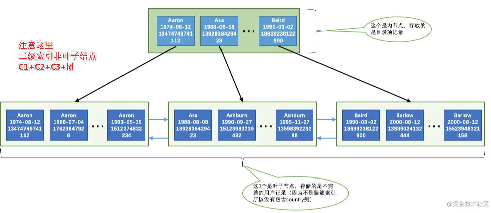

# Table of Contents

* [索引的代价](#索引的代价)
* [回表的代价](#回表的代价)
* [覆盖索引](#覆盖索引)
* [B+适用条件](#b适用条件)
  * [全值匹配](#全值匹配)
  * [匹配左边的列](#匹配左边的列)
  * [匹配列前缀](#匹配列前缀)
  * [匹配范围值](#匹配范围值)
  * [精确匹配某一列并范围匹配另外一列](#精确匹配某一列并范围匹配另外一列)
  * [排序](#排序)
    * [使用联合索引进行排序注意事项](#使用联合索引进行排序注意事项)
    * [不可以使用索引进行排序的几种情况](#不可以使用索引进行排序的几种情况)
  * [分组](#分组)
* [如何创建索引](#如何创建索引)
  * [只为用于搜索、排序或分组的列创建索引](#只为用于搜索排序或分组的列创建索引)
  * [考虑列的基数(离散性)](#考虑列的基数离散性)
  * [索引列的类型尽量小](#索引列的类型尽量小)
  * [索引字符串值的前缀](#索引字符串值的前缀)
  * [不要对索引列进行处理](#不要对索引列进行处理)
  * [主键插入顺序](#主键插入顺序)
  * [冗余和重复索引](#冗余和重复索引)
* [总结](#总结)
* [疑惑](#疑惑)
  * [为什么二级索引回表时，是一条一条的查询？](#为什么二级索引回表时是一条一条的查询)
  * [为什么使用B+而不是B树?](#为什么使用b而不是b树)


# 索引的代价

为什么要先说索引的代价？知道其代价，才能正确利用好索引。

+ 空间上的代价

  这个是显而易见的，每建立一个索引都要为它建立一棵`B+`树，每一棵`B+`树的每一个节点都是一个数据页，一个页默认会占用`16KB`的存储空间，一棵很大的`B+`树由许多数据页组成，那可是很大的一片存储空间呢。

+ 时间上的代价

  每次对表中的数据进行增、删、改操作时，都需要去修改各个`B+`树索引。而且我们讲过，`B+`树每层节点都是按照索引列的值从小到大的顺序排序而组成了双向链表。不论是叶子节点中的记录，还是内节点中的记录（也就是不论是用户记录还是目录项记录）都是按照索引列的值从小到大的顺序而形成了一个单向链表。而增、删、改操作可能会对节点和记录的排序造成破坏，所以存储引擎需要额外的时间进行一些记录移位，页面分裂、页面回收啥的操作来维护好节点和记录的排序。如果我们建了许多索引，每个索引对应的`B+`树都要进行相关的维护操作，这还能不给性能拖后腿么？


> 索引并不是万能的，并不是所有的查询语句都可以用到索引，某些情况需要我们权衡利弊。


# 回表的代价


看下边这个查询：

```mysql
SELECT * FROM person_info WHERE name > 'Asa' AND name < 'Barlow';
```

回表需要通过二级索引找到主键值，二级索引记录在**磁盘中的存储是相连的，集中分布在一个或几个数据页中**

我们可以很快的把这些连着的记录从磁盘中读出来，这种读取方式我们也可以称为`顺序I/O`。

而在聚簇索引中记录是根据`id`（也就是主键）的顺序排列的，所以根据这些并不连续的`id`值到聚簇索引中访问完整的用户记录可能分布在不同的数据页中，**这样读取完整的用户记录可能要访问更多的数据页，这种读取方式我们也可以称为`随机I/O`。**一般情况下，顺序I/O比随机I/O的性能高很多


>  每获取一条二级索引记录，就执行一次回表（没有优化的情况下）


+ 什么情况下会回表


什么时候使用采用二级索引 + 回表的方式去执行查询呢？这个就是传说中的查询优化器做的工作，查询优化器会事先对表中的记录计算一些统计数据，然后再利用这些统计数据根据查询的条件来计算一下需要回表的记录数，需要回表的记录数越多，就越倾向于使用全表扫描，反之倾向于使用二级索引 + 回表的方式。当然优化器做的分析工作不仅仅是这么简单，但是大致上是个这个过程。

> 一般情况下，限制查询获取较少的记录数会让优化器更倾向于选择使用二级索引 + 回表的方式进行查询，因为回表的记录越少，性能提升就越高，比方说上边的查询可以改写成这样：

那什么时候采用全表扫描的方式，什么时候使用采用`二级索引 + 回表`的方式去执行查询呢？这个就是传说中的查询优化器做的工作，查询优化器会事先对表中的记录计算一些统计数据，然后再利用这些统计数据根据查询的条件来计算一下需要回表的记录数，需要回表的记录数越多，就越倾向于使用全表扫描，反之倾向于使用`二级索引 + 回表`的方式。当然优化器做的分析工作不仅仅是这么简单，但是大致上是个这个过程。一般情况下，限制查询获取较少的记录数会让优化器更倾向于选择使用`二级索引 + 回表`的方式进行查询，因为回表的记录越少，性能提升就越高，比方说上边的查询可以改写成这样：

```
SELECT * FROM person_info WHERE name > 'Asa' AND name < 'Barlow' LIMIT 10;
```

添加了`LIMIT 10`的查询更容易让优化器采用`二级索引 + 回表`的方式进行查询。

对于有排序需求的查询，上边讨论的采用`全表扫描`还是`二级索引 + 回表`的方式进行查询的条件也是成立的，比方说下边这个查询：

```
SELECT * FROM person_info ORDER BY name, birthday, phone_number;
```

由于查询列表是`*`，所以如果使用二级索引进行排序的话，需要把排序完的二级索引记录全部进行回表操作，这样操作的成本还不如直接遍历聚簇索引然后再进行文件排序（`filesort`）低，所以优化器会倾向于使用`全表扫描`的方式执行查询。如果我们加了`LIMIT`子句，比如这样：

```
SELECT * FROM person_info ORDER BY name, birthday, phone_number LIMIT 10;
```

这样需要回表的记录特别少，优化器就会倾向于使用`二级索引 + 回表`的方式执行查询。


>  MySQL可以通过MRR multi range read， 把通过联合索引查出来的主键id进行排序，一定程度上把随机io转化为顺序io，降低查询成本


# 覆盖索引

为了彻底告别`回表`操作带来的性能损耗，我们建议：最好在查询列表里只包含索引列，比如这样：

```
SELECT name, birthday, phone_number FROM person_info WHERE name > 'Asa' AND name < 'Barlow'
```

因为我们只查询`name`, `birthday`, `phone_number`这三个索引列的值，所以在通过`idx_name_birthday_phone_number`索引得到结果后就不必到`聚簇索引`中再查找记录的剩余列，也就是`country`列的值了，这样就省去了`回表`操作带来的性能损耗。我们把这种只需要用到索引的查询方式称为`索引覆盖`。排序操作也优先使用`覆盖索引`的方式进行查询，比方说这个查询：

```
SELECT name, birthday, phone_number  FROM person_info ORDER BY name, birthday, phone_number;
```

虽然这个查询中没有`LIMIT`子句，但是采用了`覆盖索引`，所以查询优化器就会直接使用`idx_name_birthday_phone_number`索引进行排序而不需要回表操作了。

当然，如果业务需要查询出索引以外的列，那还是以保证业务需求为重。但是我们很不鼓励用`*`号作为查询列表，最好把我们需要查询的列依次标明。


# B+适用条件

```mysql
CREATE TABLE person_info(
    id INT NOT NULL auto_increment,
    name VARCHAR(100) NOT NULL,
    birthday DATE NOT NULL,
    phone_number CHAR(11) NOT NULL,
    country varchar(100) NOT NULL,
    PRIMARY KEY (id),
    KEY idx_name_birthday_phone_number (name, birthday, phone_number)
);
```


对于这个`person_info`表我们需要注意两点：

- 表中的主键是`id`列，它存储一个自动递增的整数。所以`InnoDB`存储引擎会自动为`id`列建立聚簇索引。
- 我们额外定义了一个二级索引`idx_name_birthday_phone_number`，它是由3个列组成的联合索引。所以在这个索引对应的`B+`树的叶子节点处存储的用户记录只保留`name`、`birthday`、`phone_number`这三个列的值以及主键`id`的值，**并不会保存`country`列的值**。




从图中可以看出，这个`idx_name_birthday_phone_number`索引对应的`B+`树中页面和记录的排序方式就是这样的：

- 先按照`name`列的值进行排序。
- 如果`name`列的值相同，则按照`birthday`列的值进行排序。
- 如果`birthday`列的值也相同，则按照`phone_number`的值进行排序。


> 其实就是特殊的BST,满足BST的性质，可以通过二分法快速定位。后面索引创建以及使用，都是在此性质上进行扩展的。
>
> 联合索引：就跟你走楼梯，先有1才会有2最后才会有3！


日常工作，查询数据莫非以下情况；全值、一半、前匹配、后匹配、范围查询、排序、分组等等。自己试想下这些情况下，我们上面建立的二级索引会有效果吗？


## 全值匹配

```mysql
SELECT * FROM person_info WHERE name = 'Ashburn' AND birthday = '1990-09-27' AND phone_number = '15123983239';
```

- 因为`B+`树的数据页和记录先是按照`name`列的值进行排序的，所以先可以很快定位`name`列的值是`Ashburn`的记录位置。
- 在`name`列相同的记录里又是按照`birthday`列的值进行排序的，所以在`name`列的值是`Ashburn`的记录里又可以快速定位`birthday`列的值是`'1990-09-27'`的记录。
- 如果很不幸，`name`和`birthday`列的值都是相同的，那记录是按照`phone_number`列的值排序的，所以联合索引中的三个列都可能被用到。

但是万一有人写错了呢？顺序弄反

```mysql
SELECT * FROM person_info WHERE birthday = '1990-09-27' AND phone_number = '15123983239' AND name = 'Ashburn';
```

 答案是：没影响哈。`MySQL`有一个叫**查询优化器**的东东，会分析这些搜索条件并且按照可以使用的索引中列的顺序来决定先使用哪个搜索条件，后使用哪个搜索条件。 


## 匹配左边的列

 们的搜索语句中也可以不用包含全部联合索引中的列，**只包含左边的就行(>=1)**，比方说下边的查询语句： 

```mysql
SELECT * FROM person_info WHERE name = 'Ashburn';
SELECT * FROM person_info WHERE name = 'Ashburn' AND birthday = '1990-09-27';
```

那么这样会用到索引吗？

以上只会用到`name`索引。


 因为`B+`树的数据页和记录先是按照`name`列的值排序的，在`name`列的值相同的情况下才使用`birthday`列进行排序，也就是说`name`列的值不同的记录中`birthday`的值可能是无序的。而现在你跳过`name`列直接根据`birthday`的值去查找 ，是找不到的。


> 如果我们想使用联合索引中尽可能多的列，搜索条件中的各个列必须是联合索引中从**最左边连续的列**。 


## 匹配列前缀

`name`:na就是`name`的前缀

 `person_info`表上建立的联合索引`idx_name_birthday_phone_number`会先用`name`列的值进行排序，所以这个联合索引对应的`B+`树中的记录的`name`列的排列就是这样的： 

```java
Aaron
Aaron
...
Aaron
Asa
Ashburn
...
Ashburn
Baird
Barlow
...
Barlow
```

这里需要注意的是，一般的比较规则都是逐个比较字符的大小，也就是说我们比较两个字符串的大小的过程其实是这样的：

- 先比较字符串的第一个字符，第一个字符小的那个字符串就比较小。
- 如果两个字符串的第一个字符相同，那就再比较第二个字符，第二个字符比较小的那个字符串就比较小。
- 如果两个字符串的第二个字符也相同，那就接着比较第三个字符，依此类推。

 也就是说这些字符串的前n个字符，也就是前缀都是排好序的 。


 所以对于字符串类型的索引列来说，我们只匹配它的前缀也是可以快速定位记录的，比方说我们想查询名字以`'As'`开头的记录，那就可以这么写查询语句： 


```mysql
SELECT * FROM person_info WHERE name LIKE 'As%';
```

 但是需要注意的是，如果只给出后缀或者中间的某个字符串，比如这样： 

```mysql
SELECT * FROM person_info WHERE name LIKE '%As%';
```

 `MySQL`就无法快速定位记录位置了，因为字符串中间有`'As'`的字符串并没有排好序，所以只能全表扫描了。 


> 注意：这种匹配列前缀只适用于**字符串**


```mysql
| www.baidu.com  |
| www.google.com |
| www.gov.cn     |
| ...            |
| www.wto.org
```

但是有时间你先匹配以`com`结尾的，这个时候怎么办呢？很简单` 逆序存储+二级索引 `

```java
| moc.udiab.www  |
| moc.elgoog.www |
| nc.vog.www     |
| ...            |
| gro.otw.www 


WHERE url LIKE 'moc%' 
```


## 匹配范围值

 `B+`树示意图，所有记录都是按照索引列的值从小到大的顺序排好序的，所以这极大的方便我们查找索引列的值在某个范围内的记录。 

回头看我们`idx_name_birthday_phone_number`索引的`B+`树示意图，所有记录都是按照索引列的值从小到大的顺序排好序的，所以这极大的方便我们查找索引列的值在某个范围内的记录。比方说下边这个查询语句：

```
SELECT * FROM person_info WHERE name > 'Asa' AND name < 'Barlow';
```

由于`B+`树中的数据页和记录是先按`name`列排序的，所以我们上边的查询过程其实是这样的：

- 通过B+树在叶子节点中找到**第一条**`name`值大于`Asa`的二级索引记录，读取该记录的主键值进行回表操作，获得对应的聚簇索引记录后发送给客户端。
- 根据上一步找到的记录，沿着记录所在的链表向后查找（同一页面中的记录使用单向链表连接起来，数据页之间用双向链表连接起来）下一条二级索引记录，判断该记录是否符合name < 'Barlow'条件，如果符合，则进行回表操作后发送至客户端。
- 重复上一步骤，直到某条二级索引记录不符合name <'Barlow'条件为止。

不过在使用联合进行范围查找的时候需要注意，**如果对多个列同时进行范围查找的话，只有对索引最左边的那个列进行范围查找的时候才能用到`B+`树索引**，比方说这样：

```
SELECT * FROM person_info WHERE name > 'Asa' AND name < 'Barlow' AND birthday > '1980-01-01';
```

上边这个查询可以分成两个部分：

1. 通过条件`name > 'Asa' AND name < 'Barlow' `来对`name`进行范围，查找的结果可能有多条`name`值不同的记录，
2. 对这些`name`值不同的记录继续通过`birthday > '1980-01-01'`条件继续过滤。

这样子对于联合索引`idx_name_birthday_phone_number`来说，只能用到`name`列的部分，而用不到`birthday`列的部分，因为只有`name`值相同的情况下才能用`birthday`列的值进行排序，而这个查询中通过`name`进行范围查找的记录中可能并不是按照`birthday`列进行排序的，所以在搜索条件中继续以`birthday`列进行查找时是用不到这个`B+`树索引的。


## 精确匹配某一列并范围匹配另外一列


>  这个可以说是匹配范围的一个变种，当你熟悉B+的数据特征后，先C1、在C2 然后C3


对于同一个联合索引来说，虽然对多个列都进行范围查找时只能用到最左边那个索引列，但是如果左边的列是精确查找，则右边的列可以进行范围查找，比方说这样：

```
SELECT * FROM person_info WHERE name = 'Ashburn' AND birthday > '1980-01-01' AND birthday < '2000-12-31' AND phone_number > '15100000000';
```

这个查询的条件可以分为3个部分：

1. `name = 'Ashburn'`，对`name`列进行精确查找，当然可以使用`B+`树索引了。
2. `birthday > '1980-01-01' AND birthday < '2000-12-31'`，由于`name`列是精确查找，所以通过`name = 'Ashburn'`条件查找后得到的结果的`name`值都是相同的，它们会再按照`birthday`的值进行排序。所以此时对`birthday`列进行范围查找是可以用到`B+`树索引的。
3. `phone_number > '15100000000'`，通过`birthday`的范围查找的记录的`birthday`的值可能不同，所以这个条件无法再利用`B+`树索引了，只能遍历上一步查询得到的记录。

同理，下边的查询也是可能用到这个`idx_name_birthday_phone_number`联合索引的：

```
SELECT * FROM person_info WHERE name = 'Ashburn' AND birthday = '1980-01-01' AND phone_number > '15100000000'
```


## 排序


我们在写查询语句的时候经常需要对查询出来的记录通过`ORDER BY`子句按照某种规则进行排序。

一般情况下，我们只能把记录都加载到内存中，再用一些排序算法，比如快速排序、归并排序、吧啦吧啦排序等等在内存中对这些记录进行排序，有的时候可能查询的结果集太大以至于不能在内存中进行排序的话，还可能暂时借助磁盘的空间来存放中间结果，排序操作完成后再把排好序的结果集返回到客户端。**在`MySQL`中，把这种在内存中或者磁盘上进行排序的方式统称为文件排序（英文名：`filesort`）**，跟`文件`这个词儿一沾边儿，就显得这些排序操作非常慢了（磁盘和内存的速度比起来，就像是飞机和蜗牛的对比）。

但是如果`ORDER BY`子句里使用到了我们的索引列，就有可能省去在内存或文件中排序的步骤，比如下边这个简单的查询语句：

```
SELECT * FROM person_info ORDER BY name, birthday, phone_number LIMIT 10;
```

这个查询的结果集需要先按照`name`值排序，如果记录的`name`值相同，则需要按照`birthday`来排序，如果`birthday`的值相同，则需要按照`phone_number`排序。大家可以回过头去看我们建立的`idx_name_birthday_phone_number`索引的示意图，因为这个`B+`树索引本身就是按照上述规则排好序的，所以直接从索引中提取数据，然后进行`回表`操作取出该索引中不包含的列就好了。简单吧？是的，索引就是这么牛逼。

### 使用联合索引进行排序注意事项

对于`联合索引`有个问题需要注意，`ORDER BY`的子句后边的列的顺序也必须按照索引列的顺序给出，如果给出`ORDER BY phone_number, birthday, name`的顺序，那也是用不了`B+`树索引，这种颠倒顺序就不能使用索引的原因我们上边详细说过了，这就不赘述了。

同理，`ORDER BY name`、`ORDER BY name, birthday`这种匹配索引左边的列的形式可以使用部分的`B+`树索引。当联合索引左边列的值为常量，也可以使用后边的列进行排序，比如这样：

```
SELECT * FROM person_info WHERE name = 'A' ORDER BY birthday, phone_number LIMIT 10;
```

这个查询能使用联合索引进行排序是因为`name`列的值相同的记录是按照`birthday`, `phone_number`排序的，说了好多遍了都。

### 不可以使用索引进行排序的几种情况

+ ##### ASC、DESC混用

+ ##### 排序列包含非同一个索引的列

  有时候用来排序的多个列不是一个索引里的，这种情况也不能使用索引进行排序，比方说：

  ```
  SELECT * FROM person_info ORDER BY name, country LIMIT 10;
  ```

  `name`和`country`并不属于一个联合索引中的列，所以无法使用索引进行排序

+ ##### 排序列使用了复杂的表达式->其实已经改变了B+树的值了，无法使用索引

## 分组

> 分组基本跟排序一样。


# 如何创建索引

> 就是怎么样的数据，才能更好的利用索引特征。


## 只为用于搜索、排序或分组的列创建索引

 `WHERE`子句中的列、连接子句中的连接列，或者出现在`ORDER BY`或`GROUP BY`子句中的列创建索引。 


## 考虑列的基数(离散性)

 `列的基数`指的是某一列中不重复数据的个数，比方说某个列包含值`2, 5, 8, 2, 5, 8, 2, 5, 8`，虽然有`9`条记录，但该列的基数却是`3`。 

 假设某个列的基数为`1`，也就是所有记录在该列中的值都一样，那为该列建立索引是没有用的，因为所有值都一样就无法排序，无法进行快速查找了 


>  最好为那些列的基数大的列建立索引，为基数太小列的建立索引效果可能不好。 


## 索引列的类型尽量小

 在表示的整数范围允许的情况下，尽量让索引列使用较小的类型，比如我们能使用`INT`就不要使用`BIGINT`，能使用`MEDIUMINT`就不要使用`INT`～ 这是因为： 

- 数据类型越小，在查询时进行的比较操作越快（这是CPU层次的东东）
- 数据类型越小，索引占用的存储空间就越少，在一个数据页内就可以放下更多的记录，从而减少磁盘`I/O`带来的性能损耗，也就意味着可以把更多的数据页缓存在内存中，从而加快读写效率。


## 索引字符串值的前缀

我们知道一个字符串其实是由若干个字符组成，如果我们在`MySQL`中使用`utf8`字符集去存储字符串的话，编码一个字符需要占用`1~3`个字节。假设我们的字符串很长，那存储一个字符串就需要占用很大的存储空间。在我们需要为这个字符串列建立索引时，那就意味着在对应的`B+`树中有这么两个问题：

- `B+`树索引中的记录需要把该列的完整字符串存储起来，而且字符串越长，在索引中占用的存储空间越大。
- 如果`B+`树索引中索引列存储的字符串很长，那在做字符串比较时会占用更多的时间。

我们前边儿说过索引列的字符串前缀其实也是排好序的，所以索引的设计者提出了个方案 --- 只对字符串的前几个字符进行索引也就是说在二级索引的记录中只保留字符串前几个字符


> 但是你对只对字符串前缀进行索引，后面巷匹配完整的字符串就无法命中索引了。


## 不要对索引列进行处理

```java
原值：A
处理后：sub(A)
这个时候是用不到索引的
```


## 主键插入顺序

`B+`是按顺序存储的。如果 我们插入的主键值忽大忽小的话，这就比较麻烦了 。

数据页面`1~100`，你插入一个9，会导致`页分裂`，引起连锁反应。

> 这里类似Redis的ZipList,引起连锁更新，只不过Mysql的主键ID，插入小的一定会发生页分裂。


## 冗余和重复索引

```java
  KEY idx_name_birthday_phone_number (name(10), birthday, phone_number),
    KEY idx_name (name(10))
```

这不是浪费空间吗


# 总结

1. `B+`树索引在空间和时间上都有代价，所以没事儿别瞎建索引。

2. `B+`树索引适用于下边这些情况：
   - 全值匹配
   - 匹配左边的列
   - 匹配范围值
   - 精确匹配某一列并范围匹配另外一列
   - 用于排序
   - 用于分组

3. 在使用索引时需要注意下边这些事项：
   - 只为用于搜索、排序或分组的列创建索引
   - 为列的基数大的列创建索引
   - 索引列的类型尽量小
   - 可以只对字符串值的前缀建立索引
   - 只有索引列在比较表达式中单独出现才可以适用索引
   - 为了尽可能少的让`聚簇索引`发生页面分裂和记录移位的情况，建议让主键拥有`AUTO_INCREMENT`属性。
   - 定位并删除表中的重复和冗余索引
   - 尽量使用`覆盖索引`进行查询，避免`回表`带来的性能损耗。

   > 其实就是让我们平时的操作尽可能命中索引

   

   


# 疑惑

## 为什么二级索引回表时，是一条一条的查询？

因为主键id不一定连续

## 为什么使用B+而不是B树?

Mysql数据是存在硬盘，加载的时候是不能【一次性加载到内存中】。

红黑树是二叉树的一个变种，

在数据不能一次加载内存中，需要检索出来，

B和B+节点存储信息更多，树高度低(高度影响检索速度)


B+树

1. 非叶子节点不存储数据，可以存储更多索引
2. 叶子节点用链表连着。支持范围查询。

B树

​	**因为 B 树不管叶子节点还是非叶子节点，都会保存数据**，这样导致在非叶子节点中能保存的指针数量变少（有些资料也称为扇出），指针少的情况下要保存大量数据，只能增加树的高度，导致 IO 操作变多，查询性能变低。
