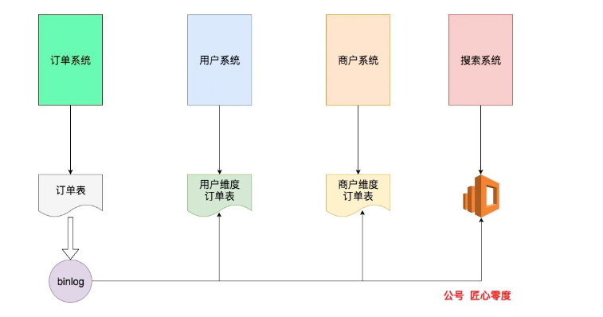
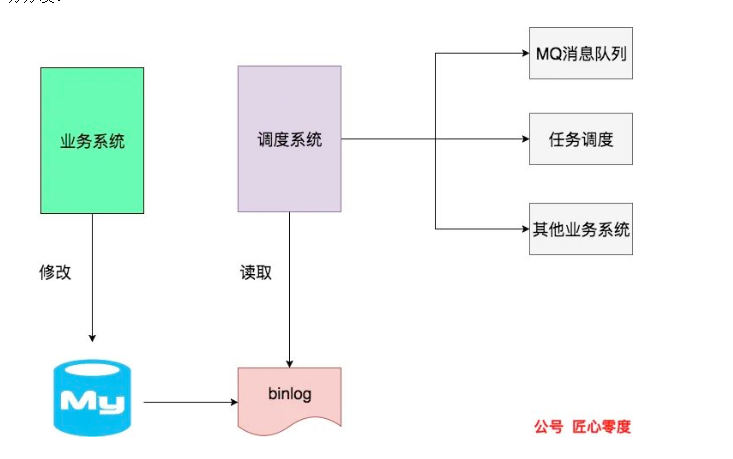

之前介绍了mysql中应用binlog的场景**，而我们的业务可以伪装成master的slave节点，感知数据的变化**，这就给了我们很多的业务运用空间。

# 数据异构

如图所示，订单系统生成订单后，通过binlog可以解析生成用户维度的订单信息供用户中心查询、商户维度订单表供运营管理，以及搜索系统的搜索数据，提供全文搜索功能。

这样，我们就通过原始的订单数据异构到三个系统中，提供了丰富的数据访问功能。不仅从节点上降低了数据服务器的压力，数据表现形式也更贴近自己的服务，减少不必要的字段冗余。

# 缓存数据补充

# 基于数据的任务分发

很多系统依赖同一块重要数据，当这些数据发生变化的时候，**需要调用其他相关系统的通知接口同步数据变化，或者mq消息告知变化并等待其主动同步。**这两种情况都对原始系统造成了侵入，原始系统改一块数据，并不想做这么多其他的事情。所以这时候可以通过binlog进行任务分发。

