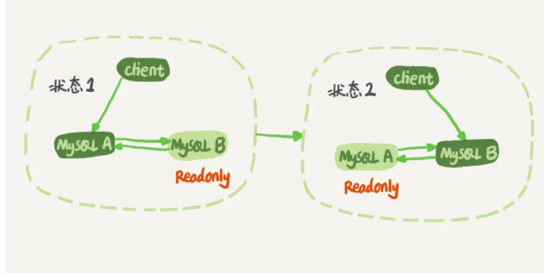

# Table of Contents

* [什么是bing log](#什么是bing-log)
* [binlog格式](#binlog格式)
  * [为什么会有mixed格式的binlog？](#为什么会有mixed格式的binlog)
  * [如何恢复数据](#如何恢复数据)
* [循环复制的问题](#循环复制的问题)
* [binlog 可以做 crash-save吗](#binlog-可以做-crash-save吗)
* [Redo和binlog区别](#redo和binlog区别)
* [两阶段提交(redo)](#两阶段提交redo)
* [为什么需要两阶段提交](#为什么需要两阶段提交)


https://www.zhihu.com/question/31082722/answer/1928249851?utm_source=wechat_session&utm_medium=social&utm_oi=610027514937085952&utm_content=group2_Answer&utm_campaign=shareopn

# 什么是bing log

redo log 是 InnoDB 引擎特有的日志，**而 server 层也有自己的日志，那就是 binlog。**


> 最开始 MySQL 里并没有 InnoDB 引擎。MySQ L自带的引擎是 MyISAM，但是 MyISAM 没有 crash-safe 的能力，**binlog 日志只能用于归档**。而 InnoDB 是另一个公司以插件形式引入MySQL 的，只依靠 binlog 是没有 crash-safe 能力的，所以 InnoDB 使用另外一套日志系统——也就是 redo log 来实现 crash-safe 能力。
>
> 是先有bin后有redo

# binlog格式

binlog 有三种格式，分别为 STATMENT 、 ROW 和 MIXED。

> 在 MySQL 5.7.7 之前，默认的格式是 STATEMENT ， MySQL 5.7.7 之后，默认值是 ROW。日志格式通过 binlog-format 指定。

+ STATMENT：**每一条会修改数据的 sql 语句**会记录到 binlog 中 。

  slave在复制的时候sql进程会解析成和原来master端执行过的相同的sql再次执行。

  **在主从同步中一般是不建议用statement模式的**，因为会有些语句不支持，比如语句中包含UUID函数，以及LOAD DATA IN FILE语句等 优点：解决了 Row
  level下的缺点，不需要记录每一行的数据变化，减少bin-log日志量，节约磁盘IO，提高新能 缺点：**容易出现主从复制不一致**

+ ROW：不记录 sql 的上下文信息，仅需记录哪条数据被修改。记两条，更新前和更新后都有。

  > 当前数据a
  > 改后数据b
  >
  > insert语句：binlog里会记录所有的字段信息，这些信息可以用来精确定位刚刚被插入的那一行。
  >
  > delete语句：binlog也会把被删掉的行的整行信息保存起来。
  >
  > update语句：binlog里面会记录修改前整行的数据和修改后的整行数据。

+ MIXED：前两种模式的混合，一般的复制使用 STATEMENT 模式保存 binlog ，对于 STATEMENT 模式无法复制的操作使用 ROW 模式保存 binlog

## 为什么会有mixed格式的binlog？

因为有些statement格式的binlog可能会导致主备不一致，所以要使用row格式。 **但row格式的缺点是，很占空间。**

比如你用一个delete语句删掉10万行数据，用statement的话就是一个SQL语句被记录到binlog中，占用几十个字节的空间。但如果用row格式的
binlog，就要把这10万条记录都写到binlog中。这样做，不仅会占用更大的空间，同时写 binlog也要耗费IO资源，影响执行速度。

所以，MySQL就取了个折中方案，也就是有了mixed格式的binlog。**mixed格式的意思 是，MySQL自己会判断这条SQL语句是否可能引起主备不一致，如果有可能，就用row格 式，否则就用statement格式。**

## 如何恢复数据

用binlog来恢复数据的标准做法是，用 mysqlbinlog工具解析出来，然后把解析结果 整个发给MySQL执行。类似下面的命令：

```mysql
mysqlbinlog master.000001 --start-position=2738 --stop-position=2973 | mysql -h127.0.0.1 -P13000 -u$
```

这个命令的意思是，将 master.000001 文件里面从第2738字节到第2973字节中间这段内容解析出来，放到MySQL去执行。

# 循环复制的问题

这种只会发生在双M上。



双M结构和M-S结构，其实区别只是多了一条线，即：节点A和B之间总是互为主备关系。这样在切换的时候就不用再修改主备关系。

业务逻辑在节点A上更新了一条语句，然后再把生成的binlog 发给节点B，节点B执行完这条更新语句后也会生成binlog。

那么，如果节点A同时是节点B的备库，相当于又把节点B新生成的binlog拿过来执行了一次，然后节点A和B间，会不断地循环执行这个更新语句，也就是循环复制了。这个要怎么解决呢？

MySQL在binlog中记录了这个命令第一次执行时所在实例的 server id。因此，我们可以用下面的逻辑，来解决两个节点间的循环复制的问题：

1. 规定两个库的server id必须不同，如果相同，则它们之间不能设定为主备关系；
2. 一个备库接到binlog并在重放的过程中，生成与原binlog的server id相同的新的binlog；
3. 每个库在收到从自己的主库发过来的日志后，先判断server id，如果跟自己的相同，表示 这个日志是自己生成的，就直接丢弃这个日志。

按照这个逻辑，如果我们设置了双M结构，日志的执行流就会变成这样：

1. 从节点A更新的事务，binlog里面记的都是A的server id；
2. 传到节点B执行一次以后，节点B生成的binlog 的server id也是A的server id；
3. 再传回给节点A，A判断到这个server id与自己的相同，就不会再处理这个日志。所以，死 循环在这里就断掉了

# binlog 可以做 crash-save吗

想要crash-sav也不是不可以

+ 无redo

    + 引入check point

+ 有redo

    + 直接直接对比匹配全量 binlog 和磁盘数据库文件，但这样做的话，效率低不说。因为 binlog 是 server 层的记录并不是引擎层的，有可能导致数据不一致的情况：

      > 假如 binlog 记录了 3 条数据，正常情况引擎层也写了 3 条数据，但是此时节点宕机重启，binlog 发现有 3 条记录需要回放，所以回放 3 条记录，但是引擎层可能已经写入了 2 条数据到磁盘，只需要回放一条 1 数据。那 binlog 回放的前两条数据会不会重复呢，比如会报错 duplicate key。

# Redo和binlog区别

redo log 和 binlog 主要有三种不同：

- redo log 是 InnoDB 引擎特有的；binlog 是 MySQL 的 Server 层实现的，所有引擎都可以使用。
- redo log 是物理日志，记录的是**在某个数据页上做了什么修改**；binlog 是逻辑日志，记录的是这个语句的原始逻辑，比如**"给 ID=2 这一行的 age 字段加1"**。
- redo log 是循环写的，空间固定会用完；binlog是可以追加写入的。**追加写**是指 binlog文件写到一定大小后会切换到下一个，并不会覆盖以前的日志。

# 两阶段提交(redo)

```mysql
update student set age = age + 1 where id = 2;
```

1. 执行器取 id = 2 的行数据。ID 是主键，引擎用树搜索找到这一行。如果这一行所在的数据页本来就在内存中，就直接返回给执行器；否则，需要先从磁盘读入内存，再返回。

2. 将旧值写入Undo。

3. 更新buffer pool中的lru缓存页数据。

4. 写入redo block

5. 事务提交，刷新脏页到redo日志，刷盘。（第一阶段提交）

6. 事务提交，binlog刷盘。

7. binlog刷盘后，会回写commit id到redo日志，保持两者一致（第二阶段提交）

   > 重点是2份日志在最后 事务id是一致的，表示数据一致，如果不一致，就直接回滚？


# 为什么需要两阶段提交


可以看到不管先写redo还是bin都会问题，redo二阶段的提交，保证了2份日志数据的一致性。
