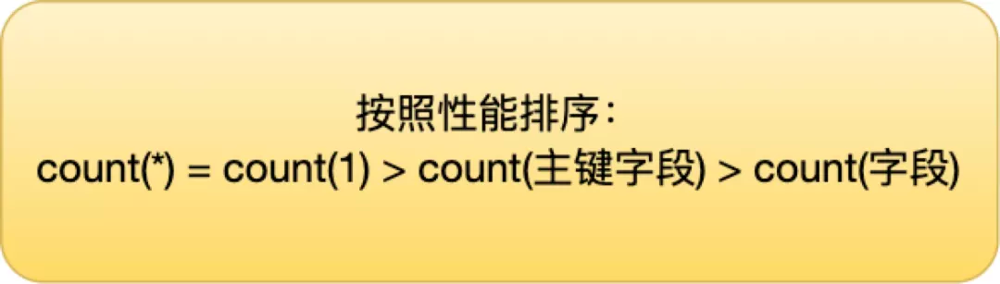
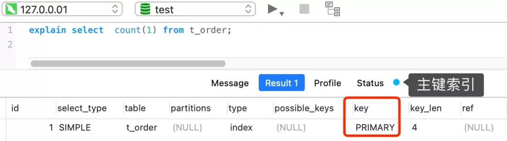
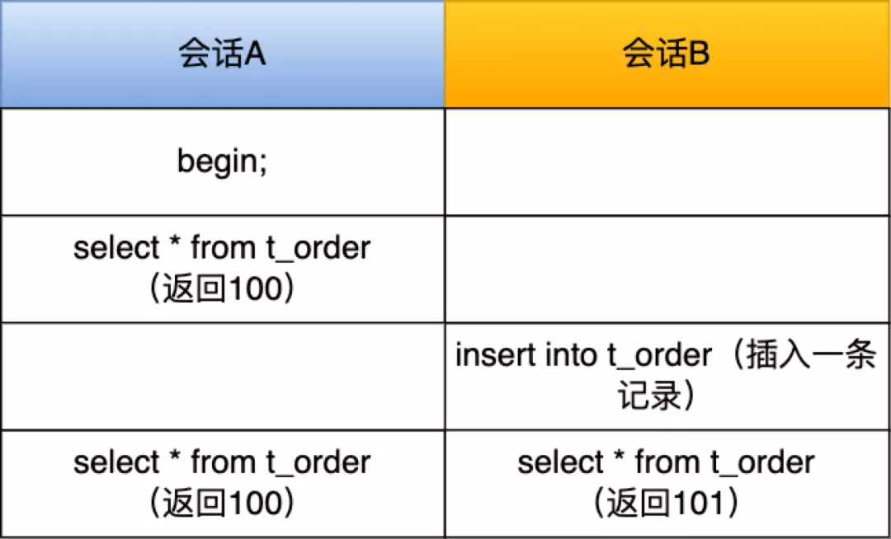

# Table of Contents

* [MySQL中COUNT是怎样执行的](#mysql中count是怎样执行的)
* [那COUNT(*)，COUNT(1)，COUNT(id)，COUNT(非主键列)呢？](#那countcount1countidcount非主键列呢)
* [总结](#总结)
* [为什么要通过遍历的方式来计数？](#为什么要通过遍历的方式来计数)
* [如何优化Count(*)](#如何优化count)
* [参考资料](#参考资料)


COUNT是一个汇总函数（聚集函数），它接收1个表达式作为参数：

```
COUNT(expr)
```

COUNT函数用于统计在符合搜索条件的记录中，指定的表达式`expr`不为NULL的行数有多少。这里需要特别注意的是，`expr`不仅仅可以是列名，其他任意表达式都是可以的。

比方说：

```
SELECT COUNT(key1) FROM t;
```

这个语句是用于统计在single_table表的所有记录中，key1列不为NULL的行数是多少。

再看这个：

```
SELECT COUNT('abc') FROM t;
```

这个语句是用于统计在single_table表的所有记录中，'abc'这个表达式不为NULL的行数是多少。很显然，'abc'这个表达式永远不是NULL，所以上述语句其实就是统计single_table表里有多少条记录。

再看这个：

```
SELECT COUNT(*) FROM t;
```

这个语句就是直接统计single_table表有多少条记录。

总结+注意：**COUNT函数的参数可以是任意表达式，该函数用于统计在符合搜索条件的记录中，[指定的表达式]不为NULL的行数有多少**。

# MySQL中COUNT是怎样执行的

以下边这个语句为例：

```
SELECT COUNT(*) FROM t;
```

这个语句是要去查询表t中共包含多少条记录。由于聚簇索引和二级索引中的记录是一一对应的，而二级索引记录中包含的列是少于聚簇索引记录的，所以同样数量的二级索引记录可以比聚簇索引记录占用更少的存储空间。如果我们使用二级索引执行上述查询，即数一下idx_key1中共有多少条二级索引记录，是比直接数聚簇索引中共有多少聚簇索引记录可以节省很多I/O成本。所以优化器会决定使用idx_key1执行上述查询：

```mysql
mysql> EXPLAIN SELECT COUNT(*) FROM t;
+----+-------------+-------+------------+-------+---------------+----------+---------+------+------+----------+-------------+
| id | select_type | table | partitions | type  | possible_keys | key      | key_len | ref  | rows | filtered | Extra       |
+----+-------------+-------+------------+-------+---------------+----------+---------+------+------+----------+-------------+
|  1 | SIMPLE      | t     | NULL       | index | NULL          | idx_key1 | 5       | NULL |   16 |   100.00 | Using index |
+----+-------------+-------+------------+-------+---------------+----------+---------+------+------+----------+-------------+
1 row in set, 1 warning (0.02 sec)
```

在执行上述查询时，server层会维护一个名叫count的变量，然后：

•server层向InnoDB要第一条记录。

•InnoDB找到idx_key1的第一条二级索引记录，并返回给server层（**注意：由于此时只是统计记录数量，所以并不需要回表**）。

•由于COUNT函数的参数是`*`，MySQL会将`*`当作常数0处理。由于0并不是NULL，server层给count变量加1。

•server层向InnoDB要下一条记录。

•InnoDB通过二级索引记录的next_record属性找到下一条二级索引记录，并返回给server层。

•server层继续给count变量加1。

•... 重复上述过程，直到InnoDB向server层返回没记录可查的消息。

•server层将最终的count变量的值发送到客户端。

# 那COUNT(*)，COUNT(1)，COUNT(id)，COUNT(非主键列)呢？



+ count(*)

  **count(`*`) 其实等于 count(`0`)**，也就是说，当你使用 count(`*`)  时，MySQL 会将 `*` 参数转化为参数 0 来处理。

  ---


+ COUNT(1)



那么，InnoDB 循环遍历聚簇索引（主键索引），将读取到的记录返回给 server 层，**但是不会读取记录中的任何字段的值**，因为 count 函数的参数是 1，不是字段，所以不需要读取记录中的字段值。参数 1 很明显并不是
NULL，因此 server 层每从 InnoDB 读取到一条记录，就将 count 变量加 1。

---

+ COUNT(id)

  **InnoDB引擎会遍历整张表，把每一行的id值都取出来，返回给server层。server层拿到id后，判断是不可能为空的，就按行累加。**

  count(1) 相比 count(主键字段) 少一个步骤，就是不需要读取记录中的字段值，所以通常会说 count(1) 执行效率会比 count(主键字段) 高一点。

  但是，如果表里有二级索引时，InnoDB 循环遍历的对象就二级索引了。

  **优化器也会选择占用存储空间最小的那个索引来执行查询.**


+ `COUNT(非主键列)`
    1. 如果这个“字段”是定义为not null的话，一行行地从记录里面读出这个字段，判断不能为 null，按行累加；
    2. 如果这个“字段”定义允许为null，那么执行的时候，判断到有可能是null，还要把值取出 来再判断一下，不是null才累加。

# 总结

对于`COUNT(*)`、`COUNT(常数)`、`COUNT(主键)`形式的COUNT函数来说，优化器可以选择最小的索引执行查询，从而提升效率，它们的执行过程是一样的，只不过在判断表达式是否为NULL时选择不同的判断方式，这个判断为NULL的过程的代价可以忽略不计，所以我们可以认为`COUNT(*)`、`COUNT(常数)`、`COUNT(主键)`所需要的代价是相同的。

而对于`COUNT(非主键列)`来说，server层必须要从InnoDB中读到包含`非主键列`的记录，所以优化器并不能随心所欲的选择最小的索引去执行。

# 为什么要通过遍历的方式来计数？

而 InnoDB 存储引擎是支持事务的，**同一个时刻的多个查询**，由于多版本并发控制（MVCC）的原因，InnoDB 表“应该返回多少行”也是不确定的，所以无法像 MyISAM一样，只维护一个 row_count 变量。



在会话 A 和会话 B的最后一个时刻，同时查表 t_order 的记录总个数，可以发现，显示的结果是不一样的。所以，在使用 InnoDB 存储引擎时，就需要扫描表来统计具体的记录。

而当带上 where 条件语句之后，MyISAM 跟 InnoDB 就没有区别了，它们都需要扫描表来进行记录个数的统计。

# 如何优化Count(*)

1. ***近似值\***

   这时，我们就可以使用 show table status 或者 explain 命令来表进行估算。

2. ***第二种，额外表保存计数值\***

   这样就很麻烦了

# 参考资料

https://mp.weixin.qq.com/s/foPwJPS8Ek7YmR3ZgV8xMw
