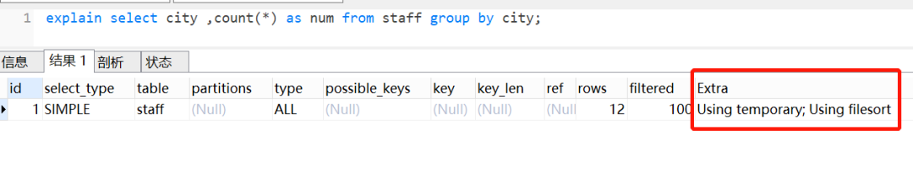
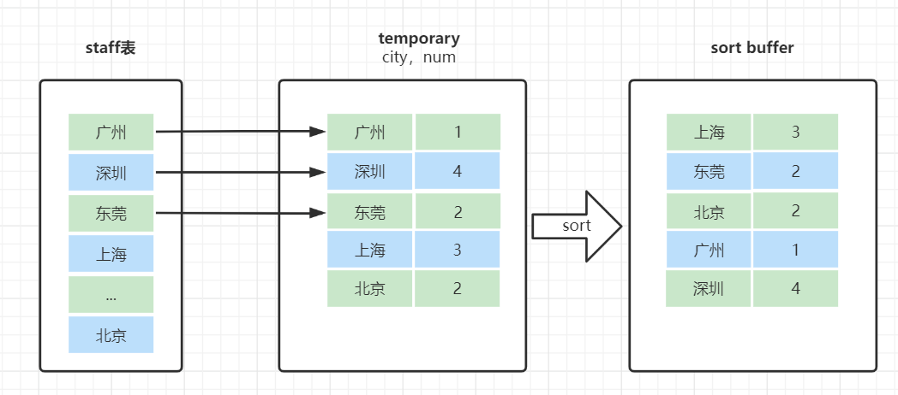

# Table of Contents

* [前提知识](#前提知识)
* [例子](#例子)
* [原理分析](#原理分析)
  * [explain](#explain)
  * [group by 的简单执行流程](#group-by-的简单执行流程)
  * [where、group by 、having](#wheregroup-by-having)
* [使用 group by 注意的问题](#使用-group-by-注意的问题)
  * [group by一定要配合聚合函数使用嘛？](#group-by一定要配合聚合函数使用嘛)
  * [group by 后面跟的字段一定要出现在select中嘛。](#group-by-后面跟的字段一定要出现在select中嘛)
  * [`group by`导致的慢SQL问题](#group-by导致的慢sql问题)
* [group by的一些优化方案](#group-by的一些优化方案)


group by`一般用于**分组统计**，它表达的逻辑就是`根据一定的规则，进行分组`。


# 前提知识

[OrderBy原理](OrderBy原理.md)


# 例子

假设用一张员工表，表结构如下：

```
CREATE TABLE `staff` (
  `id` bigint(11) NOT NULL AUTO_INCREMENT COMMENT '主键id',
  `id_card` varchar(20) NOT NULL COMMENT '身份证号码',
  `name` varchar(64) NOT NULL COMMENT '姓名',
  `age` int(4) NOT NULL COMMENT '年龄',
  `city` varchar(64) NOT NULL COMMENT '城市',
  PRIMARY KEY (`id`)
) ENGINE=InnoDB AUTO_INCREMENT=15 DEFAULT CHARSET=utf8 COMMENT='员工表';
```

我们现在有这么一个需求：**统计每个城市的员工数量**。对应的 SQL 语句就可以这么写：

```
select city ,count(*) as num from staff group by city;
```


# 原理分析

## explain

我们先用`explain`查看一下执行计划

```
explain select city ,count(*) as num from staff group by city;
```



- Extra 这个字段的`Using temporary`表示在执行分组的时候使用了**临时表**
- Extra 这个字段的`Using filesort`表示使用了**排序**


## group by 的简单执行流程

我们一起来看下这个SQL的执行流程哈

1. 创建内存临时表，表里有两个字段`city`和`num`；
2. 全表扫描`staff`的记录，依次取出city = 'X'的记录。

- 判断**临时表**中是否有为 city='X'的行，没有就插入一个记录 (X,1);
- 如果临时表中有city='X'的行的行，就将x 这一行的num值加 1；

1. 遍历完成后，再根据字段`city`做**排序**，得到结果集返回给客户端。

这个流程的执行图如下：





可以看到：group by就是比order by 多了一个**临时表**，我们可以理解为，我们代码中分组需要用得到Map


## where、group by 、having


如果一个SQL同时含有`where、group by、having`子句，执行顺序是怎样的呢。

比如这个SQL：

```
select city ,count(*) as num from staff  where age> 19 group by city having num >= 3;
```

1. 执行`where`子句查找符合年龄大于19的员工数据
2. `group by`子句对员工数据，根据城市分组。
3. 对`group by`子句形成的城市组，运行聚集函数计算每一组的员工数量值；
4. 最后用`having`子句选出员工数量大于等于3的城市组。


> `having`只能用在group by之后，where执行在group by之前


# 使用 group by 注意的问题

## group by一定要配合聚合函数使用嘛？

group by 就是**分组统计**的意思，一般情况都是配合聚合函数`如（count(),sum(),avg(),max(),min())`一起使用。

- count() 数量
- sum() 总和
- avg() 平均
- max() 最大值
- min() 最小值

如果没有配合聚合函数使用可以吗？

> 我用的是**Mysql 5.7** ，是可以的。不会报错，并且返回的是，**分组的第一行数据。**


## group by 后面跟的字段一定要出现在select中嘛。

不一定，比如以下SQL：

```
select max(age)  from staff group by city;
```


分组字段`city`不在select 后面，并不会报错。当然，这个可能跟**不同的数据库，不同的版本**有关吧。大家使用的时候，可以先验证一下就好。有一句话叫做，**纸上得来终觉浅，绝知此事要躬行**。


## `group by`导致的慢SQL问题

其实看执行过程就知道

因为它既用到**临时表**，又默认用到**排序**。有时候还可能用到**磁盘临时表**。


#  group by的一些优化方案

+ ### group by 后面的字段加索引

+ ### order by null 不用排序

  > **group by默认按所有字段升序**
  >
  > 如果你的需求并不需要对结果集进行排序，可以使用`order by null`。

  ```
  select city ,count(*) as num from staff group by city order by null
  ```

  执行计划如下，已经没有`filesort`啦

+ ### 尽量只使用内存临时表

  如果`group by`需要统计的数据不多，我们可以尽量只使用**内存临时表**；因为如果group by 的过程因为内存临时表放不下数据，从而用到磁盘临时表的话，是比较耗时的。因此可以适当调大`tmp_table_size`参数，来避免用到**磁盘临时表**。

+ ### 使用SQL_BIG_RESULT优化

  如果数据量实在太大怎么办呢？总不能无限调大`tmp_table_size`吧？但也不能眼睁睁看着数据先放到内存临时表，**随着数据插入**发现到达上限，再转成磁盘临时表吧？这样就有点不智能啦。

  因此，如果预估数据量比较大，我们使用`SQL_BIG_RESULT` 这个提示直接用磁盘临时表。MySQl优化器发现，磁盘临时表是B+树存储，存储效率不如数组来得高。因此会直接用数组来存

  示例SQl如下：

  ```
  select SQL_BIG_RESULT city ,count(*) as num from staff group by city;
  ```

  执行计划的`Extra`字段可以看到，执行没有再使用临时表，而是只有排序
