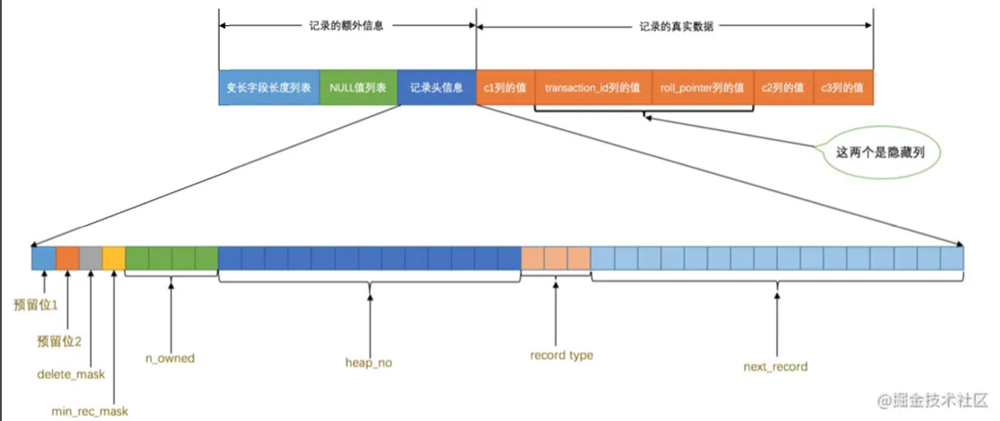
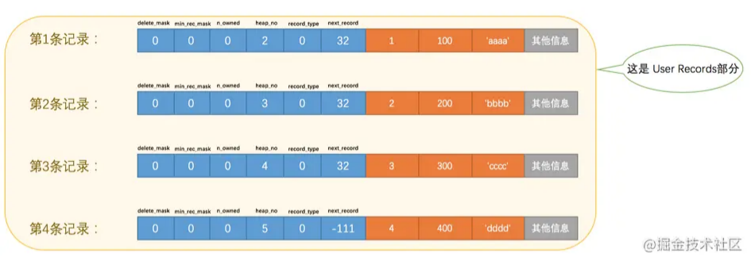
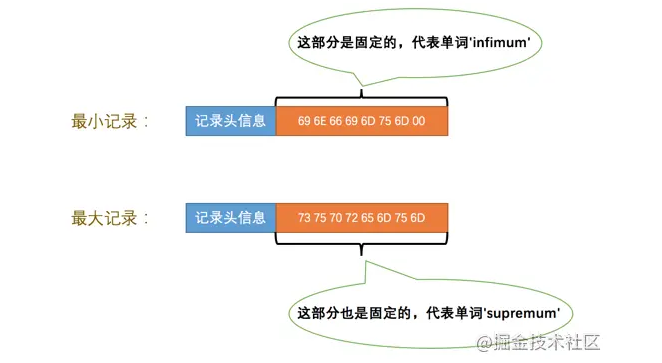
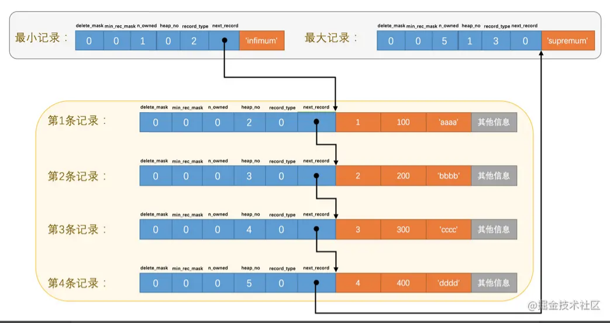
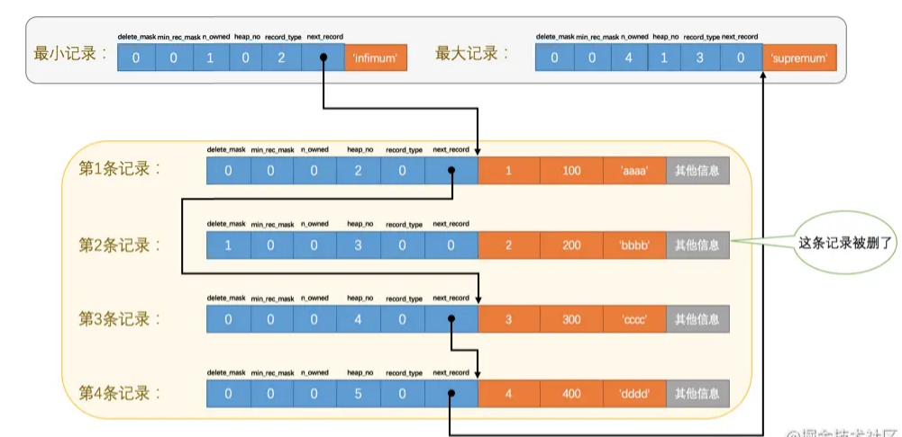
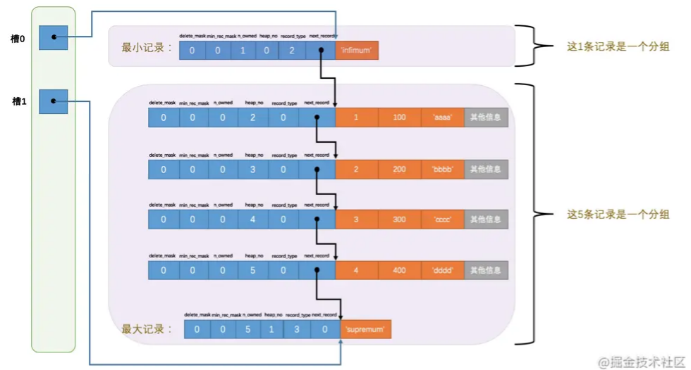
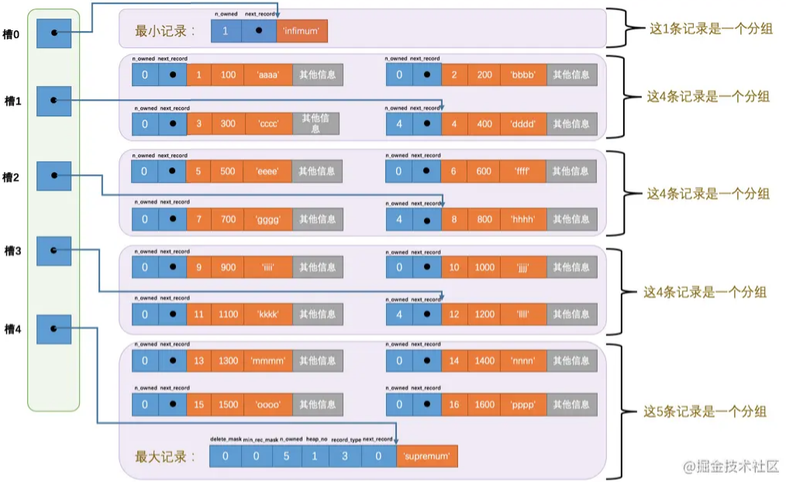

# Table of Contents

* [数据页结构](#数据页结构)
* [User Records](#user-records)
  * [行格式-记录头信息](#行格式-记录头信息)
    * [delete_mask](#delete_mask)
    * [min_rec_mask](#min_rec_mask)
    * [n_owned](#n_owned)
    * [heap_no](#heap_no)
    * [record_type](#record_type)
    * [next_record](#next_record)
* [Page Directory(页目录)](#page-directory页目录)
  * [分组](#分组)
  * [分组规则](#分组规则)
* [Page Header（页面头部）](#page-header页面头部)
* [File Header（文件头部）](#file-header文件头部)
* [File Tail](#file-tail)
* [总结](#总结)


# 数据页结构

数据页代表的这块`16KB`大小的存储空间可以被划分为多个部分，不同部分有不同的功能，各个部分如图所示：


| 名称                 | 中文名             | 占用空间大小 | 简单描述                 |
| -------------------- | ------------------ | ------------ | ------------------------ |
| `File Header`        | 文件头部           | `38`字节     | 页的一些通用信息         |
| `Page Header`        | 页面头部           | `56`字节     | 数据页专有的一些信息     |
| `Infimum + Supremum` | 最小记录和最大记录 | `26`字节     | **两个虚拟的行记录**     |
| `User Records`       | 用户记录           | 不确定       | 实际存储的行记录内容     |
| `Free Space`         | 空闲空间           | 不确定       | 页中尚未使用的空间       |
| `Page Directory`     | 页面目录           | 不确定       | 页中的某些记录的相对位置 |
| `File Trailer`       | 文件尾部           | `8`字节      | 校验页是否完整           |

下面会仔细说明这些属性


# User Records


在页的7个组成部分中，我们自己存储的记录会按照我们指定的`行格式`存储到`User Records`部分。但是在一开始生成页的时候，其实并没有`User Records`这个部分，每当我们插入一条记录，都会从`Free Space`部分，也就是尚未使用的存储空间中申请一个记录大小的空间划分到`User Records`部分，当`Free Space`部分的空间全部被`User Records`部分替代掉之后，也就意味着这个页使用完了，如果还有新的记录插入的话，就需要去申请新的页了


## 行格式-记录头信息

```java
mysql> CREATE TABLE page_demo(
    ->     c1 INT,
    ->     c2 INT,
    ->     c3 VARCHAR(10000),
    ->     PRIMARY KEY (c1)
    -> ) CHARSET=ascii ROW_FORMAT=Compact;
Query OK, 0 rows affected (0.03 sec)
```




仔细看记录头的信息


| 名称           | 大小（单位：bit） | 描述                                                         |
| -------------- | ----------------- | ------------------------------------------------------------ |
| `预留位1`      | `1`               | 没有使用                                                     |
| `预留位2`      | `1`               | 没有使用                                                     |
| `delete_mask`  | `1`               | 标记该记录是否被删除                                         |
| `min_rec_mask` | `1`               | B+树的每层非叶子节点中的最小记录都会添加该标记               |
| `n_owned`      | `4`               | 表示当前记录拥有的记录数                                     |
| `heap_no`      | `13`              | 表示当前记录在记录堆的位置信息                               |
| `record_type`  | `3`               | 表示当前记录的类型，`0`表示普通记录，`1`表示B+树非叶节点记录，`2`表示最小记录，`3`表示最大记录 |
| `next_record`  | `16`              | 表示下一条记录的相对位置                                     |


下边我们试着向`page_demo`表中插入几条记录：

```java
mysql> INSERT INTO page_demo VALUES(1, 100, 'aaaa'), (2, 200, 'bbbb'), (3, 300, 'cccc'), (4, 400, 'dddd');
Query OK, 4 rows affected (0.00 sec)
Records: 4  Duplicates: 0  Warnings: 0
注意这里 1234是主键
```




### delete_mask

这个属性标记着当前记录是否被删除，占用1个二进制位，值为`0`的时候代表记录并没有被删除，为`1`的时候代表记录被删除掉了。

> **数据并没有被删除，只是标记不可用**。所有被删除掉的记录都会组成一个所谓的`垃圾链表`，在这个链表中的记录占用的空间称之为所谓的`可重用空间`，
>
> 如果有新记录插入到表中的话，可能把这些被删除的记录占用的存储空间覆盖掉。(空间足够的话)


将这个delete_mask位设置为1和将被删除的记录加入到垃圾链表中其实是两个阶段，后面会提到


### min_rec_mask

B+树的每层非叶子节点中的最小记录都会添加该标记，具体后面说到。


### n_owned

当前记录拥有的记录数。这不是行格式吗？怎么还会有记录数？

在页分组的时候会用到 记录当前组内的行数量

### heap_no


这个属性表示当前记录在本`页`中的位置

InnoDB自动给每个页里边儿加了两个记录，称为`伪记录`或者`虚拟记录`。这两个伪记录一个代表`最小记录`，一个代表`最大记录`

```java
最小  0
最大  1
1    2
2    3
3    4
4    5
```



由于这两条记录不是我们自己定义的记录，所以它们并不存放在`页`的`User Records`部分，他们被单独放在一个称为`Infimum + Supremum`的部分


<font color=red>对于一条完整的记录来说，比较记录的大小就是比较`主键`的大小。</font>

比方说我们插入的4行记录的主键值分别是：`1`、`2`、`3`、`4`，这也就意味着这4条记录的大小从小到大依次递增。


### record_type

这个属性表示当前记录的类型，一共有4种类型的记录，`0`表示普通记录，`1`表示B+树非叶节点记录，`2`表示最小记录，`3`表示最大记录。


### next_record

它表示从当前记录的真实数据到下一条记录的真实数据的地址偏移量。其实就是链表

`下一条记录`指得并不是按照我们插入顺序的下一条记录，而是按照主键值由小到大的顺序的下一条记录。而且规定 ***Infimum记录（也就是最小记录）*** 的下一条记录就是本页中主键值最小的用户记录，而本页中主键值最大的用户记录的下一条记录就是 ***Supremum记录（也就是最大记录）***




如果删掉第2条记录



- 第2条记录并没有从存储空间中移除，而是把该条记录的`delete_mask`值设置为`1`。
- 第2条记录的`next_record`值变为了0，意味着该记录没有下一条记录了。
- 第1条记录的`next_record`指向了第3条记录。
- 还有一点你可能忽略了，就是`最大记录`的`n_owned`值从`5`变成了`4`


> 你会不会觉得next_record这个指针有点儿怪，为啥要指向记录头信息和真实数据之间的位置呢？为啥不干脆指向整条记录的开头位置，也就是记录的额外信息开头的位置呢？ 因为这个位置刚刚好，向左读取就是记录头信息，向右读取就是真实数据。我们前边还说过变长字段长度列表、NULL值列表中的信息都是逆序存放，这样可以使记录中位置靠前的字段和它们对应的字段长度信息在内存中的距离更近，可能会提高高速缓存的命中率。当然如果你看不懂这句话的话就不要勉强了，果断跳过～


举个例子 

 1 2 3 4 删除 2 插入 2 ，2会复用之前空间。插入同空间的5也会复用2之前的空间


# Page Directory(页目录)


## 分组


记录在页中按照主键值由小到大顺序串联成一个单链表，那么我们怎么查询数据呢？

设计`InnoDB`的大叔们为我们的记录也制作了一个类似的目录，他们的制作过程是这样的：

1. 将所有正常的记录（包括最大和最小记录，不包括标记为已删除的记录）划分为几个组。
2. 每个组的最后一条记录（也就是组内最大的那条记录）的头信息中的`n_owned`属性表示该记录拥有多少条记录，也就是该组内共有几条记录。
3. 将每个组的最后一条记录的地址偏移量单独提取出来按顺序存储到靠近`页`的尾部的地方，这个地方就是所谓的`Page Directory`，也就是`页目录`（此时应该返回头看看页面各个部分的图）。页面目录中的这些地址偏移量被称为`槽`（英文名：`Slot`），所以这个页面目录就是由`槽`组成的。

看着很熟悉是不，就是二分法。

> 那么数据页中的数据，是怎么被分成组的呢？


比方说现在的`page_demo`表中正常的记录共有6条，`InnoDB`会把它们分成两组，第一组中只有一个最小记录，第二组中是剩余的5条记录，看下边的示意图：



- 注意最小和最大记录的头信息中的`n_owned`属性
  - 最小记录的`n_owned`值为`1`，这就代表着以最小记录结尾的这个分组中只有`1`条记录，也就是最小记录本身。
  - 最大记录的`n_owned`值为`5`，这就代表着以最大记录结尾的这个分组中只有`5`条记录，包括最大记录本身还有我们自己插入的`4`条记录。


## 分组规则


对于最小记录所在的分组只能有 ***1*** 条记录，最大记录所在的分组拥有的记录条数只能在 ***1~8*** 条之间，剩下的分组中记录的条数范围只能在是 ***4~8*** 条之间。

- 初始情况下一个数据页里只有最小记录和最大记录两条记录，它们分属于两个分组。
- 之后每插入一条记录，都会从`页目录`中找到主键值比本记录的主键值大并且差值最小的槽，然后把该槽对应的记录的`n_owned`值加1，表示本组内又添加了一条记录，直到该组中的记录数等于8个。
- 在一个组中的记录数等于8个后再插入一条记录时，会将组中的记录拆分成两个组，一个组中4条记录，另一个5条记录。这个过程会在`页目录`中新增一个`槽`来记录这个新增分组中最大的那条记录的偏移量。




比方说我们想找主键值为`6`的记录，过程是这样的：

1. 计算中间槽的位置：`(0+4)/2=2`，所以查看`槽2`对应记录的主键值为`8`，又因为`8 > 6`，所以设置`high=2`，`low`保持不变。
2. 重新计算中间槽的位置：`(0+2)/2=1`，所以查看`槽1`对应的主键值为`4`，又因为`4 < 6`，所以设置`low=1`，`high`保持不变。
3. 因为`high - low`的值为1，所以确定主键值为`6`的记录在`槽2`对应的组中。此刻我们需要找到`槽2`中主键值最小的那条记录，然后沿着单向链表遍历`槽2`中的记录。但是我们前边又说过，每个槽对应的记录都是该组中主键值最大的记录，这里`槽2`对应的记录是主键值为`8`的记录，怎么定位一个组中最小的记录呢？别忘了各个槽都是挨着的，我们可以很轻易的拿到`槽1`对应的记录（主键值为`4`），**该条记录的下一条记录就是`槽2`中主键值最小的记录**，该记录的主键值为`5`。所以我们可以从这条主键值为`5`的记录出发，遍历`槽2`中的各条记录，直到找到主键值为`6`的那条记录即可。由于一个组中包含的记录条数只能是1~8条，所以遍历一个组中的记录的代价是很小的。


# Page Header（页面头部）


本页中已经存储了多少条记录，第一条记录的地址是什么，页目录中存储了多少个槽等等，特意在页中定义了一个叫`Page Header`的部分，它是`页`结构的第二部分，这个部分占用固定的`56`个字节，专门存储各种状态信息，


| 名称                | 占用空间大小 | 描述                                                         |
| ------------------- | ------------ | ------------------------------------------------------------ |
| `PAGE_N_DIR_SLOTS`  | `2`字节      | 在页目录中的槽数量                                           |
| `PAGE_HEAP_TOP`     | `2`字节      | 还未使用的空间最小地址，也就是说从该地址之后就是`Free Space` |
| `PAGE_N_HEAP`       | `2`字节      | 本页中的记录的数量（包括最小和最大记录以及标记为删除的记录） |
| `PAGE_FREE`         | `2`字节      | 第一个已经标记为删除的记录地址（各个已删除的记录通过`next_record`也会组成一个**单链表**，这个单链表中的记录可以被重新利用） |
| `PAGE_GARBAGE`      | `2`字节      | 已删除记录占用的字节数                                       |
| `PAGE_LAST_INSERT`  | `2`字节      | 最后插入记录的位置                                           |
| `PAGE_DIRECTION`    | `2`字节      | 记录插入的方向                                               |
| `PAGE_N_DIRECTION`  | `2`字节      | 一个方向连续插入的记录数量                                   |
| `PAGE_N_RECS`       | `2`字节      | 该页中记录的数量（不包括最小和最大记录以及被标记为删除的记录） |
| `PAGE_MAX_TRX_ID`   | `8`字节      | 修改当前页的最大事务ID，该值仅在二级索引中定义               |
| `PAGE_LEVEL`        | `2`字节      | 当前页在B+树中所处的层级                                     |
| `PAGE_INDEX_ID`     | `8`字节      | 索引ID，表示当前页属于哪个索引                               |
| `PAGE_BTR_SEG_LEAF` | `10`字节     | B+树叶子段的头部信息，仅在B+树的Root页定义                   |
| `PAGE_BTR_SEG_TOP`  | `10`字节     | B+树非叶子段的头部信息，仅在B+树的Root页定义                 |

- `PAGE_DIRECTION`

  假如新插入的一条记录的主键值比上一条记录的主键值大，我们说这条记录的插入方向是右边，反之则是左边。用来表示最后一条记录插入方向的状态就是`PAGE_DIRECTION`。

- `PAGE_N_DIRECTION`

  假设连续几次插入新记录的方向都是一致的，`InnoDB`会把沿着同一个方向插入记录的条数记下来，这个条数就用`PAGE_N_DIRECTION`这个状态表示。当然，如果最后一条记录的插入方向改变了的话，这个状态的值会被清零重新统计。


至于我们没提到的那些属性，我没说是因为现在不需要大家知道。不要着急，当我们学完了后边的内容，你再回头看，一切都是那么清晰


> 每页一个垃圾单链表

# File Header（文件头部）

`File Header`针对各种类型的页都通用，也就是说不同类型的页都会以`File Header`作为第一个组成部分，它描述了一些针对各种页都通用的一些信息，比方说这个页的编号是多少，它的上一个页、下一个页是谁啦吧啦吧啦～ 这个部分占用固定的`38`个字节，是由下边这些内容组成的：

| 名称                               | 占用空间大小 | 描述                                                         |
| ---------------------------------- | ------------ | ------------------------------------------------------------ |
| `FIL_PAGE_SPACE_OR_CHKSUM`         | `4`字节      | 页的校验和（checksum值）                                     |
| `FIL_PAGE_OFFSET`                  | `4`字节      | 页号                                                         |
| `FIL_PAGE_PREV`                    | `4`字节      | 上一个页的页号                                               |
| `FIL_PAGE_NEXT`                    | `4`字节      | 下一个页的页号                                               |
| `FIL_PAGE_LSN`                     | `8`字节      | 页面被最后修改时对应的日志序列位置（英文名是：Log Sequence Number） |
| `FIL_PAGE_TYPE`                    | `2`字节      | 该页的类型                                                   |
| `FIL_PAGE_FILE_FLUSH_LSN`          | `8`字节      | 仅在系统表空间的一个页中定义，代表文件至少被刷新到了对应的LSN值 |
| `FIL_PAGE_ARCH_LOG_NO_OR_SPACE_ID` | `4`字节      | 页属于哪个表空间                                             |

- `FIL_PAGE_SPACE_OR_CHKSUM`

  <font color=red>这个比较重要</font>

  这个代表当前页面的校验和（checksum）。啥是个校验和？就是对于一个很长很长的字节串来说，

  我们会通过某种算法来**计算一个比较短的值来代表这个很长的字节串**，这个比较短的值就称为`校验和`。

  这样在比较两个很长的字节串之前先比较这两个长字节串的校验和，如果校验和都不一样两个长字节串肯定是不同的，所以省去了直接比较两个比较长的字节串的时间损耗。

- `FIL_PAGE_OFFSET`

  每一个`页`都有一个单独的页号，就跟你的身份证号码一样，`InnoDB`通过页号来可以唯一定位一个`页`。

- `FIL_PAGE_TYPE`

  这个代表当前`页`的类型，我们前边说过，`InnoDB`为了不同的目的而把页分为不同的类型，我们上边介绍的其实都是存储记录的`数据页`，其实还有很多别的类型的页，具体如下表：

  | 类型名称                  | 十六进制 | 描述                             |
  | ------------------------- | -------- | -------------------------------- |
  | `FIL_PAGE_TYPE_ALLOCATED` | 0x0000   | 最新分配，还没使用               |
  | `FIL_PAGE_UNDO_LOG`       | 0x0002   | Undo日志页                       |
  | `FIL_PAGE_INODE`          | 0x0003   | 段信息节点                       |
  | `FIL_PAGE_IBUF_FREE_LIST` | 0x0004   | Insert Buffer空闲列表            |
  | `FIL_PAGE_IBUF_BITMAP`    | 0x0005   | Insert Buffer位图                |
  | `FIL_PAGE_TYPE_SYS`       | 0x0006   | 系统页                           |
  | `FIL_PAGE_TYPE_TRX_SYS`   | 0x0007   | 事务系统数据                     |
  | `FIL_PAGE_TYPE_FSP_HDR`   | 0x0008   | 表空间头部信息                   |
  | `FIL_PAGE_TYPE_XDES`      | 0x0009   | 扩展描述页                       |
  | `FIL_PAGE_TYPE_BLOB`      | 0x000A   | 溢出页                           |
  | `FIL_PAGE_INDEX`          | 0x45BF   | 索引页，也就是我们所说的`数据页` |

  我们存放记录的数据页的类型其实是`FIL_PAGE_INDEX`，也就是所谓的`索引页`。至于啥是个索引，且听下回分解～

- `FIL_PAGE_PREV`和`FIL_PAGE_NEXT`

  `数据页`（也就是类型为`FIL_PAGE_INDEX`的页）是有这两个属性的，所以所有的数据页其实是一个双链表，就像这样：


# File Tail

我们知道`InnoDB`存储引擎会把数据存储到磁盘上，但是磁盘速度太慢，需要以`页`为单位把数据加载到内存中处理，如果该页中的数据在内存中被修改了，那么在修改后的某个时间需要把数据同步到磁盘中。但是在同步了一半的时候中断电了咋办，这不是莫名尴尬么？为了检测一个页是否完整（也就是在同步的时候有没有发生只同步一半的尴尬情况），设计`InnoDB`的大叔们在每个页的尾部都加了一个`File Trailer`部分，这个部分由`8`个字节组成，可以分成2个小部分：

- 前4个字节代表页的校验和

  这个部分是和`File Header`中的校验和相对应的。每当一个页面在内存中修改了，在同步之前就要把它的校验和算出来，因为`File Header`在页面的前边，所以校验和会被首先同步到磁盘，当完全写完时，校验和也会被写到页的尾部，如果完全同步成功，则页的首部和尾部的校验和应该是一致的。如果写了一半儿断电了，那么在`File Header`中的校验和就代表着已经修改过的页，而在`File Trailer`中的校验和代表着原先的页，二者不同则意味着同步中间出了错。

- 后4个字节代表页面被最后修改时对应的日志序列位置（LSN）

  这个部分也是为了校验页的完整性的，只不过我们目前还没说`LSN`是个什么意思，所以大家可以先不用管这个属性。

这个`File Trailer`与`File Header`类似，都是所有类型的页通用的。


# 总结

1. InnoDB为了不同的目的而设计了不同类型的页，我们把用于存放记录的页叫做`数据页`。
2. 一个数据页可以被大致划分为7个部分，分别是
   - `File Header`，表示页的一些通用信息，占固定的38字节。
   - `Page Header`，表示数据页专有的一些信息，占固定的56个字节。
   - `Infimum + Supremum`，两个虚拟的伪记录，分别表示页中的最小和最大记录，占固定的`26`个字节。
   - `User Records`：真实存储我们插入的记录的部分，大小不固定。
   - `Free Space`：页中尚未使用的部分，大小不确定。
   - `Page Directory`：页中的某些记录相对位置，也就是各个槽在页面中的地址偏移量，大小不固定，插入的记录越多，这个部分占用的空间越多。
   - `File Trailer`：用于检验页是否完整的部分，占用固定的8个字节。
3. 每个记录的头信息中都有一个`next_record`属性，从而使页中的所有记录串联成一个`单链表`。
4. `InnoDB`会把页中的记录划分为若干个组，每个组的最后一个记录的地址偏移量作为一个`槽`，存放在`Page Directory`中，所以在一个页中根据主键查找记录是非常快的，分为两步：
   - 通过二分法确定该记录所在的槽。
   - 通过记录的next_record属性遍历该槽所在的组中的各个记录。
5. 每个数据页的`File Header`部分都有上一个和下一个页的编号，所以所有的数据页会组成一个`双链表`。
6. 为保证从内存中同步到磁盘的页的完整性，在页的首部和尾部都会存储页中数据的校验和和页面最后修改时对应的`LSN`值，如果首部和尾部的校验和和`LSN`值校验不成功的话，就说明同步过程出现了问题。

> 这里顺便说下 磁盘也是有checkSum
