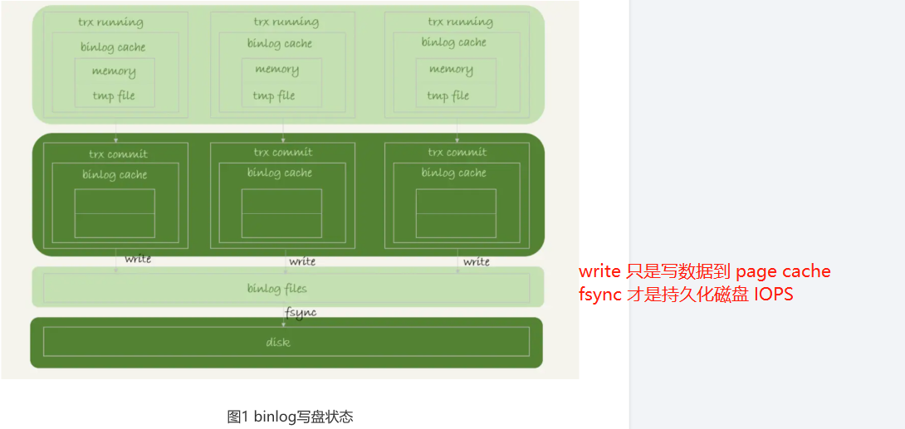
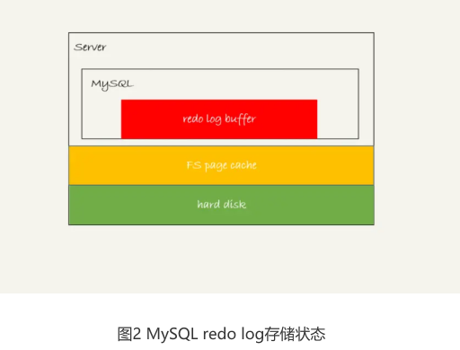
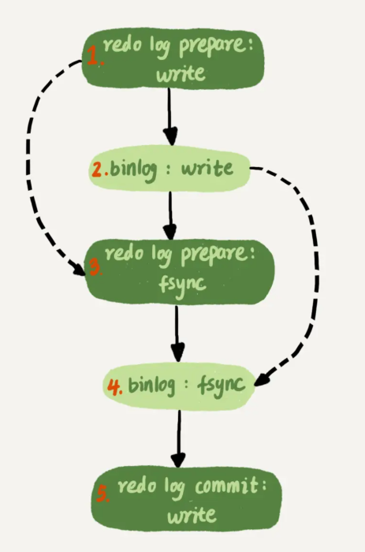

# Table of Contents

* [binlog的写入机制](#binlog的写入机制)
* [redo log的写入机制](#redo-log的写入机制)
* [双1配置](#双1配置)
* [组提交](#组提交)
* [2阶段优化](#2阶段优化)
* [提升io性能的方法](#提升io性能的方法)
* [总结](#总结)

# binlog的写入机制

binlog的写入逻辑比较简单：

+ 事务执行过程中，先把日志写到binlog cache，

+ 事务提交的时候，再把binlog cache写到binlog文件中。

一个事务的binlog是不能被拆开的，因此不论这个事务多大，也要确保一次性写入。

> 为什么？我想的是破坏了原子性。

这就涉及到了binlog cache的保存问题。

系统给binlog cache分配了一片内存，每个线程一个，参数 binlog_cache_size用于控制单个
线程内binlog cache所占内存的大小。如果超过了这个参数规定的大小，就要暂存到磁盘。

事务提交的时候，执行器把binlog cache里的完整事务写入到binlog中，并清空binlogcache。

可以看到，每个线程有自己binlog cache，但是共用同一份binlog文件。

write 和fsync的时机，是由参数sync_binlog控制的：
1. sync_binlog=0的时候，表示每次提交事务都只write，不fsync；

2. sync_binlog=1的时候，表示每次提交事务都会执行fsync；

3. sync_binlog=N(N>1)的时候，表示每次提交事务都write，但累积N个事务后才fsync。

因此，在出现IO瓶颈的场景里，将sync_binlog设置成一个比较大的值，可以提升性能。在实
际的业务场景中，考虑到丢失日志量的可控性，一般不建议将这个参数设成0，比较常见的是
将其设置为100~1000中的某个数值。

但是，将sync_binlog设置为N，对应的风险是：如果主机发生异常重启，会丢失最近N个事
务的binlog日志。

# redo log的写入机制

redo log可能存在的三种状态

这三种状态分别是：
1. 存在redo log buffer中，物理上是在MySQL进程内存中，就是图中的红色部分；
2. 写到磁盘(write)，但是没有持久化（fsync)，物理上是在文件系统的page cache里面，也
就是图中的黄色部分；
3. 持久化到磁盘，对应的是hard disk，也就是图中的绿色部分。
日志写到redo log buffer是很快的，wirte到page cache也差不多，但是持久化到磁盘的速
度就慢多了。

为了控制redo log的写入策略，InnoDB提供了innodb_flush_log_at_trx_commit参数，它
有三种可能取值：

有三种可能取值：
1. 设置为0的时候，表示每次事务提交时都只是把redo log留在redo log buffer中;
2. 设置为1的时候，表示每次事务提交时都将redo log直接持久化到磁盘；
3. 设置为2的时候，表示每次事务提交时都只是把redo log写到page cache。

InnoDB有一个后台线程，每隔1秒，就会把redo log buffer中的日志，调用write写到文件系
统的page cache，然后调用fsync持久化到磁盘。

注意，事务执行中间过程的redo log也是直接写在redo log buffer中的，这些redo log也会
被后台线程一起持久化到磁盘。也就是说，一个没有提交的事务的redo log，也是可能已经
持久化到磁盘的。

实际上，除了后台线程每秒一次的轮询操作外，还有两种场景会让一个没有提交的事务的
redo log写入到磁盘中。

1. 一种是，redo log buffer占用的空间即将达到 innodb_log_buffer_size一半的时候，后
台线程会主动写盘。注意，由于这个事务并没有提交，所以这个写盘动作只是write，而没
有调用fsync，也就是只留在了文件系统的page cache。
2. 另一种是，并行的事务提交的时候，顺带将这个事务的redo log buffer持久化到磁盘。假
设一个事务A执行到一半，已经写了一些redo log到buffer中，这时候有另外一个线程的事
务B提交，如果innodb_flush_log_at_trx_commit设置的是1，那么按照这个参数的逻辑，
事务B要把redo log buffer里的日志全部持久化到磁盘。这时候，就会带上事务A在redo
log buffer里的日志一起持久化到磁盘。

# 双1配置

这里需要说明的是，我们介绍两阶段提交的时候说过，时序上redo log先prepare， 再写
binlog，最后再把redo log commit。如果把innodb_flush_log_at_trx_commit设置成1，那么redo log在prepare阶段就要持久化一次，因为有一个崩溃恢复逻辑是要依赖于prepare 的redo log，再加上binlog来恢复的。

每秒一次后台轮询刷盘，再加上崩溃恢复这个逻辑，InnoDB就认为redo log在commit的时候就不需要fsync了，只会write到文件系统的page cache中就够了。

通常我们说MySQL的“双1”配置，指的就是sync_binlog和innodb_flush_log_at_trx_commit都设置成 1。也就是说，一个事务完整提交前，需要等待两次刷盘，一次是redo log（prepare 阶段），一次是binlog。

这时候，你可能有一个疑问，这意味着我从MySQL看到的TPS是每秒两万的话，每秒就会写四万次磁盘。但是，我用工具测试出来，磁盘能力也就两万左右，怎么能实现两万的TPS？

解释这个问题，就要用到组提交（group commit）机制了。

# 组提交

LSN是单调递增的，用来对应redo log的一个个写入点。每次写入长度为length的redo log， LSN
的值就会加上length。

如图3所示，是三个并发事务(trx1, trx2, trx3)在prepare 阶段，都写完redo log buffer，持久化到磁盘的过程，对应的LSN分别是50、120 和160。

从图中可以看到，

1. trx1是第一个到达的，会被选为这组的 leader；
2. 等trx1要开始写盘的时候，这个组里面已经有了三个事务，这时候LSN也变成了160；
3. trx1去写盘的时候，带的就是LSN=160，因此等trx1返回时，所有LSN小于等于160的
redo log，都已经被持久化到磁盘；
4. 这时候trx2和trx3就可以直接返回了。

所以，一次组提交里面，组员越多，节约磁盘IOPS的效果越好。但如果只有单线程压测，那
就只能老老实实地一个事务对应一次持久化操作了。

在并发更新场景下，第一个事务写完redo log buffer以后，接下来这个fsync越晚调用，组员
可能越多，节约IOPS的效果就越好。

# 2阶段优化

实际上，写binlog是分成两步的：

1. 先把binlog从binlog cache中写到磁盘上的binlog文件；
2. 调用fsync持久化。

MySQL为了让组提交的效果更好，把redo log做fsync的时间拖到了步骤1之后。也就是说，上面的图变成了这样：

>  也就是件fsync时机提到了最后。

第4步把binlog fsync到磁盘时，如果有多个事务的binlog已经写完了，也是一起持久化的，这样也可以减少IOPS的消耗。

不过通常情况下第3步执行得会很快，所以binlog的write和fsync间的间隔时间短，导致能集
合到一起持久化的binlog比较少，因此binlog的组提交的效果通常不如redo log的效果那么
好。

如果你想提升binlog组提交的效果，可以通过设置 binlog_group_commit_sync_delay 和
binlog_group_commit_sync_no_delay_count来实现。

1. binlog_group_commit_sync_delay参数，表示延迟多少微秒后才调用fsync;
2. binlog_group_commit_sync_no_delay_count参数，表示累积多少次以后才调用fsync。

这两个条件是或的关系，也就是说只要有一个满足条件就会调用fsync。

之前有同学在评论区问到，WAL机制是减少磁盘写，可是每次提交事务都要写redo log和binlog，这磁盘读写次数也没变少呀？

现在你就能理解了，WAL机制主要得益于两个方面：

1. redo log 和 binlog都是顺序写，磁盘的顺序写比随机写速度要快；
2. 组提交机制，可以大幅度降低磁盘的IOPS消耗。

# 提升io性能的方法

1. 设置 binlog_group_commit_sync_delay 和binlog_group_commit_sync_no_delay_count参数，减少binlog的写盘次数。这个方法是基于“额外的故意等待”来实现的，因此可能会增加语句的响应时间，但没有丢失数据的风险。
2. 将sync_binlog 设置为大于1的值（比较常见是100~1000）。这样做的风险是，主机掉电时会丢binlog日志。
3. 将innodb_flush_log_at_trx_commit设置为2。这样做的风险是，主机掉电的时候会丢数据。

# 总结

1. 一个事务的binlog是不能被拆开的，因此不论这个事务多大，也要确保一次性写入。
2. 每个线程一个binglog_cache。超过设置大小，会暂存到磁盘。
3. write 和fsync的时机，是由参数sync_binlog控制的：
   1. sync_binlog=0的时候，表示每次提交事务都只write，不fsync；
   2. sync_binlog=1的时候，表示每次提交事务都会执行fsync；
   3. sync_binlog=N(N>1)的时候，表示每次提交事务都write，但累积N个事务后才fsync。
4. redo日志三种状态，内存、page cache 、disk
5. redo刷盘策略
   1. 设置为0的时候，表示每次事务提交时都只是把redo log留在redo log buffer中;
   2. 设置为1的时候，表示每次事务提交时都将redo log直接持久化到磁盘；
   3. 设置为2的时候，表示每次事务提交时都只是把redo log写到page cache。
6. 双1配置。一个事务完整提交前，需要等待两次刷盘，一次是redo log（prepare 阶段），一次是binlog。
7. 组提交。redo日志。会将多次提交事务中小于最大LSN的redo日志一起fsync。
8. 2阶段优化：将fsync放到最后去执行。
9. 通知设置参数控制bing log 刷盘时机。
