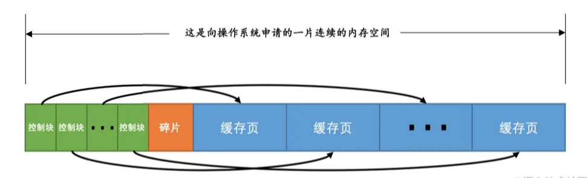
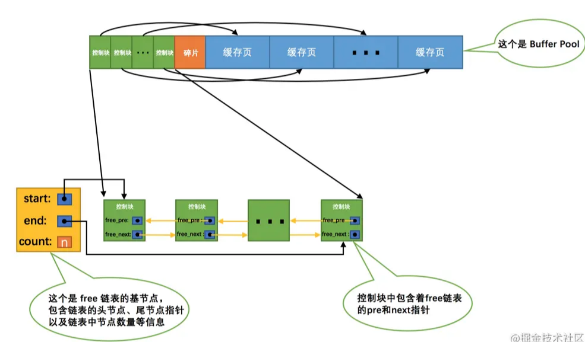
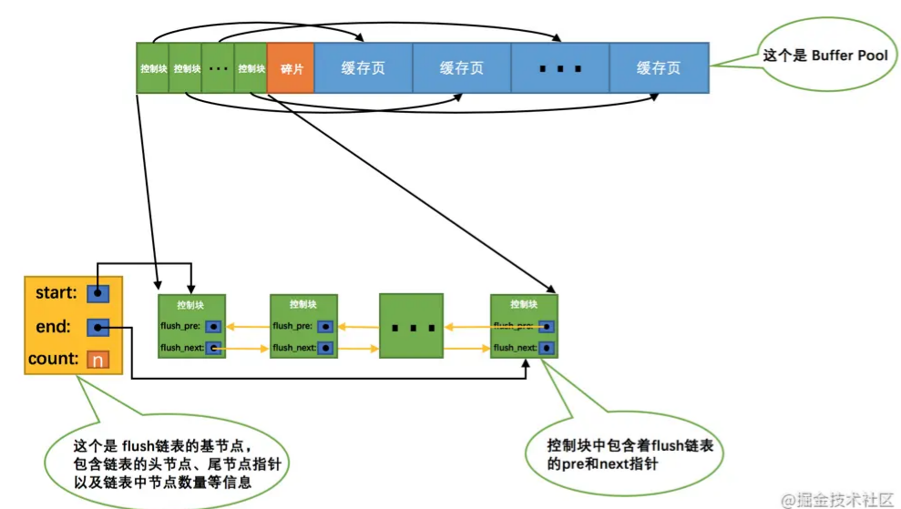
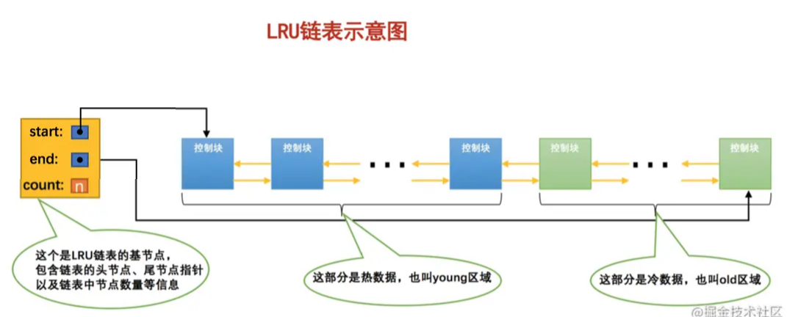
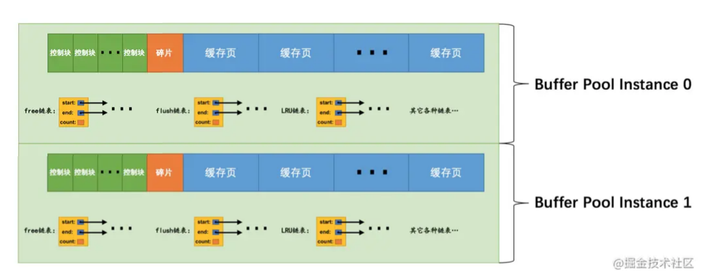
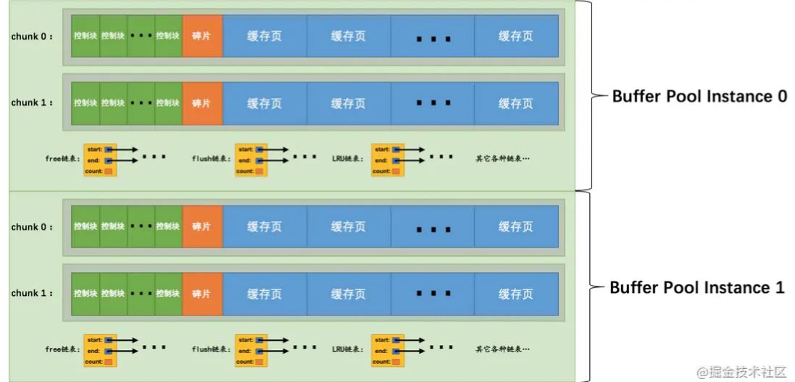

# Table of Contents

* [缓存的重要性](#缓存的重要性)
* [为什么要有 Buffer Pool？](#为什么要有-buffer-pool)
* [Buffer Pool](#buffer-pool)
* [控制块](#控制块)
* [Free链表](#free链表)
* [缓存页寻找](#缓存页寻找)
* [flush链表](#flush链表)
* [简单LRU链表](#简单lru链表)
* [简单LRU链表不能解决的问题-预读](#简单lru链表不能解决的问题-预读)
* [LRU冷热链](#lru冷热链)
* [LRU冷热链如何解决预读和全表扫描问题](#lru冷热链如何解决预读和全表扫描问题)
* [优化LRU冷热链](#优化lru冷热链)
* [其他的一些链表](#其他的一些链表)
* [刷新脏页到磁盘](#刷新脏页到磁盘)
* [多个Buffer Pool实例](#多个buffer-pool实例)
* [innodb_buffer_pool_chunk_size](#innodb_buffer_pool_chunk_size)
* [配置Buffer Pool时的注意事项](#配置buffer-pool时的注意事项)
* [Buffer Pool中存储的其它信息](#buffer-pool中存储的其它信息)
* [查看Buffer Pool的状态信息](#查看buffer-pool的状态信息)
* [应用场景](#应用场景)
* [总结](#总结)


# 缓存的重要性

`InnoDB`存储引擎在处理客户端的请求时，当需要访问某个页的数据时，就会把完整的页的数据全部加载到内存中，

也就是说即使我们只需要访问一个页的一条记录，那也需要先把整个页的数据加载到内存中。(预读)

将整个页加载到内存中后就可以进行读写访问了，在进行完读写访问之后并**不着急把该页对应的内存空间释放掉**，而是将其`缓存`起来，这样将来有请求再次访问该页面时，就可以省去磁盘`IO`的开销了。


> pageCacher 也是类似
>
> 预读和缓存


# 为什么要有 Buffer Pool？

虽然说 MySQL 的数据是存储在磁盘里的，但是也不能每次都从磁盘里面读取数据，这样性能是极差的。

要想提升查询性能，加个缓存就行了嘛。所以，当数据从磁盘中取出后，缓存内存中，下次查询同样的数据的时候，直接从内存中读取。

为此，Innodb 存储引擎设计了一个**缓冲池（\*Buffer Pool\*）**，来提高数据库的读写性能。


有了缓冲池后：

- 当读取数据时，如果数据存在于  Buffer Pool 中，客户端就会直接读取  Buffer Pool 中的数据，否则再去磁盘中读取。
- 当修改数据时，首先是修改  Buffer Pool  中数据所在的页，然后将其页设置为脏页，最后由后台线程将脏页写入到磁盘。


> 下面讲的都是围绕这2步来的。
>
> 如何保证缓存的命中率
>
> 以及缓存数据什么时候刷入磁盘


# Buffer Pool

在`MySQL`服务器启动的时候就向操作系统申请了**一片连续的内存**，他们给这片内存起了个名，叫做`Buffer Pool`（中文名是`缓冲池`）。 默认情况下`Buffer Pool`只有`128M`大小。当然如果你嫌弃这个`128M`太大或者太小，可以在启动服务器的时候配置`innodb_buffer_pool_size`参数的值，它表示`Buffer Pool`的大小，就像这样：

```
[server]
innodb_buffer_pool_size = 268435456
```

其中，`268435456`的单位是字节，也就是我指定`Buffer Pool`的大小为`256M`。需要注意的是，`Buffer Pool`也不能太小，最小值为`5M`(当小于该值时会自动设置成`5M`)。


# 控制块

`Buffer Pool`中默认的缓存页大小和在磁盘上默认的页大小是一样的，都是`16KB`。

为了**更好的管理这些在`Buffer Pool`中的缓存页**，设计`InnoDB`的大叔为每一个缓存页都创建了一些所谓的`控制信息`，这些控制信息包括该页所属的表空间编号、页号、缓存页在`Buffer Pool`中的地址、链表节点信息、一些锁信息以及`LSN`信息（锁和`LSN`我们之后会具体唠叨，现在可以先忽略），当然还有一些别的控制信息，我们这就不全唠叨一遍了，挑重要的说嘛～

每个缓存页对应的控制信息占用的内存大小是相同的，我们就把每个页对应的控制信息占用的一块内存称为一个`控制块`吧，控制块和缓存页是一一对应的，它们都被存放到 Buffer Pool 中，其中**控制块被存放到 Buffer Pool 的前边，缓存页被存放到 Buffer Pool 后边**，所以整个`Buffer Pool`对应的内存空间看起来就是这样的：



每一个控制块都对应一个缓存页，那在分配足够多的控制块和缓存页后，可能剩余的那点儿空间不够一对控制块和缓存页的大小，自然就用不到喽，这个用不到的那点儿内存空间就被称为`碎片`了。当然，如果你把`Buffer Pool`的大小设置的刚刚好的话，也可能不会产生`碎片`～


# Free链表

从磁盘上读取一个页到`Buffer Pool`中的时候该放到哪个缓存页的位置呢？或者说怎么**区分`Buffer Pool`中哪些缓存页是空闲**的，哪些已经被使用了呢？我们最好在某个地方记录一下Buffer Pool中哪些缓存页是可用的，这个时候缓存页对应的`控制块`就派上大用场了，我们可以把**所有空闲的缓存页**对应的控制块作为一个节点放到一个链表中，这个链表也可以被称作`free链表`（或者说空闲链表）。

刚刚完成初始化的`Buffer Pool`中所有的缓存页都是空闲的，所以每一个缓存页对应的控制块都会被加入到`free链表`中，假设该`Buffer Pool`中可容纳的缓存页数量为`n`，那增加了`free链表`的效果图就是这样的：



从图中可以看出，我们为了管理好这个`free链表`，特意为这个链表定义了一个`基节点`，里边儿包含着链表的头节点地址，尾节点地址，以及当前链表中节点的数量等信息。这里需要注意的是，链表的基节点占用的内存空间并不包含在为`Buffer Pool`申请的一大片连续内存空间之内，而是**单独申请的一块内存空间**。


> 注意这里是控制块加入Free链表


# 缓存页寻找

`表空间号 + 页号`作为`key`，`缓存页`作为`value`创建一个**哈希表**，在需要访问某个页的数据时，先从哈希表中根据`表空间号 + 页号`看看有没有对应的缓存页，如果有，直接使用该缓存页就好，如果没有，那就从`free链表`中选一个空闲的缓存页，然后把磁盘中对应的页加载到该缓存页的位置。


> free链表主要看哪些缓存空间没有被使用，哈希表主要看哪些数据页已经被缓存！
>
> 缓存就会带来一个问题，我现在是读数据，如果是修改数据呢？
>
> 
>
> 如果修改缓存后同步，是立即同步还是异步同步？那怎么保证数据的一致性？
> 


# flush链表


如果我们修改了`Buffer Pool`中某个缓存页的数据，那它就和磁盘上的页不一致了，这样的缓存页也被称为`脏页`（英文名：`dirty page`）。

最简单的做法就是每发生一次修改就立即同步到磁盘上对应的页上，但是频繁的往磁盘中写数据会严重的影响程序的性能（毕竟磁盘慢的像乌龟一样）。所以每次修改缓存页后，我们并不着急立即把修改同步到磁盘上，而是在**未来的某个时间点进行同步**


> 这里有一个疑问点,在未来的时间同步，如果实例断掉了怎么办？

为了方便快递找到已修改过的数据，<font color=red>凡是修改过的缓存页对应的控制块都会作为一个节点**加入**到一个链表中</font>，因为这个链表节点对应的缓存页都是需要被刷新到磁
盘上的，所以也叫`flush链表`。


> 注意这是控制块加入到Flush链表,可以理解一份数据2处引用
>
> 只是说定义一个链表，可以帮助快速找到修改的数据
>
> 所有数据都在lru链表里，脏页再通过flush链表串起来




# 简单LRU链表


假设我们一共访问了`n`次页，那么被访问的页已经在**缓存中的次数除以`n`就是所谓的`缓存命中率`**，我们的期望就是让`缓存命中率`越高越好

管理`Buffer Pool`的缓存页其实也是这个道理，当`Buffer Pool`中不再有空闲的缓存页时，就需要淘汰掉部分最近很少使用的缓存页。不过，我们怎么知道哪些**缓存页最近频繁使用，哪些最近很少使用**呢？呵呵，神奇的链表再一次派上了用场，我们可以再创建一个链表，由于这个链表是为了`按照最近最少使用`的原则去淘汰缓存页的，

所以这个链表可以被称为`LRU链表`（LRU的英文全称：Least Recently Used）。当我们需要访问某个页时，可以这样处理`LRU链表`：

- 如果该页不在`Buffer Pool`中，在把该页从磁盘加载到`Buffer Pool`中的缓存页时，就把该缓存页对应的`控制块`作为节点塞到链表的头部。
- 如果该页已经缓存在`Buffer Pool`中，则直接把该页对应的`控制块`移动到`LRU链表`的头部。

也就是说：只要我们使用到某个缓存页，就把该缓存页调整到`LRU链表`的头部，这样`LRU链表`尾部就是最近最少使用的缓存页喽～ 所以当`Buffer Pool`中的空闲缓存页使用完时，到`LRU链表`的尾部找些缓存页淘汰就OK啦

看着是不是很简单？要不然为什么叫简单LRU链表。哈哈 


> 注意这里是控制块加入LRU链表


# 简单LRU链表不能解决的问题-预读

1. `InnoDB`提供了一个看起来比较贴心的服务——`预读`（英文名：`read ahead`）。所谓`预读`，就是`InnoDB`认为执行当前的请求可能之后会读取某些页面，就预先把它们加载到`Buffer Pool`中。根据触发方式的不同，`预读`又可以细分为下边两种：

   + 线性预读
     设计`InnoDB`的大叔提供了一个系统变量`innodb_read_ahead_threshold`，

     <font color=red>如果顺序访问了某个区（`extent`）的页面超过这个系统变量的值，就会触发一次`异步`读取下一个区中全部的页面到`Buffer Pool`的请求，注意`异步`读取意味着从磁盘中加载这些被预读的页面并不会影响到当前工作线程的正常执行。</font>

     这个`innodb_read_ahead_threshold`系统变量的值默认是`56`，我们可以在服务器启动时通过启动参数或者服务器运行过程中直接调整该系统变量的值，不过它是一个全局变量，注意使用`SET GLOBAL`命令来修改哦。

     > 这里是区到区！

   + 随机预读
     如果`Buffer Pool`中已经缓存了<font color=red>某个区的13个连续的页面</font>，不论这些页面是不是顺序读取的，都会触发一次`异步`读取本区中所有其的页面到`Buffer Pool`的请求。设计`InnoDB`的大叔同时提供了`innodb_random_read_ahead`系统变量，它的默认值为`OFF`，也就意味着`InnoDB`并不会默认开启随机预读的功能，如果我们想开启该功能，可以通过修改启动参数或者直接使用`SET GLOBAL`命令把该变量的值设置为`ON`。

     > 这里是区中数据页达到某种临界值

2. 一些需要扫描全表的查询语句，扫描全表意味着什么？意味着将访问到该表所在的所有页！假设这个表中记录非常多的话，那该表会占用特别多的`页`，当需要访问这些页时，会把它们统统都加载到`Buffer Pool`中。


预读和全表扫描本身没问题，但是会产生很多预读的页面都没有用到的话，这就会导致处在`LRU链表`尾部的一些缓存页会很快的被淘汰掉，也就是所谓的`劣币驱逐良币`，会大大降低缓存命中率。


# LRU冷热链

因为有这两种情况的存在，所以设计`InnoDB`的大叔把这个`LRU链表`按照一定比例分成两截，分别是：

- 一部分存储使用频率非常高的缓存页，所以这一部分链表也叫做`热数据`，或者称`young区域`。
- 另一部分存储使用频率不是很高的缓存页，所以这一部分链表也叫做`冷数据`，或者称`old区域`。




<font color=red>我们是按照某个比例将LRU链表分成两半的，不是某些节点固定是young区域的，某些节点固定是old区域的</font>，随着程序的运行，某个节点所属的区域也可能发生变化。那这个划分成两截的比例怎么确定呢？对于`InnoDB`存储引擎来说，我们可以通过查看系统变量`innodb_old_blocks_pct`的值来确定`old`区域在`LRU链表`中所占的比例，比方说这样：

```
mysql> SHOW VARIABLES LIKE 'innodb_old_blocks_pct';
+-----------------------+-------+
| Variable_name         | Value |
+-----------------------+-------+
| innodb_old_blocks_pct | 37    |
+-----------------------+-------+
1 row in set (0.01 sec)
```

从结果可以看出来，默认情况下，`old`区域在`LRU链表`中所占的比例是`37%`，也就是说`old`区域大约占`LRU链表`的`3/8`。这个比例我们是可以设置的，我们可以在启动时修改`innodb_old_blocks_pct`参数来控制`old`区域在`LRU链表`中所占的比例，比方说这样修改配置文件：

```
[server]
innodb_old_blocks_pct = 40
```

这样我们在启动服务器后，`old`区域占`LRU链表`的比例就是`40%`。当然，如果在服务器运行期间，我们也可以修改这个系统变量的值，不过需要注意的是，这个系统变量属于`全局变量`，一经修改，会对所有客户端生效，所以我们只能这样修改：

```
SET GLOBAL innodb_old_blocks_pct = 40;
```


# LRU冷热链如何解决预读和全表扫描问题

+ 预读
  当磁盘上的某个页面在初次加载到Buffer Pool中的某个缓存页时，该缓存页对应的控制块会被放到old区域的头部。这样针对预读到`Buffer Pool`却不进行后续访问的页面就会被逐渐从`old`区域逐出，而不会影响`young`区域中被使用比较频繁的缓存页。

+ 全表扫描

  在进行全表扫描时，虽然首次被加载到`Buffer Pool`的页被放到了`old`区域的头部，但是后续会被马上访问到，每次进行访问的时候又会把该页放到`young`区域的头部，这样仍然会把那些使用频率比较高的页面给顶下去。有同学会想：可不可以在第一次访问该页面时不将其从`old`区域移动到`young`区域的头部，后续访问时再将其移动到`young`区域的头部。回答是：行不通！

  因为设计`InnoDB`的大叔规定<font color=red>每次去页面中读取一条记录时，都算是访问一次页面</font>，而一个页面中可能会包含很多条记录，也就是说读取完某个页面的记录就相当于访问了这个页面好多次。

  咋办？全表扫描有一个特点，<font color=red>那就是它的执行频率非常低</font>，谁也不会没事儿老在那写全表扫描的语句玩，而且在执行全表扫描的过程中，即使某个页面中有很多条记录，也就是去多次访问这个页面所花费的时间也是非常少的。

  所以我们只需要规定，**在对某个处在`old`区域的缓存页进行第一次访问时就在它对应的控制块中记录下来这个访问时间，如果后续的访问时间与第一次访问的时间在某个时间间隔内，那么该页面就不会被从old区域移动到young区域的头部，否则将它移动到young区域的头部。**上述的这个间隔时间是由系统变量`innodb_old_blocks_time`控制的，你看：

```
mysql> SHOW VARIABLES LIKE 'innodb_old_blocks_time';
+------------------------+-------+
| Variable_name          | Value |
+------------------------+-------+
| innodb_old_blocks_time | 1000  |
+------------------------+-------+
1 row in set (0.01 sec)
```

这个`innodb_old_blocks_time`的默认值是`1000`，它的单位是毫秒，也就意味着对于从磁盘上被加载到`LRU`链表的`old`区域的某个页来说，如果第一次和最后一次访问该页面的时间间隔小于`1s`（很明显在一次全表扫描的过程中，多次访问一个页面中的时间不会超过`1s`），那么该页是不会被加入到`young`区域的～ 当然，像`innodb_old_blocks_pct`一样，我们也可以在服务器启动或运行时设置`innodb_old_blocks_time`的值，这里就不赘述了，你自己试试吧～ 这里需要注意的是，如果我们把`innodb_old_blocks_time`的值设置为`0`，那么每次我们访问一个页面时就会把该页面放到`young`区域的头部。

> 对于全表扫描，后续访问时间和第一次在某个时间段，就不从old to young


# 优化LRU冷热链


对于`young`区域的缓存页来说，我们每次访问一个缓存页就要把它移动到`LRU链表`的头部，这样开销是不是太大啦，毕竟在`young`区域的缓存页都是热点数据，也就是可能被经常访问的，这样频繁的对`LRU链表`进行节点移动操作是不太好的。

为了解决这个问题其实我们还可以提出一些优化策略，比如只有被访问的缓存页位于`young`区域的`1/4`的后边，才会被移动到`LRU链表`头部，这样就可以降低调整`LRU链表`的频率，从而提升性能（也就是说如果某个缓存页对应的节点在`young`区域的`1/4`中，再次访问该缓存页时也不会将其移动到`LRU`链表头部）。

> 小贴士： 我们之前介绍随机预读的时候曾说，如果Buffer Pool中有某个区的13个连续页面就会触发随机预读，这其实是不严谨的（不幸的是MySQL文档就是这么说的[摊手]），其实还要求这13个页面是非常热的页面，所谓的非常热，指的是这些页面在整个young区域的头1/4处。


# 其他的一些链表

为了更好的管理`Buffer Pool`中的缓存页，除了我们上边提到的一些措施，设计`InnoDB`的大叔们还引进了其他的一些`链表`，比如`unzip LRU链表`用于管理解压页，`zip clean链表`用于管理没有被解压的压缩页，`zip free数组`中每一个元素都代表一个链表，它们组成所谓的`伙伴系统`来为压缩页提供内存空间


# 刷新脏页到磁盘

**后台有专门的线程**每隔一段时间负责把脏页刷新到磁盘，这样可以不影响用户线程处理正常的请求。主要有两种刷新路径：

- 从`LRU链表`的冷数据中刷新一部分页面到磁盘。

  后台线程会定时从`LRU链表`尾部开始扫描一些页面，扫描的页面数量可以通过系统变量`innodb_lru_scan_depth`来指定，**如果从里边儿发现脏页，会把它们刷新到磁盘**。这种刷新页面的方式被称之为`BUF_FLUSH_LRU`。

- 从`flush链表`中刷新一部分页面到磁盘。

  后台线程也会定时从`flush链表`中刷新一部分页面到磁盘，刷新的速率取决于当时系统是不是很繁忙。这种刷新页面的方式被称之为`BUF_FLUSH_LIST`。

  > flush链表通过指针的方式管理脏页，但其实脏页还是在LRU链表上。
  > 对比java中的地址引用，同一个对象多出引用


有时候后台线程刷新脏页的进度比较慢，导致用户线程在准备加载一个磁盘页到`Buffer Pool`时没有可用的缓存页，**这时就会尝试看看`LRU链表`尾部有没有可以直接释放掉的未修改页面，如果没有的话会不得不将`LRU链表`尾部的一个脏页同步刷新到磁盘（和磁盘交互是很慢的，这会降低处理用户请求的速度）**。这种刷新单个页面到磁盘中的刷新方式被称之为`BUF_FLUSH_SINGLE_PAGE`。

当然，有时候系统特别繁忙时，也可能出现用户线程批量的从`flush链表`中刷新脏页的情况，很显然在处理用户请求过程中去刷新脏页是一种严重降低处理速度的#行为（毕竟磁盘的速度慢的要死），这属于一种迫不得已的情况，不过这得放在后边唠叨`redo`日志的`checkpoint`时说了。


提交事务，意味着Redo日志刷盘，但是内存中的数据不一定刷盘！！！！


# 多个Buffer Pool实例

我们上边说过，`Buffer Pool`本质是`InnoDB`向操作系统申请的一块连续的内存空间，在多线程环境下，访问`Buffer Pool`中的各种链表都需要加锁处理啥的，在`Buffer Pool`特别大而且多线程并发访问特别高的情况下，单一的`Buffer Pool`可能会影响请求的处理速度。所以在`Buffer Pool`特别大的时候，我们可以把它们拆分成若干个小的`Buffer Pool`，每个`Buffer Pool`都称为一个`实例`，它们都是独立的，独立的去申请内存空间，独立的管理各种链表，独立的吧啦吧啦，所以在多线程并发访问时并不会相互影响，从而提高并发处理能力。我们可以在服务器启动的时候通过设置`innodb_buffer_pool_instances`的值来修改`Buffer Pool`实例的个数，比方说这样：

```
[server]
innodb_buffer_pool_instances = 2
```

这样就表明我们要创建2个`Buffer Pool`实例，示意图就是这样：




不过也不是说`Buffer Pool`实例创建的越多越好，分别管理各个`Buffer Pool`也是需要性能开销的，设计`InnoDB`的大叔们规定：**当innodb_buffer_pool_size的值小于1G的时候设置多个实例是无效的**，InnoDB会默认把innodb_buffer_pool_instances 的值修改为1。而我们鼓励在`Buffer Pool`大于或等于1G的时候设置多个`Buffer Pool`实例。


> 多个 buffer pool 是`独立`！多个buffer pool 也会带来开销 
>
> 那么写数据的时候，怎么知道哪个数据写入哪个buffer pool呢？

# innodb_buffer_pool_chunk_size


在`MySQL 5.7.5`之前，`Buffer Pool`的大小只能在服务器启动时通过配置`innodb_buffer_pool_size`启动参数来调整大小，在服务器运行过程中是不允许调整该值的。不过设计`MySQL`的大叔在`5.7.5`以及之后的版本中支持了在服务器运行过程中调整`Buffer Pool`大小的功能，但是有一个问题，就是每次当我们要重新调整`Buffer Pool`大小时，都需要重新向操作系统申请一块连续的内存空间，然后将旧的`Buffer Pool`中的内容复制到这一块新空间，这是极其耗时的。

所以设计`MySQL`的大叔们决定不再一次性为某个`Buffer Pool`实例向操作系统申请一大片连续的内存空间，而是以一**个所谓的`chunk`为单位向操作系统申请空间**。也就是说一个`Buffer Pool`实例其实是由若干个`chunk`组成的，一个`chunk`就代表一片连续的内存空间，里边儿包含了若干缓存页与其对应的控制块，画个图表示就是这样：




> 类似表空间的区 

正是因为发明了这个`chunk`的概念，我们在服务器运行期间调整`Buffer Pool`的大小时就是以`chunk`为单位增加或者删除内存空间，而不需要重新向操作系统申请一片大的内存，然后进行缓存页的复制。这个所谓的`chunk`的大小是我们在启动操作`MySQL`服务器时通过`innodb_buffer_pool_chunk_size`启动参数指定的，它的默认值是`134217728`，也就是`128M`。不过需要注意的是，innodb_buffer_pool_chunk_size的值只能在服务器启动时指定，在服务器运行过程中是不可以修改的。


> 小贴士： 为什么不允许在服务器运行过程中修改innodb_buffer_pool_chunk_size的值？还不是因为innodb_buffer_pool_chunk_size的值代表InnoDB向操作系统申请的一片连续的内存空间的大小，如果你在服务器运行过程中修改了该值，就意味着要重新向操作系统申请连续的内存空间并且将原先的缓存页和它们对应的控制块复制到这个新的内存空间中，这是十分耗时的操作！ 另外，这个innodb_buffer_pool_chunk_size的值并不包含缓存页对应的控制块的内存空间大小，所以实际上InnoDB向操作系统申请连续内存空间时，每个chunk的大小要比innodb_buffer_pool_chunk_size的值大一些，约5%。


# 配置Buffer Pool时的注意事项

- `innodb_buffer_pool_size`必须是`innodb_buffer_pool_chunk_size × innodb_buffer_pool_instances`的倍数（这主要是想保证每一个`Buffer Pool`实例中包含的`chunk`数量相同）。

  假设我们指定的`innodb_buffer_pool_chunk_size`的值是`128M`，`innodb_buffer_pool_instances`的值是`16`，那么这两个值的乘积就是`2G`，也就是说`innodb_buffer_pool_size`的值必须是`2G`或者`2G`的整数倍。比方说我们在启动`MySQL`服务器是这样指定启动参数的：

  ```
  mysqld --innodb-buffer-pool-size=8G --innodb-buffer-pool-instances=16
  ```

  默认的`innodb_buffer_pool_chunk_size`值是`128M`，指定的`innodb_buffer_pool_instances`的值是`16`，所以`innodb_buffer_pool_size`的值必须是`2G`或者`2G`的整数倍，上边例子中指定的`innodb_buffer_pool_size`的值是`8G`，符合规定，所以在服务器启动完成之后我们查看一下该变量的值就是我们指定的`8G`（8589934592字节）：

  ```
  mysql> show variables like 'innodb_buffer_pool_size';
  +-------------------------+------------+
  | Variable_name           | Value      |
  +-------------------------+------------+
  | innodb_buffer_pool_size | 8589934592 |
  +-------------------------+------------+
  1 row in set (0.00 sec)
  ```

  如果我们指定的`innodb_buffer_pool_size`大于`2G`并且不是`2G`的整数倍，那么服务器会自动的把`innodb_buffer_pool_size`的值调整为`2G`的整数倍，比方说我们在启动服务器时指定的`innodb_buffer_pool_size`的值是`9G`：

  ```
  mysqld --innodb-buffer-pool-size=9G --innodb-buffer-pool-instances=16
  ```

  那么服务器会自动把`innodb_buffer_pool_size`的值调整为`10G`（10737418240字节），不信你看：

  ```
  mysql> show variables like 'innodb_buffer_pool_size';
  +-------------------------+-------------+
  | Variable_name           | Value       |
  +-------------------------+-------------+
  | innodb_buffer_pool_size | 10737418240 |
  +-------------------------+-------------+
  1 row in set (0.01 sec)
  ```

- 如果在服务器启动时，`innodb_buffer_pool_chunk_size × innodb_buffer_pool_instances`的值已经大于`innodb_buffer_pool_size`的值，那么`innodb_buffer_pool_chunk_size`的值会被服务器自动设置为`innodb_buffer_pool_size/innodb_buffer_pool_instances`的值。

  比方说我们在启动服务器时指定的`innodb_buffer_pool_size`的值为`2G`，`innodb_buffer_pool_instances`的值为16，`innodb_buffer_pool_chunk_size`的值为`256M`：

  ```
  mysqld --innodb-buffer-pool-size=2G --innodb-buffer-pool-instances=16 --innodb-buffer-pool-chunk-size=256M
  ```

  由于`256M × 16 = 4G`，而`4G > 2G`，所以`innodb_buffer_pool_chunk_size`值会被服务器改写为`innodb_buffer_pool_size/innodb_buffer_pool_instances`的值，也就是：`2G/16 = 128M`（134217728字节），不信你看：

  ```
  mysql> show variables like 'innodb_buffer_pool_size';
  +-------------------------+------------+
  | Variable_name           | Value      |
  +-------------------------+------------+
  | innodb_buffer_pool_size | 2147483648 |
  +-------------------------+------------+
  1 row in set (0.01 sec)
  
  mysql> show variables like 'innodb_buffer_pool_chunk_size';
  +-------------------------------+-----------+
  | Variable_name                 | Value     |
  +-------------------------------+-----------+
  | innodb_buffer_pool_chunk_size | 134217728 |
  +-------------------------------+-----------+
  1 row in set (0.00 sec)
  ```


# Buffer Pool中存储的其它信息

`Buffer Pool`的缓存页除了用来缓存磁盘上的页面以外，还可以存储锁信息、自适应哈希索引等信息，这些内容等我们之后遇到了再详细讨论哈～


# 查看Buffer Pool的状态信息

设计`MySQL`的大叔贴心的给我们提供了`SHOW ENGINE INNODB STATUS`语句来查看关于`InnoDB`存储引擎运行过程中的一些状态信息，其中就包括`Buffer Pool`的一些信息，我们看一下（为了突出重点，我们只把输出中关于`Buffer Pool`的部分提取了出来）：

```
mysql> SHOW ENGINE INNODB STATUS\G

(...省略前边的许多状态)
----------------------
BUFFER POOL AND MEMORY
----------------------
Total memory allocated 13218349056;
Dictionary memory allocated 4014231
Buffer pool size   786432
Free buffers       8174
Database pages     710576
Old database pages 262143
Modified db pages  124941
Pending reads 0
Pending writes: LRU 0, flush list 0, single page 0
Pages made young 6195930012, not young 78247510485
108.18 youngs/s, 226.15 non-youngs/s
Pages read 2748866728, created 29217873, written 4845680877
160.77 reads/s, 3.80 creates/s, 190.16 writes/s
Buffer pool hit rate 956 / 1000, young-making rate 30 / 1000 not 605 / 1000
Pages read ahead 0.00/s, evicted without access 0.00/s, Random read ahead 0.00/s
LRU len: 710576, unzip_LRU len: 118
I/O sum[134264]:cur[144], unzip sum[16]:cur[0]
--------------
(...省略后边的许多状态)

mysql>
```

我们来详细看一下这里边的每个值都代表什么意思：

- `Total memory allocated`：代表`Buffer Pool`向操作系统申请的连续内存空间大小，包括全部控制块、缓存页、以及碎片的大小。

- `Dictionary memory allocated`：为数据字典信息分配的内存空间大小，注意这个内存空间和`Buffer Pool`没啥关系，不包括在`Total memory allocated`中。

- `Buffer pool size`：代表该`Buffer Pool`可以容纳多少缓存`页`，注意，单位是`页`！

- `Free buffers`：代表当前`Buffer Pool`还有多少空闲缓存页，也就是`free链表`中还有多少个节点。

- `Database pages`：代表`LRU`链表中的页的数量，包含`young`和`old`两个区域的节点数量。

- `Old database pages`：代表`LRU`链表`old`区域的节点数量。

- `Modified db pages`：代表脏页数量，也就是`flush链表`中节点的数量。

- `Pending reads`：正在等待从磁盘上加载到`Buffer Pool`中的页面数量。

  当准备从磁盘中加载某个页面时，会先为这个页面在`Buffer Pool`中分配一个缓存页以及它对应的控制块，然后把这个控制块添加到`LRU`的`old`区域的头部，但是这个时候真正的磁盘页并没有被加载进来，`Pending reads`的值会跟着加1。

- `Pending writes LRU`：即将从`LRU`链表中刷新到磁盘中的页面数量。

- `Pending writes flush list`：即将从`flush`链表中刷新到磁盘中的页面数量。

- `Pending writes single page`：即将以单个页面的形式刷新到磁盘中的页面数量。

- `Pages made young`：代表`LRU`链表中曾经从`old`区域移动到`young`区域头部的节点数量。

  这里需要注意，一个节点每次只有从`old`区域移动到`young`区域头部时才会将`Pages made young`的值加1，也就是说如果该节点本来就在`young`区域，由于它符合在`young`区域1/4后边的要求，下一次访问这个页面时也会将它移动到`young`区域头部，但这个过程并不会导致`Pages made young`的值加1。

- `Page made not young`：在将`innodb_old_blocks_time`设置的值大于0时，首次访问或者后续访问某个处在`old`区域的节点时由于不符合时间间隔的限制而不能将其移动到`young`区域头部时，`Page made not young`的值会加1。

  这里需要注意，对于处在`young`区域的节点，如果由于它在`young`区域的1/4处而导致它没有被移动到`young`区域头部，这样的访问并不会将`Page made not young`的值加1。

- `youngs/s`：代表每秒从`old`区域被移动到`young`区域头部的节点数量。

- `non-youngs/s`：代表每秒由于不满足时间限制而不能从`old`区域移动到`young`区域头部的节点数量。

- `Pages read`、`created`、`written`：代表读取，创建，写入了多少页。后边跟着读取、创建、写入的速率。

- `Buffer pool hit rate`：表示在过去某段时间，平均访问1000次页面，有多少次该页面已经被缓存到`Buffer Pool`了。

- `young-making rate`：表示在过去某段时间，平均访问1000次页面，有多少次访问使页面移动到`young`区域的头部了。

  需要大家注意的一点是，这里统计的将页面移动到`young`区域的头部次数不仅仅包含从`old`区域移动到`young`区域头部的次数，还包括从`young`区域移动到`young`区域头部的次数（访问某个`young`区域的节点，只要该节点在`young`区域的1/4处往后，就会把它移动到`young`区域的头部）。

- `not (young-making rate)`：表示在过去某段时间，平均访问1000次页面，有多少次访问没有使页面移动到`young`区域的头部。

  需要大家注意的一点是，这里统计的没有将页面移动到`young`区域的头部次数不仅仅包含因为设置了`innodb_old_blocks_time`系统变量而导致访问了`old`区域中的节点但没把它们移动到`young`区域的次数，还包含因为该节点在`young`区域的前1/4处而没有被移动到`young`区域头部的次数。

- `LRU len`：代表`LRU链表`中节点的数量。

- `unzip_LRU`：代表`unzip_LRU链表`中节点的数量（由于我们没有具体唠叨过这个链表，现在可以忽略它的值）。

- `I/O sum`：最近50s读取磁盘页的总数。

- `I/O cur`：现在正在读取的磁盘页数量。

- `I/O unzip sum`：最近50s解压的页面数量。

- `I/O unzip cur`：正在解压的页面数量。


# 应用场景

change buffer 预先保存了更新记录，减少了读取数据页的过程，从而提高性能。也就是说如果 change buffer 中针对不同的数据页如果包含的更新记录越多，其实收益也就越大。

**因此对于写多读少的业务（更新完立即查询）change buffer 发挥的作用也就越大**。如常见的账单类，日志类等系统。

如果业务是更新完立即查询，虽然可以将更新记录放在 change buffer 中，但由于之后要马上查询数据页，所以会立即触发 merge 过程。这样随机访问 IO 次数并不会减少，反而增加了 change buffer 的维护代价，起到反效果。


# 总结 


1. 磁盘太慢，用内存作为缓存很有必要。

2. `Buffer Pool`本质上是`InnoDB`向操作系统申请的一段连续的内存空间，可以通过`innodb_buffer_pool_size`来调整它的大小。

3. `Buffer Pool`向操作系统申请的连续内存由控制块和缓存页组成，每个控制块和缓存页都是一一对应的，在填充足够多的控制块和缓存页的组合后，`Buffer Pool`剩余的空间可能产生不够填充一组控制块和缓存页，这部分空间不能被使用，也被称为`碎片`。

4. `InnoDB`使用了许多`链表`来管理`Buffer Pool`。

5. `free链表`中每一个节点都代表一个空闲的缓存页，在将磁盘中的页加载到`Buffer Pool`时，会从`free链表`中寻找空闲的缓存页。

6. 为了快速定位某个页是否被加载到`Buffer Pool`，使用`表空间号 + 页号`作为`key`，缓存页作为`value`，建立哈希表。

7. 在`Buffer Pool`中被修改的页称为`脏页`，脏页并不是立即刷新，而是被加入到`flush链表`中，待之后的某个时刻同步到磁盘上。

8. `LRU链表`分为`young`和`old`两个区域，可以通过`innodb_old_blocks_pct`来调节`old`区域所占的比例。首次从磁盘上加载到`Buffer Pool`的页会被放到`old`区域的头部，在`innodb_old_blocks_time`间隔时间内访问该页不会把它移动到`young`区域头部。在`Buffer Pool`没有可用的空闲缓存页时，会首先淘汰掉`old`区域的一些页。

9. 我们可以通过指定`innodb_buffer_pool_instances`来控制`Buffer Pool`实例的个数，每个`Buffer Pool`实例中都有各自独立的链表，互不干扰。

10. 自`MySQL 5.7.5`版本之后，可以在服务器运行过程中调整`Buffer Pool`大小。每个`Buffer Pool`实例由若干个`chunk`组成，每个`chunk`的大小可以在服务器启动时通过启动参数调整。

11. 可以用下边的命令查看`Buffer Pool`的状态信息：

    ```
    SHOW ENGINE INNODB STATUS\G
    ```


# 二次总结

1. 为了存放空闲的节点描述信息，设置了free链表
2. 为了区分未更新数据和已更新数据，设置了flush链表
3. 为了区分常用数据页和非常用数据页，使用了lru链表
4. 为了解决mysql预读机制带来的问题，lru链表分为了热数据和冷数据。首先会将访问的数据放入到冷数据中，只有在数据页被放入冷数据链表中超过1s后，仍有人访问的数据页会被移动到热数据头部。
5. buffer pool内存空间不足时会对lru链表和flush链表进行刷盘
   1. 当对lru链表进行刷盘时，会从冷数据尾部获取数据进行刷盘。若缓存页既存在于lru链表，也存在于flush链表中时，则需要进行刷盘后才能将其归还给 free链表；若不存在于flush链表，则可以直接释放并归还
   2. flush链表中的缓存页必须进行刷盘


# 注意事项

## 普通索引和唯一索引

 对于唯一索引来说，所有的更新操作都需要判断是否违反唯一性约束。所以必须把所需要的数据页读入内存，然后直接更新就可以，不需要使用 change buffer. 所以 change buffer 只对普通索引有用。 


# Change Buffer（写缓冲）

 如果每次写操作，数据库都直接更新磁盘中的数据，会很占磁盘IO。为了减少磁盘IO，InnoDB在Buffer Pool中开辟了一块内存，用来存储变更记录，为了防止异常宕机丢失缓存，当事务提交时会将变更记录持久化到磁盘（redo log），等待时机更新磁盘的数据文件（刷脏），**用来缓存写操作的内存，就是Change Buffer**


- 当需要更新一个数据页时，如果数据页在内存中就直接更新；而如果这个数据页还没有在内存中的话，在不影响数据一致性的前提下，InnoDB 会将这些更新操作缓存在 change buffer 中。

- 这样就不需要从磁盘中读入这个数据页了，在下次查询需要访问这个数据页的时候，将数据页读入内存，然后执行 change buffer 中与这个页有关的操作。通过这种方式就能保证这个数据逻辑的正确性。

- 注意唯一索引的更新**就不能使用 change buffer，实际上也只有普通索引可以使用**。

- 适用场景：

  \- 对于写多读少的业务来说，页面在写完以后马上被访问到的概率比较小，此时 change buffer 的使用效果最好。这种业务模型常见的就是账单类、日志类的系统。

- \- 反过来，假设一个业务的更新模式是写入之后马上会做查询，那么即使满足了条件，将更新先记录在 change buffer，但之后由于马上要访问这个数据页，会立即触发 merge 过程。这样随机访问 IO 的次数不会减少，反而增加了 change buffer 的维护代价。


# 疑惑

1. flush链表在未来的时间同步，如果实例断掉了怎么办？
   会写入redo log，然后持久化到磁盘

2. 多个实例，怎么快速找缓存数据页？
   每份实例是有哈希表的，这个找是比较快速的。

   


