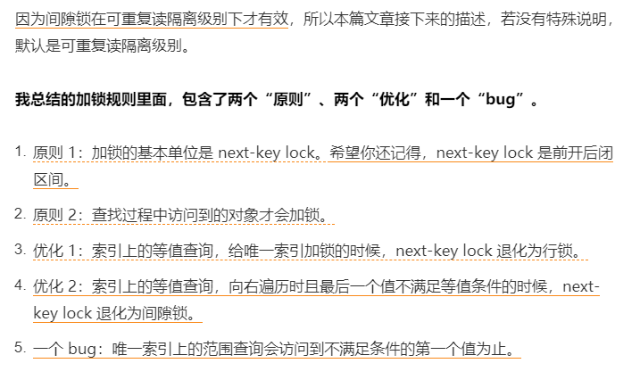
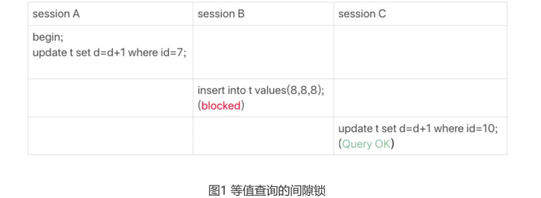
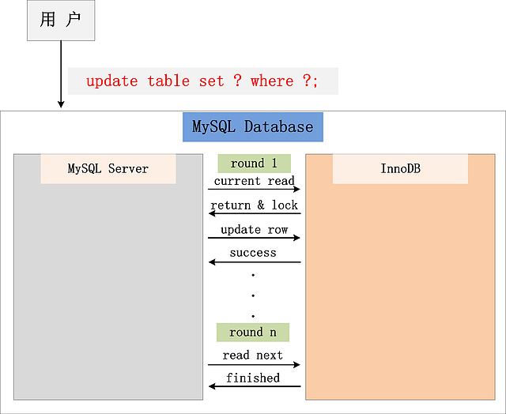

# Table of Contents

* [加锁规则](#加锁规则)
* [基础数据](#基础数据)
* [第一个案例:等值查询间隙锁](#第一个案例等值查询间隙锁)
* [mysql读会加s锁吗，什么时候加读s锁？什么时候加X锁](#mysql读会加s锁吗什么时候加读s锁什么时候加x锁)
* [参考资料](#参考资料)


# 加锁规则

**以下默认隔离级别为RR**


加间隙锁的规则(引用自林晓斌老师的mysql实战45讲):




---

1、查询过程中**访问到的对象才会加锁**，而加锁的基本单位是next-key lock（前开后闭）；

2、等值查询上MySQL的优化：索引上的等值查询，如果是唯一索引，next-key lock会退化为行锁，如果不是唯一索引，需要访问到第一个不满足条件的值，此时next-key lock会退化为间隙锁；

3、范围查询：无论是否是唯一索引，**范围查询都需要访问到不满足条件的第一个值为止；**

---

# 基础数据

```mysql
CREATE TABLE `t` (
 `id` int(11) NOT NULL,
 `c` int(11) DEFAULT NULL,
 `d` int(11) DEFAULT NULL,
 PRIMARY KEY (`id`),
 KEY `c` (`c`)
) ENGINE=InnoDB;
insert into t values(0,0,0),(5,5,5),
(10,10,10),(15,15,15),(20,20,20),(25,25,25);
```


# 第一个案例:等值查询间隙锁




由于表t中没有id=7的记录，所以用我们上面提到的加锁规则判断一下的话：
1. 根据原则1，加锁单位是next-key lock，session A加锁范围就是(5,10]；

   > 因为数据库只有 5 10 所以为（5,10]

2. 同时根据优化2，这是一个等值查询(id=7)，而id=10不满足查询条件，next-key lock退化
  成间隙锁，因此最终加锁的范围是(5,10)。
  所以，session B要往这个间隙里面插入id=8的记录会被锁住，但是session C修改id=10这行
  是可以的。


# mysql读会加s锁吗，什么时候加读s锁？什么时候加X锁

Mysql的普通select是不会加s锁的

SELECT ... LOCK IN SHARE MODE的语句才会加s锁。我们平常用的mvcc是不会加s的，因为mvcc就是为了避免读写互斥才出来的。

所以我们说的加s锁的前提是，**当前读。**　


在一个支持MVCC并发控制的系统中，哪些读操作是快照读？哪些操作又是当前读呢？以MySQL InnoDB为例：

快照读：简单的select操作，属于快照读，不加锁。(当然，也有例外，下面会分析)

select * from table where ?;

当前读：特殊的读操作，插入/更新/删除操作，属于当前读，需要加锁。　　

select * from table where ? lock in share mode;

select * from table where ? for update;

insert into table values (…);

update table set ? where ?;

delete from table where ?;

所有以上的语句，都属于当前读，读取记录的最新版本。并且，读取之后，还需要保证其他并发事务不能修改当前记录，对读取记录加锁。其中，除了第一条语句，对读取记录加S锁 (共享锁)外，其他的操作，都加的是X锁 (排它锁)。


> 注意！！ 加锁要看目的，我们为什么要加锁？读读 读写 写写


　　为什么将 插入/更新/删除 操作，都归为当前读？可以看看下面这个 更新 操作，在数据库中的执行流程：



从图中，可以看到，一个Update操作的具体流程。当Update SQL被发给MySQL后，MySQL Server会根据where条件，读取第一条满足条件的记录，然后InnoDB引擎会将第一条记录返回，并加锁 (current read)。待MySQL Server收到这条加锁的记录之后，会再发起一个Update请求，更新这条记录。一条记录操作完成，再读取下一条记录，直至没有满足条件的记录为止。因此，Update操作内部，就包含了一个当前读。同理，Delete操作也一样。Insert操作会稍微有些不同，简单来说，就是Insert操作可能会触发Unique Key的冲突检查，也会进行一个当前读。


# 参考资料

+ https://www.cnblogs.com/tutar/p/5878651.html
+ https://zhuanlan.zhihu.com/p/214177479
