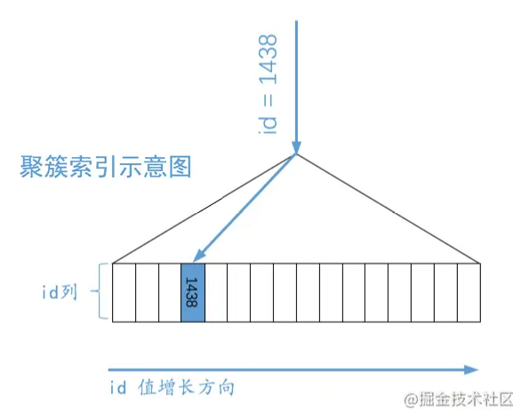
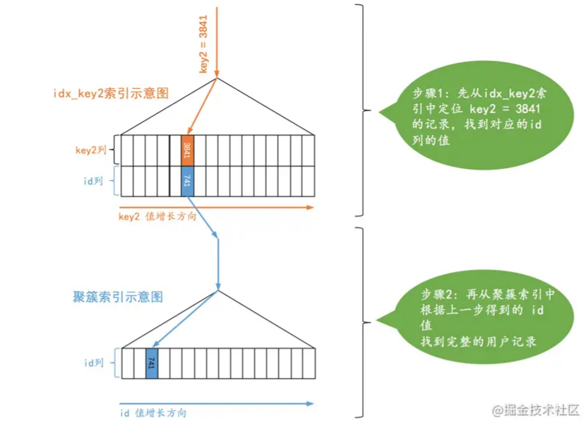
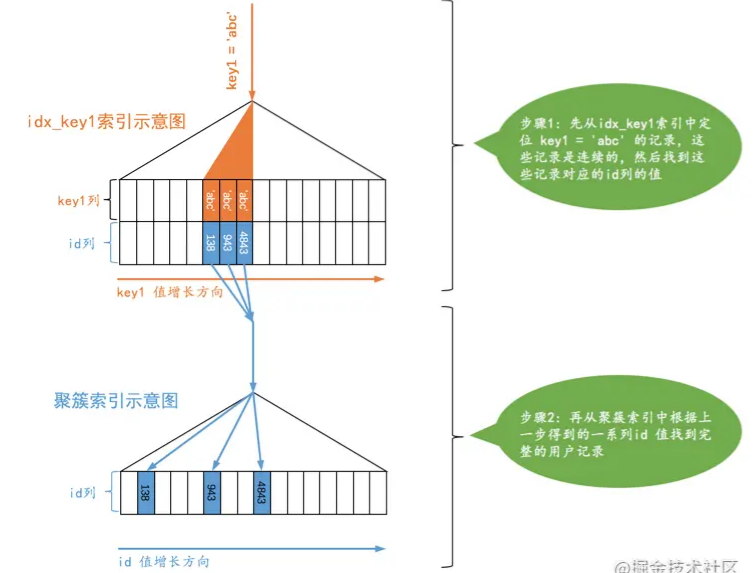
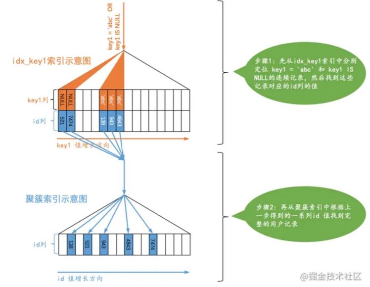

# Table of Contents

* [准备数据](#准备数据)
* [查询方式](#查询方式)
* [const](#const)
* [ref](#ref)
  * [需要注意的情况](#需要注意的情况)
  * [ref_or_null](#ref_or_null)
* [range](#range)
  * [明确range访问方法使用的范围区间](#明确range访问方法使用的范围区间)
* [index](#index)
* [all](#all)
* [索引合并(优化)](#索引合并优化)
  * [二级索引+回表](#二级索引回表)
  * [Intersection合并](#intersection合并)
  * [Union合并](#union合并)
  * [Sort-Union合并](#sort-union合并)
* [总结](#总结)


> 关于这一章，可以直接看总结


# 准备数据

```java
CREATE TABLE single_table (
    id INT NOT NULL AUTO_INCREMENT,
    key1 VARCHAR(100),
    key2 INT,
    key3 VARCHAR(100),
    key_part1 VARCHAR(100),
    key_part2 VARCHAR(100),
    key_part3 VARCHAR(100),
    common_field VARCHAR(100),
    PRIMARY KEY (id),
    KEY idx_key1 (key1),
    UNIQUE KEY idx_key2 (key2),
    KEY idx_key3 (key3),
    KEY idx_key_part(key_part1, key_part2, key_part3)
) Engine=InnoDB CHARSET=utf8;
```

我们为这个`single_table`表建立了1个聚簇索引和4个二级索引，分别是：

- 为`id`列建立的聚簇索引。
- 为`key1`列建立的`idx_key1`二级索引。
- 为`key2`列建立的`idx_key2`二级索引，而且该索引是唯一二级索引。
- 为`key3`列建立的`idx_key3`二级索引。
- 为`key_part1`、`key_part2`、`key_part3`列建立的`idx_key_part`二级索引，这也是一个联合索引。


# 查询方式

MySQL把查询的执行方式大致分为下边两种：

- 使用全表扫描进行查询
- 使用索引进行查询
  - 针对主键或唯一二级索引的等值查询
  - 针对普通二级索引的等值查询
  - 针对索引列的范围查询
  - 直接扫描整个索引


# const

可以通过主键列来定位一条记录

```java
SELECT * FROM single_table WHERE id = 1438;
```



我们根据唯一二级索引列来定位一条记录的速度也是贼快的，比如下边这个查询：

```
SELECT * FROM single_table WHERE key2 = 3841;
```

这个查询的执行过程的示意图就是这样：




> 通过主键或者唯一二级索引列与常数的等值比较来定位一条记录定义为：`const`


# ref


对某个普通的二级索引列与常数进行等值比较

```mysql
SELECT * FROM single_table WHERE key1 = 'abc';
```

由于普通二级索引并不限制索引列值的唯一性，所以可能找到多条对应的记录,采用二级索引来执行查询的访问方法称为：`ref`




## 需要注意的情况


- 二级索引列值为`NULL`的情况

  不论是普通的二级索引，还是唯一二级索引，它们的索引列对包含`NULL`值的数量并不限制，所以我们采用`key IS NULL`这种形式的搜索条件最多只能使用`ref`的访问方法，而不是`const`的访问方法。
  
  > 对于Mysql,null值是不确定的值，是可以存储多个的

+ 对于某个包含多个索引列的二级索引来说，只要是**最左边的连续索引列是与常数的等值比较**就可能采用`ref`的访问方法


##  ref_or_null

有时候我们不仅想找出某个二级索引列的值等于某个常数的记录，还想把该列的值为`NULL`的记录也找出来，就像下边这个查询：

```mysql
SELECT * FROM single_table WHERE key1 = 'abc' OR key1 IS NULL;
```




# range

```mysql
SELECT * FROM single_table WHERE key2 IN (1438, 6328) OR (key2 >= 38 AND key2 <= 79);
```

索引列需要匹配某个或某些范围的值

`key2`列的值只要匹配下列3个范围中的任何一个就算是匹配成功了：

- `key2`的值是`1438`
- `key2`的值是`6328`
- `key2`的值在`38`和`79`之间。

设计`MySQL`的大叔把这种利用索引进行范围匹配的访问方法称之为：`range`

也就是从数学的角度看，每一个所谓的范围都是数轴上的一个`区间`，3个范围也就对应着3个区间：

- 范围1：`key2 = 1438`
- 范围2：`key2 = 6328`
- 范围3：`key2 ∈ [38, 79]`，注意这里是闭区间。

我们可以把那种索引列等值匹配的情况称之为`单点区间`，上边所说的`范围1`和`范围2`都可以被称为单点区间，像`范围3`这种的我们可以称为连续范围区间。


## 明确range访问方法使用的范围区间

其实对于`B+`树索引来说，只要索引列和常数使用`=`、`<=>`、`IN`、`NOT IN`、`IS NULL`、`IS NOT NULL`、`>`、`<`、`>=`、`<=`、`BETWEEN`、`!=`（不等于也可以写成`<>`）或者`LIKE`操作符连接起来，就可以产生一个所谓的`区间`。


> 区间过多，或者说区间以及单点区间过多，导致回表随机IO,有时候会放弃走索引。

# index

看下边这个查询：

```
SELECT key_part1, key_part2, key_part3 FROM single_table WHERE key_part2 = 'abc';
```

由于`key_part2`并不是联合索引`idx_key_part`最左索引列，所以我们无法使用`ref`或者`range`访问方法来执行这个语句。但是这个查询符合下边这两个条件：

- 它的查询列表只有3个列：`key_part1`, `key_part2`, `key_part3`，而索引`idx_key_part`又包含这三个列。
- 搜索条件中只有`key_part2`列。这个列也包含在索引`idx_key_part`中。

也就是说我们可以直接通过遍历`idx_key_part`索引的叶子节点的记录来比较`key_part2 = 'abc'`这个条件是否成立，把匹配成功的二级索引记录的`key_part1`, `key_part2`, `key_part3`列的值直接加到结果集中就行了。由于二级索引记录比聚簇索记录小的多（聚簇索引记录要存储所有用户定义的列以及所谓的隐藏列，而二级索引记录只需要存放索引列和主键），而且这个过程也不用进行回表操作，所以直接遍历二级索引比直接遍历聚簇索引的成本要小很多，设计`MySQL`的大叔就把

>  这种采用遍历二级索引记录的执行方式称之为：`index`。
> 通俗的讲就是遍历二级索引，然后匹配二级索引中的某个值，是index


+ 这里要注意，如果将查询的列改为`SELECT * FROM single_table WHERE key_part2 = 'abc';` 那是什么？ all


# all

就是全表扫描了，这种效率是最低的。

# 索引合并(优化)


> 就是 为了优化回表前主键id的顺序，避免产生大量的随机IO

##  二级索引+回表

<font color=red>一般情况下只能利用单个二级索引执行查询</font>

```
SELECT * FROM single_table WHERE key1 = 'abc' AND key2 > 1000;
```

查询优化器会识别到这个查询中的两个搜索条件：

- `key1 = 'abc'`
- `key2 > 1000`

优化器一般会根据`single_table`表的统计数据来判断到底使用**哪个条件到对应的二级索引中查询扫描的行数会更少**，选择那个扫描行数较少的条件到对应的二级索引中查询。

假设优化器决定使用`idx_key1`索引进行查询

- 步骤1：使用二级索引定位记录的阶段，也就是根据条件`key1 = 'abc'`从`idx_key1`索引代表的`B+`树中找到对应的二级索引记录。
- 步骤2：回表阶段，也就是根据上一步骤中找到的记录的**主键值进行`回表`操作**，也就是到聚簇索引中找到对应的完整的用户记录，再根据**条件`key2 > 1000`到完整的用户记录**继续过滤。将最终符合过滤条件的记录返回给用户。


## Intersection合并


某个查询可以使用多个二级索引，将从多个二级索引中查询到的结果取交集，然后再去回表。


> 大家想一想，取交集的目的是什么？是为了能拿到有序的主键id`快速`回表！


`MySQL`在某些特定的情况下才可能会使用到`Intersection`索引合并：

- 情况一：<font color=red>二级索引列是等值匹配的情况，对于联合索引来说，在联合索引中的每个列都必须等值匹配，不能出现只匹配部分列的情况</font>。

  比方说下边这个查询可能用到`idx_key1`和`idx_key_part`这两个二级索引进行`Intersection`索引合并的操作：

  ```
  SELECT * FROM single_table WHERE key1 = 'a' AND key_part1 = 'a' AND key_part2 = 'b' AND key_part3 = 'c';
  ```

  而下边这两个查询就不能进行`Intersection`索引合并：

  ```
  SELECT * FROM single_table WHERE key1 > 'a' AND key_part1 = 'a' AND key_part2 = 'b' AND key_part3 = 'c';
  
  SELECT * FROM single_table WHERE key1 = 'a' AND key_part1 = 'a';
  ```

  第一个查询是因为对`key1`进行了范围匹配，第二个查询是因为联合索引`idx_key_part`中的`key_part2`和`key_part3`列并没有出现在搜索条件中，所以这两个查询不能进行`Intersection`索引合并。

+ 情况二：主键列可以是范围匹配

  比方说下边这个查询可能用到主键和`idx_key1`进行`Intersection`索引合并的操作：

```
SELECT * FROM single_table WHERE id > 100 AND key1 = 'a';
```

如果从各个二级索引中查询出的结果集并不是按照主键排序的话，那就要先把结果集中的主键值排序完再来做上边的那个过程，就比较耗时了。


>  按照有序的主键值去回表取记录有个专有名词儿，叫：Rowid Ordered Retrieval，简称ROR，以后大家在某些地方见到这个名词儿就眼熟了。


## Union合并

`ntersection`是交集的意思，这适用于使用不同索引的搜索条件之间使用`AND`连接起来的情况；

`Union`是并集的意思，适用于使用不同索引的搜索条件之间使用`OR`连接起来的情况。与`Intersection`索引合并类似，`MySQL`在某些特定的情况下才可能会使用到`Union`索引合并：


情况和交集一样


## Sort-Union合并


`Union`索引合并的使用条件太苛刻，必须保证各个二级索引列在进行等值匹配的条件下才可能被用到，比方说下边这个查询就无法使用到`Union`索引合并：

```
SELECT * FROM single_table WHERE key1 < 'a' OR key3 > 'z'
```

这是因为根据`key1 < 'a'`从`idx_key1`索引中获取的二级索引记录的主键值不是排好序的，根据`key3 > 'z'`从`idx_key3`索引中获取的二级索引记录的主键值也不是排好序的，但是`key1 < 'a'`和`key3 > 'z'`这两个条件又特别让我们动心，所以我们可以这样：

- 先根据`key1 < 'a'`条件从`idx_key1`二级索引中获取记录，并按照记录的主键值进行排序
- 再根据`key3 > 'z'`条件从`idx_key3`二级索引中获取记录，并按照记录的主键值进行排序
- 因为上述的两个二级索引主键值都是排好序的，剩下的操作和`Union`索引合并方式就一样了。

我们把上述这种

<font color=red>先按照二级索引记录的主键值进行排序，之后按照`Union`索引合并方式执行的方式称之为`Sort-Union`索引合并</font>，

很显然，这种`Sort-Union`索引合并比单纯的`Union`索引合并多了一步对二级索引记录的主键值排序的过程。


# 总结

1. const 通过主键或者唯一二级索引列 等值查询
2.  ref 普通二级索引等值查询，然后回表；
3. ref_or_null ，ref 基础上查询null 值 
4. range 任意索引 in()，或者范围查找 
5. index，遍历二级索引全部记录 
6. all，全表扫描
7. 索引合并：对二级索引进行处理，得到有序的主键id，然后回表
