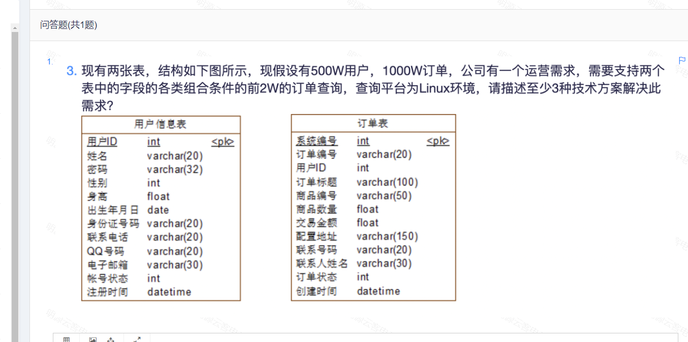

# Table of Contents

* [sql相关](#sql相关)
  * [exists](#exists)
  * [Group By](#group-by)
* [500W数据初始30S优化后1s](#500w数据初始30s优化后1s)
* [Mybatis中更新Mysql时间多了一秒](#mybatis中更新mysql时间多了一秒)
* [优先级条件，怎么建立索引?](#优先级条件怎么建立索引)
* [死锁问题](#死锁问题)


# sql相关

## exists
exists存在主要是代替in不走索引的问题

```mysql
select *
from tt_send_place_box a
where exists(select a.send_job_task_id
             from tt_send_place_box b
             where b.box_no = 'PAG40005O3'
               and b.send_job_task_id = '3202111282356099'
              #  查询完 是要匹配的
               and a.send_job_task_id = b.send_job_task_id
          );
```


## Group By


分组后，取第一条或者最后一天数据数据，

+ 方法一

```mysql
select send_task_id, max(operation_flag) as operation_flag
from ti_send_get_task
where icreate_tm > '2021-12-01'
group by send_task_id;
```

+ 方法二

```mysql
select *
from (select *
      from ti_send_get_task
      where icreate_tm > '2021-11-01'
      order by icreate_tm desc) tt
group by tt.send_task_id;

```


>  问题来了，如果我要取倒数第二条数据呢？


提供一种解决思路，用limit来解决，不过不知道效率怎么样。

```java
//取第一条数据后的 1条数据
select *
from ti_send_get_task where send_task_id='2202110312317272' limit 1,1;

```


# 500W数据初始30S优化后1s


# Mybatis中更新Mysql时间多了一秒

今天遇到代码生成的时间，更新到mysql时，多出一秒，

这是因为mysql的数据类型为datetime

当创建时间是2020-04-25 22:30:50.771，毫秒被四舍五入为2020-04-25 22:30:51

解决：

+ 将mysql时间类型改为datetime(3)【建议】
+ java传入时间，去掉毫秒值。


# 优先级条件，怎么建立索引?

背景：查询一个数据，数据量大概500W左右，但是查询条件多样化

条件1：A+B+C+D+E

条件2：F+A+N+D+E

条件3：D+F+C+D+E

等等

条件1有直接返回，否则条件2，依次类推。


解决方案：

**在存储数据的时候，多建立一个字段，满足条件1就存条件1的值，依次类推。建立hash索引。**

查询直接匹配即可。


# 死锁问题

[死锁问题](死锁问题分析.md)


# N中组合条件查询怎么做？

