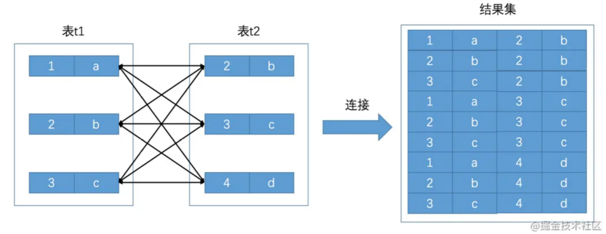
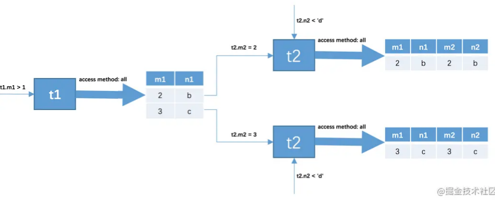
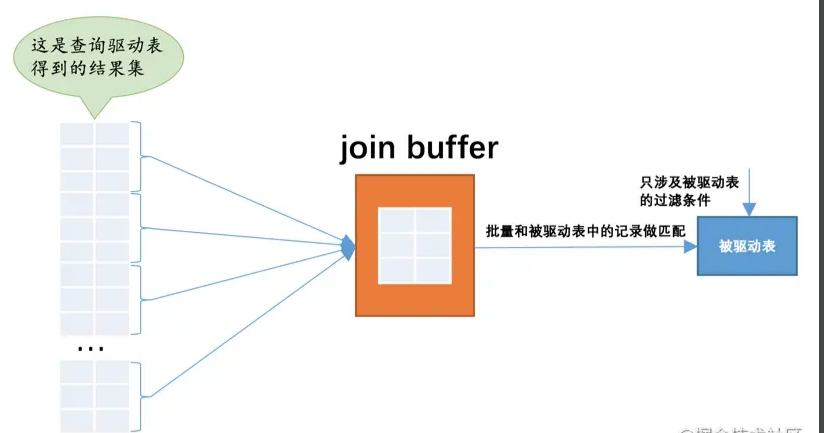

# Table of Contents

* [连接本质](#连接本质)
* [连接过程简介](#连接过程简介)
* [连接类型](#连接类型)
* [连接的原理](#连接的原理)
  * [嵌套循环连接（Nested-Loop Join）](#嵌套循环连接nested-loop-join)
  * [使用索引加快连接速度](#使用索引加快连接速度)
  * [基于块的嵌套循环连接（Block Nested-Loop Join）](#基于块的嵌套循环连接block-nested-loop-join)
* [总结](#总结)


搞数据库一个避不开的概念就是`Join`，翻译成中文就是`连接`。日常工作中基本都是多表查询。


# 连接本质

`连接`的本质就是把各个连接表中的记录都取出来依次匹配的组合加入结果集并返回给用户。




连接查询的结果集中包含一个表中的每一条记录与另一个表中的每一条记录相互匹配的组合，像这样的结果集就可以称之为`笛卡尔积`


# 连接过程简介


```mysql
SELECT * FROM t1, t2 WHERE t1.m1 > 1 AND t1.m1 = t2.m2 AND t2.n2 < 'd';
```

+ 首先确定第一个需要查询的表，这个表称之为`驱动表`，也就是t1
+ t1表中找满足t1.m1 > 1
+ 从驱动表产生的结果集中的每一条记录，分别需要到`t2`表中查找匹配的记录，所谓`匹配的记录`，指的是符合过滤条件的记录。
+ 两表连接查询中，驱动表只需要访问一次，被驱动表可能被访问多次。



# 连接类型

这个就不多说了

内连接 外连接 左连接 右连接 

就区分的就是 筛选条件放在on后面还是where后面 

# 连接的原理

##  嵌套循环连接（Nested-Loop Join）

```
for each row in t1 {   #此处表示遍历满足对t1单表查询结果集中的每一条记录
    
    for each row in t2 {   #此处表示对于某条t1表的记录来说，遍历满足对t2单表查询结果集中的每一条记录
    
        for each row in t3 {   #此处表示对于某条t1和t2表的记录组合来说，对t3表进行单表查询
            if row satisfies join conditions, send to client
        }
    }
}
```


> 一般都是使用小表*大表，可以减少连接次数
>
> a left join b 以a的次数为准 


这个过程就像是一个嵌套的循环，所以这种驱动表只访问一次，但被驱动表却可能被多次访问，访问次数取决于对驱动表执行单表查询后的结果集中的记录条数的连接执行方式称之为`嵌套循环连接`（`Nested-Loop Join`），这是最简单，也是最笨拙的一种连接查询算法。


## 使用索引加快连接速度


查询驱动表返回的数据，作为筛选条件去匹配被驱动表数据。我们可以对被驱动表添加`索引`来加快查询。


连接查询中对被驱动表使用主键值或者唯一二级索引列的值进行等值查找的查询执行方式称之为：`eq_ref`。


<font color=red>建议在真实工作中最好不要使用`*`作为查询列表，最好把真实用到的列作为查询列表</font>。回表随机IO伤不起 

## 基于块的嵌套循环连接（Block Nested-Loop Join）

当被驱动表中的数据非常多时，**每次访问被驱动表，被驱动表的记录会被加载到内存中**，在内存中的每一条记录只会和驱动表结果集的一条记录做匹配，之后就会被从内存中清除掉。然后再从驱动表结果集中拿出另一条记录，再一次把被驱动表的记录加载到内存中一遍，周而复始，**驱动表结果集中有多少条记录，就得把被驱动表从磁盘上加载到内存中多少次。**


> 总结就是边遍历边join，找到一条就join被驱动表 


所以我们可不可以在把被驱动表的记录加载到内存的时候，**一次性和多条驱动表中的记录**做匹配


`oin buffer`就是执行连接查询前申请的一块固定大小的内存，先把若干条驱动表结果集中的记录装在这个`join buffer`中，然后开始扫描被驱动表，每一条被驱动表的记录一次性和`join buffer`中的多条驱动表记录做匹配，因为匹配的过程都是在内存中完成的，所以这样可以显著减少被驱动表的`I/O`代价。



**最好的情况是`join buffer`足够大，能容纳驱动表结果集中的所有记录，这样只需要访问一次被驱动表就可以完成连接操作了。**设计`MySQL`的大叔把这种加入了`join buffer`的嵌套循环连接算法称之为`基于块的嵌套连接`（Block Nested-Loop Join）算法。

这个`join buffer`的大小是可以通过启动参数或者系统变量`join_buffer_size`进行配置，默认大小为`262144字节`（也就是`256KB`），最小可以设置为`128字节`。当然，对于优化被驱动表的查询来说，最好是为被驱动表加上效率高的索引，如果实在不能使用索引，并且自己的机器的内存也比较大可以尝试调大`join_buffer_size`的值来对连接查询进行优化。


> 经过测试 
> a left join b
>
> 1.b无索引  b BNL
>
> 2.b有索引  **a 是BNL B是NLJ **
>
> 也就是说 放入join buffer 有可能是**驱动表或者被驱动表**


# 总结

1. join就是求`笛卡尔积`
2. 左连接 右连接
3. 为了减少匹配次数，使用join buffer
