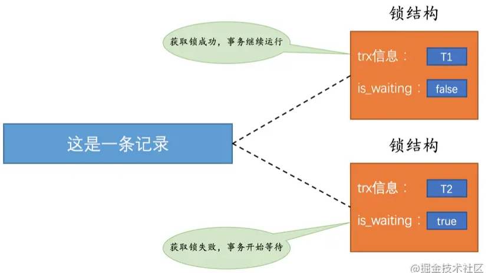
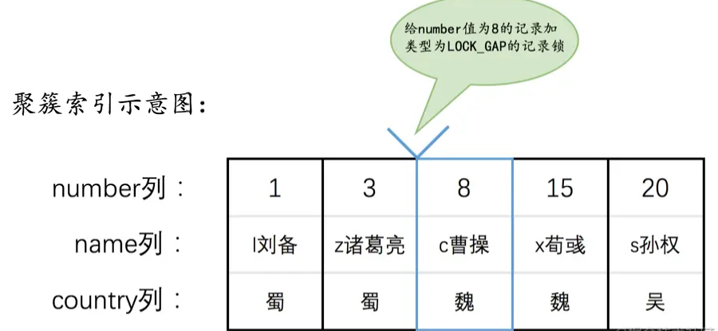
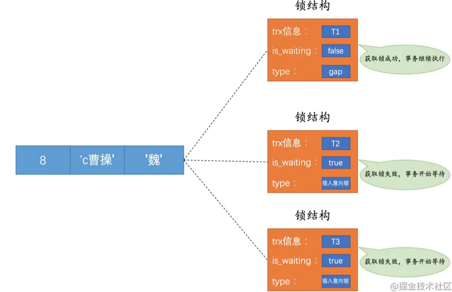
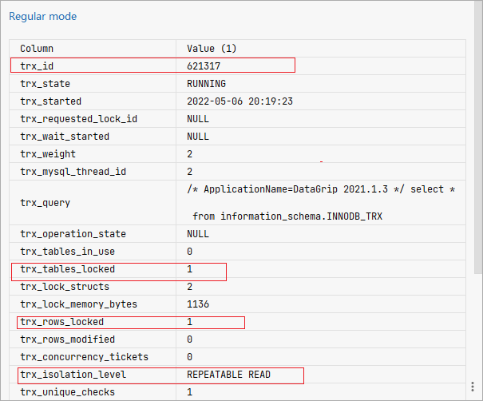
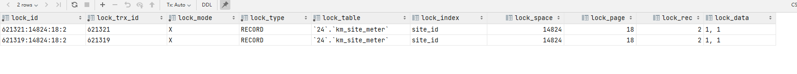
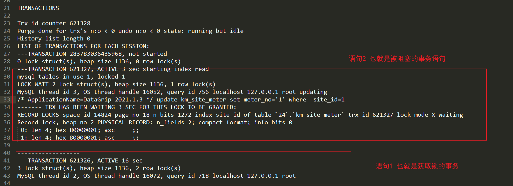

# Table of Contents

* [参考资料](#参考资料)
* [并发带来的几种情况](#并发带来的几种情况)
  * [读-读](#读-读)
  * [写-写](#写-写)
  * [读-写](#读-写)
* [一致性读（Consistent Reads）](#一致性读consistent-reads)
* [锁定读（Locking Reads）](#锁定读locking-reads)
  * [共享锁和独占锁](#共享锁和独占锁)
  * [锁定读的语句](#锁定读的语句)
* [写操作](#写操作)
* [表锁](#表锁)
* [意向锁](#意向锁)
* [元数据锁](#元数据锁)
* [InnoDB中的表级锁](#innodb中的表级锁)
* [InnoDB中的行级锁(重点)](#innodb中的行级锁重点)
  * [行锁 `Record lock `](#行锁-record-lock-)
  * [间隙锁`Gap Locks`](#间隙锁gap-locks)
  * [Next-Key Locks](#next-key-locks)
  * [插入意向锁LOCK_INSERT_INTENTION](#插入意向锁lock_insert_intention)
  * [隐式锁](#隐式锁)
* [如何查看事务加锁情况](#如何查看事务加锁情况)
  * [使用infomation_schema数据库中的表获取锁信息](#使用infomation_schema数据库中的表获取锁信息)
    * [**INNODB_TRX**](#innodb_trx)
    * [INNODB_LOCKS](#innodb_locks)
    * [INNODB_LOCK_WAITS](#innodb_lock_waits)
  * [使用show engine innodb status 命令(推荐)](#使用show-engine-innodb-status-命令推荐)
* [总结](#总结)
* [疑惑](#疑惑)


> 1. 重点了解怎么解决幻读的
> 2. 理解锁，其实要理解，为什么要加锁？ 
>    + 读：数据改不改无所谓 不用加
>    + 读：数据不能被改变 加
>    + 写：必须加


# 参考资料

[](https://mp.weixin.qq.com/s?__biz=MzUxODAzNDg4NQ==&mid=2247496932&idx=1&sn=5bd840a32040998aa60c6317ccad71ac&scene=21#wechat_redirect)


# 并发带来的几种情况

## 读-读

这种没啥说的，没啥问题

## 写-写

在这种情况下会发生`脏写`的问题，任何一种隔离级别都不允许这种问题的发生。所以在多个未提交事务相继对一条记录做改动时，需要让它们排队执行，这个排队的过程其实是通过`锁`来实现的

**这个所谓的`锁`其实是一个内存中的结构**，在事务执行前本来是没有锁的，也就是说一开始是没有`锁结构`和记录进行关联的

当一个事务想对这条记录做改动时，首先会看看内存中有没有与这条记录关联的`锁结构`，当没有的时候就会在内存中生成一个`锁结构`与之关联。比方说事务`T1`要对这条记录做改动，就需要生成一个`锁结构`与之关联：


其实在`锁结构`里有很多信息，不过为了简化理解，我们现在只把两个比较重要的属性拿了出来：

- `trx信息`：代表这个锁结构是哪个事务生成的。
- `is_waiting`：代表当前事务是否在等待。

如图所示，当事务`T1`改动了这条记录后，就生成了一个`锁结构`与该记录关联，因为之前没有别的事务为这条记录加锁，所以`is_waiting`属性就是`false`，我们把这个场景就称之为获取锁成功，或者加锁成功，然后就可以继续执行操作了。

在事务`T1`提交之前，另一个事务`T2`也想对该记录做改动，那么先去看看有没有`锁结构`与这条记录关联，发现有一个`锁结构`与之关联后，然后也生成了一个`锁结构`与这条记录关联，不过`锁结构`的`is_waiting`属性值为`true`，表示当前事务需要等待，我们把这个场景就称之为获取锁失败，或者加锁失败，或者没有成功的获取到锁，画个图表示就是这样：



在事务`T1`提交之后，就会把该事务生成的`锁结构`释放掉，然后看看还有没有别的事务在等待获取锁，发现了事务`T2`还在等待获取锁，所以把事务`T2`对应的锁结构的`is_waiting`属性设置为`false`，然后把该事务对应的线程唤醒，让它继续执行，此时事务`T2`就算获取到锁了。效果图就是这样：


## 读-写

方案一：读操作利用多版本并发控制（`MVCC`），写操作进行`加锁`。

方案二：读、写操作都采用`加锁`的方式。

很明显，采用`MVCC`方式的话，`读-写`操作彼此并不冲突，性能更高，采用`加锁`方式的话，`读-写`操作彼此需要排队执行，影响性能。一般情况下我们当然愿意采用`MVCC`来解决`读-写`操作并发执行的问题，但是业务在某些特殊情况下，要求必须采用`加锁`的方式执行，那也是没有办法的事。


# 一致性读（Consistent Reads）

事务利用`MVCC`进行的读取操作称之为`一致性读`，或者`一致性无锁读`，有的地方也称之为`快照读`。所有普通的`SELECT`语句（`plain SELECT`）在`READ COMMITTED`、`REPEATABLE READ`隔离级别下都算是`一致性读`，比方说：

```
SELECT * FROM t;
SELECT * FROM t1 INNER JOIN t2 ON t1.col1 = t2.col2
```

`一致性读`并不会对表中的任何记录做`加锁`操作，其他事务可以自由的对表中的记录做改动。


# 锁定读（Locking Reads）


## 共享锁和独占锁

- `共享锁`，英文名：`Shared Locks`，简称`S锁`。在**事务**要**读取一条记录**时，需要先获取该记录的`S锁`。
- `独占锁`，也常称`排他锁`，英文名：`Exclusive Locks`，简称`X锁`。在事务要**改动一条记录**时，需要先获取该记录的`X锁`。

所以我们说`S锁`和`S锁`是兼容的，`S锁`和`X锁`是不兼容的，`X锁`和`X锁`也是不兼容的，画个表表示一下就是这样：

| 兼容性 | `X`    | `S`    |
| ------ | ------ | ------ |
| `X`    | 不兼容 | 不兼容 |
| `S`    | 不兼容 | 兼容   |

##  锁定读的语句

为此设计`MySQL`的大叔提出了两种比较特殊的`SELECT`语句格式：

- 对读取的记录加`S锁`：

  ```mysql
  SELECT ... LOCK IN SHARE MODE;
  ```

- 对读取的记录加`X锁`：

  ```mysql
  SELECT ... FOR UPDATE;
  ```

  

# 写操作

平常所用到的`写操作`无非是`DELETE`、`UPDATE`、`INSERT`这三种：

+ `INSERT`：

  一般情况下，新插入一条记录的操作并不加锁，设计`InnoDB`的大叔通过一种称之为`隐式锁`的东东来保护这条新插入的记录在本事务提交前不被别的事务访问

+ `DELETE`：

  对一条记录做`DELETE`操作的过程其实是先在`B+`树中定位到这条记录的位置，然后获取一下这条记录的`X锁`，然后再执行`delete mark`操作。我们也可以把这个定位待删除记录在`B+`树中位置的过程看成是一个获取`X锁`的`锁定读`。

+ `UPDATE`：

  在对一条记录做`UPDATE`操作时分为三种情况：

  - 如果未修改该记录的键值并且被更新的列占用的存储空间在修改前后未发生变化，则先在`B+`树中定位到这条记录的位置，然后再获取一下记录的`X锁`，最后在原记录的位置进行修改操作。其实我们也可以把这个定位待修改记录在`B+`树中位置的过程看成是一个获取`X锁`的`锁定读`。

  - 如果未修改该记录的键值并且至少有一个被更新的列占用的存储空间在修改前后发生变化，则先在`B+`树中定位到这条记录的位置，然后获取一下记录的`X锁`，**将该记录彻底删除掉**（就是把记录彻底移入垃圾链表），最后再插入一条新记录。这个定位待修改记录在`B+`树中位置的过程看成是一个获取`X锁`的`锁定读`，新插入的记录由`INSERT`操作提供的`隐式锁`进行保护。

    > 这种情况还没理解，为什么要彻底删除？

  - 如果修改了该记录的键值，则相当于在原记录上做`DELETE`操作之后再来一次`INSERT`操作，加锁操作就需要按照`DELETE`和`INSERT`的规则进行了。


# 表锁

我们前边提到的`锁`都是针对记录的，也可以被称之为`行级锁`或者`行锁`，对一条记录加锁影响的也只是这条记录而已，我们就说这个锁的粒度比较细；其实一个事务也可以在`表`级别进行加锁，自然就被称之为`表级锁`或者`表锁`，对一个表加锁影响整个表中的记录，我们就说这个锁的粒度比较粗。


给表加的锁也可以分为`共享锁`（`S锁`）和`独占锁`（`X锁`）：

- 给表加`S锁`：

  如果一个事务给表加了`S锁`，那么：

  - 别的事务可以继续获得该表的`S锁`
  - 别的事务可以继续获得该表中的某些记录的`S锁`
  - 别的事务不可以继续获得该表的`X锁`
  - 别的事务不可以继续获得该表中的某些记录的`X锁`

- 给表加`X锁`：

  如果一个事务给表加了`X锁`（意味着该事务要独占这个表），那么：

  - 别的事务不可以继续获得该表的`S锁`
  - 别的事务不可以继续获得该表中的某些记录的`S锁`
  - 别的事务不可以继续获得该表的`X锁`
  - 别的事务不可以继续获得该表中的某些记录的`X锁`


# 意向锁

在存在行级锁和表级锁的情况下，事务 T 想要对表 A 加 X 锁，就需要先检测是否有其它事务对表 A 或者表 A 中的任意一行加了锁，那么就需要对表 A 的每一行都检测一次，这是非常耗时的。

意向锁在原来的 X/S 锁之上引入了 IX/IS，IX/IS 都是表锁，用来表示一个事务想要在表中的某个数据行上加 X 锁或 S 锁。有以下两个规定:

- 一个事务在获得某个数据行对象的 S 锁之前，必须先获得表的 IS 锁或者更强的锁；
- 一个事务在获得某个数据行对象的 X 锁之前，必须先获得表的 IX 锁。

通过引入意向锁，事务 T 想要对表 A 加 X 锁，只需要先检测是否有其它事务对表 A 加了 X / IX / S / IS 锁，如果加了就表示有其它事务正在使用这个表或者表中某一行的锁，因此事务 T 加 X 锁失败。

<font color=red>首先明确并存的概念是指数据库同时支持表、行锁，而不是任何情况都支持一个表中同时有一个事务A持有行锁、又有一个事务B持有表锁，因为表一旦被上了一个表级的写锁，肯定不能再上一个行级的锁。</font>


> 行锁就是教室里面的一排排桌子
>
> 表锁就是一间间教室
>
> 意向锁就是教学楼


总结一下：IS、IX锁是表级锁，它们的提出仅仅为了在之后加表级别的S锁和X锁时可以**快速判断表中的记录是否被上锁，以避免用遍历的方式来查看表中有没有上锁的记录，也就是说其实IS锁和IX锁是兼容的，IX锁和IX锁是兼容的**。我们画个表来看一下表级别的各种锁的兼容性：

| 兼容性 | `X`    | `IX`   | `S`    | `IS`   |
| ------ | ------ | ------ | ------ | ------ |
| `X`    | 不兼容 | 不兼容 | 不兼容 | 不兼容 |
| `IX`   | 不兼容 | 兼容   | 不兼容 | 兼容   |
| `S`    | 不兼容 | 不兼容 | 兼容   | 兼容   |
| `IS`   | 不兼容 | 兼容   | 兼容   | 兼容   |


> 意向锁就是为了解决加锁时，表锁找行锁带来的带来的开销，加了一个标志位，不是正则的锁。
>
> 所以，**意向锁的目的是为了快速判断表里是否有记录被加锁**。


# 元数据锁

再来说说**元数据锁（MDL）**。

我们不需要显示的使用 MDL，因为当我们对数据库表进行操作时，会自动给这个表加上 MDL：

- 对一张表进行 CRUD 操作时，加的是 **MDL 读锁**；
- 对一张表做结构变更操作的时候，加的是 **MDL 写锁**；

MDL 是为了保证当用户对表执行 CRUD 操作时，防止其他线程对这个表结构做了变更。

当有线程在执行 select 语句（ 加 MDL 读锁）的期间，如果有其他线程要更改该表的结构（ 申请 MDL 写锁），那么将会被阻塞，直到执行完 select 语句（ 释放 MDL 读锁）。

反之，当有线程对表结构进行变更（ 加 MDL 写锁）的期间，如果有其他线程执行了 CRUD 操作（ 申请 MDL 读锁），那么就会被阻塞，直到表结构变更完成（ 释放 MDL 写锁）。

> MDL 不需要显示调用，那它是在什么时候释放的?

MDL 是在事务提交后才会释放，这意味着**事务执行期间，MDL 是一直持有的**。

那如果数据库有一个长事务（所谓的长事务，就是开启了事务，但是一直还没提交），那在对表结构做变更操作的时候，可能会发生意想不到的事情，比如下面这个顺序的场景：

1. 首先，线程 A 先启用了事务（但是一直不提交），然后执行一条 select 语句，此时就先对该表加上 MDL 读锁；
2. 然后，线程 B 也执行了同样的 select 语句，此时并不会阻塞，因为「读读」并不冲突；
3. 接着，线程 C 修改了表字段，此时由于线程 A 的事务并没有提交，也就是 MDL 读锁还在占用着，这时线程 C 就无法申请到 MDL 写锁，就会被阻塞，

那么在线程 C 阻塞后，后续有对该表的 select 语句，就都会被阻塞，如果此时有大量该表的 select 语句的请求到来，就会有大量的线程被阻塞住，这时数据库的线程很快就会爆满了。

> 为什么线程 C 因为申请不到 MDL 写锁，而导致后续的申请读锁的查询操作也会被阻塞？

这是因为申请 MDL 锁的操作会形成一个队列，队列中**写锁获取优先级高于读锁**，一旦出现 MDL 写锁等待，会阻塞后续该表的所有 CRUD 操作。

所以为了能安全的对表结构进行变更，在对表结构变更前，先要看看数据库中的长事务，是否有事务已经对表加上了 MDL 读锁，如果可以考虑 kill 掉这个长事务，然后再做表结构的变更。

# InnoDB中的表级锁


> 一般不会用到，相当鸡肋。
>
> DDL语句也会发生阻塞，但是由MDL(元数据锁)导致的
>
> auto_inc锁，这个可以关注下


+ 表级别的`S锁`、`X锁`

  在对某个表执行`SELECT`、`INSERT`、`DELETE`、`UPDATE`语句时，`InnoDB`存储引擎是不会为这个表添加表级别的`S锁`或者`X锁`的。

  另外，在对某个表执行一些诸如`ALTER TABLE`、`DROP TABLE`**这类的`DDL`语句**时，其他事务对这个表并发执行诸如`SELECT`、`INSERT`、`DELETE`、`UPDATE`的语句会发生阻塞，同理，某个事务中对某个表执行`SELECT`、`INSERT`、`DELETE`、`UPDATE`语句时，在其他会话中对这个表执行`DDL`语句也会发生阻塞。这个过程其实**是通过在`server层`使用一种称之为`元数据锁`（英文名：`Metadata Locks`，简称`MDL`）东东来实现的**，一般情况下也不会使用`InnoDB`存储引擎自己提供的表级别的`S锁`和`X锁`。

  其实这个`InnoDB`存储引擎提供的表级`S锁`或者`X锁`是相当鸡肋，只会在一些特殊情况下，比方说崩溃恢复过程中用到。不过我们还是可以手动获取一下的，比方说在系统变量`autocommit=0，innodb_table_locks = 1`时，手动获取`InnoDB`存储引擎提供的表`t`的`S锁`或者`X锁`可以这么写：

  - `LOCK TABLES t READ`：`InnoDB`存储引擎会对表`t`加表级别的`S锁`。
  - `LOCK TABLES t WRITE`：`InnoDB`存储引擎会对表`t`加表级别的`X锁`。

  不过请尽量避免在使用`InnoDB`存储引擎的表上使用`LOCK TABLES`这样的手动锁表语句，它们并不会提供什么额外的保护，只是会降低并发能力而已。`InnoDB`的厉害之处还是实现了更细粒度的行锁，关于表级别的`S锁`和`X锁`大家了解一下就罢了。

+ 表级别的`IS锁`、`IX锁`

  当我们在对使用`InnoDB`存储引擎的表的某些记录加`S锁`之前，那就需要先在表级别加一个`IS锁`，当我们在对使用`InnoDB`存储引擎的表的某些记录加`X锁`之前，那就需要先在表级别加一个`IX锁`。`IS锁`和`IX锁`的使命只是为了后续在加表级别的`S锁`和`X锁`时判断表中是否有已经被加锁的记录，以避免用遍历的方式来查看表中有没有上锁的记录

+ 表级别的`AUTO-INC锁`

  在使用`MySQL`过程中，我们可以为表的某个列添加`AUTO_INCREMENT`属性，之后在插入记录时，可以不指定该列的值，系统会自动为它赋上递增的值，比方说我们有一个表：

  ```
  CREATE TABLE t (
      id INT NOT NULL AUTO_INCREMENT,
      c VARCHAR(100),
      PRIMARY KEY (id)
  ) Engine=InnoDB CHARSET=utf8;
  ```

  由于这个表的`id`字段声明了`AUTO_INCREMENT`，也就意味着在书写插入语句时不需要为其赋值，目前是由2中方式

  + 采用`AUTO-INC`锁，也就是在执行插入语句时就在表级别加一个`AUTO-INC`锁，然后为每条待插入记录的`AUTO_INCREMENT`修饰的列分配递增的值，在该语句执行结束后，再把`AUTO-INC`锁释放掉。<font color=red>注意并不是事务结束，而是语句结束</font>

  + 采用一个轻量级的锁，在为插入语句生成`AUTO_INCREMENT`修饰的列的值时获取一下这个轻量级锁，然后生成本次插入语句需要用到的`AUTO_INCREMENT`列的值之后，就把该轻量级锁释放掉，并不需要等到整个插入语句执行完才释放锁。


> 那么一般采用轻量级锁的方式对`AUTO_INCREMENT`修饰的列进行赋值。这种方式可以避免锁定表，可以提升插入性能。
> 因为轻量级锁，只生成对应值，并不锁表。
>

+ 注意

  设计InnoDB的大叔提供了一个称之为innodb_autoinc_lock_mode的系统变量来控制到底使用上述两种方式中的哪种来为AUTO_INCREMENT修饰的列进行赋值，

  当innodb_autoinc_lock_mode值为0时，一律采用AUTO-INC锁；

  当innodb_autoinc_lock_mode值为2时，一律采用轻量级锁；

  当innodb_autoinc_lock_mode值为1时，两种方式混着来（也就是在插入记录数量确定时采用轻量级锁，不确定时使用AUTO-INC锁）。

  不过当innodb_autoinc_lock_mode值为2时，可能会造成不同事务中的插入语句为AUTO_INCREMENT修饰的列生成的值是交叉的，在有主从复制的场景中是不安全的。

> Q：不都是在master写吗，为什么出现生成的值是交叉的？
> A：基于语句的主从复制，是不会复制id过去的，


# InnoDB中的行级锁(重点)


> `行锁`，也称为`记录锁`，顾名思义就是在记录上加的锁。行锁的类型比较多。


##  行锁 `Record lock `

  锁定一个记录上的索引，而不是记录本身。

  如果表没有设置索引，InnoDB 会自动在主键上创建隐藏的聚簇索引，因此 Record Locks 依然可以使用。

## 间隙锁`Gap Locks`

左开右开

  锁定索引之间的间隙，但是不包含索引本身。开区间



如图中为`number`值为`8`的记录加了`gap锁`，意味着**不允许别的事务在`number`值为`8`的记录前边的`间隙`插入新记录**，其实就是`number`列的值`(3, 8)`这个区间的新记录是不允许立即插入的。

> `gap锁`的作用仅仅是为了防止插入幻影记录的而已。


<font color=red>不知道大家发现了一个问题没，给一条记录加了`gap锁`只是不允许其他事务往这条记录前边的间隙插入新记录，那对于最后一条记录之后的间隙，也就是`hero`表中`number`值为`20`的记录之后的间隙该咋办呢</font>

`数据页`时介绍的两条伪记录了：

- `Infimum`记录，表示该页面中最小的记录。
- `Supremum`记录，表示该页面中最大的记录。

为了实现阻止其他事务插入`number`值在`(20, +∞)`这个区间的新记录，我们可以给索引中的最后一条记录，也就是`number`值为`20`的那条记录所在页面的`Supremum`记录加上一个`gap锁`

<font color=red>这样就可以阻止其他事务插入`number`值在`(20, +∞)`这个区间的新记录。</font>

> Q:但是这也只是一个数据页，2个数据页呢？难道找到最后一个数据页的最大值？
>
> A: 


## Next-Key Locks

左开右闭

它是 Record Locks 和 Gap Locks 的结合，不仅锁定一个记录上的索引，也锁定索引之间的间隙。例如一个索引包含以下值：10, 11, 13, and 20，那么就需要锁定以下区间：

```java
(-∞, 10]
(10, 11]
(11, 13]
(13, 20]
(20, +∞)
```

> 注意这里是闭区间！

## 插入意向锁LOCK_INSERT_INTENTION



## 隐式锁


一个事务对新插入的记录可以不显式的加锁（生成一个锁结构），但是由于`事务id`这个牛逼的东东的存在，相当于加了一个`隐式锁`。

别的事务在对这条记录加`S锁`或者`X锁`时，由于`隐式锁`的存在，会先帮助当前事务生成一个锁结构，然后自己再生成一个锁结构后进入等待状态。

- 情景一：对于聚簇索引记录来说，有一个`trx_id`隐藏列，该隐藏列记录着最后改动该记录的`事务id`。那么如果在当前事务中新插入一条聚簇索引记录后，该记录的`trx_id`隐藏列代表的的就是当前事务的`事务id`，如果其他事务此时想对该记录添加`S锁`或者`X锁`时，首先会看一下该记录的`trx_id`隐藏列代表的事务是否是当前的活跃事务，如果是的话，那么就帮助当前事务创建一个`X锁`（也就是为当前事务创建一个锁结构，`is_waiting`属性是`false`），然后自己进入等待状态（**也就是为自己也创建一个锁结构**，`is_waiting`属性是`true`）。
- 情景二：对于二级索引记录来说，本身并没有`trx_id`隐藏列，但是在二级索引页面的`Page Header`部分有一个`PAGE_MAX_TRX_ID`属性，该属性代表对该页面做改动的最大的`事务id`，如果`PAGE_MAX_TRX_ID`属性值小于当前最小的活跃`事务id`，那么说明对该页面做修改的事务都已经提交了，否则就需要在页面中定位到对应的二级索引记录，然后回表找到它对应的聚簇索引记录，然后再重复`情景一`的做法。


# 如何查看事务加锁情况


## 使用infomation_schema数据库中的表获取锁信息

`infomation_schema`数据库中，有几个表跟锁紧密关联的。

- **INNODB_TRX**：该表存储了InnoDB当前正在执行的事务信息，包括事务id、事务状态（比如事务是在运行还是在等待获取某个所）等。

- **INNODB_LOCKS**：该表记录了一些锁信息，包括两个方面：1.如果一个事务想要获取某个锁，但未获取到，则记录该锁信息。2. 如果一个事务获取到了某个锁，但是这个锁阻塞了别的事务，则记录该锁信息。

- **INNODB_LOCK_WAITS**:表明每个阻塞的事务是因为获取不到哪个事务持有的锁而阻塞。

  


### **INNODB_TRX**

```mysql
begin;
select  * from table limit  1 for update ;

 select *
 from information_schema.INNODB_TRX;
```



表中可以看到一个事务id为`621317`正在运行汇中，它的隔离级别为`REPEATABLE READ`。我们一般关注这几个参数：

- trx_tables_locked：该事务当前加了多少个表级锁。
- trx_rows_locked：表示当前加了多少个行级锁。
- trx_lock_structs：表示该事务生成了多少个内存中的锁结构。


### INNODB_LOCKS

一般系统中，发生某个事务**因为获取不到锁而被阻塞时**，该表才会有记录。


事务A、B执行如下：

```mysql
//语句1  621319
begin;
select  * from km_site_meter where  site_id =1 limit  1 for update ;

//语句2 621323
begin;
update km_site_meter set meter_no='1' where  site_id=1

```



**可以看到两个事务Id `621321`和`621319`都持有什么锁**，就是看那个`lock_mode和lock_type`哈。

但是并看不出是**哪个锁在等待那个锁导致的阻塞**，这时候就可以看`INNODB_LOCK_WAITS`表啦。


### INNODB_LOCK_WAITS

INNODB_LOCK_WAITS 表明每个事务是因为获取不到哪个事务持有的锁而阻塞。


- requesting_trx_id：表示因为获取不到锁而被阻塞的事务的事务id
- blocking_trx_id：表示因为获取到别的事务需要的锁而导致其被阻塞的事务的事务Id。 **其实就是占用锁的事务**


## 使用show engine innodb status 命令(推荐)

**INNODB_LOCKS** 和 **INNODB_LOCK_WAITS** 在MySQL 8.0已被移除，其实就是不鼓励我们用这两个表来获取表信息。

而我们还可以用`show engine innodb status`获取当前系统各个事务的加锁信息。

```mysql
show engine innodb status
```

在看死锁日志的时候，我们一般先把这个变量`innodb_status_output_locks`打开哈，它是MySQL 5.6.16 引入的


一定要打开这个！！！!!!!!!!!!!!!!!!!!!!!!!!!!!!!!!!

```mysql
set global  innodb_status_output_locks =on;
```


status有很多信息，我们主要关注`TRANSACTIONS`




这结构锁的关键词需要记住一下哈：

- `lock_mode X locks gap before rec`表示X型的gap锁
- `lock_mode X locks rec but not gap`表示 X型的记录锁（Record Lock）
- `lock mode X` 一般表示 X型临键锁（next-key 锁）


- `TRX HAS BEEN WAITING 7 SEC FOR THIS LOCK TO BE GRANTED`表示它在等这个锁
- `RECORD LOCKS space id 267 page no 4 n bits 80 index c of table `test2`.`t5` trx id 1644853 lock_mode X locks gap before rec insert intention waiting`表示一个锁结构，这个锁结构的Space ID是267，page number是4，n_bits属性为80，对应的索引是`c`，这个锁结构中存放的锁类型是X型的插入意向Gap锁。


# 总结

1. 了解表锁、行锁、意向锁
2. 理解间隙锁
   


# 疑惑

1. gap锁后面的范围怎么确定？
2. 怎么加间隙锁的
   事务A：查询1-5 目前有3条
   事务B :准备写入1-5中的一条，那是a加还是b加

