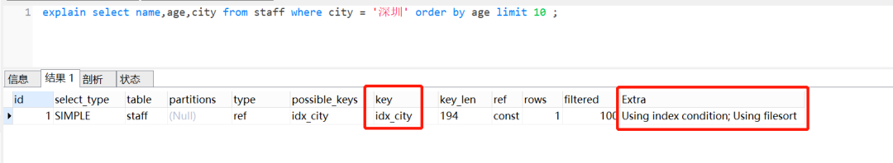
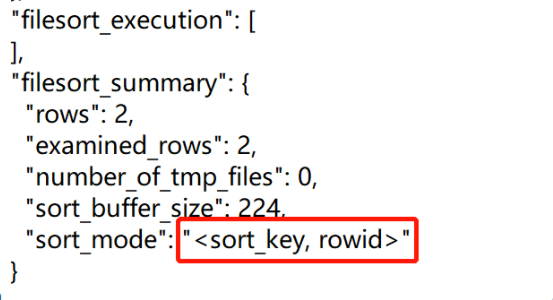
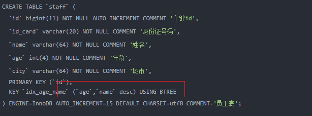

# Table of Contents

* [例子](#例子)
* [工作原理](#工作原理)
  * [explain分析](#explain分析)
  * [全字段排序](#全字段排序)
  * [磁盘临时文件辅助排序](#磁盘临时文件辅助排序)
  * [rowid](#rowid)
  * [全字段排序与rowid排序对比](#全字段排序与rowid排序对比)
* [Order By 优化](#order-by-优化)
  * [索引存储顺序与order by不一致，如何优化？](#索引存储顺序与order-by不一致如何优化)
  * [使用了in条件多个属性时，SQL执行是否有排序过程](#使用了in条件多个属性时sql执行是否有排序过程)
* [参考资料](#参考资料)


# 例子

假设用一张员工表，表结构如下：

```
CREATE TABLE `staff` (
`id` BIGINT ( 11 ) AUTO_INCREMENT COMMENT '主键id',
`id_card` VARCHAR ( 20 ) NOT NULL COMMENT '身份证号码',
`name` VARCHAR ( 64 ) NOT NULL COMMENT '姓名',
`age` INT ( 4 ) NOT NULL COMMENT '年龄',
`city` VARCHAR ( 64 ) NOT NULL COMMENT '城市',
PRIMARY KEY ( `id`),
INDEX idx_city ( `city` )
) ENGINE = INNODB COMMENT '员工表';
```


id是主键，city是普通索引

我们现在有这么一个需求：**查询前10个，来自深圳员工的姓名、年龄、城市，并且按照年龄小到大排序**。对应的 SQL 语句就可以这么写：

```
select name,age,city from staff where city = '深圳' order by age limit 10;
```

这条语句的逻辑很清楚，但是它的**底层执行流程**是怎样的呢？


# 工作原理

## explain分析



1. 执行计划的**key**这个字段，表示使用到索引idx_city
2. Extra 这个字段的 **Using index condition** 表示索引条件
3. Extra 这个字段的 **Using filesort**表示用到排序


## 全字段排序

MySQL 会给每个查询线程分配一块小**内存**，用于**排序**的，称为 **sort_buffer**。什么时候把字段放进去排序呢，其实是通过`idx_city`索引找到对应的数据，才把数据放进去啦。


具体流程

1. MySQL 为对应的线程初始化**sort_buffer**
2. 根据**idx_city**，查找对应数据，
3. 将数据放入**sort_buffer**进行排序，
4. 返回给客户端


将查询所需的字段全部读取到sort_buffer中，就是**全字段排序**。这里面，有些小伙伴可能会有个疑问,把查询的所有字段都放到sort_buffer，而sort_buffer是一块内存来的，如果数据量太大，sort_buffer放不下怎么办呢？


## 磁盘临时文件辅助排序

实际上，sort_buffer的大小是由一个参数控制的：**sort_buffer_size**。如果要排序的数据小于sort_buffer_size，排序在**sort_buffer** 内存中完成，如果要排序的数据大于sort_buffer_size，则**借助磁盘文件来进行排序**

如何确定是否使用了磁盘文件来进行排序呢？可以使用以下这几个命令

```
## 打开optimizer_trace，开启统计
set optimizer_trace = "enabled=on";
## 执行SQL语句
select name,age,city from staff where city = '深圳' order by age limit 10;
## 查询输出的统计信息
select * from information_schema.optimizer_trace 
```

可以从 **number_of_tmp_files** 中看出，是否使用了临时文件。

**number_of_tmp_files** 表示使用来排序的磁盘临时文件数。如果number_of_tmp_files>0，则表示使用了磁盘文件来进行排序。


这种依赖与磁盘的排序效果是不太好的，实际上使用的是**归并排序**算法。


## rowid

rowid 排序就是，只把查询SQL**需要用于排序的字段和主键id**，放到sort_buffer中。那怎么确定走的是全字段排序还是rowid 排序排序呢？

> rowid =需要用于排序的字段和主键id

实际上有个参数控制的。这个参数就是**max_length_for_sort_data**，它表示MySQL用于排序行数据的长度的一个参数，如果单行的长度超过这个值，MySQL 就认为单行太大，就换rowid 排序。我们可以通过命令看下这个参数取值。

```
show variables like 'max_length_for_sort_data';
```


**max_length_for_sort_data** 默认值是1024。因为本文示例中name,age,city长度=64+4+64 =132 < 1024, 所以走的是全字段排序。我们来改下这个参数，改小一点，

执行示意图如下：


对比一下**全字段排序**的流程，rowid 排序多了一次**回表**。


我们通过**optimizer_trace**，可以看到是否使用了rowid排序的：

```
## 打开optimizer_trace，开启统计
set optimizer_trace = "enabled=on";
## 执行SQL语句
select name,age,city from staff where city = '深圳' order by age limit 10;
## 查询输出的统计信息
select * from information_schema.optimizer_trace 
```





## 全字段排序与rowid排序对比

- 全字段排序：sort_buffer内存不够的话，就需要用到磁盘临时文件，造成**磁盘访问**。
- rowid排序：sort_buffer可以放更多数据，但是需要再回到原表去取数据，比全字段排序多一次**回表**。

一般情况下，对于InnoDB存储引擎，会优先使**用全字段**排序。可以发现 **max_length_for_sort_data** 参数设置为1024，这个数比较大的。一般情况下，排序字段不会超过这个值，也就是都会走**全字段**排序。


# Order By 优化

1. 将Order by后面的字段 是由**联合索引或者覆盖索引**，这样就不会用到文件排序或者rowid排序了

2. SQL 语句中包含 limit 的情况下，**通过成本评估有可能会使用优先队列**来避免磁盘文件排序，提升排序效率。

   


## 索引存储顺序与order by不一致，如何优化？


如果MySQL是8.0版本，支持**Descending Indexes**，可以指定索引以某种排序进行排序





## 使用了in条件多个属性时，SQL执行是否有排序过程

如果我们有**联合索引idx_city_name**，执行这个SQL的话，是不会走排序过程的，如下：

```mysql
select * from staff where city in ('深圳') order by age limit 10;
```


但是，如果使用in条件，并且有多个条件时，就会有排序过程。

```mysql
 explain select * from staff where city in ('深圳','上海') order by age limit 10;
```


这是因为:in有两个条件，**在满足深圳时，age是排好序的**，但是把满足上海的age也加进来，**就不能保证满足所有的age都是排好序的**。因此需要Using filesort。

> 未知的数据是无法判断排序的，只能走文件排序。


# 参考资料

+ [https://mp.weixin.qq.com/s/h9jWeoyiBGnQLvDrtXqVWw](https://mp.weixin.qq.com/s/h9jWeoyiBGnQLvDrtXqVWw)

+ https://mp.weixin.qq.com/s/YBWbEahWp0uVN_n9jAFU0A?forceh5=1 这个毕竟硬核，可以先看上面的 再看下面的

  

