# Table of Contents

* [Redo 日志](#redo-日志)
* [redo日志格式(了解)](#redo日志格式了解)
  * [简单的redo日志类型](#简单的redo日志类型)
    * [复杂一些的redo日志类型](#复杂一些的redo日志类型)
* [Mini-Transaction](#mini-transaction)
  * [以组的形式写入redo日志](#以组的形式写入redo日志)
  * [如何保证Redo日志在一个组](#如何保证redo日志在一个组)
  * [MTR](#mtr)
* [Redo 写入](#redo-写入)
  * [redo log block](#redo-log-block)
  * [redo log buffer](#redo-log-buffer)
  * [block to buffer](#block-to-buffer)
* [redo日志刷盘时机（物理）](#redo日志刷盘时机物理)
* [redo日志文件组(物理文件)](#redo日志文件组物理文件)
* [redo日志文件格式](#redo日志文件格式)
  * [日志文件前2048](#日志文件前2048)
* [Log Sequence Number(LSN)](#log-sequence-numberlsn)
* [flushed_to_disk_lsn](#flushed_to_disk_lsn)
* [flush链表中的LSN(重点)](#flush链表中的lsn重点)
* [checkPoint(重点)](#checkpoint重点)
* [innodb_flush_log_at_trx_commit的用法](#innodb_flush_log_at_trx_commit的用法)
* [什么是 crash-save ？](#什么是-crash-save-)
* [崩溃恢复](#崩溃恢复)
  * [确定恢复的起点](#确定恢复的起点)
  * [确定恢复的终点](#确定恢复的终点)
* [redo log 的执行流程](#redo-log-的执行流程)
* [流程总结](#流程总结)


# Redo 日志

前面提到如果Flush链表上的数据没有同步到磁盘，是会数据丢失的，也无法恢复。那么如何保证这个`持久性`呢？

一个很简单的做法就是在事务提交完成之前把该事务所修改的所有页面都刷新到磁盘，但是这个简单粗暴的做法有些问题：

- 刷新一个完整的数据页太浪费了

  有时候我们仅仅修改了某个页面中的一个字节，但是我们知道在`InnoDB`中是以页为单位来进行磁盘IO的，也就是说我们在**该事务提交时不得不将一个完整的页面从内存中刷新到磁盘**，我们又知道一个页面默认是16KB大小，只修改一个字节就要刷新16KB的数据到磁盘上显然是太浪费了。

- 随机IO刷起来比较慢

  一个事务可能包含很多语句，即使是一条语句也可能修改许多页面，倒霉催的是该事务修改的这些页面可能并不相邻，这就意味着在将某个事务修改的`Buffer Pool`中的页面刷新到磁盘时，需要进行很多的随机IO，随机IO比顺序IO要慢，尤其对于传统的机械硬盘来说。

所以我们其实没有必要在每次事务提交时就把该事务在内存中修改过的全部页面刷新到磁盘，只需要把修改了哪些东西记录一下就好，比方说某个事务将系统表空间中的第100号页面中偏移量为1000处的那个字节的值`1`改成`2`我们只需要记录一下：

> 将第0号表空间的100号页面的偏移量为1000处的值更新为`2`。

**这样我们在事务提交时，把上述内容刷新到磁盘中**，即使之后系统崩溃了，重启之后只要按照上述内容所记录的步骤重新更新一下数据页，那么该事务对数据库中所做的修改又可以被恢复出来，也就意味着满足`持久性`的要求。因为在系统崩溃重启时需要按照上述内容所记录的步骤重新更新数据页，所以上述内容也被称之为`重做日志`，英文名为`redo log`。


> Redo日志：事务提交时候，会将脏页刷到磁盘，叫Redo日志。
>
> Redo：记录的是物理页面的修改  就是内存空间怎么变了
> Undo：记录的是逻辑变化  就是我们常见的值的变化
>
> 


+ Redo好处
  + 空间占用非常小
  + 是顺序写入磁盘的


# redo日志格式(了解)

> 这个觉得了解下就好，不用过多深入了解
>
> redo日志会把事务在执行过程中对数据库所做的所有修改都记录下来，在之后系统崩溃重启后可以把事务所做的任何修改都恢复出来。

通过上边的内容我们知道，`redo`日志本质上只是记录了一下事务对数据库做了哪些修改。 设计`InnoDB`的大叔们针对事务对数据库的不同修改场景定义了多种类型的`redo`日志，但是绝大部分类型的`redo`日志都有下边这种通用的结构：


各个部分的详细释义如下：

- `type`：该条`redo`日志的类型。

  在`MySQL 5.7.21`这个版本中，设计`InnoDB`的大叔一共为`redo`日志设计了53种不同的类型，稍后会详细介绍不同类型的`redo`日志。

- `space ID`：表空间ID。

- `page number`：页号。

- `data`：该条`redo`日志的具体内容。


## 简单的redo日志类型

我们前边介绍`InnoDB`的记录行格式的时候说过，如果我们没有为某个表显式的定义主键，并且表中也没有定义`Unique`键，那么`InnoDB`会自动的为表添加一个称之为`row_id`的隐藏列作为主键。为这个`row_id`隐藏列赋值的方式如下：

- 服务器会在内存中维护一个全局变量，每当向某个包含隐藏的`row_id`列的表中插入一条记录时，就会把该变量的值当作新记录的`row_id`列的值，并且把该变量自增1。
- 每当这个变量的值为256的倍数时，就会将该变量的值刷新到系统表空间的页号为`7`的页面中一个称之为`Max Row ID`的属性处（我们前边介绍表空间结构时详细说过）。
- 当系统启动时，会将上边提到的`Max Row ID`属性加载到内存中，将该值加上256之后赋值给我们前边提到的全局变量（因为在上次关机时该全局变量的值可能大于`Max Row ID`属性值）。

这个`Max Row ID`属性占用的存储空间是8个字节，当某个事务向某个包含`row_id`隐藏列的表插入一条记录，并且为该记录分配的`row_id`值为256的倍数时，就会向系统表空间页号为7的页面的相应偏移量处写入8个字节的值。但是我们要知道，这个写入实际上是在`Buffer Pool`中完成的，我们需要为这个页面的修改记录一条`redo`日志，以便在系统崩溃后能将已经提交的该事务对该页面所做的修改恢复出来。这种情况下对页面的修改是极其简单的，`redo`日志中只需要记录一下在某个页面的某个偏移量处修改了几个字节的值，具体被修改的内容是啥就好了，设计`InnoDB`的大叔把这种极其简单的`redo`日志称之为`物理日志`，并且根据在页面中写入数据的多少划分了几种不同的`redo`日志类型：

- `MLOG_1BYTE`（`type`字段对应的十进制数字为`1`）：表示在页面的某个偏移量处写入1个字节的`redo`日志类型。
- `MLOG_2BYTE`（`type`字段对应的十进制数字为`2`）：表示在页面的某个偏移量处写入2个字节的`redo`日志类型。
- `MLOG_4BYTE`（`type`字段对应的十进制数字为`4`）：表示在页面的某个偏移量处写入4个字节的`redo`日志类型。
- `MLOG_8BYTE`（`type`字段对应的十进制数字为`8`）：表示在页面的某个偏移量处写入8个字节的`redo`日志类型。
- `MLOG_WRITE_STRING`（`type`字段对应的十进制数字为`30`）：表示在页面的某个偏移量处写入一串数据。

我们上边提到的`Max Row ID`属性实际占用8个字节的存储空间，所以在修改页面中的该属性时，会记录一条类型为`MLOG_8BYTE`的`redo`日志，`MLOG_8BYTE`的`redo`日志结构如下所示：


其余`MLOG_1BYTE`、`MLOG_2BYTE`、`MLOG_4BYTE`类型的`redo`日志结构和`MLOG_8BYTE`的类似，只不过具体数据中包含对应个字节的数据罢了。`MLOG_WRITE_STRING`类型的`redo`日志表示写入一串数据，但是因为不能确定写入的具体数据占用多少字节，所以需要在日志结构中添加一个`len`字段：


> 小贴士： 只要将MLOG_WRITE_STRING类型的redo日志的len字段填充上1、2、4、8这些数字，就可以分别替代MLOG_1BYTE、MLOG_2BYTE、MLOG_4BYTE、MLOG_8BYTE这些类型的redo日志，为啥还要多此一举设计这么多类型呢？还不是因为省空间啊，能不写len字段就不写len字段，省一个字节算一个字节。

### 复杂一些的redo日志类型

有时候执行一条语句会修改非常多的页面，包括系统数据页面和用户数据页面（用户数据指的就是聚簇索引和二级索引对应的`B+`树）。以一条`INSERT`语句为例，它除了要向`B+`树的页面中插入数据，也可能更新系统数据`Max Row ID`的值，不过对于我们用户来说，平时更关心的是语句对`B+`树所做更新：

- 表中包含多少个索引，一条`INSERT`语句就可能更新多少棵`B+`树。
- 针对某一棵`B+`树来说，既可能更新叶子节点页面，也可能更新内节点页面，也可能创建新的页面（在该记录插入的叶子节点的剩余空间比较少，不足以存放该记录时，会进行页面的分裂，在内节点页面中添加`目录项记录`）。

在语句执行过程中，`INSERT`语句对所有页面的修改都得保存到`redo`日志中去。这句话说的比较轻巧，做起来可就比较麻烦了，比方说将记录插入到聚簇索引中时，如果定位到的叶子节点的剩余空间足够存储该记录时，那么只更新该叶子节点页面就好，那么只记录一条`MLOG_WRITE_STRING`类型的`redo`日志，表明在页面的某个偏移量处增加了哪些数据就好了么？那就too young too naive了～ 别忘了一个数据页中除了存储实际的记录之后，还有什么`File Header`、`Page Header`、`Page Directory`等等部分（在唠叨数据页的章节有详细讲解），所以每往叶子节点代表的数据页里插入一条记录时，还有其他很多地方会跟着更新，比如说：

- 可能更新`Page Directory`中的槽信息。
- `Page Header`中的各种页面统计信息，比如`PAGE_N_DIR_SLOTS`表示的槽数量可能会更改，`PAGE_HEAP_TOP`代表的还未使用的空间最小地址可能会更改，`PAGE_N_HEAP`代表的本页面中的记录数量可能会更改，吧啦吧啦，各种信息都可能会被修改。
- 我们知道在数据页里的记录是按照索引列从小到大的顺序组成一个单向链表的，每插入一条记录，还需要更新上一条记录的记录头信息中的`next_record`属性来维护这个单向链表。
- 还有别的吧啦吧啦的更新的地方，就不一一唠叨了...

画一个简易的示意图就像是这样：


说了这么多，就是想表达：把一条记录插入到一个页面时需要更改的地方非常多。这时我们如果使用上边介绍的简单的物理`redo`日志来记录这些修改时，可以有两种解决方案：

- 方案一：在每个修改的地方都记录一条`redo`日志。

  也就是如上图所示，有多少个加粗的块，就写多少条物理`redo`日志。这样子记录`redo`日志的缺点是显而易见的，因为被修改的地方是在太多了，可能记录的`redo`日志占用的空间都比整个页面占用的空间都多了～

- 方案二：将整个页面的`第一个被修改的字节`到`最后一个修改的字节`之间所有的数据当成是一条物理`redo`日志中的具体数据。

  从图中也可以看出来，`第一个被修改的字节`到`最后一个修改的字节`之间仍然有许多没有修改过的数据，我们把这些没有修改的数据也加入到`redo`日志中去岂不是太浪费了～

正因为上述两种使用物理`redo`日志的方式来记录某个页面中做了哪些修改比较浪费，设计`InnoDB`的大叔本着勤俭节约的初心，提出了一些新的`redo`日志类型，比如：

- `MLOG_REC_INSERT`（对应的十进制数字为`9`）：表示插入一条使用非紧凑行格式的记录时的`redo`日志类型。
- `MLOG_COMP_REC_INSERT`（对应的十进制数字为`38`）：表示插入一条使用紧凑行格式的记录时的`redo`日志类型。

> 小贴士： Redundant是一种比较原始的行格式，它就是非紧凑的。而Compact、Dynamic以及Compressed行格式是较新的行格式，它们是紧凑的（占用更小的存储空间）。

- `MLOG_COMP_PAGE_CREATE`（`type`字段对应的十进制数字为`58`）：表示创建一个存储紧凑行格式记录的页面的`redo`日志类型。
- `MLOG_COMP_REC_DELETE`（`type`字段对应的十进制数字为`42`）：表示删除一条使用紧凑行格式记录的`redo`日志类型。
- `MLOG_COMP_LIST_START_DELETE`（`type`字段对应的十进制数字为`44`）：表示从某条给定记录开始删除页面中的一系列使用紧凑行格式记录的`redo`日志类型。
- `MLOG_COMP_LIST_END_DELETE`（`type`字段对应的十进制数字为`43`）：与`MLOG_COMP_LIST_START_DELETE`类型的`redo`日志呼应，表示删除一系列记录直到`MLOG_COMP_LIST_END_DELETE`类型的`redo`日志对应的记录为止。

> 小贴士： 我们前边唠叨InnoDB数据页格式的时候重点强调过，数据页中的记录是按照索引列大小的顺序组成单向链表的。有时候我们会有删除索引列的值在某个区间范围内的所有记录的需求，这时候如果我们每删除一条记录就写一条redo日志的话，效率可能有点低，所以提出MLOG_COMP_LIST_START_DELETE和MLOG_COMP_LIST_END_DELETE类型的redo日志，可以很大程度上减少redo日志的条数。

- `MLOG_ZIP_PAGE_COMPRESS`（`type`字段对应的十进制数字为`51`）：表示压缩一个数据页的`redo`日志类型。
- ······还有很多很多种类型，这就不列举了，等用到再说哈～

这些类型的`redo`日志既包含`物理`层面的意思，也包含`逻辑`层面的意思，具体指：

- 物理层面看，这些日志都指明了对哪个表空间的哪个页进行了修改。
- 逻辑层面看，在系统崩溃重启时，并不能直接根据这些日志里的记载，将页面内的某个偏移量处恢复成某个数据，而是需要调用一些事先准备好的函数，执行完这些函数后才可以将页面恢复成系统崩溃前的样子。

大家看到这可能有些懵逼，我们还是以类型为`MLOG_COMP_REC_INSERT`这个代表插入一条使用紧凑行格式的记录时的`redo`日志为例来理解一下我们上边所说的`物理`层面和`逻辑`层面到底是个啥意思。废话少说，直接看一下这个类型为`MLOG_COMP_REC_INSERT`的`redo`日志的结构（由于字段太多了，我们把它们竖着看效果好些）：


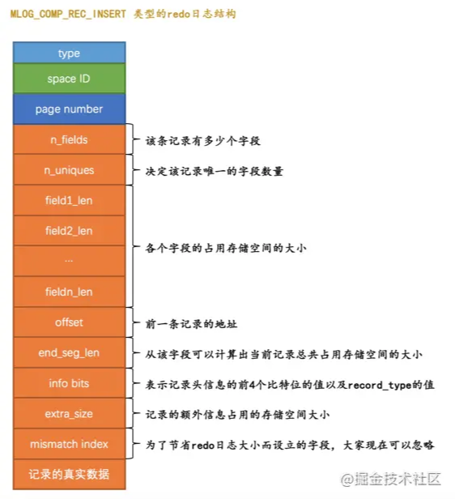


这个类型为`MLOG_COMP_REC_INSERT`的`redo`日志结构有几个地方需要大家注意：

- 我们前边在唠叨索引的时候说过，在一个数据页里，不论是叶子节点还是非叶子节点，记录都是按照索引列从小到大的顺序排序的。对于二级索引来说，当索引列的值相同时，记录还需要按照主键值进行排序。图中`n_uniques`的值的含义是在一条记录中，需要几个字段的值才能确保记录的唯一性，这样当插入一条记录时就可以按照记录的前`n_uniques`个字段进行排序。对于聚簇索引来说，`n_uniques`的值为主键的列数，对于其他二级索引来说，该值为索引列数+主键列数。这里需要注意的是，唯一二级索引的值可能为`NULL`，所以该值仍然为索引列数+主键列数。
- `field1_len ~ fieldn_len`代表着该记录若干个字段占用存储空间的大小，需要注意的是，这里不管该字段的类型是固定长度大小的（比如`INT`），还是可变长度大小（比如`VARCHAR(M)`）的，该字段占用的大小始终要写入`redo`日志中。
- `offset`代表的是该记录的前一条记录在页面中的地址。为啥要记录前一条记录的地址呢？这是因为每向数据页插入一条记录，都需要修改该页面中维护的记录链表，每条记录的`记录头信息`中都包含一个称为`next_record`的属性，所以在插入新记录时，需要修改前一条记录的`next_record`属性。
- 我们知道一条记录其实由`额外信息`和`真实数据`这两部分组成，这两个部分的总大小就是一条记录占用存储空间的总大小。通过`end_seg_len`的值可以间接的计算出一条记录占用存储空间的总大小，为啥不直接存储一条记录占用存储空间的总大小呢？这是因为写`redo`日志是一个非常频繁的操作，设计`InnoDB`的大叔想方设法想减小`redo`日志本身占用的存储空间大小，所以想了一些弯弯绕的算法来实现这个目标，`end_seg_len`这个字段就是为了节省`redo`日志存储空间而提出来的。至于具体设计`InnoDB`的大叔到底是用了什么神奇魔法减小`redo`日志大小的，我们这就不多唠叨了，因为的确有那么一丢丢小复杂，说清楚还是有一点点麻烦的，而且说明白了也没啥用。
- `mismatch_index`的值也是为了节省`redo`日志的大小而设立的，大家可以忽略。

很显然这个类型为`MLOG_COMP_REC_INSERT`的`redo`日志并没有记录`PAGE_N_DIR_SLOTS`的值修改为了啥，`PAGE_HEAP_TOP`的值修改为了啥，`PAGE_N_HEAP`的值修改为了啥等等这些信息，而只是把在本页面中插入一条记录所有必备的要素记了下来，之后系统崩溃重启时，服务器会调用相关向某个页面插入一条记录的那个函数，而`redo`日志中的那些数据就可以被当成是调用这个函数所需的参数，在调用完该函数后，页面中的`PAGE_N_DIR_SLOTS`、`PAGE_HEAP_TOP`、`PAGE_N_HEAP`等等的值也就都被恢复到系统崩溃前的样子了。这就是所谓的`逻辑`日志的意思。


# Mini-Transaction

> 数据库某个事务下的可能修改某个操作是不可分割的！所以即使一个事务下的Redo日志也是**分组**的，
>
> 每组代表的是原子性操作，要么一起成功，要么一起失败！
>
> 一个事务下有多个mtr


## 以组的形式写入redo日志

语句在执行过程中可能修改若干个页面。比如我们前边说的一条`INSERT`语句可能修改系统表空间页号为`7`的页面的`Max Row ID`属性（当然也可能更新别的系统页面，只不过我们没有都列举出来而已），还会更新聚簇索引和二级索引对应`B+`树中的页面。由于对这些页面的更改都发生在`Buffer Pool`中，所以在修改完页面之后，需要记录一下相应的`redo`日志。在执行语句的过程中产生的`redo`日志被设计`InnoDB`的大叔人为的划分成了若干个不可分割的组，比如：

- 更新`Max Row ID`属性时产生的`redo`日志是不可分割的。
- 向聚簇索引对应`B+`树的页面中插入一条记录时产生的`redo`日志是不可分割的。
- 向某个二级索引对应`B+`树的页面中插入一条记录时产生的`redo`日志是不可分割的。
- 还有其他的一些对页面的访问操作时产生的`redo`日志是不可分割的。。。
  

怎么理解这个`不可分割`的意思呢？我们以向某个索引对应的`B+`树插入一条记录为例，在向`B+`树中插入这条记录之前，需要先定位到这条记录应该被插入到哪个叶子节点代表的数据页中，定位到具体的数据页之后，有两种可能的情况：

- 情况一：该数据页的剩余的空闲空间充足，足够容纳这一条待插入记录，那么事情很简单，直接把记录插入到这个数据页中，记录一条类型为`MLOG_COMP_REC_INSERT`的`redo`日志就好了，我们把这种情况称之为`乐观插入`

+ 情况二：该数据页剩余的空闲空间不足，那么事情就悲剧了，我们前边说过，遇到这种情况要进行所谓的`页分裂`操作，也就是新建一个叶子节点，然后把原先数据页中的一部分记录复制到这个新的数据页中，然后再把记录插入进去，把这个叶子节点插入到叶子节点链表中，最后还要在内节点中添加一条`目录项记录`指向这个新创建的页面。很显然，这个过程要对多个页面进行修改，也就意味着会产生多条`redo`日志，我们把这种情况称之为`悲观插入`。


设计`InnoDB`的大叔们**认为向某个索引对应的`B+`树中插入一条记录的这个过程必须是原子的**，不能说插了一半之后就停止了。比方说在悲观插入过程中，新的页面已经分配好了，数据也复制过去了，新的记录也插入到页面中了，可是没有向内节点中插入一条`目录项记录`，这个插入过程就是不完整的，这样会形成一棵不正确的`B+`树。

我们知道`redo`日志是为了在系统崩溃重启时恢复崩溃前的状态，如果在悲观插入的过程中只记录了一部分`redo`日志，那么在系统崩溃重启时会将索引对应的`B+`树恢复成一种不正确的状态，这是设计`InnoDB`的大叔们所不能忍受的。

>  所以他们规定在执行这些需要保证原子性的操作时必须以`组`的形式来记录的`redo`日志，在进行系统崩溃重启恢复时，针对某个组中的`redo`日志，要么把全部的日志都恢复掉，要么一条也不恢复。


##  如何保证Redo日志在一个组

该组中的最后一条`redo`日志后边加上一条特殊类型的`redo`日志，该类型名称为`MLOG_MULTI_REC_END`，`type`字段对应的十进制数字为`31`，该类型的`redo`日志结构很简单，只有一个`type`字段：


所以某个需要保证原子性的操作产生的一系列`redo`日志必须要以一个类型为`MLOG_MULTI_REC_END`结尾，就像这样：


## MTR

> 对底层页面中的一次原子访问的过程称之为一个`Mini-Transaction`，简称`mtr`

比如上边所说的修改一次`Max Row ID`的值算是一个`Mini-Transaction`，向某个索引对应的`B+`树中插入一条记录的过程也算是一个`Mini-Transaction`。

通过上边的叙述我们也知道，一个所谓的`mtr`可以包含一组`redo`日志，在进行崩溃恢复时这一组`redo`日志作为一个不可分割的整体。

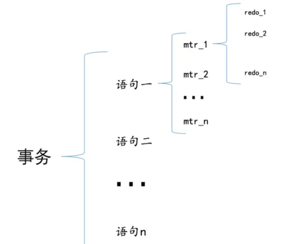


# Redo 写入


## redo log block

通过`mtr`生成的`redo`日志都放在了大小为`512字节`的`页`中。为了和我们前边提到的表空间中的页做区别，我们这里把用来存储`redo`日志的页称为`block`

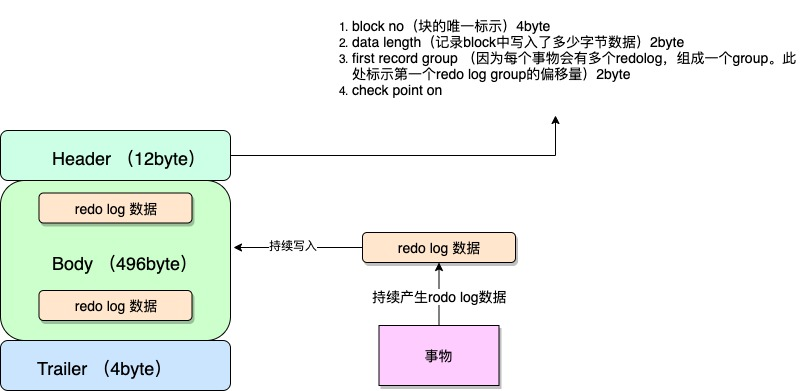


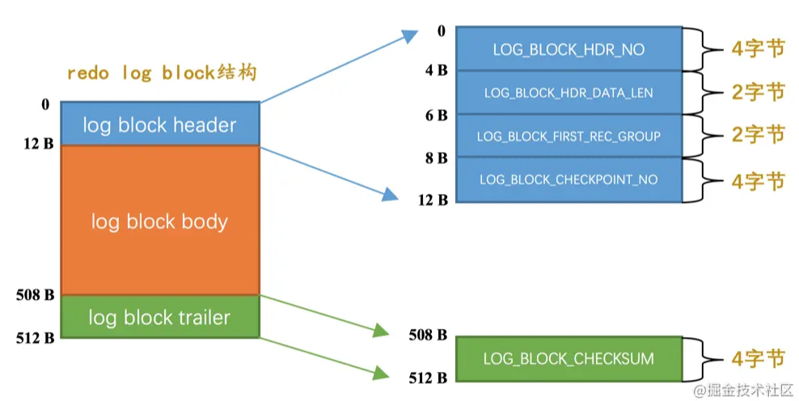


+ log block header
  + `LOG_BLOCK_HDR_NO`：每一个block都有一个大于0的唯一标号，本属性就表示该标号值。
  + `LOG_BLOCK_HDR_DATA_LEN`：表示block中已经使用了多少字节，初始值为`12`（因为`log block body`从第12个字节处开始）。随着往block中写入的redo日志越来也多，本属性值也跟着增长。如果`log block body`已经被全部写满，那么本属性的值被设置为`512`。
  + `LOG_BLOCK_FIRST_REC_GROUP`：一条`redo`日志也可以称之为一条`redo`日志记录（`redo log record`），一个`mtr`会生产多条`redo`日志记录，这些`redo`日志记录被称之为一个`redo`日志记录组（`redo log record group`）。`LOG_BLOCK_FIRST_REC_GROUP`就代表该block中第一个`mtr`生成的`redo`日志记录组的偏移量（其实也就是这个block里第一个`mtr`生成的第一条`redo`日志的偏移量）。
  + `LOG_BLOCK_CHECKPOINT_NO`：表示所谓的`checkpoint`的序号

+ `log block trailer`中属性的意思如下：
  - `LOG_BLOCK_CHECKSUM`：表示block的校验值，用于正确性校验


## redo log buffer

设计`InnoDB`的大叔为了解决磁盘速度过慢的问题而引入了`Buffer Pool`。同理，写入`redo`日志时也不能直接直接写到磁盘上，实际上在服务器启动时就向操作系统申请了一大片称之为`redo log buffer`的连续内存空间，翻译成中文就是`redo日志缓冲区`，我们也可以简称为`log buffer`。

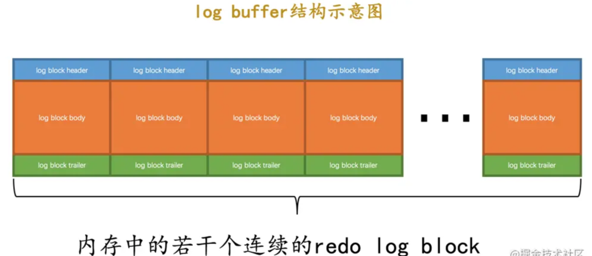

我们可以通过启动参数`innodb_log_buffer_size`来指定`log buffer`的大小，在`MySQL 5.7.21`这个版本中，该启动参数的默认值为`16MB`。


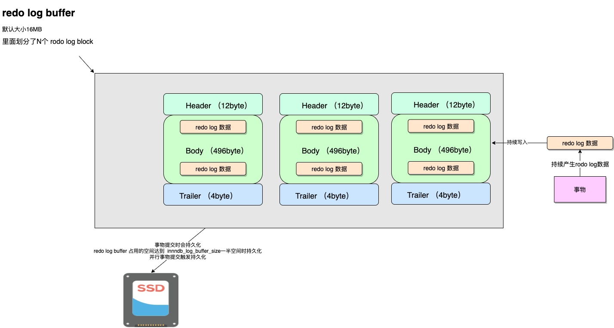

## block to buffer

+ 如何确定要写入`block`的位置

提供了一个称之为`buf_free`的全局变量，该变量指明后续写入的`redo`日志应该写入到`log buffer`中的哪个位置

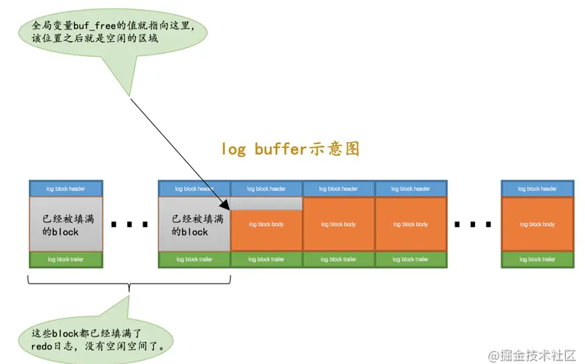


+ 一个mtr过程中会产生很多Redo日志，是立即写入buffer吗？
  

`redo`日志是一个不可分割的组，所以其实并不是每生成一条`redo`日志，就将其插入到`log buffer`中，而是每个`mtr`运行过程中产生的日志先暂时存到一个地方，当该`mtr`结束的时候，将过程中产生的一组`redo`日志再全部复制到`log buffer`中

+ 并发下mtr执行情况

不同的事务可能是并发执行的，所以`T1`、`T2`之间的`mtr`可能是交替执行的。每当一个`mtr`执行完成时，伴随该`mtr`生成的一组`redo`日志就需要被复制到`log buffer`中，也就是说**不同事务的`mtr`可能是交替写入`log buffer`的**


# redo日志刷盘时机（物理）


我们前边说`mtr`运行过程中产生的一组`redo`日志在`mtr`结束时会被复制到`log buffer`中，可是这些日志总在内存里呆着也不是个办法，在一些情况下它们会被刷新到磁盘里

比如：

- `log buffer`空间不足时

  `log buffer`的大小是有限的（通过系统变量`innodb_log_buffer_size`指定），如果不停的往这个有限大小的`log buffer`里塞入日志，很快它就会被填满。设计`InnoDB`的大叔认为如果当前写入`log buffer`的`redo`日志量已经占满了`log buffer`总容量的大约一半左右，就需要把这些日志刷新到磁盘上。

- 事务提交时

  我们前边说过之所以使用`redo`日志主要是因为它占用的空间少，还是顺序写，在事务提交时可以不把修改过的`Buffer Pool`页面刷新到磁盘，但是为了保证持久性，必须要把修改这些页面对应的`redo`日志刷新到磁盘。

- 后台线程不停的刷刷刷

  后台有一个线程，大约每秒都会刷新一次`log buffer`中的`redo`日志到磁盘。

- 正常关闭服务器时

- 做所谓的`checkpoint`时（我们现在没介绍过`checkpoint`的概念，稍后会仔细唠叨，稍安勿躁）

- 其他的一些情况...


**提交事务，意味着Redo日志刷盘，但是内存中的数据不一定刷盘！！！！**


# redo日志文件组(物理文件)

`MySQL`的数据目录（使用`SHOW VARIABLES LIKE 'datadir'`查看）下默认有两个名为`ib_logfile0`和`ib_logfile1`的文件，`log buffer`中的日志默认情况下就是刷新到这两个磁盘文件中。如果我们对默认的`redo`日志文件不满意，可以通过下边几个启动参数来调节：

- `innodb_log_group_home_dir`

  该参数指定了`redo`日志文件所在的目录，默认值就是当前的数据目录。

- `innodb_log_file_size`

  该参数指定了每个`redo`日志文件的大小，在`MySQL 5.7.21`这个版本中的默认值为`48MB`，

- `innodb_log_files_in_group`

  该参数指定`redo`日志文件的个数，默认值为2，最大值为100。

从上边的描述中可以看到，磁盘上的`redo`日志文件不只一个，而是以一个`日志文件组`的形式出现的。这些文件以`ib_logfile[数字]`（`数字`可以是`0`、`1`、`2`...）的形式进行命名。在将`redo`日志写入`日志文件组`时，是从`ib_logfile0`开始写，如果`ib_logfile0`写满了，就接着`ib_logfile1`写，同理，`ib_logfile1`写满了就去写`ib_logfile2`，依此类推。如果写到最后一个文件该咋办？那就重新转到`ib_logfile0`继续写，所以整个过程如下图所示：


> 如果采用循环使用的方式向redo日志文件组里写数据的话，那岂不是要追尾，也就是后写入的redo日志覆盖掉前边写的redo日志？当然可能了！所以设计InnoDB的大叔提出了checkpoint的概念，


# redo日志文件格式

我们前边说过`log buffer`本质上是一片连续的内存空间，被划分成了若干个`512`字节大小的`block`。将log buffer中的redo日志刷新到磁盘的本质就是把block的镜像写入日志文件中，所以`redo`日志文件其实也是由若干个`512`字节大小的block组成。

`redo`日志文件组中的每个文件大小都一样，格式也一样，都是由两部分组成：

- 前2048个字节，也就是前4个block是用来存储一些管理信息的。
- 从第**2048字节往后是用来存储`log buffer`中的block镜像的**。

所以我们前边所说的`循环`使用redo日志文件，其实是从每个日志文件的第2048个字节开始算，画个示意图就是这样：

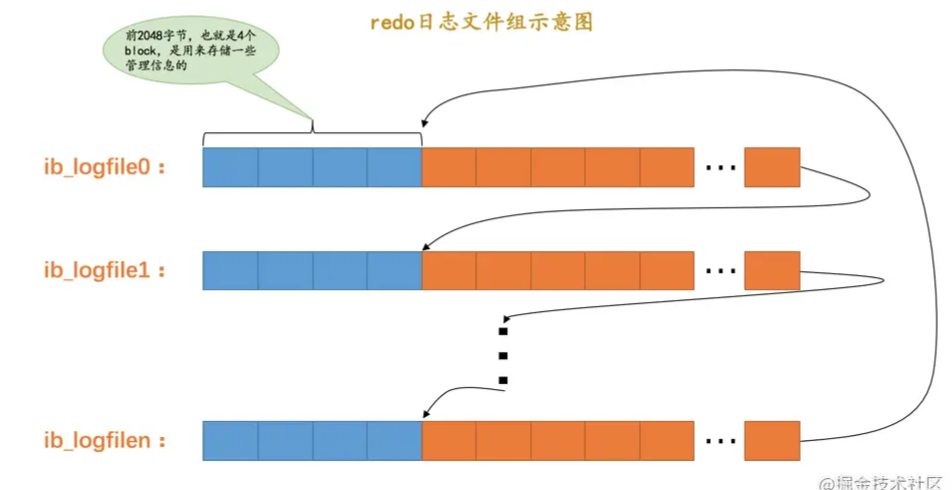


## 日志文件前2048


+ `log file header`：描述该`redo`日志文件的一些整体属性，看一下它的结构：

  

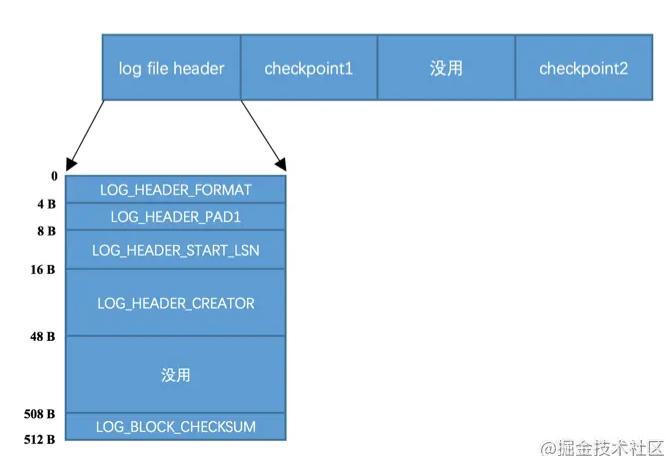

各个属性的具体释义如下：

| 属性名                 | 长度（单位：字节） | 描述                                                         |
| ---------------------- | ------------------ | ------------------------------------------------------------ |
| `LOG_HEADER_FORMAT`    | `4`                | `redo`日志的版本，在`MySQL 5.7.21`中该值永远为1              |
| `LOG_HEADER_PAD1`      | `4`                | 做字节填充用的，没什么实际意义，忽略～                       |
| `LOG_HEADER_START_LSN` | `8`                | 标记本`redo`日志文件开始的LSN值，也就是文件偏移量为2048字节初对应的LSN值（关于什么是LSN我们稍后再看哈，看不懂的先忽略）。 |
| `LOG_HEADER_CREATOR`   | `32`               | 一个字符串，标记本`redo`日志文件的创建者是谁。正常运行时该值为`MySQL`的版本号，比如：`"MySQL 5.7.21"`，使用`mysqlbackup`命令创建的`redo`日志文件的该值为`"ibbackup"`和创建时间。 |
| `LOG_BLOCK_CHECKSUM`   | `4`                | 本block的校验值，所有block都有，我们不关心                   |

+ checkpoint1

各个属性的具体释义如下：

| 属性名                        | 长度（单位：字节） | 描述                                                         |
| ----------------------------- | ------------------ | ------------------------------------------------------------ |
| `LOG_CHECKPOINT_NO`           | `8`                | 服务器做`checkpoint`的编号，每做一次`checkpoint`，该值就加1。 |
| `LOG_CHECKPOINT_LSN`          | `8`                | 服务器做`checkpoint`结束时对应的`LSN`值，系统崩溃恢复时将从该值开始。 |
| `LOG_CHECKPOINT_OFFSET`       | `8`                | 上个属性中的`LSN`值在`redo`日志文件组中的偏移量              |
| `LOG_CHECKPOINT_LOG_BUF_SIZE` | `8`                | 服务器在做`checkpoint`操作时对应的`log buffer`的大小         |
| `LOG_BLOCK_CHECKSUM`          | `4`                | 本block的校验值，所有block都有，我们不关心                   |

- 第三个block未使用，忽略～
- `checkpoint2`：结构和`checkpoint1`一样。


# Log Sequence Number(LSN)

为记录已经写入的`redo`日志量，设计了一个称之为`Log Sequence Number`的全局变量，翻译过来就是：`日志序列号`，简称`lsn`。不过不像人一出生的年龄是`0`岁，设计`InnoDB`的大叔规定初始的`lsn`值为`8704`（也就是一条`redo`日志也没写入时，`lsn`的值为`8704`）。

每一组由mtr生成的redo日志都有一个唯一的LSN值与其对应，LSN值越小，说明redo日志产生的越早。


# flushed_to_disk_lsn

`redo`日志是首先写到`log buffer`中，之后才会被刷新到磁盘上的`redo`日志文件。所以设计`InnoDB`的大叔提出了一个称之为`buf_next_to_write`的全局变量，标记当前`log buffer`中已经有哪些日志被刷新到磁盘中了。


新的`redo`日志写入到`log buffer`时，首先`lsn`的值会增长，但`flushed_to_disk_lsn`不变，随后随着不断有`log buffer`中的日志被刷新到磁盘上，`flushed_to_disk_lsn`的值也跟着增长。如果两者的值相同时，说明log buffer中的所有redo日志都已经刷新到磁盘中了。


# flush链表中的LSN(重点)

我们知道一个`mtr`代表一次对底层页面的原子访问，在访问过程中可能会产生一组不可分割的`redo`日志，在`mtr`结束时，会把这一组`redo`日志写入到`log buffer`中。除此之外，在`mtr`结束时还有一件非常重要的事情要做，就是把在mtr执行过程中可能修改过的页面加入到Buffer Pool的flush链表。


当第一次修改某个缓存在`Buffer Pool`中的页面时，就会把这个页面对应的控制块插入到`flush链表`的头部，之后再修改该页面时由于它已经在`flush`链表中了，就不再次插入了。也就是说flush链表中的脏页是按照**页面的第一次修改时间从大到小**进行排序的。


在这个过程中会在缓存页对应的控制块中记录两个关于页面何时修改的属性：

- `oldest_modification`：如果某个页面被加载到`Buffer Pool`后进**行第一次修改**，那么就将修改该页面的`mtr`开始时对应的`lsn`值写入这个属性。
- `newest_modification`：每修改一次页面，都会将修改该页面的`mtr`结束时对应的`lsn`值写入这个属性。也就是说该属性表示页面**最近一次修改后对应的系统`lsn`值**。

我们接着上边唠叨`flushed_to_disk_lsn`的例子看一下：

- 假设`mtr_1`执行过程中修改了`页a`，那么在`mtr_1`执行结束时，就会将`页a`对应的控制块加入到`flush链表`的头部。并且将`mtr_1`开始时对应的`lsn`，也就是`8716`写入`页a`对应的控制块的`oldest_modification`属性中，把`mtr_1`结束时对应的`lsn`，也就是8916写入`页a`对应的控制块的`newest_modification`属性中。画个图表示一下（为了让图片美观一些，我们把`oldest_modification`缩写成了`o_m`，把`newest_modification`缩写成了`n_m`）：

  

- 接着假设`mtr_2`执行过程中又修改了`页b`和`页c`两个页面，那么在`mtr_2`执行结束时，就会将`页b`和`页c`对应的控制块都加入到`flush链表`的头部。并且将`mtr_2`开始时对应的`lsn`，也就是8916写入`页b`和`页c`对应的控制块的`oldest_modification`属性中，把`mtr_2`结束时对应的`lsn`，也就是9948写入`页b`和`页c`对应的控制块的`newest_modification`属性中。画个图表示一下：

  

  从图中可以看出来，每次新插入到`flush链表`中的节点都是被放在了头部，也就是说`flush链表`中前边的脏页修改的时间比较晚，后边的脏页修改时间比较早。

- 接着假设`mtr_3`执行过程中修改了`页b`和`页d`，不过`页b`之前已经被修改过了，所以它对应的控制块已经被插入到了`flush`链表，所以在`mtr_3`执行结束时，只需要将`页d`对应的控制块都加入到`flush链表`的头部即可。所以需要将`mtr_3`开始时对应的`lsn`，也就是9948写入`页d`对应的控制块的`oldest_modification`属性中，把`mtr_3`结束时对应的`lsn`，也就是10000写入`页d`对应的控制块的`newest_modification`属性中。另外，由于`页b`在`mtr_3`执行过程中又发生了一次修改，所以需要更新`页b`对应的控制块中`newest_modification`的值为10000。画个图表示一下：

  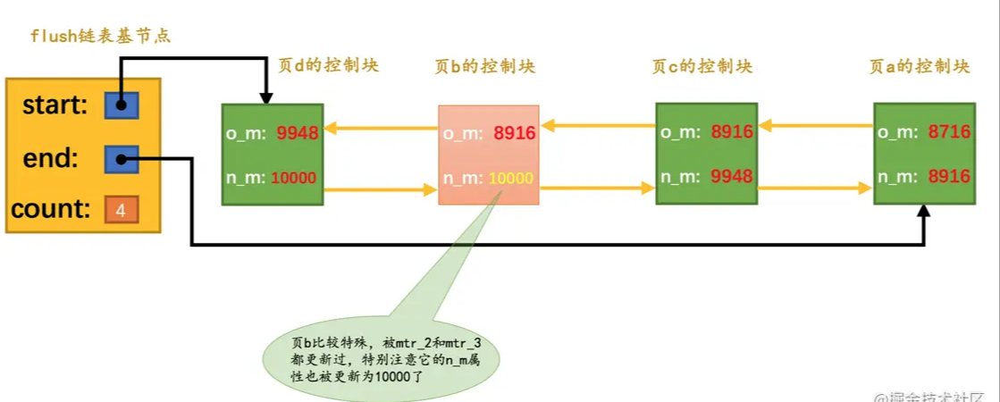

总结一下上边说的，就是：flush链表中的脏页按照修改发生的时间顺序进行排序，也就是按照**oldest_modification代表的LSN值进行排序**，被多次更新的页面**不会重复插入到flush链表中**，但是会**更新newest_modification属性**的值。


# checkPoint(重点)

我们的`redo`日志文件组容量是有限的，我们不得不选择循环使用`redo`日志文件组中的文件，但是这会造成最后写的`redo`日志与最开始写的`redo`日志`追尾`

如果`页a`被刷新到了磁盘，那么它对应的控制块就会**从`flush链表`中移除**，它们占用的磁盘空间就可以被覆盖掉了。

设计`InnoDB`的大叔提出了一个全局变量`checkpoint_lsn`来代表当前系统中可以被覆盖的`redo`日志总量是多少，这个变量初始值也是`8704`。

比方说现在`页a`被刷新到了磁盘，`mtr_1`生成的`redo`日志就可以被覆盖了，所以我们可以进行一个增加`checkpoint_lsn`的操作，我们把这个过程称之为做一次`checkpoint`。做一次`checkpoint`其实可以分为两个步骤：

- 步骤一：计算一下当前系统中可以被覆盖的`redo`日志对应的`lsn`值最大是多少。

  `redo`日志可以被覆盖，意味着它对应的脏页被刷到了磁盘，只要我们计算出当前系统中被最早修改的脏页对应的`oldest_modification`值，那凡是在系统lsn值小于该节点的oldest_modification值时产生的redo日志都是可以被覆盖掉的，我们就把该脏页的`oldest_modification`赋值给`checkpoint_lsn`。

  比方说当前系统中`页a`已经被刷新到磁盘，那么`flush链表`的尾节点就是`页c`，该节点就是当前系统中最早修改的脏页了，它的`oldest_modification`值为8916，我们就把8916赋值给`checkpoint_lsn`（也就是说在redo日志对应的lsn值小于8916时就可以被覆盖掉）。

  > 持久化到磁盘的脏页已经被flush移除了

- 步骤二：将`checkpoint_lsn`和对应的`redo`日志文件组偏移量以及此次`checkpint`的编号写到日志文件的管理信息（就是`checkpoint1`或者`checkpoint2`）中。

  设计`InnoDB`的大叔维护了一个目前系统做了多少次`checkpoint`的变量`checkpoint_no`，每做一次`checkpoint`，该变量的值就加1。我们前边说过计算一个`lsn`值对应的`redo`日志文件组偏移量是很容易的，所以可以计算得到该`checkpoint_lsn`在`redo`日志文件组中对应的偏移量`checkpoint_offset`，然后把这三个值都写到`redo`日志文件组的管理信息中。

  我们说过，每一个`redo`日志文件都有`2048`个字节的管理信息，但是上述关于checkpoint的信息只会被写到日志文件组的第一个日志文件的管理信息中。不过我们是存储到`checkpoint1`中还是`checkpoint2`中呢？设计`InnoDB`的大叔规定，当`checkpoint_no`的值是偶数时，就写到`checkpoint1`中，是奇数时，就写到`checkpoint2`中。

记录完`checkpoint`的信息之后，`redo`日志文件组中各个`lsn`值的关系就像这样：
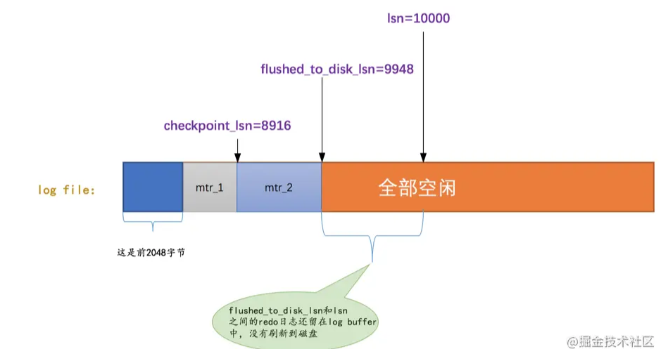


# innodb_flush_log_at_trx_commit的用法

我们前边说为了保证事务的`持久性`，用户线程在事务提交时需要将该事务执行过程中产生的所有`redo`日志都刷新到磁盘上。这一条要求太狠了，会很明显的降低数据库性能。如果有的同学对事务的`持久性`要求不是那么强烈的话，可以选择修改一个称为`innodb_flush_log_at_trx_commit`的系统变量的值，该变量有3个可选的值：

- `0`：当该系统变量值为0时，表示在事务提交时不立即向磁盘中同步`redo`日志，这个任务是交给后台线程做的。

  这样很明显会加快请求处理速度，但是如果事务提交后服务器挂了，后台线程没有及时将`redo`日志刷新到磁盘，那么该事务对页面的修改会丢失。

- `1`：当该系统变量值为1时，表示在事务提交时需要将`redo`日志同步到磁盘，可以保证事务的`持久性`。**`1`也是`innodb_flush_log_at_trx_commit`的默认值。**

- `2`：当该系统变量值为2时，表示在事务提交时需要将`redo`日志写到操作系统的缓冲区中，但并不需要保证将日志真正的刷新到磁盘。

  这种情况下如果数据库挂了，操作系统没挂的话，事务的`持久性`还是可以保证的，但是操作系统也挂了的话，那就不能保证`持久性`了。

# 什么是 crash-save ？

有了 redo log ，**即在 InnoDB 存储引擎中，事务提交过程中任何阶段，MySQL 突然奔溃，重启后都能保证事务的完整性，已提交的数据不会丢失，未提交完整的数据会自动进行回滚**。这个能力称为 crash-safe，依赖的就是 redo log 和 undo log 两个日志。


> 主要是利用checkPoint来实现的


# 崩溃恢复

## 确定恢复的起点

`checkpoint_lsn`之前的`redo`日志都可以被覆盖，**也就是说这些`redo`日志对应的脏页都已经被刷新到磁盘中了**，既然它们已经被刷盘，我们就没必要恢复它们了。对于`checkpoint_lsn`之后的`redo`日志，它们对应的脏页可能没被刷盘，也可能被刷盘了，我们不能确定，所以需要从`checkpoint_lsn`开始读取`redo`日志来恢复页面。

当然，`redo`日志文件组的第一个文件的管理信息中有两个block都存储了`checkpoint_lsn`的信息，我们当然是要选取最近发生的那次checkpoint的信息。衡量`checkpoint`发生时间早晚的信息就是所谓的`checkpoint_no`，我们只要把`checkpoint1`和`checkpoint2`这两个block中的`checkpoint_no`值读出来比一下大小，哪个的`checkpoint_no`值更大，说明哪个block存储的就是最近的一次`checkpoint`信息。这样我们就能拿到最近发生的`checkpoint`对应的`checkpoint_lsn`值以及它在`redo`日志文件组中的偏移量`checkpoint_offset`。


## 确定恢复的终点

`redo`日志恢复的起点确定了，那终点是哪个呢？这个还得从block的结构说起。我们说在写`redo`日志的时候都是顺序写的，写满了一个block之后会再往下一个block中写：


普通block的`log block header`部分有一个称之为`LOG_BLOCK_HDR_DATA_LEN`的属性，该属性值记录了当前block里使用了多少字节的空间。对于被填满的block来说，该值永远为`512`。如果该属性的值不为`512`，那么就是它了，它就是此次崩溃恢复中需要扫描的最后一个block。

> 记录当前block是否


# redo log 的执行流程

```mys
update T set a =1 where id =666
```


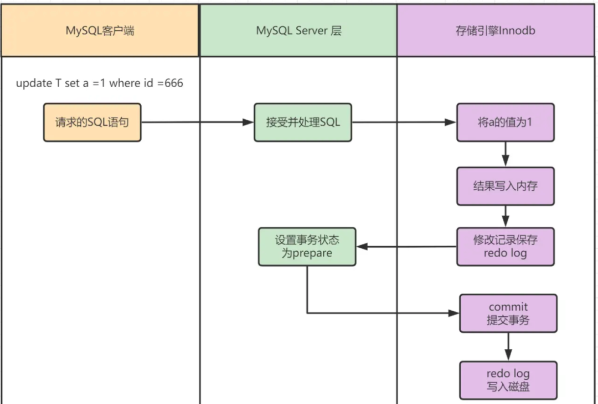


1. MySQL 客户端将请求语句 update T set a =1 where id =666，发往 MySQL Server 层。
2. MySQL Server 层接收到 SQL 请求后，对其进行分析、优化、执行等处理工作，将生成的 SQL 执行计划发到 InnoDB 存储引擎层执行。
3. InnoDB 存储引擎层将**a修改为1**的这个操作记录到内存中。
4. 记录到内存以后会修改 redo log 的记录，会在添加一行记录，其内容是**需要在哪个数据页上做什么修改**。
5. 此后，将事务的状态设置为 prepare ，说明已经准备好提交事务了。
6. 等到 MySQL Server 层处理完事务以后，会将事务的状态设置为 **commit**，也就是提交该事务。
7. 在收到事务提交的请求以后，**redo log** 会把刚才写入内存中的操作记录写入到磁盘中，从而完成整个日志的记录过程。


# 流程总结

1. **脏页-redo日志(内存)->redo buffer(会写redo 物理日志)->change buffer->mysql 数据库**

