# Table of Contents

* [事务回滚的需求](#事务回滚的需求)
* [事务ID](#事务id)
  * [事务id是怎么生成的](#事务id是怎么生成的)
  * [trx_id隐藏列](#trx_id隐藏列)
* [Undo日志格式(了解)](#undo日志格式了解)
* [Insert](#insert)
* [roll_pointer](#roll_pointer)
* [Delete](#delete)
  * [版本链表](#版本链表)
  * [索引列各列信息](#索引列各列信息)
* [Update](#update)
  * [不更新主键](#不更新主键)
  * [更新主键](#更新主键)
* [Undo页面](#undo页面)
* [Undo链表](#undo链表)
  * [一个事务](#一个事务)
  * [多个事务](#多个事务)
* [undo日志具体写入过程](#undo日志具体写入过程)
  * [Undo Log Segment Header](#undo-log-segment-header)
  * [Undo Log Header](#undo-log-header)
  * [小结](#小结)
* [Undo重用](#undo重用)
* [回滚段](#回滚段)
* [Purge](#purge)
* [总结](#总结)
* [疑惑](#疑惑)


# 事务回滚的需求

我们说过`事务`需要保证`原子性`，也就是事务中的操作要么全部完成，要么什么也不做。但是偏偏有时候事务执行到一半会出现一些情况，比如：

- 情况一：事务执行过程中可能遇到各种错误，比如服务器本身的错误，操作系统错误，甚至是突然断电导致的错误。
- 情况二：程序员可以在事务执行过程中手动输入`ROLLBACK`语句结束当前的事务的执行。

这两种情况都会导致事务执行到一半就结束，但是事务执行过程中可能已经修改了很多东西，为了保证事务的原子性，我们需要把东西改回原先的样子，这个过程就称之为`回滚`（英文名：`rollback`），这样就可以造成一个假象：这个事务看起来什么都没做，所以符合`原子性`要求。

每当我们要对一条记录做改动时（这里的`改动`可以指`INSERT`、`DELETE`、`UPDATE`），都需要留一手 —— 把回滚时所需的东西都给记下来。比方说：

- 你插入一条记录时，至少要把这条记录的主键值记下来，之后回滚的时候只需要把这个主键值对应的记录删掉就好了。
- 你删除了一条记录，至少要把这条记录中的内容都记下来，这样之后回滚时再把由这些内容组成的记录插入到表中就好了。
- 你修改了一条记录，至少要把修改这条记录前的旧值都记录下来，这样之后回滚时再把这条记录更新为旧值就好了。

设计数据库的大叔把这些为了回滚而记录的这些东东称之为撤销日志，英文名为`undo log`


# 事务ID

如果某个事务执行过程中对某个表执行了增、删、改操作，那么`InnoDB`存储引擎就会给它分配一个独一无二的`事务id`，分配方式如下：

+ 对于只读事务来说，只有在它第一次对某个用户创建的临时表执行增、删、改操作时才会为这个事务分配一个`事务id`，否则的话是不分配`事务id`的。

+ 对于读写事务来说，只有在它第一次对某个表（包括用户创建的临时表）执行增、删、改操作时才会为这个事务分配一个`事务id`，否则的话也是不分配`事务id`的。


## 事务id是怎么生成的

- 服务器会在内存中维护一个全局变量，每当需要为某个事务分配一个`事务id`时，就会把该变量的值当作`事务id`分配给该事务，并且把该变量自增1。
- 每当这个变量的值为`256`的倍数时，就会将该变量的值刷新到系统表空间的页号为`5`的页面中一个称之为`Max Trx ID`的属性处，这个属性占用`8`个字节的存储空间。
- 当系统下一次重新启动时，会将上边提到的`Max Trx ID`属性加载到内存中，将该值加上256之后赋值给我们前边提到的全局变量（因为在上次关机时该全局变量的值可能大于`Max Trx ID`属性值）。

这样就可以保证整个系统中分配的`事务id`值是一个递增的数字。先被分配`id`的事务得到的是较小的`事务id`，后被分配`id`的事务得到的是较大的`事务id`。

> 重启后事务id不一定连续新增
>
> 这时候有趣的问题来了。事务id会用完吗？


## trx_id隐藏列

聚簇索引的记录除了会保存完整的用户数据以外，而且还会自动添加名为trx_id、roll_pointer的隐藏列

+ `trx_id`：列其实还蛮好理解的，就是某个对这个聚簇索引记录做改动的语句所在的事务对应的`事务id`而已
+ roll_pointer:一个指针，指向对应的Undo日志。


# Undo日志格式(了解)

为了实现事务的`原子性`，`InnoDB`存储引擎在实际进行增、删、改一条记录时，都需要先把对应的`undo日志`记下来。一般每对一条记录做一次改动，就对应着一条`undo日志`，但在某些更新记录的操作中，也可能会对应着2条`undo日志`，这个我们后边会仔细唠叨。一个事务在执行过程中可能新增、删除、更新若干条记录，也就是说需要记录很多条对应的`undo日志`，这些`undo日志`会被从`0`开始编号，也就是说根据生成的顺序分别被称为`第0号undo日志`、`第1号undo日志`、...、`第n号undo日志`等，这个编号也被称之为`undo no`。

这些`undo日志`是被记录到类型为`FIL_PAGE_UNDO_LOG`（对应的十六进制是`0x0002`，忘记了页面类型是个啥的同学需要回过头再看看前边的章节）的页面中。这些页面可以从系统表空间中分配，也可以从一种专门存放`undo日志`的表空间，也就是所谓的`undo tablespace`中分配。不过关于如何分配存储`undo日志`的页面这个事情我们稍后再说，现在先来看看不同操作都会产生什么样子的`undo日志`吧～ 为了故事的顺利发展，我们先来创建一个名为`undo_demo`的表：

```
CREATE TABLE undo_demo (
    id INT NOT NULL,
    key1 VARCHAR(100),
    col VARCHAR(100),
    PRIMARY KEY (id),
    KEY idx_key1 (key1)
)Engine=InnoDB CHARSET=utf8;
```

这个表中有3个列，其中`id`列是主键，我们为`key1`列建立了一个二级索引，`col`列是一个普通的列。我们前边介绍`InnoDB`的数据字典时说过，每个表都会被分配一个唯一的`table id`，我们可以通过系统数据库`information_schema`中的`innodb_sys_tables`表来查看某个表对应的`table id`是什么，现在我们查看一下`undo_demo`对应的`table id`是多少：

```
mysql> SELECT * FROM information_schema.innodb_sys_tables WHERE name = 'xiaohaizi/undo_demo';
+----------+---------------------+------+--------+-------+-------------+------------+---------------+------------+
| TABLE_ID | NAME                | FLAG | N_COLS | SPACE | FILE_FORMAT | ROW_FORMAT | ZIP_PAGE_SIZE | SPACE_TYPE |
+----------+---------------------+------+--------+-------+-------------+------------+---------------+------------+
|      138 | xiaohaizi/undo_demo |   33 |      6 |   482 | Barracuda   | Dynamic    |             0 | Single     |
+----------+---------------------+------+--------+-------+-------------+------------+---------------+------------+
1 row in set (0.01 sec)
```

从查询结果可以看出，`undo_demo`表对应的`table id`为`138`，先把这个值记住，我们后边有用。


# Insert

> 你插入一条记录时，至少要把这条记录的主键值记下来，之后回滚的时候只需要把这个主键值对应的记录删掉就好了。


也就是说在写对应的`undo`日志时，主要是把这条记录的主键信息记上。所以设计`InnoDB`的大叔设计了一个类型为`TRX_UNDO_INSERT_REC`的`undo日志`，它的完整结构如下图所示：

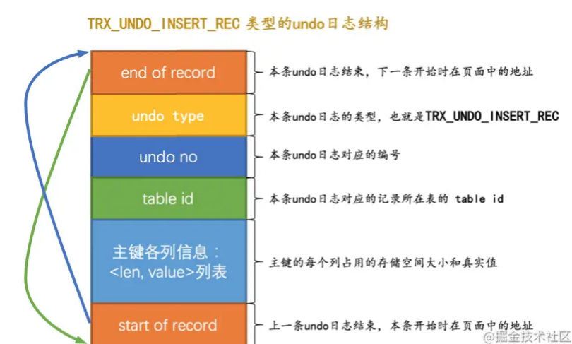


- `undo no`在一个事务中是从`0`开始递增的，也就是说只要事务没提交，每生成一条`undo日志`，那么该条日志的`undo no`就增1。
- 如果记录中的主键**只包含一个列**，那么在类型为`TRX_UNDO_INSERT_REC`的`undo日志`中只需要把该列占用的存储空间大小和真实值记录下来，
  **如果记录中的主键包含多个列**，那么每个列占用的存储空间大小和对应的真实值都需要记录下来（图中的`len`就代表列占用的存储空间大小，`value`就代表列的真实值）。

现在我们向`undo_demo`中插入两条记录：

```mysql
BEGIN;  # 显式开启一个事务，假设该事务的id为100

# 插入两条记录
INSERT INTO undo_demo(id, key1, col) 
    VALUES (1, 'AWM', '狙击枪'), (2, 'M416', '步枪');
```

因为记录的主键只包含一个`id`列，所以我们在对应的`undo日志`中只需要将待插入记录的`id`列占用的存储空间长度（`id`列的类型为`INT`，`INT`类型占用的存储空间长度为`4`个字节）和真实值记录下来。本例中插入了两条记录，所以会产生两条类型为`TRX_UNDO_INSERT_REC`的`undo日志`:

- 第一条`undo日志`的`undo no`为`0`，记录主键占用的存储空间长度为`4`，真实值为`1`。

+ 第二条`undo日志`的`undo no`为`1`，记录主键占用的存储空间长度为`4`，真实值为`2`。


# roll_pointer


> 本质上就是一个指向记录对应的`undo日志`的一个指针。

比方说我们上边向`undo_demo`表里插入了2条记录，每条记录都有与其对应的一条`undo日志`。记录被存储到了类型为`FIL_PAGE_INDEX`的页面中（就是我们前边一直所说的`数据页`），`undo日志`被存放到了类型为`FIL_PAGE_UNDO_LOG`的页面中。效果如图所示：

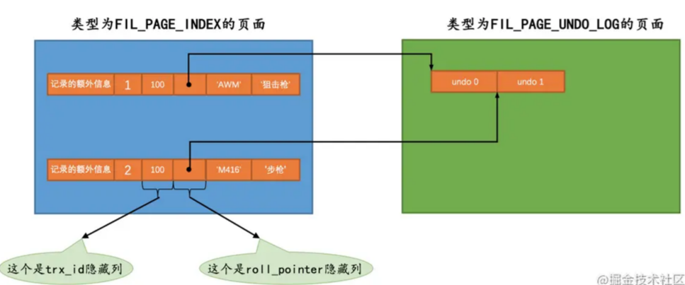


# Delete

> 你删除了一条记录，至少要把这条记录中的内容都记下来，这样之后回滚时再把由这些内容组成的记录插入到表中就好了。


我们在前边唠叨数据页结构的时候说过，被删除的记录其实也会根据记录头信息中的`next_record`属性组成一个链表，只不过这个链表中的记录占用的存储空间可以被重新利用，所以也称这个链表为`垃圾链表`。

我们之前的删除操作

+ 标志位变为1
+ 放入垃圾链表


假设现在我们准备使用`DELETE`语句把`正常记录链表`中的最后一条记录给删除掉，其实这个删除的过程需要经历两个阶段：


+ 仅仅将记录的`delete_mask`标识位设置为`1`，其他的不做修改（其实会修改记录的`trx_id`、`roll_pointer`这些隐藏列的值）

 > 注意这个时候是没有进入垃圾链表的，在事务提交之前，都是在正常链表，但标志为1
  >
  > 这个中间状态，主要是后面为了实现MVCC的


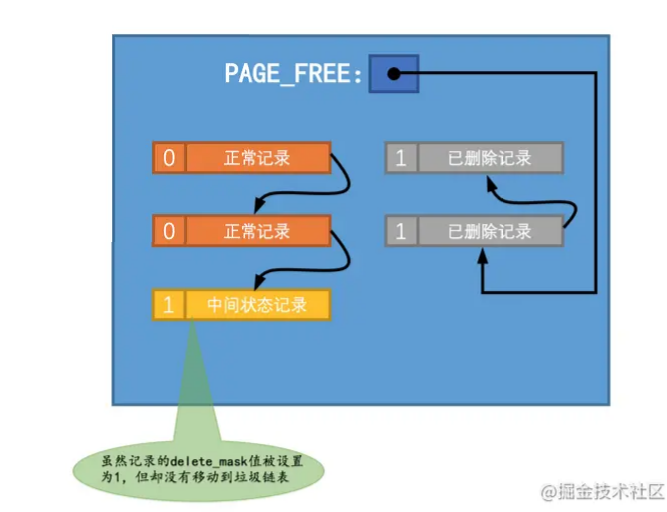
+ 当事务提交时，该记录从`正常记录链表`中移除，并且加入到`垃圾链表`中，然后还要调整一些页面的其他信息，比如页面中的用户记录数量`PAGE_N_RECS`、上次插入记录的位置`PAGE_LAST_INSERT`、垃圾链表头节点的指针`PAGE_FREE`、页面中可重用的字节数量`PAGE_GARBAGE`、还有页目录的一些信息等等。设计`InnoDB`的大叔把这个阶段称之为`purge`。

 TRX_UNDO_DEL_MARK_REC`类型的`undo日志


## 版本链表

+ 在对一条记录进行`delete mark`操作前，需要把该记录的旧的`trx_id`和`roll_pointer`隐藏列的值都给记到对应的`undo日志`中来，就是我们图中显示的`old trx_id`和`old roll_pointer`属性。这样有一个好处，那就是可以通过`undo日志`的`old roll_pointer`找到记录在修改之前对应的`undo`日志。

  >  就是记录上一次操作的Undo日志

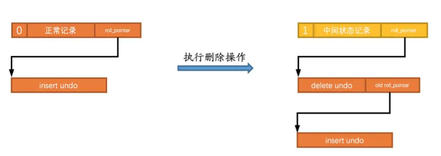

从图中可以看出来，执行完`delete mark`操作后，它对应的`undo`日志和`INSERT`操作对应的`undo`日志就串成了一个链表。这个很有意思啊，这个链表就称之为`版本链`


## 索引列各列信息

与类型为`TRX_UNDO_INSERT_REC`的`undo日志`不同，类型为`TRX_UNDO_DEL_MARK_REC`的`undo`日志还多了一个`索引列各列信息`的内容，**也就是说如果某个列被包含在某个索引中，那么它的相关信息就应该被记录到这个`索引列各列信息`部分**，所谓的相关信息包括该列在记录中的位置（用`pos`表示），该列占用的存储空间大小（用`len`表示），该列实际值（用`value`表示）。所以`索引列各列信息`存储的内容实质上就是`<pos, len, value>`的一个列表。这部分信息主要是用在事务提交后，对该`中间状态记录`做真正删除的阶段二


由于`undo_demo`表中有2个索引：一个是聚簇索引，一个是二级索引`idx_key1`。只要是包含在索引中的列，那么这个列在记录中的位置（`pos`），占用存储空间大小（`len`）和实际值（`value`）就需要存储到`undo日志`中。


+ 对于主键来说，只包含一个`id`列，存储到`undo日志`中的相关信息分别是：
  - `pos`：`id`列是主键，也就是在记录的第一个列，它对应的`pos`值为`0`。`pos`占用1个字节来存储。
  - `len`：`id`列的类型为`INT`，占用4个字节，所以`len`的值为`4`。`len`占用1个字节来存储。
  - `value`：在被删除的记录中`id`列的值为`1`，也就是`value`的值为`1`。`value`占用4个字节来存储。

+ 对于`idx_key1`来说，只包含一个`key1`列，存储到`undo日志`中的相关信息分别是：

  - `pos`：`key1`列是排在`id`列、`trx_id`列、`roll_pointer`列之后的，它对应的`pos`值为`3`。`pos`占用1个字节来存储。

  - `len`：`key1`列的类型为`VARCHAR(100)`，使用`utf8`字符集，被删除的记录实际存储的内容是`AWM`，所以一共占用3个字节，也就是所以`len`的值为`3`。`len`占用1个字节来存储。

  - `value`：在被删除的记录中`key1`列的值为`AWM`，也就是`value`的值为`AWM`。`value`占用3个字节来存储。

    

> 暂时不知道有什么用


# Update


> 更新因为设计到主键索引的分裂情况，所以需要分开讨论

## 不更新主键

+ 就地更新
  对于被更新的**每个列**来说,如果**更新后的列和更新前的列占用的存储空间都一样大**，那么就可以进行`就地更新`，也就是直接在原记录的基础上修改对应列的值

+ 先**删除旧数据**，在插入新数据

  我们这里所说的`删除`并不是`delete mark`操作，**而是真正的删除掉**，也就是把这条记录从`正常记录链表`中移除并加入到`垃圾链表`中，并且修改页面中相应的统计信息


> 为什么要这么做？

## 更新主键

`InnoDB`在聚簇索引中分了两步处理：

+ 将旧记录进行`delete mark`操作

  > 作者说，不删除是为了其他事务可以看见 ，那为什么上面不是主键更新的需要删除？ 等看完MVCC再来看

+ 根据更新后各列的值创建一条新记录，并将其插入到聚簇索引中（需重新定位插入的位置）。


针对`UPDATE`语句更新记录主键值的这种情况，在对该记录进行`delete mark`操作前，会记录一条类型为`TRX_UNDO_DEL_MARK_REC`的`undo日志`；之后插入新记录时，会记录一条类型为`TRX_UNDO_INSERT_REC`的`undo日志`，**也就是说每对一条记录的主键值做改动时，会记录2条`undo日志`**。


# Undo页面

`FIL_PAGE_UNDO_LOG`类型的页面是专门用来存储`undo日志`的，这种类型的页面的通用结构如下图所示（以默认的`16KB`大小为例）：


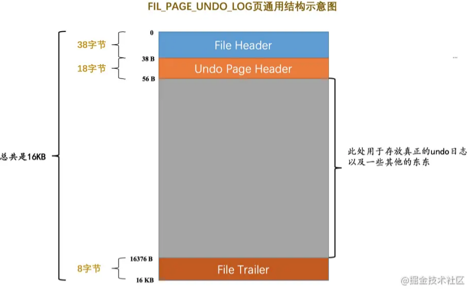


`Undo Page Header`是`Undo页面`所特有的，我们来看一下它的结构：

其中各个属性的意思如下：

- `TRX_UNDO_PAGE_TYPE`：本页面准备存储什么种类的`undo日志`。

  我们前边介绍了好几种类型的`undo日志`，它们可以被分为两个大类：

  - `TRX_UNDO_INSERT`（使用十进制`1`表示）：类型为`TRX_UNDO_INSERT_REC`的`undo日志`属于此大类，一般由`INSERT`语句产生，或者在`UPDATE`语句中有更新主键的情况也会产生此类型的`undo日志`。
  - `TRX_UNDO_UPDATE`（使用十进制`2`表示），除了类型为`TRX_UNDO_INSERT_REC`的`undo日志`，其他类型的`undo日志`都属于这个大类，比如我们前边说的`TRX_UNDO_DEL_MARK_REC`、`TRX_UNDO_UPD_EXIST_REC`啥的，一般由`DELETE`、`UPDATE`语句产生的`undo日志`属于这个大类。

  这个`TRX_UNDO_PAGE_TYPE`属性可选的值就是上边的两个，用来标记本页面用于存储哪个大类的`undo日志`，不同大类的`undo日志`不能混着存储，比如一个`Undo页面`的`TRX_UNDO_PAGE_TYPE`属性值为`TRX_UNDO_INSERT`，那么这个页面就只能存储类型为`TRX_UNDO_INSERT_REC`的`undo日志`，其他类型的`undo日志`就不能放到这个页面中了。

  > 小贴士： 之所以把undo日志分成两个大类，是因为类型为TRX_UNDO_INSERT_REC的undo日志在事务提交后可以直接删除掉，而其他类型的undo日志还需要为所谓的MVCC服务，不能直接删除掉，对它们的处理需要区别对待。当然，如果你看这段话迷迷糊糊的话，那就不需要再看一遍了，现在只需要知道undo日志分为2个大类就好了，更详细的东西我们后边会仔细唠叨的。

- `TRX_UNDO_PAGE_START`：表示在当前页面中是从什么位置开始存储`undo日志`的，或者说表示第一条`undo日志`在本页面中的起始偏移量。

- `TRX_UNDO_PAGE_FREE`：与上边的`TRX_UNDO_PAGE_START`对应，表示当前页面中存储的最后一条`undo`日志结束时的偏移量，或者说从这个位置开始，可以继续写入新的`undo日志`。

  假设现在向页面中写入了3条`undo日志`，那么`TRX_UNDO_PAGE_START`和`TRX_UNDO_PAGE_FREE`的示意图就是这样：

  

  

  

  当然，在最初一条`undo日志`也没写入的情况下，`TRX_UNDO_PAGE_START`和`TRX_UNDO_PAGE_FREE`的值是相同的。

- `TRX_UNDO_PAGE_NODE`：代表一个`List Node`结构


# Undo链表

>  总结一句就是：按需分配，啥时候需要啥时候再分配，不需要就不分配。
>
>  为了提高事务并发性，每个事务都会单独分配响应的Undo链表。

## 一个事务 


因为一个事务可能包含多个语句，而且一个语句可能对若干条记录进行改动，而对每条记录进行改动前，都需要记录1条或2条的`undo日志`，所以在一个事务执行过程中可能产生很多`undo日志`，这些日志可能一个页面放不下，需要放到多个页面中，这些页面就通过我们上边介绍的`TRX_UNDO_PAGE_NODE`属性连成了链表：


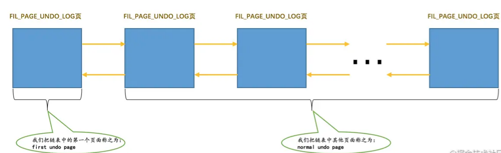


在一个事务执行过程中，可能混着执行`INSERT`、`DELETE`、`UPDATE`语句，也就意味着会产生不同类型的`undo日志`。

但是我们前边又强调过，同一个`Undo页面`要么只存储`TRX_UNDO_INSERT`大类的`undo日志`，要么只存储`TRX_UNDO_UPDATE`大类的`undo日志`，反正不能混着存，所以在一个事务执行过程中就可能需要2个`Undo页面`的链表，一个称之为`insert undo链表`，另一个称之为`update undo链表`，画个示意图就是这样：

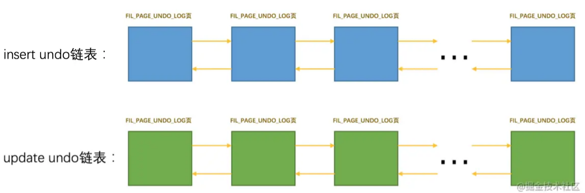


## 多个事务


为了尽可能提高`undo日志`的写入效率，不同事务执行过程中产生的undo日志需要被写入到不同的Undo页面链表中。比方说现在有事务`id`分别为`1`、`2`的两个事务，我们分别称之为`trx 1`和`trx 2`，假设在这两个事务执行过程中：

- `trx 1`对普通表做了`DELETE`操作，对临时表做了`INSERT`和`UPDATE`操作。

  `InnoDB`会为`trx 1`分配3个链表，分别是：

  - 针对普通表的`update undo链表`
  - 针对临时表的`insert undo链表`
  - 针对临时表的`update undo链表`。

- `trx 2`对普通表做了`INSERT`、`UPDATE`和`DELETE`操作，没有对临时表做改动。

  `InnoDB`会为`trx 2`分配2个链表，分别是：

  - 针对普通表的`insert undo链表`
  - 针对普通表的`update undo链表`。

综上所述，在`trx 1`和`trx 2`执行过程中，`InnoDB`共需为这两个事务分配5个`Undo页面`链表


# undo日志具体写入过程


## Undo Log Segment Header


> 了解下Undo页面可能有哪些状态


设计`InnoDB`的大叔规定，每一个`Undo页面`链表都对应着一个`段`，称之为`Undo Log Segment`。

也就是说链表中的页面都是从这个段里边申请的，所以他们在`Undo页面`链表的第一个页面，也就是上边提到的`first undo page`中设计了一个称之为`Undo Log Segment Header`的部分，这个部分中包含了该链表对应的段的`segment header`信息以及其他的一些关于这个段的信息，

所以`Undo`页面**链表的第一个页面**其实长这样：

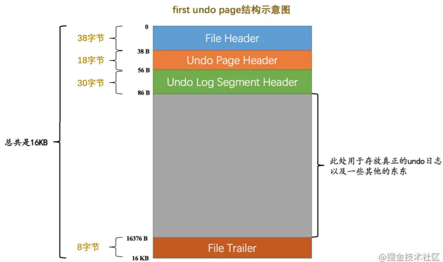

可以看到这个**`Undo`链表的第一个页面**比普通页面多了个`Undo Log Segment Header`，我们来看一下它的结构：


其中各个属性的意思如下：

- `TRX_UNDO_STATE`：本`Undo页面`链表处在什么状态。

  一个`Undo Log Segment`可能处在的状态包括：

  - `TRX_UNDO_ACTIVE`：活跃状态，也就是一个活跃的事务正在往这个段里边写入`undo日志`。
  - `TRX_UNDO_CACHED`：被缓存的状态。处在该状态的`Undo页面`链表等待着之后被其他事务重用。
  - `TRX_UNDO_TO_FREE`：对于`insert undo`链表来说，如果在它对应的事务提交之后，该链表不能被重用，那么就会处于这种状态。
  - `TRX_UNDO_TO_PURGE`：对于`update undo`链表来说，如果在它对应的事务提交之后，该链表不能被重用，那么就会处于这种状态。
  - `TRX_UNDO_PREPARED`：包含处于`PREPARE`阶段的事务产生的`undo日志`。

- `TRX_UNDO_LAST_LOG`：本`Undo页面`链表中最后一个`Undo Log Header`的位置。

  > 小贴士： 关于什么是Undo Log Header，我们稍后马上介绍哈。

- `TRX_UNDO_FSEG_HEADER`：本`Undo页面`链表对应的段的`Segment Header`信息（就是我们上一节介绍的那个10字节结构，通过这个信息可以找到该段对应的`INODE Entry`）。

- `TRX_UNDO_PAGE_LIST`：`Undo页面`链表的基节点。

  我们上边说`Undo页面`的`Undo Page Header`部分有一个12字节大小的`TRX_UNDO_PAGE_NODE`属性，这个属性代表一个`List Node`结构。每一个`Undo页面`都包含`Undo Page Header`结构，这些页面就可以通过这个属性连成一个链表。这个`TRX_UNDO_PAGE_LIST`属性代表着这个链表的基节点，当然这个基节点只存在于`Undo页面`链表的第一个页面，也就是`first undo page`中。


## Undo Log Header

> 主要是记录一组Undo日志的信息

一个事务在向`Undo页面`中写入`undo日志`时的方式是十分简单暴力的，就是直接往里怼，写完一条紧接着写另一条，各条`undo日志`之间是亲密无间的。写完一个`Undo页面`后，再从段里申请一个新页面，然后把这个页面插入到`Undo页面`链表中，继续往这个新申请的页面中写。设计`InnoDB`的大叔认为同一个事务向一个`Undo页面`链表中写入的`undo日志`算是一个组，比方说我们上边介绍的`trx 1`由于会分配3个`Undo页面`链表，也就会写入3个组的`undo日志`；`trx 2`由于会分配2个`Undo页面`链表，也就会写入2个组的`undo日志`。在每写入一组`undo日志`时，都会在这组`undo日志`前先记录一下关于这个组的一些属性，设计`InnoDB`的大叔把存储这些属性的地方称之为`Undo Log Header`。所以`Undo页面`链表的第一个页面在真正写入`undo日志`前，其实都会被填充`Undo Page Header`、`Undo Log Segment Header`、`Undo Log Header`这3个部分，如图所示：
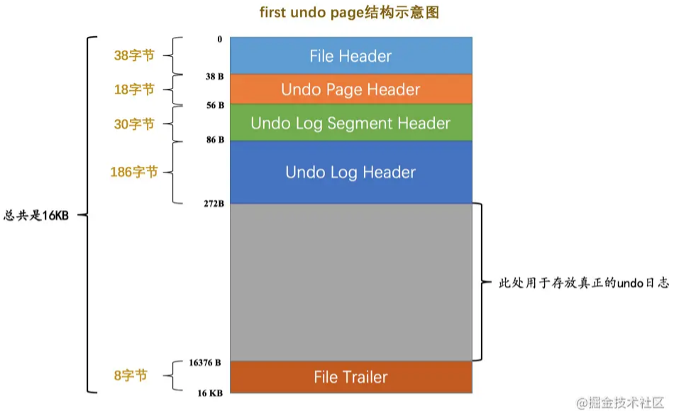


我们先大致看一下它们都是啥意思：

- `TRX_UNDO_TRX_ID`：生成本组`undo日志`的事务`id`。

- `TRX_UNDO_TRX_NO`：事务提交后生成的一个需要序号，使用此序号来标记事务的提交顺序（先提交的此序号小，后提交的此序号大）。

- `TRX_UNDO_DEL_MARKS`：标记本组`undo`日志中是否包含由于`Delete mark`操作产生的`undo日志`。

- `TRX_UNDO_LOG_START`：表示本组`undo`日志中第一条`undo日志`的在页面中的偏移量。

- `TRX_UNDO_XID_EXISTS`：本组`undo日志`是否包含XID信息。

  > 小贴士： 本书不会讲述更多关于XID是个什么东东，有兴趣的同学可以到搜索引擎或者文档中搜一搜哈。

- `TRX_UNDO_DICT_TRANS`：标记本组`undo日志`是不是由DDL语句产生的。

- `TRX_UNDO_TABLE_ID`：如果`TRX_UNDO_DICT_TRANS`为真，那么本属性表示DDL语句操作的表的`table id`。

- `TRX_UNDO_NEXT_LOG`：下一组的`undo日志`在页面中开始的偏移量。

- `TRX_UNDO_PREV_LOG`：上一组的`undo日志`在页面中开始的偏移量。

  > 小贴士： 一般来说一个Undo页面链表只存储一个事务执行过程中产生的一组undo日志，但是在某些情况下，可能会在一个事务提交之后，之后开启的事务重复利用这个Undo页面链表，这样就会导致一个Undo页面中可能存放多组Undo日志，TRX_UNDO_NEXT_LOG和TRX_UNDO_PREV_LOG就是用来标记下一组和上一组undo日志在页面中的偏移量的。关于什么时候重用Undo页面链表，怎么重用这个链表我们稍后会详细说明的，现在先理解TRX_UNDO_NEXT_LOG和TRX_UNDO_PREV_LOG这两个属性的意思就好了。

- `TRX_UNDO_HISTORY_NODE`：一个12字节的`List Node`结构，代表一个称之为`History`链表的节点。

## 小结

**对于没有被重用的`Undo页面`链表来说，链表的第一个页面，也就是`first undo page`在真正写入`undo日志`前，会填充`Undo Page Header`、`Undo Log Segment Header`、`Undo Log Header`这3个部分，之后才开始正式写入`undo日志`。**对于其他的页面来说，也就是`normal undo page`在真正写入`undo日志`前，只会填充`Undo Page Header`。链表的`List Base Node`存放到`first undo page`的`Undo Log Segment Header`部分，`List Node`信息存放到每一个`Undo页面`的`undo Page Header`部分，所以画一个`Undo页面`链表的示意图就是这样：


# Undo重用


为了能**提高并发执行的多个事务**写入`undo日志`的性能，设计`InnoDB`的大叔决定为每个**事务单独分配相应的`Undo页面`链表**（最多可能单独分配4个链表）。

但是这样也造成了一些问题，比如其实大部分事务执行过程中可能只修改了一条或几条记录，针对某个`Undo页面`链表只产生了非常少的`undo日志`，这些`undo日志`可能只占用一丢丢存储空间，每开启一个事务就新创建一个`Undo页面`链表（虽然这个链表中只有一个页面）来存储这么一丢丢`undo日志`岂不是太浪费了么？

一个`Undo页面`链表是否可以被重用的条件很简单：

- 该链表中只包含一个`Undo页面`。

  如果一个事务执行过程中产生了非常多的`undo日志`，那么它可能申请非常多的页面加入到`Undo页面`链表中。在该事物提交后，如果将整个链表中的页面都重用，那就意味着即使新的事务并没有向该`Undo页面`链表中写入很多`undo日志`，那该链表中也得维护非常多的页面，那些用不到的页面也不能被别的事务所使用，这样就造成了另一种浪费。所以设计`InnoDB`的大叔们规定，只有在`Undo页面`链表中只包含一个`Undo页面`时，该链表才可以被下一个事务所重用。

- 该`Undo页面`已经使用的空间小于整个页面空间的3/4。

我们前边说过，`Undo页面`链表按照存储的`undo日志`所属的大类可以被分为`insert undo链表`和`update undo链表`两种，这两种链表在被重用时的策略也是不同的，我们分别看一下：

- insert undo链表
  insert undo链表`中只存储类型为`TRX_UNDO_INSERT_REC`的`undo日志`，这种类型的`undo日志`在事务提交之后就没用了，就可以被清除掉。所以在某个事务提交后，重用这个事务的`insert undo链表`（这个链表中只有一个页面）时，可以直接把之前事务写入的一组`undo日志`覆盖掉，从头开始写入新事务的一组`undo日志

- update undo链表

  在一个事务提交后，它的`update undo链表`中的`undo日志`也不能立即删除掉（这些日志用于MVCC，我们后边会说的）。所以如果之后的事务想重用`update undo链表`时，就不能覆盖之前事务写入的`undo日志`。这样就相当于在同一个`Undo页面`中写入了多组的`undo日志`

  > 是一直不删除吗？并不是的，到了某种地步，mysql还是会重用这个页面


# 回滚段

> 开始事务后，怎么分配具体Undo页面对应具体事务的过程。

# Purge


大家有没有发现两件事儿：- 我们说`insert undo`在事务提交之后就可以被释放掉了，而`update undo`由于还需要支持`MVCC`，不能立即删除掉。- 为了支持`MVCC`，对于`delete mark`操作来说，仅仅是在记录上打一个删除标记，并没有真正将它删除掉。随着系统的运行，**在确定系统中包含最早产生的那个`ReadView`的事务不会再访问某些`update undo日志`以及被打了删除标记的记录后，有一个后台运行的`purge线程`会把它们真正的删除掉。**


# 总结 

1. 了解insert、delete、 update是怎么插入日志的 update比较特殊

2. 为了提高事务并发性，每个事务都会单独分配响应的Undo~~~~链表。-》解决方案就是重用这些链表，避免造成空间浪费 

3. 对于update类型的日志，比较特殊服务于后面的Mvcc
4. 回滚段就是给具体事务分配具体Undo页面的过程。
5. Undo被使用只是发生在运行阶段。
    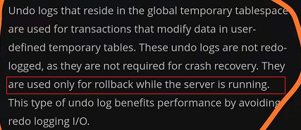

# 疑惑

1. 事务id会用完吗？

   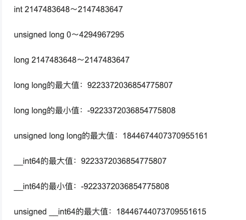

基本不会用完，用完应该也是可以重置的。
