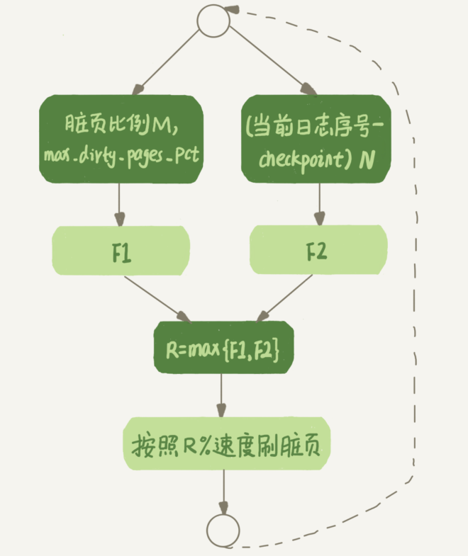

# Table of Contents

* [什么时候刷盘](#什么时候刷盘)
* [InnoDB刷脏页的控制策略](#innodb刷脏页的控制策略)
* [刷盘连坐策略](#刷盘连坐策略)
* [总结](#总结)
* [额外知识点](#额外知识点)


看上去，这就像是数据库“抖”了一下。今天，我们就一起来看一看这是什么原因。

我们在更新数据的时候，是先记Redo日志的。redo日志是宕机恢复用，那么修改的数据存在buffer pool中，是需要刷盘的。

**当内存数据页跟磁盘数据页内容不一致的时候，我们称这个内存页为“脏页”。内存数据写入到磁盘后，内存和磁盘上的数据页的内容就一致了，称为“干净页”。**

# 什么时候刷盘

那么，什么情况会引发数据库的flush过程呢？

+ 这个场景，对应的就是InnoDB的redo log写满了。
+ 这种场景，对应的就是系统内存不足。
+ 这种场景，对应的就是MySQL认为系统“空闲”的时候。
+ 这种场景，对应的就是MySQL正常关闭的情况。

第三种情况是属于MySQL空闲时的操作，这时系统没什么压力，而第四种场景是数据库本来就要关闭了。这两种情况下，你不会太关注“性能”问题。

所以这里，我们主要来分析一下前两种场景下的性能问题。

+ 第一种是“redo log写满了，要flush脏页”，**这种情况是InnoDB要尽量避免的。**因为出现这种情况的时候，整个系统就不能再接受更新了，所有的更新都必须堵住。如果你从监控上看，这时候更新数会跌为0。
+ 第二种是“内存不够用了，要先将脏页写到磁盘”，这种情况其实是常态。

InnoDB的策略是尽量使用内存，因此对于一个长时间运行的库来说，未被使用的页面很少。

而当要读入的数据页没有在内存的时候，就必须到缓冲池中申请一个数据页。这时候只能把最久不使用的数据页从内存中淘汰掉：如果要淘汰的是一个干净页，就直接释放出来复用； 但如果是脏页呢，就必须将脏页先刷到磁盘，变成干净页后才能复用。

所以，刷脏页虽然是常态，但是出现以下这两种情况，都是会明显影响性能的：

1. 一个查询要淘汰的脏页个数太多，会导致查询的响应时间明显变长；
2. 日志写满，更新全部堵住，写性能跌为0，这种情况对敏感业务来说，是不能接受的。 所以，InnoDB需要有控制脏页比例的机制，来尽量避免上面的这两种情况。

# InnoDB刷脏页的控制策略

首先，你要正确地告诉InnoDB所在主机的IO能力，这样InnoDB才能知道需要全力刷脏页的时候，可以刷多快。

这就要用到**innodb_io_capacity**这个参数了，它会告诉InnoDB你的磁盘能力。这个值我建议 你设置成磁盘的IOPS。磁盘的IOPS可以通过fio这个工具来测试，下面的语句是我用来测试磁 盘随机读写的命令：

```java
fio-filename=$filename-direct=1-iodepth 1-thread-rw=randrw-ioengine=psync-bs=16k-size=500M-
```

其实，因为没能正确地设置innodb_io_capacity参数，而导致的性能问题也比比皆是。之前，就曾有其他公司的开发负责人找我看一个库的性能问题，说MySQL的写入速度很慢，TPS很低，但是数据库主机的IO压力并不大。经过一番排查，发现罪魁祸首就是这个参数的设置出了问题。

虽然我们现在已经定义了“全力刷脏页”的行为，但平时总不能一直是全力刷吧？毕竟磁盘能力不能只用来刷脏页，还需要服务用户请求。所以接下来，我们就一起看看InnoDB怎么控制引擎按照“全力”的百分比来刷脏页。

根据我前面提到的知识点，试想一下，如果你来设计策略控制刷脏页的速度，会参考哪些因素呢？

这个问题可以这么想，如果刷太慢，会出现什么情况？首先是内存脏页太多，其次是redo log写满。

所以，InnoDB的刷盘速度就是要参考这两个因素：一个是脏页比例，一个是redo log写盘速度。

InnoDB会根据这两个因素先单独算出两个数字。参数innodb_max_dirty_pages_pct是脏页比例上限，默认值是75%。

InnoDB会根据当前的脏页比例（假设为M），算出一个范围在0到100之间的数字



现在你知道了，InnoDB会在后台刷脏页，而刷脏页的过程是要将内存页写入磁盘。所以，无
论是你的查询语句在需要内存的时候可能要求淘汰一个脏页，还是由于刷脏页的逻辑会占用IO资源并可能影响到了你的更新语句，都可能是造成你从业务端感知到MySQL“抖”了一下 的原因。

要尽量避免这种情况，**你就要合理地设置innodb_io_capacity的值，并且平时要多关注脏页 比例，不要让它经常接近75%。**

# 刷盘连坐策略

一旦一个查询请求需要在执行过程中先flush掉一个脏页时，这个查询就可能要比平时慢了。
而MySQL中的一个机制，可能让你的查询会更慢：在准备刷一个脏页的时候，如果这个数据页旁边的数据页刚好是脏页，就会把这个“邻居”也带着一起刷掉；而且这个把“邻居”拖
下水的逻辑还可以继续蔓延，也就是对于每个邻居数据页，如果跟它相邻的数据页也还是脏 页的话，也会被放到一起刷。

在InnoDB中，innodb_flush_neighbors 参数就是用来控制这个行为的，值为1的时候会有上 述的“连坐”机制，值为0时表示不找邻居，自己刷自己的。

找“邻居”这个优化在机械硬盘时代是很有意义的，可以减少很多随机IO。机械硬盘的随机 IOPS一般只有几百，相同的逻辑操作减少随机IO就意味着系统性能的大幅度提升。

而如果使用的是SSD这类IOPS比较高的设备的话，我就建议你把innodb_flush_neighbors的 值设置成0。因为这时候IOPS往往不是瓶颈，而“只刷自己”，就能更快地执行完必要的刷脏 页操作，减少SQL语句响应时间。

**在MySQL 8.0中，innodb_flush_neighbors参数的默认值已经是0了。**

# 总结

1. redo日志满了，buffer pool内存不足，需要刷盘。
2. InnoDB控制脏页比例，来避免极端情况。
3. InnoDB的刷盘速度就是要参考这两个因素：一个是脏页比例，一个是redo log写盘速度。参数`innodb_max_dirty_pages_pct`是脏页比例上限，默认值是75%。
4. 合理地设置`innodb_io_capacity`的值，并且平时要多关注脏页 比例，不要让它经常接近75%。
5. `bufferpool`脏页刷盘后，redo checkpoint前进，如果数据页已经刷盘，直接跳过。
6. 将脏页flush到磁盘上是直接将脏页数据覆盖到对应磁盘上的数据

# 额外知识点

+ flush 一般是说刷脏页，
+ purge一般是指清undo log,
+ merge一般是指应用change buffer
