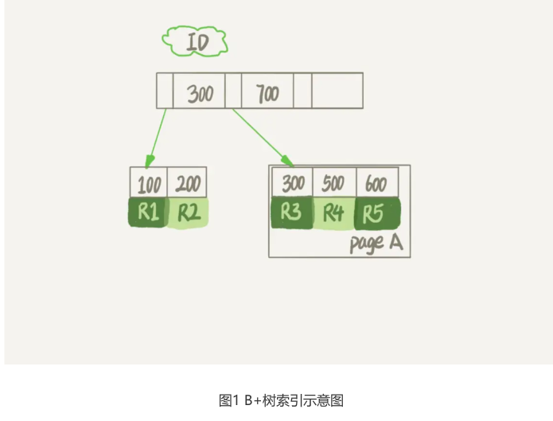
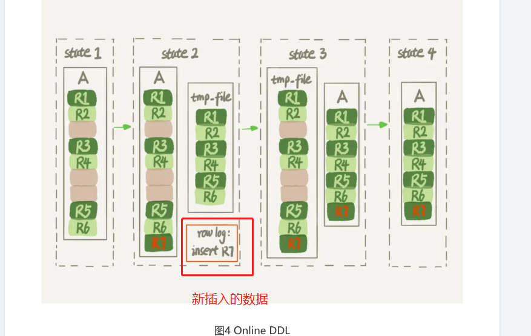

# Table of Contents

* [表结构和数据](#表结构和数据)
* [数据删除流程](#数据删除流程)
* [重建表](#重建表)
* [online DDL](#online-ddl)
* [Online 和 inplace](#online-和-inplace)
* [语句](#语句)
* [疑惑](#疑惑)
* [总结](#总结)


经常会有同学来问我，我的数据库占用空间太大，我把一个最大的表删掉了一半的数据，怎 么表文件的大小还是没变？

那么今天，我就和你聊聊数据库表的空间回收，看看如何解决这个问题。

# 表结构和数据

这里，我们还是针对MySQL中应用最广泛的InnoDB引擎展开讨论。一个InnoDB表包含两部 分，即：**表结构定义和数据。**

+ 表结构： 在MySQL 8.0版本以前，表结构是存在以.frm为后缀的文件里。而MySQL 8.0版本，则已经允许把表结构定义放在系统数据表中了。因为表结构定义占用的空间很小，所以我们今天主要讨论的是表数据。

+ 表数据： 表数据既可以存在共享表空间里，也可以是单独的文件。这个行为是由参数
  `innodb_file_per_table`控制的：

    1. 这个参数设置为OFF表示的是，表的数据放在系统共享表空间，也就是跟数据字典放在一 起；

    2. 这个参数设置为ON表示的是，每个InnoDB表数据存储在一个以 .ibd为后缀的文件中。

---

从MySQL 5.6.6版本开始，它的默认值就是ON了。我建议你不论使用MySQL的哪个版本，都将这个值设置为ON。因为，一个表单独存储为一个文件更容易管理，而且在你不需要这个表的时候，通过drop
table命令，系统就会直接删除这个文件。而如果是放在共享表空间中，即使表删掉了，空间也是不会回收的。所以，**innodb_file_per_table设置为ON，是推荐做法，我们接下来的讨论都是基于这个设置展开的。**

---

我们在删除整个表的时候，可以使用drop table命令回收表空间。但是，我们遇到的更多的删除数据的场景是删除某些行，这时就遇到了我们文章开头的问题：表中的数据被删除了，但是表空间却没有被回收。

# 数据删除流程



假设，我们要删掉R4这个记录，InnoDB引擎只会把R4这个**记录标记为删除**。如果之后要再插入一个ID在300和600之间的记录时，**可能会复用这个位置**。但是，磁盘文件的大小并不会缩小。

你现在知道了，delete命令其实只是把记录的位置，或者数据页标记为了“可复用”，但磁盘文件的大小是不会变的。也就是说，通过delete命令是不能回收表空间的。这些可以复用，而没有被使用的空间，看起来就像是“空洞”。
**实际上，不止是删除数据会造成空洞，插入/更新数据也会。**

+ 新增 ： 如果数据是按照索引递增顺序插入的，那么索引是紧凑的。但如果数据是随机插入的，就可 能造成索引的数据**页分裂。**
+ 更新： 删除一个旧的值，再插入一个新值 。如 12345 将2更新为6

---


现在，你已经知道了InnoDB的数据是按页存储的，那么如果我们删掉了一个数据页上的所有记录，会怎么样？

答案是，整个数据页就可以被复用了。但是，数据页的复用跟记录的复用是不同的。

+ 记录复用： **记录的复用，只限于符合范围条件的数据。**

  比如上面的这个例子，R4这条记录被删除后，如果插入一个ID是400的行，可以直接复用这个空间。但如果插入的是一个ID是800的行，就不能复用这个位置了。

+ 数据页复用：而当整个页从B+树里面摘掉以后，可以复用到任何位置。

# 重建表

试想一下，如果你现在有一个表A，需要做空间收缩，为了把表中存在的空洞去掉，你可以怎 么做呢？ 你可以新建一个与表A结构相同的表B，然后按照主键ID递增的顺序，把数据一行一行地从表 A里读出来再插入到表B中。

由于表B是新建的表，所以表A主键索引上的空洞，在表B中就都不存在了。显然地，表B的主 键索引更紧凑，数据页的利用率也更高。如果我们把表B作为临时表，数据从表A导入表B的 操作完成后，用表B替换A，从效果上看，就起到了收缩表A空间的作用。

这里，你可以使用**alter table A engine=InnoDB命令来重建表。**在MySQL 5.5版本之前，这
个命令的执行流程跟我们前面描述的差不多，区别只是这个临时表B不需要你自己创建，MySQL会自动完成转存数据、交换表名、删除旧表的操作。

显然，花时间最多的步骤是往临时表插入数据的过程，如果在这个过程中，有新的数据要写 入到表A的话，就会造成数据丢失。因此，在整个DDL过程中，表A中不能有更新。也就是 说，这个DDL不是Online的。

# online DDL

**而在MySQL5.6版本开始引入的Online DDL，对这个操作流程做了优化。**

我给你简单描述一下引入了Online DDL之后，重建表的流程：

1. 建立一个临时文件，扫描表A主键的所有数据页；
2. 用数据页中表A的记录生成B+树，存储到临时文件中；
3. 生成临时文件的过程中，**将所有对A的操作记录在一个日志文件（row log）中，对应的是**
   **图中state2的状态；**
4. 临时文件生成后，将日志文件中的操作应用到临时文件，得到一个逻辑数据上与表A相同的 数据文件，对应的就是图中state3的状态；
5. 用临时文件替换表A的数据文件。



DDL之前是要拿MDL写锁的，这样还能叫Online DDL吗？

确实，图4的流程中，alter语句在启动的时候需要获取MDL写锁，但是这个写锁在真正拷贝 数据之前就退化成读锁了。 为什么要退化呢？为了实现Online，MDL读锁不会阻塞增删改操作。

那为什么不干脆直接解锁呢？为了保护自己，禁止其他线程对这个表同时做DDL。

而对于一个大表来说，**Online DDL最耗时的过程就是拷贝数据到临时表的过程**，这个步骤的执行期间可以接受增删改操作。所以，相对于整个DDL过程来说，锁的时间非常短。对业务 来说，就可以认为是Online的。
需要补充说明的是，上述的这些重建方法都会扫描原表数据和构建临时文件。对于很大的表来说，这个操作是很消耗IO和CPU资源的。

因此，如果是线上服务，你要很小心地控制操作 时间。如果想要比较安全的操作的话，我推荐你使用GitHub开源的gh-ost来做。

# Online 和 inplace

说到Online，我还要再和你澄清一下它和另一个跟DDL有关的、容易混淆的概念inplace的区别。

你可能注意到了，在图3中，**我们把表A中的数据导出来的存放位置叫作tmp_table。这是一个临时表，是在server层创建的。**

在图4中，根据表A重建出来的数据是放在“tmp_file”里的，这个临时文件是InnoDB在内部创建出来的。整个DDL过程都在InnoDB内部完成。**
对于server层来说，没有把数据挪动到临时表，是一个“原地”操作，这就是“inplace”名称的来源。**

所以，我现在问你，如果你有一个1TB的表，现在磁盘间是1.2TB，能不能做一个inplace的 DDL呢？ 答案是不能。因为，tmp_file也是要占用临时空间的。

我们重建表的这个语句alter table t engine=InnoDB，其实隐含的意思是：

```MYSQL
alter table t engine=innodb,ALGORITHM=inplace;
```

跟inplace对应的就是拷贝表的方式了，用法是：

```MYSQL
alter table t engine=innodb,ALGORITHM=copy;
```

当你使用ALGORITHM=copy的时候，表示的是强制拷贝表，对应的流程就是图3的操作过 程。

 但我这样说你可能会觉得，inplace跟Online是不是就是一个意思？ 其实不是的，只是在重建表这个逻辑中刚好是这样而已。

比如，如果我要给InnoDB表的一个字段加全文索引，写法是：

```mysql
alter table t add FULLTEXT(field_name);
```

这个过程是inplace的，但会阻塞增删改操作，是非Online的。如果说这两个逻辑之间的关系是什么的话，可以概括为：
1. DDL过程如果是Online的，就一定是inplace的；
2. 反过来未必，也就是说inplace的DDL，有可能不是Online的。截止到MySQL 8.0，添加全
文索引（FULLTEXT index）和空间索引(SPATIAL index)就属于这种情况。


# 语句

+ alter table t engine = InnoDB（也就是recreate）
+ analyze table t 其实不是重建表，只是对表的索引信息做重新统计，没有修改数据，这个
  过程中加了MDL读锁；
+ optimize table t 等于recreate+analyze。


# 疑惑

假设现在有人碰到了一个“想要收缩表空间，结果适得其反”的情况，看上去是这样的：
1. 一个表t文件大小为1TB；
2. 对这个表执行 alter table t engine=InnoDB；
3. 发现执行完成后，空间不仅没变小，还稍微大了一点儿，比如变成了1.01TB。
你觉得可能是什么原因呢 ？

---


1. 过程中，有人新增了DDL。
2. 本来就很紧凑，没能整出多少剩余空间。重新收缩的过程中，页会按90%满的比例来重新整理页数据（10%留给UPDATE使用），未整理之前页已经占用90%以上，收缩之后，文件就反而变大了。


# 总结

1. InnoDB表包含两部分，即：**表结构定义和数据。**根据`innodb_file_per_table`决定表数据是单独存放还是放在共享表空间。默认单独存放。

2. 对数据的新增、更新、删除都会造成数据页的空洞。

3. 记录的复用，只限于符合范围条件的数据。数据页复用，是可以复用到任何位置。

4. 使用alter table A engine=InnoDB命令来重建表。

5. MySQL5.6之前是不能边重建，边DDL。5.6之后通过日志文件(row log)是可以 online DDL。

6. Online DDL最耗时的过程就是拷贝数据到临时表的过程，尽量避开业务高峰期。

7. DDL过程如果是Online的，就一定是inplace的。反过来未必，也就是说inplace的DDL，有可能不是Online的。截止到MySQL 8.0，添加全文索引（FULLTEXT index）和空间索引(SPATIAL index)就属于这种情况。

   > 可以这么理解：不影响增删改，就是 Online；相对 Server层没有新建临时表，就是 inplace
   >
   > 怎么判断是不是相对 Server 层没有新建临时表。一个最直观的判断方法是看命
   > 令执行后影响的行数，没有新建临时表的话新建的行数是0。

8. 1：alter table t engine=InnoDB
   2：optimize table t( 等于 recreate+analyze)。
   3：truntace table t (等于drop+create)

