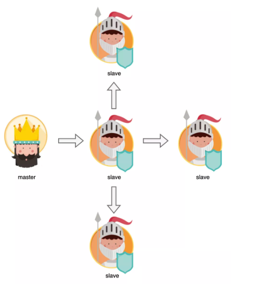
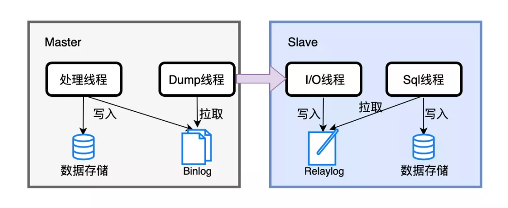
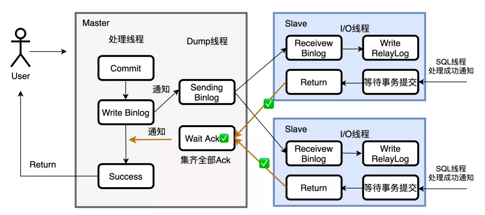
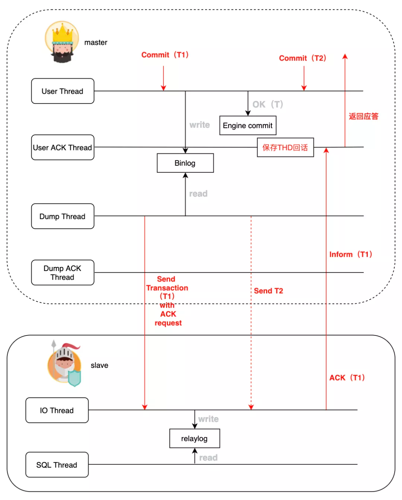
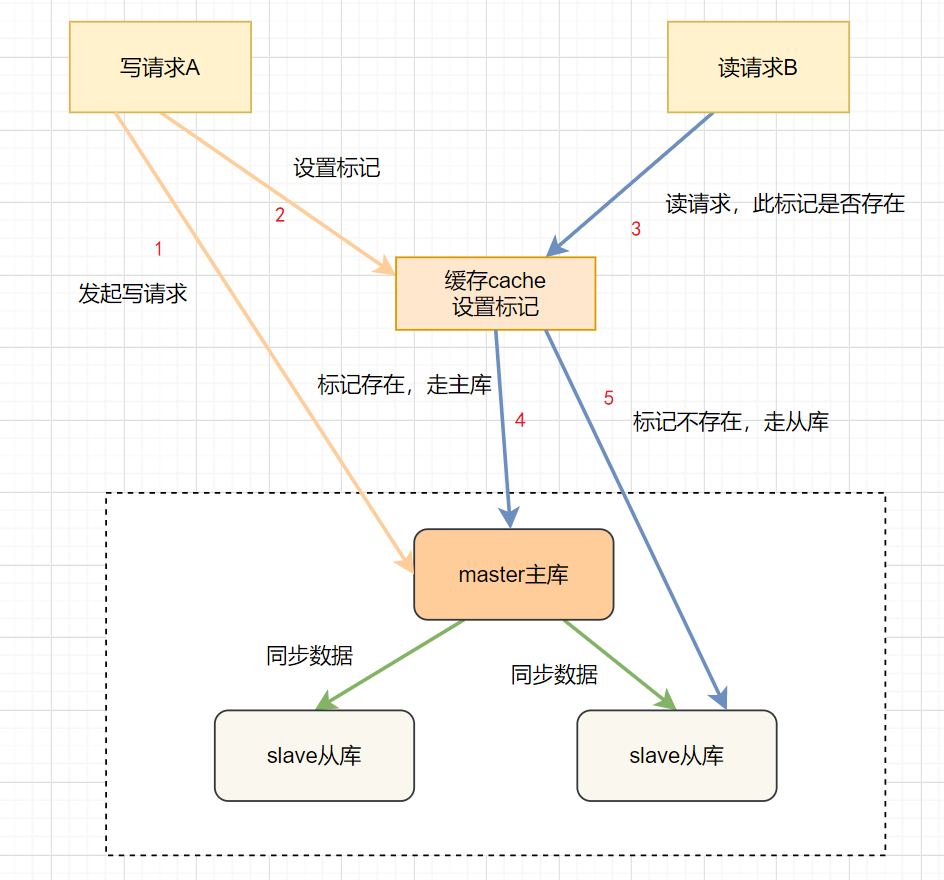

# Table of Contents

* [主从模式部署分为哪几种](#主从模式部署分为哪几种)
* [主从节点如何保持数据一致](#主从节点如何保持数据一致)
* [如何进行主从复制(重点)](#如何进行主从复制重点)
* [主从复制有哪几种模式](#主从复制有哪几种模式)
* [强同步模式(重点TDSQL)](#强同步模式重点tdsql)
* [**读写分离的场景下,怎么保证从数据库读到最新的数据?**](#读写分离的场景下怎么保证从数据库读到最新的数据)
* [参考资料](#参考资料)

> 最开始以为Mysql和Redis主从是差不多。
>
> 后面细看还是有个别区别。
>
> 1.

# 主从模式部署分为哪几种

+ 一主一丛

+ 一主多从

+ 级联多从：其实就是主的代理，这种分担了主的压力。

  

# 主从节点如何保持数据一致

+ 双写DB：成本比较大，保持一致性。
+ 主从复制：一般都是主从。

# 如何进行主从复制(重点)

当主节点上进行写操作时，会按照时间先后顺序写入到binlog中。**主从复制就是基于binlog**进行的，具体流程有两部分。

+ 当从节点连接到主节点时，主节点会创建一个叫做dump的线程，**有多少个从节点，就会创建多少个dump线程**;

  > 节点多也会带来开销，一般好像都是一主2从。

+ 当主节点的binlog发生变化的时候，dump线程就会通知从节点，并将相应的binlog内容发送给从节点。

当开启主从同步的时候，**从节点会创建两个线程用来完成数据同步工作**

+ **I/O线程**连接到主节点，主节点上的dump线程会将binlog的内容发送给I/O线程。它接收到内容后，再将其写入到本地的relay log。

+ **SQL线程**读取I/O线程写入的relay log，并且根据relay log的内容对从数据库做对应的操作。

# 主从复制有哪几种模式

+ 异步模式：这种模式下，主节点不关心dump线程同步情况，直接返回成功给客户。

+ 半同步模式：主节点只需要接收到**其中一台从节点**的返回信息，就会给用户返回成功，否则需要等待直到超时回滚。

  > 超时回滚，当前主库事务回滚吗？

+ 全同步模式：指主节点和从节点全部执行并**提交**了，才会向客户端返回成功。

  ​	**注意，是提交，而不只是从节点写入到relay log**，这样主从是强一致性的，但性能损耗非常大，必须在网络良好的情况下使用。

# 强同步模式(重点TDSQL)

全同步主要性能损耗在**于同步等待返回**，业界有一个方案叫MAR，即异步多线程强同步复制，只有当备机数据完全同步后，才由主机给予应用事务应答，保障数据不丢失，同时还用多线程思路保证了性能。

MAR可以说是半同步和全同步的折中，经常被称为强同步。腾讯的明星产品TDSQL，就是使用的MAR做同步。

+ Master上事务**写到binlog就算结束**，将会话保存到session中。接着**执行下一轮循环去处理其它请求**，这样就避免让线程阻塞等待应答了。
+ 然后负责主备同步的dump线程会将binlog立即发送给slave，slave的IO线程收到binlog并写入到relay log之后，**再给主机一个应答。**
+ 在Master，会有一组线程来处理应答，收到应答之后找到对应的会话，**还可以批量执行commit，并且给客户端应答。**

> 强同步只是提升了系统的并发能力，但是对于事务处理能力是没有提高的。

综合来看，MAR强同步复制的特点保证了节点间数据的较强一致性，又将串行同步操作异步化，还引入线程池能力，保证同城情况下TPS几乎不会下降。

# **读写分离的场景下,怎么保证从数据库读到最新的数据?**

在高并发场景或者网络不佳的场景，如果存在较大的主从同步数据延迟，这时候读请求去读从库，就会读到旧数据。这时候最简单暴力的方法，就是**强制读主库**。实际上可以使用**缓存标记法**。

- A发起写请求，更新主库数据，并在缓存中设置一个标记，表示数据已更新，标记格式为：userId+业务Id。
- 设置此标记，**设置过期时间（估值为主库和从库同步延迟的时间）**
- B发起读请求，先判断此请求，在缓存中有没有更新标记。
- 如果存在标记，走主库；如果没有，请求走从库。

这个方案，解决了数据不一致问题，但是每次请求都要先跟缓存打交道，会影响系统吞吐

# 参考资料

https://mp.weixin.qq.com/s/426oD3DMoDhsesHcZ52fwA

https://mp.weixin.qq.com/s/qhsVURhXm0Ot-jWq0khfEg
