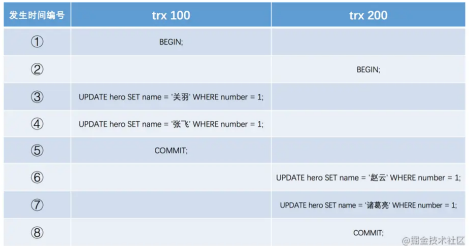
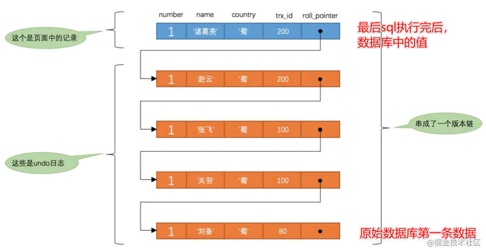
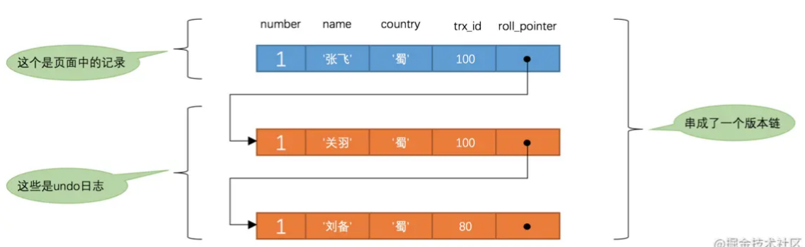
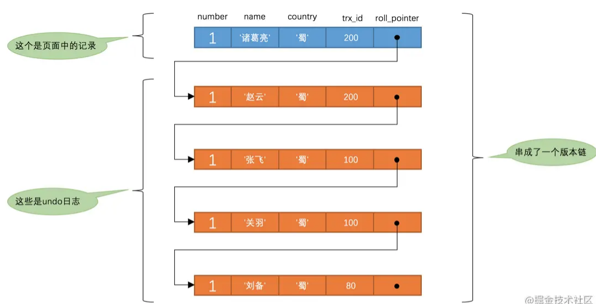
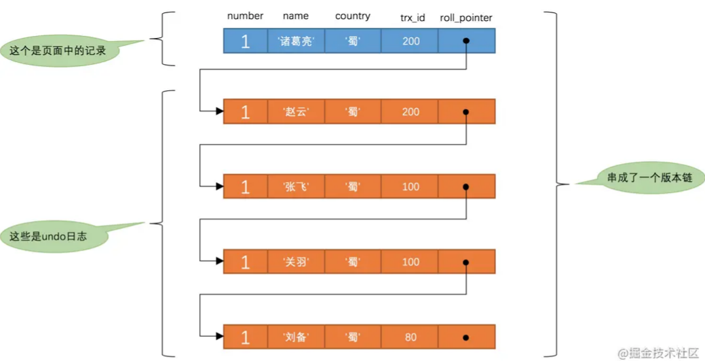
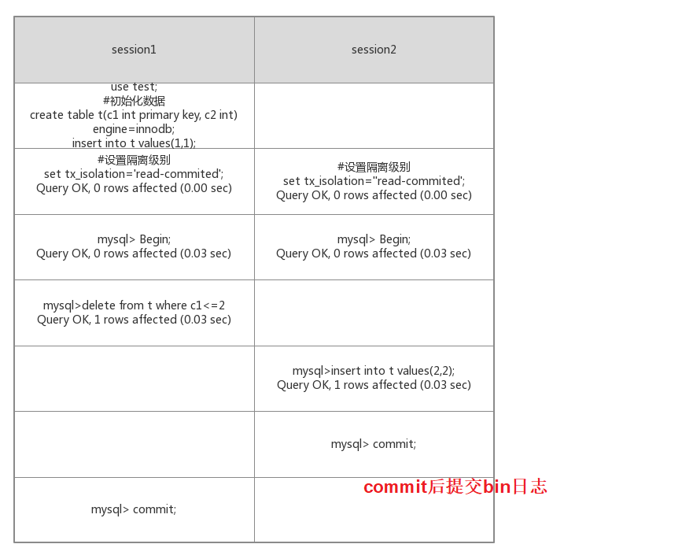

# Table of Contents

* [事务特性](#事务特性)
* [事务隔离级别](#事务隔离级别)
* [SQL标准中的四种隔离级别](#sql标准中的四种隔离级别)
* [MySQL中支持的四种隔离级别](#mysql中支持的四种隔离级别)
  * [如何设置事务的隔离级别](#如何设置事务的隔离级别)
  * [这四种隔离级别具体是如何实现的呢？](#这四种隔离级别具体是如何实现的呢)
* [MVCC产生过程](#mvcc产生过程)
* [MVCC原理](#mvcc原理)
  * [版本链](#版本链)
  * [ReadView](#readview)
  * [READ COMMITTED —— 每次读取数据前都生成一个ReadView](#read-committed--每次读取数据前都生成一个readview)
  * [REPEATABLE READ —— 在第一次读取数据时生成一个ReadView](#repeatable-read--在第一次读取数据时生成一个readview)
  * [MVCC小结](#mvcc小结)
* [MySQL InnoDB 引擎 RC 隔离级别是否解决了幻读](#mysql-innodb-引擎-rc-隔离级别是否解决了幻读)
* [MySQL InnoDB 引擎 RR 隔离级别是否解决了幻读](#mysql-innodb-引擎-rr-隔离级别是否解决了幻读)
* [总结](#总结)
* [相关问题](#相关问题)
  * [为什么Mysql默认是可重复读？](#为什么mysql默认是可重复读)
  * [RC和RR怎么选择？](#rc和rr怎么选择)
* [参考资料](#参考资料)


# 事务特性

事务是由 MySQL 的引擎来实现的，我们常见的 InnoDB 引擎它是支持事务的。

不过并不是所有的引擎都能支持事务，比如 MySQL 原生的 MyISAM 引擎就不支持事务，也正是这样，所以大多数 MySQL 的引擎都是用 InnoDB。

事务看起来感觉简单，但是要实现事务必须要遵守 4 个特性，分别如下：

- **原子性（Atomicity）**：一个事务中的所有操作，要么全部完成，要么全部不完成，不会结束在中间某个环节，而且事务在执行过程中发生错误，会被回滚到事务开始前的状态，就像这个事务从来没有执行过一样；
- **一致性（Consistency）**：数据库的完整性不会因为事务的执行而受到破坏，比如表中有一个字段为姓名，它有唯一约束，也就是表中姓名不能重复，如果一个事务对姓名字段进行了修改，但是在事务提交后，表中的姓名变得非唯一性了，这就破坏了事务的一致性要求，这时数据库就要撤销该事务，返回初始化的状态。
- **隔离性（Isolation）**：数据库允许多个并发事务同时对其数据进行读写和修改的能力，隔离性可以防止多个事务并发执行时由于交叉执行而导致数据的不一致。
- **持久性（Durability）**：事务处理结束后，对数据的修改就是永久的，即便系统故障也不会丢失。

InnoDB 引擎通过什么技术来保证事务的这四个特性的呢？

- 持久性是通过 redo log （重做日志）来保证的；
- 原子性是通过 undo log（回滚日志） 来保证的；
- 隔离性是通过 MVCC（多版本并发控制） 或锁机制来保证的；
- 一致性则是通过持久性+原子性+隔离性来保证；


# 事务隔离级别

在并发环境下，事务的隔离性很难保证，因此会出现很多并发一致性问题。


+ 脏写（`Dirty Write`）
  如果一个事务修改了另一个未提交事务修改过的数据，那就意味着发生了`脏写`

+ 脏读（`Dirty Read`）
  如果一个事务读到了另一个未提交事务修改过的数据，那就意味着发生了`脏读`

  > 出现脏写和脏读是因为事务可能被回滚

+ 不可重复读（Non-Repeatable Read）
  如果一个事务**只能读到另一个已经提交的事务修改过的数据**，并且其他事务每对该数据进行一次修改并提交后，该事务都能查询得到最新值，那就意味着发生了`不可重复读`
  
  
    不可重复读是指在对于数据库中的某个数据，<font color=red>一个事务范围内多次查询却返回了不同的数据值,和第一次查询结果不同</font>，这是由于在查询间隔，被另一个事务修改并提交了。
  
+ 幻读（Phantom）

  如果一个事务先根据某些条件查询出一些记录，之后另一个事务又向表中插入了符合这些条件的记录，原先的事务再次按照该条件查询时，能把另一个事务插入的记录也读出来，那就意味着发生了`幻读`

  `Session A`中的事务先根据条件`number > 0`这个条件查询表`hero`，得到了`name`列值为`'刘备'`的记录；之后`Session B`中提交了一个隐式事务，该事务向表`hero`中插入了一条新记录；之后`Session A`中的事务再根据相同的条件`number > 0`查询表`hero`，得到的结果集中包含`Session B`中的事务新插入的那条记录，这种现象也被称之为`幻读`。

  有的同学会有疑问，那如果`Session B`中是删除了一些符合`number > 0`的记录而不是插入新记录，那`Session A`中之后再根据`number > 0`的条件读取的记录变少了，这种现象算不算`幻读`呢？明确说一下，这种现象不属于`幻读`，

  <font color=red>`幻读`强调的是一个事务按照某个相同条件多次读取记录时，后读取时读到了之前没有读到的记录</font>


# SQL标准中的四种隔离级别

`SQL标准`中规定，针对不同的隔离级别，并发事务可以发生不同严重程度的问题，具体情况如下：

| 隔离级别           | 脏读         | 不可重复读   | 幻读         |
| ------------------ | ------------ | ------------ | ------------ |
| `READ UNCOMMITTED` | Possible     | Possible     | Possible     |
| `READ COMMITTED`   | Not Possible | Possible     | Possible     |
| `REPEATABLE READ`  | Not Possible | Not Possible | Possible     |
| `SERIALIZABLE`     | Not Possible | Not Possible | Not Possible |


# MySQL中支持的四种隔离级别


`MySQL`的默认隔离级别为`REPEATABLE READ`，我们可以手动修改一下事务的隔离级别。

## 如何设置事务的隔离级别

我们可以通过下边的语句修改事务的隔离级别：

```mysql
SET [GLOBAL|SESSION] TRANSACTION ISOLATION LEVEL level;
```

其中的`level`可选值有4个：

```
level: {
     REPEATABLE READ
   | READ COMMITTED
   | READ UNCOMMITTED
   | SERIALIZABLE
}
```

其他使用了解就行 

## 这四种隔离级别具体是如何实现的呢？

- 对于「读未提交」隔离级别的事务来说，因为可以读到未提交事务修改的数据，所以直接读取最新的数据就好了；
- 对于「串行化」隔离级别的事务来说，通过加读写锁的方式来避免并行访问；
- 对于「读提交」和「可重复读」隔离级别的事务来说，它们是通过 **Read View 来实现的，它们的区别在于创建 Read View 的时机不同，大家可以把 Read View 理解成一个数据快照，就像相机拍照那样，定格某一时刻的风景。「读提交」隔离级别是在「每个语句执行前」都会重新生成一个 Read View，而「可重复读」隔离级别是「启动事务时」生成一个 Read View，然后整个事务期间都在用这个 Read View**。

# MVCC产生过程

为什么需要MVCC呢？数据库通常使用锁来实现隔离性。最原生的锁，锁住一个资源后会禁止其他任何线程访问同一个资源。但是很多应用的一个特点都是读多写少的场景，很多数据的读取次数远大于修改的次数，而读取数据间互相排斥显得不是很必要。所以就使用了一种读写锁的方法，读锁和读锁之间不互斥，而写锁和写锁、读锁都互斥。这样就很大提升了系统的并发能力。之后人们发现并发读还是不够，又提出了能不能让读写之间也不冲突的方法，

就是**读取数据时通过一种类似快照的方式**将数据保存下来，这样读锁就和写锁不冲突了


# MVCC原理


## 版本链

对于使用`InnoDB`存储引擎的表来说，它的聚簇索引记录中都包含两个必要的隐藏列

+ `row_id`并不是必要的，我们创建的表中有主键或者非NULL的UNIQUE键时都不会包含`row_id`列：

- `trx_id`：每次一个事务对某条聚簇索引记录进行改动时，都会把该事务的`事务id`赋值给`trx_id`隐藏列。
- `roll_pointer`：每次对某条聚簇索引记录进行改动时，都会把旧的版本写入到`undo日志`中，然后这个隐藏列就相当于一个指针，可以通过它来找到该记录修改前的信息。<font color=red>这就构成了版本链</font>

假设之后两个`事务id`分别为`100`、`200`的事务对这条记录进行`UPDATE`操作，操作流程如下：



每次对记录进行改动，都会记录一条`undo日志`，每条`undo日志`也都有一个`roll_pointer`属性（`INSERT`操作对应的`undo日志`没有该属性，因为该记录并没有更早的版本），可以将这些`undo日志`都连起来，串成一个链表




## ReadView

> 准确说ReadView的产生，是依赖于版本链！

对于使用`READ UNCOMMITTED`隔离级别的事务来说，由于可以读到未提交事务修改过的记录，所以直接读取记录的最新版本就好了；对于使用`SERIALIZABLE`隔离级别的事务来说，设计`InnoDB`的大叔规定使用加锁的方式来访问记录（加锁是啥我们后续文章中说哈）；

对于使用`READ COMMITTED`和`REPEATABLE READ`隔离级别的事务来说，都必须保证读到已经提交了的事务修改过的记录，也就是说假如另一个事务已经修改了记录但是尚未提交，是不能直接读取最新版本的记录的，


核心问题就是：**需要判断一下版本链中的哪个版本是当前事务可见的**。为此，设计`InnoDB`的大叔提出了一个`ReadView`的概念，这个`ReadView`中主要包含4个比较重要的内容：

- `m_ids`：表示在生成`ReadView`时**当前系统中活跃的读写事务**的`事务id`列表。**“活跃事务”指的就是，启动了但还没提交的事务**。	 

  >对某行数据进行修改,A事务100 B事务102 C事务104 那么列表就是[100,102,104]

- `min_trx_id`：表示在生成`ReadView`时当前系统中**活跃的读写事务中最小的`事务id`**，也就是`m_ids`中的最小值。

- `max_trx_id`：表示生成`ReadView`时系统中应该分配给下一个事务的`id`值。

  > 小贴士： 注意max_trx_id并不是m_ids中的最大值，事务id是递增分配的。比方说现在有id为1，2，3这三个事务，之后id为3的事务提交了。那么一个新的读事务在生成ReadView时，m_ids就包括1和2，min_trx_id的值就是1，max_trx_id的值就是4。

- `creator_trx_id`：表示生成**该`ReadView`的事务的`事务id`**。

  > 小贴士： 我们前边说过，只有在对表中的记录做改动时（执行INSERT、DELETE、UPDATE这些语句时）才会为事务分配事务id，否则在一个只读事务中
  > 的事务id值都默认为0。


<font color=red>下面这话反复读,理解为止</font>

有了这个`ReadView`，这样在**访问某条记录**时，只需要按照下边的步骤判断记录的某个版本是否可见：

- 如果被访问版本的`trx_id`属性值与`ReadView`中的`creator_trx_id`值相同，意味着当前事务在访问它自己修改过的记录，所以该版本可以被当前事务访问。
- 如果被访问版本的`trx_id`属性值小于`ReadView`中的`min_trx_id`值，表明生成该版本的事务在当前事务生成`ReadView`前已经提交，所以该版本可以被当前事务访问。
- 如果被访问版本的`trx_id`属性值大于或等于`ReadView`中的`max_trx_id`值，表明生成该版本的事务在当前事务生成`ReadView`后才开启，所以该版本不可以被当前事务访问。
- 如果被访问版本的`trx_id`属性值在`ReadView`的`min_trx_id`和`max_trx_id`之间，那就需要判断一下`trx_id`属性值是不是在`m_ids`列表中，**如果在，说明创建`ReadView`时生成该版本的事务还是活跃的，该版本不可以被访问；如果不在，说明创建`ReadView`时生成该版本的事务已经被提交，该版本可以被访问**。

**如果某个版本的数据对当前事务不可见的话，那就顺着版本链找到下一个版本的数据，继续按照上边的步骤判断可见性，依此类推，直到版本链中的最后一个版本**。如果最后一个版本也不可见的话，那么就意味着该条记录对该事务完全不可见，查询结果就不包含该记录。


在`MySQL`中，`READ COMMITTED`和`REPEATABLE READ`隔离级别的的一个非常大的区别就是**它们生成ReadView的时机不同**。

我们还是以表`hero`为例来，假设现在表`hero`中只有一条由`事务id`为`80`的事务插入的一条记录：

```mysql
mysql> SELECT * FROM hero;
+--------+--------+---------+
| number | name   | country |
+--------+--------+---------+
|      1 | 刘备   | 蜀      |
+--------+--------+---------+
1 row in set (0.07 sec)
```

接下来看一下`READ COMMITTED`和`REPEATABLE READ`所谓的生成ReadView的时机不同到底不同在哪里。


## READ COMMITTED —— 每次读取数据前都生成一个ReadView

比方说现在系统里有两个`事务id`分别为`100`、`200`的事务在执行：

```
# Transaction 100
BEGIN;

UPDATE hero SET name = '关羽' WHERE number = 1;

UPDATE hero SET name = '张飞' WHERE number = 1;
# Transaction 200
BEGIN;

# 更新了一些别的表的记录
...
```

> 小贴士： 再次强调一遍，事务执行过程中，只有在第一次真正修改记录时（比如使用INSERT、DELETE、UPDATE语句），才会被分配一个单独的事务id，这个事务id是递增的。所以我们才在Transaction 200中更新一些别的表的记录，目的是让它分配事务id。

此刻，表`hero`中`number`为`1`的记录得到的版本链表如下所示：





假设现在有一个使用`READ COMMITTED`隔离级别的事务开始执行：

```
# 使用READ COMMITTED隔离级别的事务
BEGIN;

# SELECT1：Transaction 100、200未提交
SELECT * FROM hero WHERE number = 1; # 得到的列name的值为'刘备'
```

这个`SELECT1`的执行过程如下：

- 在执行`SELECT`语句时会先生成一个`ReadView`，`ReadView`的`m_ids`列表的内容就是`[100, 200]`，`min_trx_id`为`100`，`max_trx_id`为`201`，`creator_trx_id`为`0`。
- 然后从版本链中挑选可见的记录，从图中可以看出，最新版本的列`name`的内容是`'张飞'`，该版本的`trx_id`值为`100`，在`m_ids`列表内，所以不符合可见性要求，根据`roll_pointer`跳到下一个版本。
- 下一个版本的列`name`的内容是`'关羽'`，该版本的`trx_id`值也为`100`，也在`m_ids`列表内，所以也不符合要求，继续跳到下一个版本。
- 下一个版本的列`name`的内容是`'刘备'`，该版本的`trx_id`值为`80`，小于`ReadView`中的`min_trx_id`值`100`，所以这个版本是符合要求的，最后返回给用户的版本就是这条列`name`为`'刘备'`的记录。

之后，我们把`事务id`为`100`的事务提交一下，就像这样：

```
# Transaction 100
BEGIN;

UPDATE hero SET name = '关羽' WHERE number = 1;

UPDATE hero SET name = '张飞' WHERE number = 1;

COMMIT;
```

然后再到`事务id`为`200`的事务中更新一下表`hero`中`number`为`1`的记录：

```
# Transaction 200
BEGIN;

# 更新了一些别的表的记录
...

UPDATE hero SET name = '赵云' WHERE number = 1;

UPDATE hero SET name = '诸葛亮' WHERE number = 1;
```

此刻，表`hero`中`number`为`1`的记录的版本链就长这样：





然后再到刚才使用`READ COMMITTED`隔离级别的事务中继续查找这个`number`为`1`的记录，如下：

```
# 使用READ COMMITTED隔离级别的事务
BEGIN;

# SELECT1：Transaction 100、200均未提交
SELECT * FROM hero WHERE number = 1; # 得到的列name的值为'刘备'

# SELECT2：Transaction 100提交，Transaction 200未提交
SELECT * FROM hero WHERE number = 1; # 得到的列name的值为'张飞'
```

这个`SELECT2`的执行过程如下：

- 在执行`SELECT`语句时会又会单独生成一个`ReadView`，该`ReadView`的`m_ids`列表的内容就是`[200]`（`事务id`为`100`的那个事务已经提交了，所以再次生成快照时就没有它了），`min_trx_id`为`200`，`max_trx_id`为`201`，`creator_trx_id`为`0`。
- 然后从版本链中挑选可见的记录，从图中可以看出，最新版本的列`name`的内容是`'诸葛亮'`，该版本的`trx_id`值为`200`，在`m_ids`列表内，所以不符合可见性要求，根据`roll_pointer`跳到下一个版本。
- 下一个版本的列`name`的内容是`'赵云'`，该版本的`trx_id`值为`200`，也在`m_ids`列表内，所以也不符合要求，继续跳到下一个版本。
- 下一个版本的列`name`的内容是`'张飞'`，该版本的`trx_id`值为`100`，小于`ReadView`中的`min_trx_id`值`200`，所以这个版本是符合要求的，最后返回给用户的版本就是这条列`name`为`'张飞'`的记录。

以此类推，如果之后`事务id`为`200`的记录也提交了，再次在使用`READ COMMITTED`隔离级别的事务中查询表`hero`中`number`值为`1`的记录时，得到的结果就是`'诸葛亮'`了，具体流程我们就不分析了。总结一下就是：使用READ COMMITTED隔离级别的事务在每次查询开始时都会生成一个独立的ReadView。


## REPEATABLE READ —— 在第一次读取数据时生成一个ReadView


> 对于使用`REPEATABLE READ`隔离级别的事务来说，只会在第一次执行查询语句时生成一个`ReadView`，之后的查询就不会重复生成了。
> 后面查询会复用第一次查询的快照读

比方说现在系统里有两个`事务id`分别为`100`、`200`的事务在执行：

```mysql
# Transaction 100
BEGIN;

UPDATE hero SET name = '关羽' WHERE number = 1;

UPDATE hero SET name = '张飞' WHERE number = 1;
# Transaction 200
BEGIN;

# 更新了一些别的表的记录
...
```

此刻，表`hero`中`number`为`1`的记录得到的版本链表如下所示：


假设现在有一个使用`REPEATABLE READ`隔离级别的事务开始执行：

```
# 使用REPEATABLE READ隔离级别的事务
BEGIN;

# SELECT1：Transaction 100、200未提交
SELECT * FROM hero WHERE number = 1; # 得到的列name的值为'刘备'
```

这个`SELECT1`的执行过程如下：

- 在执行`SELECT`语句时会先生成一个`ReadView`，`ReadView`的`m_ids`列表的内容就是`[100, 200]`，`min_trx_id`为`100`，`max_trx_id`为`201`，`creator_trx_id`为`0`。
- 然后从版本链中挑选可见的记录，从图中可以看出，最新版本的列`name`的内容是`'张飞'`，该版本的`trx_id`值为`100`，在`m_ids`列表内，所以不符合可见性要求，根据`roll_pointer`跳到下一个版本。
- 下一个版本的列`name`的内容是`'关羽'`，该版本的`trx_id`值也为`100`，也在`m_ids`列表内，所以也不符合要求，继续跳到下一个版本。
- 下一个版本的列`name`的内容是`'刘备'`，该版本的`trx_id`值为`80`，小于`ReadView`中的`min_trx_id`值`100`，所以这个版本是符合要求的，最后返回给用户的版本就是这条列`name`为`'刘备'`的记录。

之后，我们把`事务id`为`100`的事务提交一下，就像这样：

```
# Transaction 100
BEGIN;

UPDATE hero SET name = '关羽' WHERE number = 1;

UPDATE hero SET name = '张飞' WHERE number = 1;

COMMIT;
```

然后再到`事务id`为`200`的事务中更新一下表`hero`中`number`为`1`的记录：

```
# Transaction 200
BEGIN;

# 更新了一些别的表的记录
...

UPDATE hero SET name = '赵云' WHERE number = 1;

UPDATE hero SET name = '诸葛亮' WHERE number = 1;
```

此刻，表`hero`中`number`为`1`的记录的版本链就长这样：



然后再到刚才使用`REPEATABLE READ`隔离级别的事务中继续查找这个`number`为`1`的记录，如下：

```
# 使用REPEATABLE READ隔离级别的事务
BEGIN;

# SELECT1：Transaction 100、200均未提交
SELECT * FROM hero WHERE number = 1; # 得到的列name的值为'刘备'

# SELECT2：Transaction 100提交，Transaction 200未提交
SELECT * FROM hero WHERE number = 1; # 得到的列name的值仍为'刘备'
```

这个`SELECT2`的执行过程如下：

- 因为当前事务的隔离级别为`REPEATABLE READ`，而之前在执行`SELECT1`时已经生成过`ReadView`了，所以此时直接复用之前的`ReadView`，之前的`ReadView`的`m_ids`列表的内容就是`[100, 200]`，`min_trx_id`为`100`，`max_trx_id`为`201`，`creator_trx_id`为`0`。
- 然后从版本链中挑选可见的记录，从图中可以看出，最新版本的列`name`的内容是`'诸葛亮'`，该版本的`trx_id`值为`200`，在`m_ids`列表内，所以不符合可见性要求，根据`roll_pointer`跳到下一个版本。
- 下一个版本的列`name`的内容是`'赵云'`，该版本的`trx_id`值为`200`，也在`m_ids`列表内，所以也不符合要求，继续跳到下一个版本。
- 下一个版本的列`name`的内容是`'张飞'`，该版本的`trx_id`值为`100`，而`m_ids`列表中是包含值为`100`的`事务id`的，所以该版本也不符合要求，同理下一个列`name`的内容是`'关羽'`的版本也不符合要求。继续跳到下一个版本。
- 下一个版本的列`name`的内容是`'刘备'`，该版本的`trx_id`值为`80`，小于`ReadView`中的`min_trx_id`值`100`，所以这个版本是符合要求的，最后返回给用户的版本就是这条列`c`为`'刘备'`的记录。

也就是说两次`SELECT`查询得到的结果是重复的，记录的列`c`值都是`'刘备'`，这就是`可重复读`的含义。如果我们之后再把`事务id`为`200`的记录提交了，然后再到刚才使用`REPEATABLE READ`隔离级别的事务中继续查找这个`number`为`1`的记录，得到的结果还是`'刘备'`，具体执行过程大家可以自己分析一下。


## MVCC小结

从上边的描述中我们可以看出来，

所谓的`MVCC`（Multi-Version Concurrency Control ，多版本并发控制）指的就是在使用`READ COMMITTD`、`REPEATABLE READ`这两种隔离级别的事务在执行普通的`SELECT`**操作时的过程**，这样子可以**使不同事务的`读-写`、`写-读`操作并发执行，从而提升系统性能**。

`READ COMMITTD`、`REPEATABLE READ`这两个隔离级别的一个很大不同就是：**生成ReadView的时机不同**，

+ READ COMMITTD在每一次进行普通SELECT操作前都会生成一个ReadView，
+ 而REPEATABLE READ只在第一次进行普通SELECT操作前生成一个ReadView，之后的查询操作都重复使用这个ReadView就好了。


# MySQL InnoDB 引擎 RC 隔离级别是否解决了幻读

并没有

读已提交，每次都是读取最新的。


# MySQL InnoDB 引擎 RR 隔离级别是否解决了幻读

引用一个 github 上面的评论 [地址](https://github.com/Yhzhtk/note/issues/42#issuecomment-424079787)：

> Mysql官方给出的幻读解释是：只要在一个事务中，第二次select多出了row就算幻读。
> a事务先select，b事务insert确实会加一个gap锁，但是如果b事务commit，这个gap锁就会释放（释放后a事务可以随意dml操作），a事务再select出来的结果在MVCC下还和第一次select一样，接着a事务不加条件地update，这个update会作用在所有行上（包括b事务新加的），a事务再次select就会出现b事务中的新行，并且这个新行已经被update修改了，实测在RR级别下确实如此。
>
> 如果这样理解的话，Mysql的RR级别确实防不住幻读


+ 在快照读读情况下，mysql通过mvcc来避免幻读。快照读不会有幻读的数据

+ 在当前读读情况下，mysql通过next-key来避免幻读。加锁


那什么时候执行快照读什么时候当前读呢？取决你的sql

```mysql
select *  from A  --快照
select *  from A for update--当前
```


https://www.cnblogs.com/wudanyang/p/10655180.html


# 总结

事务是在 MySQL 引擎层实现的，我们常见的 InnoDB 引擎是支持事务的，事务的四大特性是原子性、一致性、隔离性、持久性，我们这次主要讲的是隔离性。

当多个事务并发执行的时候，会引发脏读、不可重复读、幻读这些问题，那为了避免这些问题，SQL 提出了四种隔离级别，分别是读未提交、读已提交、可重复读、串行化，从左往右隔离级别顺序递增，隔离级别越高，意味着性能越差，InnoDB 引擎的默认隔离级别是可重复读。

要解决脏读现象，就要将隔离级别升级到读已提交以上的隔离级别，要解决不可重复读现象，就要将隔离级别升级到可重复读以上的隔离级别。

而对于幻读现象，不建议将隔离级别升级为串行化，因为这会导致数据库并发时性能很差。InnoDB 引擎的默认隔离级别虽然是「可重复读」，但是它通过 next-key lock 锁（行锁+间隙锁的组合）来锁住记录之间的“间隙”和记录本身，防止其他事务在这个记录之间插入新的记录，这样就避免了幻读现象。

对于「读提交」和「可重复读」隔离级别的事务来说，它们是通过 **Read View **来实现的，它们的区别在于创建 Read View 的时机不同：

- 「读提交」隔离级别是在**每个 select 都会生成一个新的 Read View**，也意味着，事务期间的多次读取同一条数据，前后两次读的数据可能会出现不一致，因为可能这期间另外一个事务修改了该记录，并提交了事务。
- 「可重复读」隔离级别是**启动事务时生成一个 Read View**，然后整个事务期间都在用这个 Read View，这样就保证了在事务期间读到的数据都是事务启动前的记录。

这两个隔离级别实现是通过「事务的 Read View 里的字段」和「记录中的两个隐藏列」的比对，来控制并发事务访问同一个记录时的行为，这就叫 MVCC（多版本并发控制）。

**在可重复读隔离级别中，普通的 select 语句就是基于 MVCC 实现的快照读，也就是不会加锁的。而 select .. for update 语句就不是快照读了，而是当前读了，也就是每次读都是拿到最新版本的数据，但是它会对读到的记录加上 next-key lock 锁。**


# 相关问题

## 为什么Mysql默认是可重复读？

这个问题可以从以下几方面来回答：

1. 为什么Oracle使用的是RC，不是RR?

   这个问题，本身就是可以接受的，因为你读的是别人提交的数据。

2. 那为什么Mysql使用的是RR呢？

   答案是因为bin log

   在RC级别的时候，使用bin log的 statement时，会出现bug,因此Mysql是默认是RR.

   > 具体是什么Bug？

   举个例子：

   前提：RC

   

   

   你可以决定事务的开始，但你没法决定事务的提交，那么就会导致bin日志的顺序并不是我们认位的那样。

   
   

   在master上执行的顺序为先删后插！而此时binlog为STATEMENT格式，是基于事务记录，在事务未提交前，二进制日志先缓存，提交后再写入记录的,因此顺序为先插后删！

   slave同步的是binglog，因此从机执行的顺序和主机不一致！slave在插入后删除了所有数据.

   解决方案有两种！ (1)隔离级别设为**可重复读(Repeatable Read)**,在该隔离级别下引入间隙锁。当`Session 1`执行delete语句时，会锁住间隙。那么，`Ssession 2`执行插入语句就会阻塞住！ (2)将binglog的格式修改为row格式，此时是基于行的复制，自然就不会出现sql执行顺序不一样的问题！奈何这个格式在mysql5.1版本开始才引入。因此由于历史原因，mysql将默认的隔离级别设为**可重复读(Repeatable Read)**，保证主从复制不出问题！


## RC和RR怎么选择？

那为什么MySQL官方默认隔离级别是RR，而有些大厂选择了RC作为默认的隔离级别呢？

+ 提升并发

RC 在加锁的过程中，不需要添加`Gap Lock`和 `Next-Key Lock `的，只对要修改的记录添加行级锁就行了。因此RC的支持的并发度比RR高得多，

- 减少死锁

正是因为RR隔离级别增加了`Gap Lock`和 `Next-Key Lock `锁，因此它相对于RC，更容易产生死锁。


建议： 在RC级别下,用的binlog为row格式， 可以实现更好的并发性能. 

1. 如果业务场景没有幻读，RC下，MVCC都是当前读。


# 参考资料

+ https://mp.weixin.qq.com/s/lbh7tJIANFsYRi_xfCpwJg
+ 
