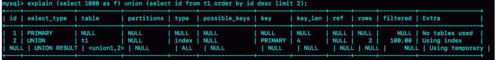
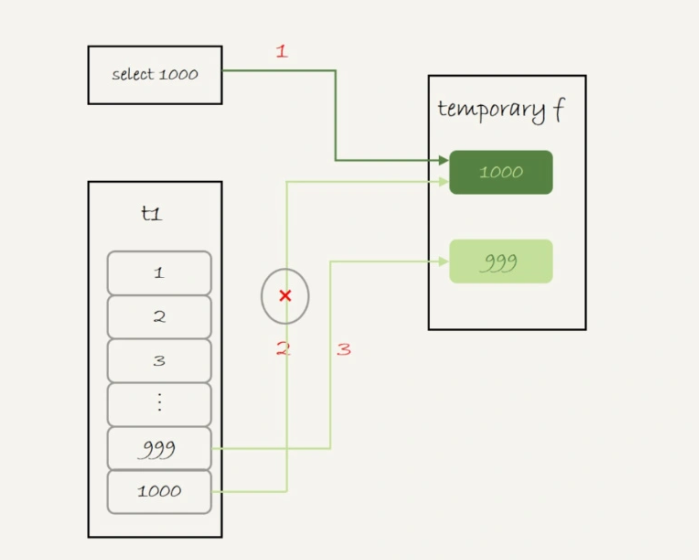

# Table of Contents

* [union](#union)
* [union all](#union-all)
* [UNION和UNION ALL的区别?](#union和union-all的区别)
* [[Group By](GroupBy.md)](#group-bygroupbymd)


Mysql有sort buffer、内存临时表和join buffer。这三个数据结构都是用来存放语句执行过程中的中间数据，以辅助SQL语句的执行的。

其中，**我们在排序的时候用到了sort buffer，在使用join语句的时候用到了join buffer。**

然后，你可能会有这样的疑问，MySQL什么时候会使用内部临时表呢？  


# union 

为了便于量化分析，我用下面的表t1来举例。

```mysql
create table t1(id int primary key, a int, b int, index(a));
delimiter ;;
create procedure idata()
begin
declare i int;
set i=1;
while(i<=1000)do
insert into t1 values(i, i, i);
set i=i+1;
end while;
end;;
delimiter ;
call idata();
```


然后，我们执行下面这条语句：

```mysql
(select 1000 as f) union (select id from t1 order by id desc limit 2);
```

这条语句用到了**union，它的语义是，取这两个子查询结果的并集。并集的意思就是这两个集合加起来，重复的行只保留一行。**

下图是这个语句的explain结果。


可以看到：
这个语句的执行流程是这样的：


1. 创建一个内存临时表，这个临时表只有一个整型字段f，并且f是主键字段。
2. 执行第一个子查询，得到1000这个值，并存入临时表中。
3.  执行第二个子查询  
   1. 拿到第一行id=1000，试图插入临时表中。但由于1000这个值已经存在于临时表了，违
      反了唯一性约束，所以插入失败，然后继续执行；
   2. 取到第二行id=999，插入临时表成功  
4. 从临时表中按行取出数据，返回结果，并删除临时表，结果中包含两行数据分别是1000和
   999。  




可以看到，这里的内存临时表起到了暂存数据的作用，而且计算过程还用上了临时表主键id的
唯一性约束，实现了union的语义。  


# union all

如果把上面这个语句中的union改成union all的话，就没有了“去重”的语义。这样执行的时候，就依次执行子查询，得到的结果直接作为结果集的一部分，发给客户端。因此也就不需要临时表了  。

> 因为union all是直接合并2个表的数据，不要临时表去重。

# UNION和UNION ALL的区别?

UNION和UNION ALL都是将两个结果集合并为一个，两个要联合的SQL语句 字段个数必须一样，而且字段类型要“相容”（一致）；

+ UNION在进行表连接后会筛选掉重复的数据记录（效率较低），

+ 而UNION ALL则不会去掉重复的数据记录；
+ UNION会按照字段的顺序进行排序，而UNION ALL只是简单的将两个结果合并就返回；


# [Group By](GroupBy.md)


