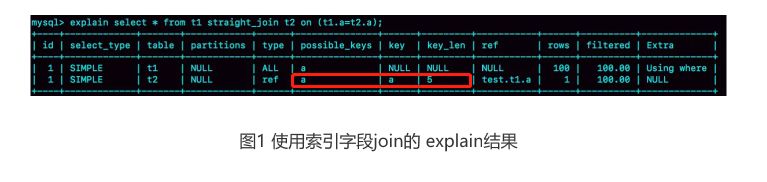
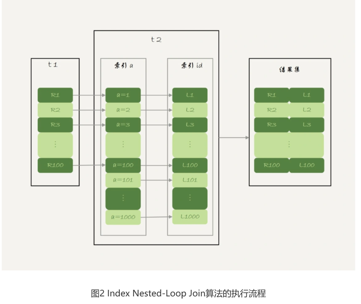
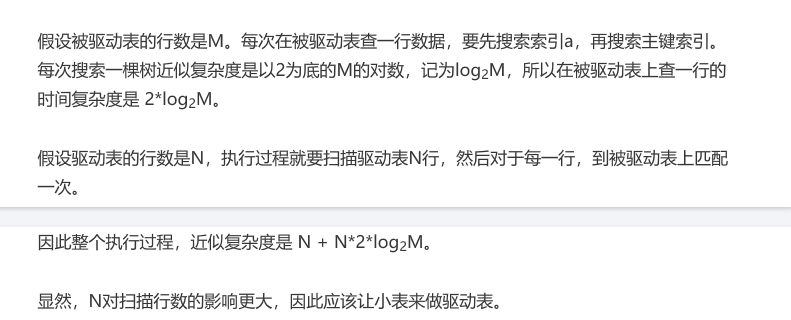
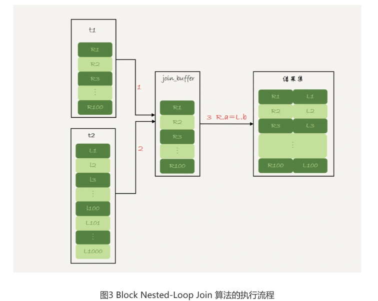
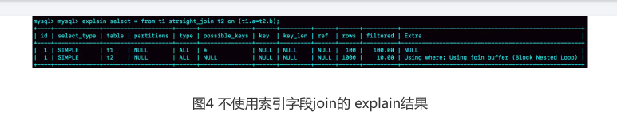
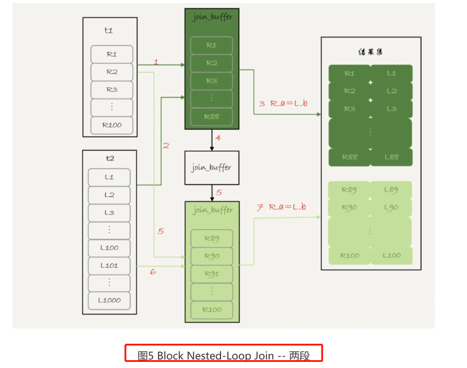

# Table of Contents

* [准备数据](#准备数据)
* [Index Nested-Loop Join](#index-nested-loop-join)
* [Simple Nested-Loop Join (了解)](#simple-nested-loop-join-了解)
* [Block Nested-Loop Join](#block-nested-loop-join)
* [什么是小表](#什么是小表)
* [多表join是怎么join的](#多表join是怎么join的)
* [总结](#总结)


1. 我们DBA不让使用join，使用join有什么问题呢？

2. 如果有两个大小不同的表做join，应该用哪个表做驱动表呢？

今天这篇文章，我就先跟你说说join语句到底是怎么执行的，然后再来回答这两个问题。

# 准备数据

我还是创建两个表t1和t2

```mysql
CREATE TABLE `t2` (
 `id` int(11) NOT NULL,
 `a` int(11) DEFAULT NULL,
 `b` int(11) DEFAULT NULL,
 PRIMARY KEY (`id`),
 KEY `a` (`a`)
) ENGINE=InnoDB;
drop procedure idata;
delimiter ;;
create procedure idata()
begin
 declare i int;
 set i=1;
 while(i<=1000)do
 insert into t2 values(i, i, i);
 set i=i+1;
 end while;
end;;
delimiter ;
call idata();

//创建新表
create table t1 like t2;
//插入数据 
insert into t1 (select * from t2 where id<=100)
```

表t2里插入了1000行数据，在表t1里插入的是100行数据。

可以看到，这两个表都有一个主键索引id和**一个索引a，字段b上无索引。**

**join分2种情况，一种join字段有索引，一种没索引。**

# Index Nested-Loop Join

我们来看一下这个语句：

```mysql
select * from t1 straight_join t2 on (t1.a=t2.a);
```

如果直接使用join语句，MySQL优化器可能会选择表t1或t2作为驱动表，这样会影响我们分 析SQL语句的执行过程。所以，为了便于分析执行过程中的性能问题，我改用`straight_join`
让MySQL使用固定的连接方式执行查询，这样优化器只会按照我们指定的方式去join。在这个 语句里，t1 是驱动表，t2是被驱动表。

现在，我们来看一下这条语句的explain结果。



可以看到，在这条语句里，被驱动表t2的字段a上有索引，join过程用上了这个索引，因此这 个语句的执行流程是这样的：

1. 从表t1中读入一行数据 R；
2. 从数据行R中，取出a字段到表t2里去查找；
3. 取出表t2中满足条件的行，跟R组成一行，作为结果集的一部分；
4. 重复执行步骤1到3，直到表t1的末尾循环结束。

**这个过程是先遍历表t1，然后根据从表t1中取出的每行数据中的a值，去表t2中查找满足条件的记录**。在形式上，这个过程就跟我们写程序时的嵌套查询类似，并且可以用上被驱动表的 索引，所以我们称之为“Index Nested-Loop
Join”，简称NLJ。

它对应的流程图如下所示：



在这个流程里：

1. 对驱动表t1做了全表扫描，这个过程需要扫描100行；
2. 而对于每一行R，根据a字段去表t2查找，走的是树搜索过程。由于我们构造的数据都是一 一对应的，因此每次的搜索过程都只扫描一行，也是总共扫描100行；
3. 所以，整个执行流程，总扫描行数是200。

**在这个join语句执行过程中，驱动表是走全表扫描，而被驱动表是走树搜索。**



----


到这里小结一下，通过上面的分析我们得到了两个结论：

1. 使用join语句，性能比强行拆成多个单表执行SQL语句的性能要好；
2. 如果使用join语句的话，需要让小表做驱动表。 但是，你需要注意，这个结论的前提是“可以使用被驱动表的索引”。 接下来，我们再看看被驱动表用不上索引的情况。

---

# Simple Nested-Loop Join (了解)

现在，我们把SQL语句改成这样：

```mysql
 select * from t1 straight_join t2 on (t1.a=t2.b);
```

**由于表t2的字段b上没有索引，因此再用图2的执行流程时，每次到t2去匹配的时候，就要做 一次全表扫描。**

你可以先设想一下这个问题，继续使用图2的算法，是不是可以得到正确的结果呢？如果只看结果的话，这个算法是正确的，而且这个算法也有一个名字，叫做“Simple Nested-Loop Join”。
但是，这样算来，这个SQL请求就要扫描表t2多达100次，总共扫描100*1000=10万行。

这还只是两个小表，如果t1和t2都是10万行的表（当然了，这也还是属于小表的范围），就 要扫描100亿行，这个算法看上去太“笨重”了。 当然，MySQL也没有使用这个Simple Nested-Loop Join算法，而是使用了另一个叫
作“Block Nested-Loop Join”的算法，简称BNL。

# Block Nested-Loop Join

这时候，被驱动表上没有可用的索引，算法的流程是这样的：

1. 把表t1的数据读入线程内存join_buffer中，由于我们这个语句中写的是select *，因此是把 整个表t1放入了内存；

2. 扫描表t2，把表t2中的每一行取出来，跟join_buffer中的数据做对比，满足join条件的， 作为结果集的一部分返回。

这个过程的流程图如下：



对应地，这条SQL语句的explain结果如下所示：



**可以看到，在这个过程中，对表t1和t2都做了一次全表扫描，因此总的扫描行数是1100。由 于join_buffer是以无序数组的方式组织的，因此对表t2中的每一行，都要做100次判断，总共 需要在内存中做的判断次数是：100*
1000=10万次。**

前面我们说过，如果使用Simple Nested-Loop Join算法进行查询，扫描行数也是10万行。 因此，从时间复杂度上来说，这两个算法是一样的。但是，Block Nested-Loop
Join算法的这10万次判断是内存操作，速度上会快很多，性能也更好。

接下来，我们来看一下，在这种情况下，应该选择哪个表做驱动表。 假设小表的行数是N，大表的行数是M，那么在这个算法里：

1. 两个表都做一次全表扫描，所以总的扫描行数是M+N；
2. 内存中的判断次数是M*N。 可以看到，调换这两个算式中的M和N没差别，因此这时候选择大表还是小表做驱动表，执行 耗时是一样的。

然后，你可能马上就会问了，这个例子里表t1才100行，要是表t1是一个大表，join_buffer放 不下怎么办呢？

join_buffer的大小是由参数join_buffer_size设定的，默认值是256k。**如果放不下表t1的所有**
**数据话，策略很简单，就是分段放。**

我把join_buffer_size改成1200，再执行：

```mysql
select * from t1 straight_join t2 on (t1.a=t2.b);
```

执行过程就变成了：

1. 扫描表t1，顺序读取数据行放入join_buffer中，放完第88行join_buffer满了，继续第2 步；
2. **扫描表t2，把t2中的每一行取出来**，跟join_buffer中的数据做对比，满足join条件的，作 为结果集的一部分返回；
3. 清空join_buffer；
4. 继续扫描表t1，顺序读取最后的12行数据放入join_buffer中，继续执行第2步。 执行流程图也就变成这样：



图中的步骤4和5，表示清空join_buffer再复用。

这个流程才体现出了这个算法名字中“Block”的由来，表示“分块去join”。

可以看到，这时候由于表t1被分成了两次放入join_buffer中，导致表t2会被扫描两次。虽然分成两次放入join_buffer，但是判断等值条件的次数还是不变的，依然是(88+12)1000=10 万次。

我们再来看下，在这种情况下驱动表的选择问题。假设，驱动表的数据行数是N，需要分K段才能完成算法流程，被驱动表的数据行数是M。

注意，这里的K不是常数，N越大K就会越大，因此把K表示为λ*N，显然λ的取值范围是(0,1)。 所以，在这个算法的执行过程中：

1. 扫描行数是 N+λ*N*M；
2. 内存判断 N*M次。

**显然，内存判断次数是不受选择哪个表作为驱动表影响的。而考虑到扫描行数，在M和N大小 确定的情况下，N小一些，整个算式的结果会更小。 所以结论是，应该让小表当驱动表。**

# 什么是小表

所以，更准确地说，在决定哪个表做驱动表的时候，应该是两个表按照各自的条件过滤，过 滤完成之后，计算参与join的各个字段的总数据量，数据量小的那个表，就是“小表”，应该 作为驱动表。

# 多表join是怎么join的

假设我们不考虑BKA，就按照一行行数据来判断的话，流程应该如下

表是t1 ,t2 ,t3。 t1 straight_join t2 straight_join t3，这样的join顺序。

1. 调用innodb接口，从t1中取一行数据，数据返回到server端。
2. 调用innodb接口，从t2中取满足条件的数据，数据返回到server端。
3. 调用innodb接口，从t3中取满足条件的数据，数据返回到server端。

上面三步之后，驱动表 t1的一条数据就处理完了，接下来重复上述过程。

（如果采用BKA进行优化，每多一个join，就多一个join_buffer）。

# 总结

1. 可以使用`straight_join`强制指定驱动表。
2. 是否有索引
    + 有：`Index Nested-Loop Join`。驱动表是走全表扫描，而被驱动表是走树搜索
    + 无
        + Simple Nested-Loop Join：不用管
        + 优化后：`Block Nested-Loop Join`。使用了join buffer，内存操作。

3. 关联字段要有索引。
4. 小表驱动大表。
    + `Index Nested-Loop Join`:N越大，驱动表扫描次数越多，被驱动表扫描次数也要增多。
    + `Block Nested-Loop Join`： 不管谁做驱动表，本身扫描总行数是一样的，但是buffer有大小。驱动表越大，会将数据分成多次，加载到buffer中，会导致被驱动表反复被加载。**
      内存判断次数是不受选择哪个表作为驱动表影响的**
