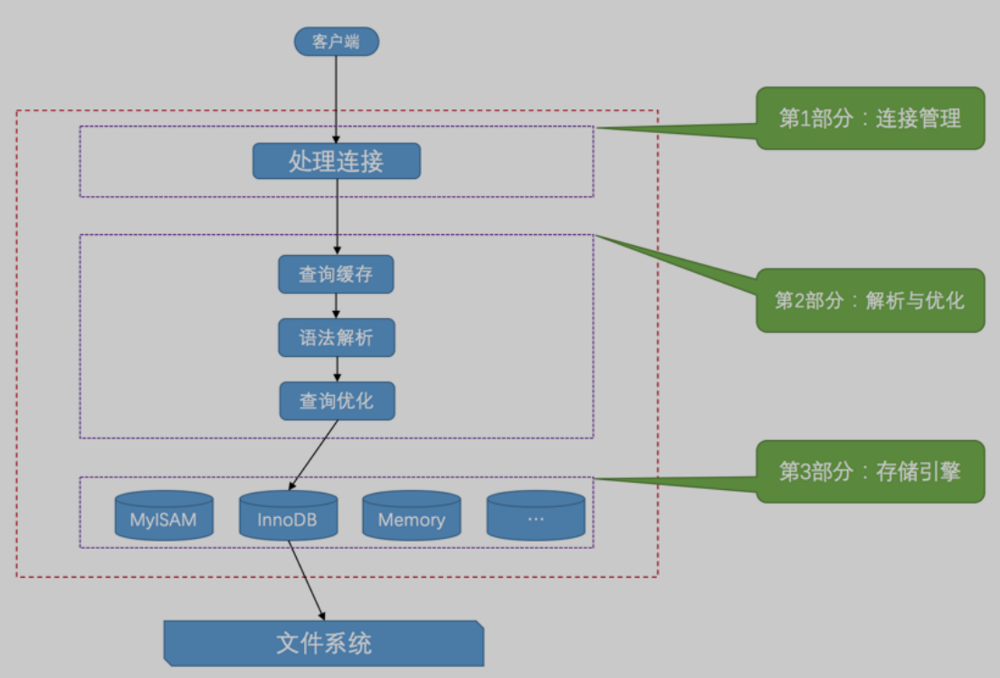
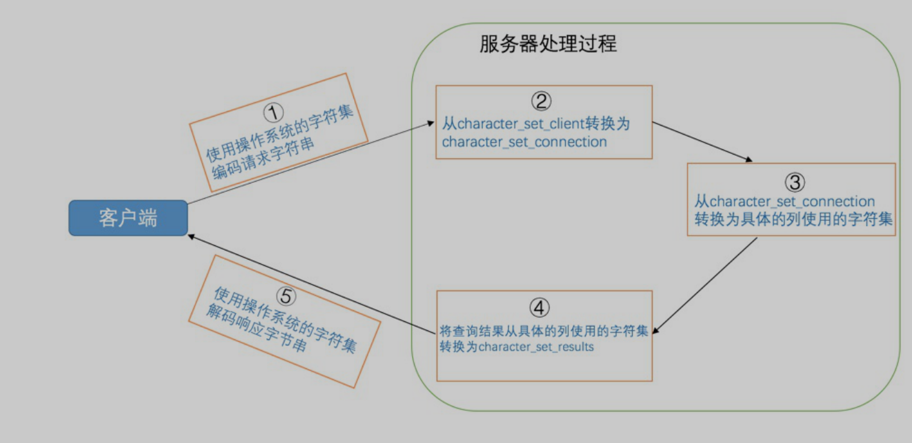
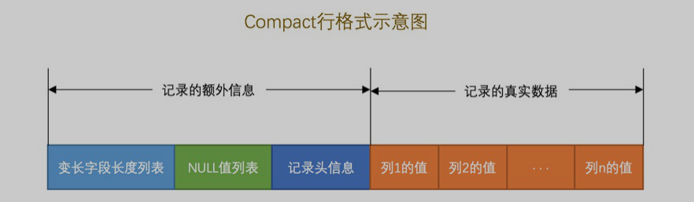
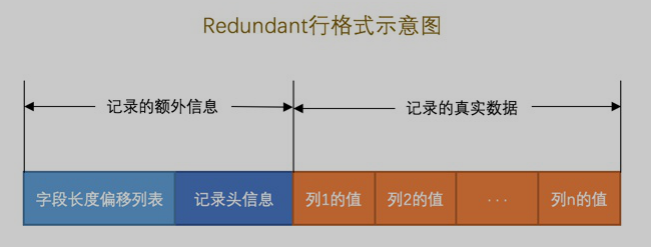
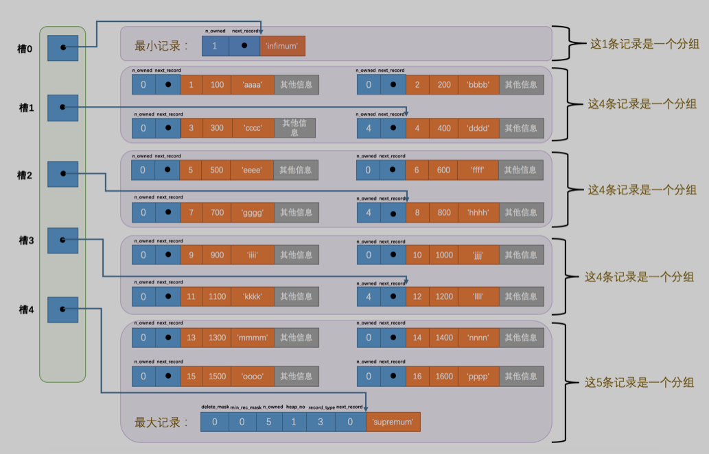
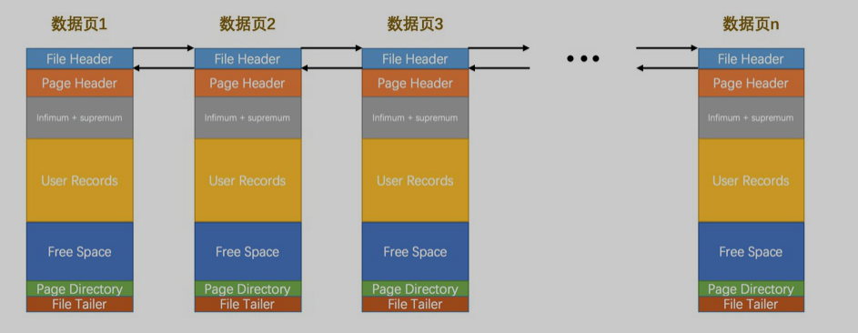
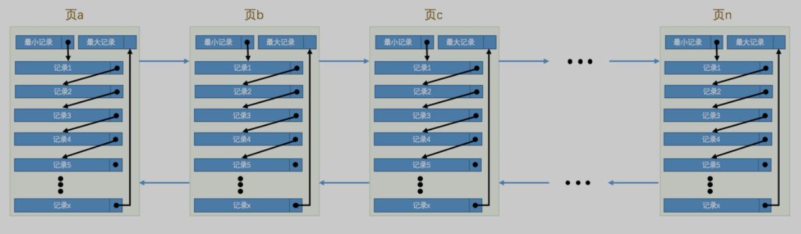
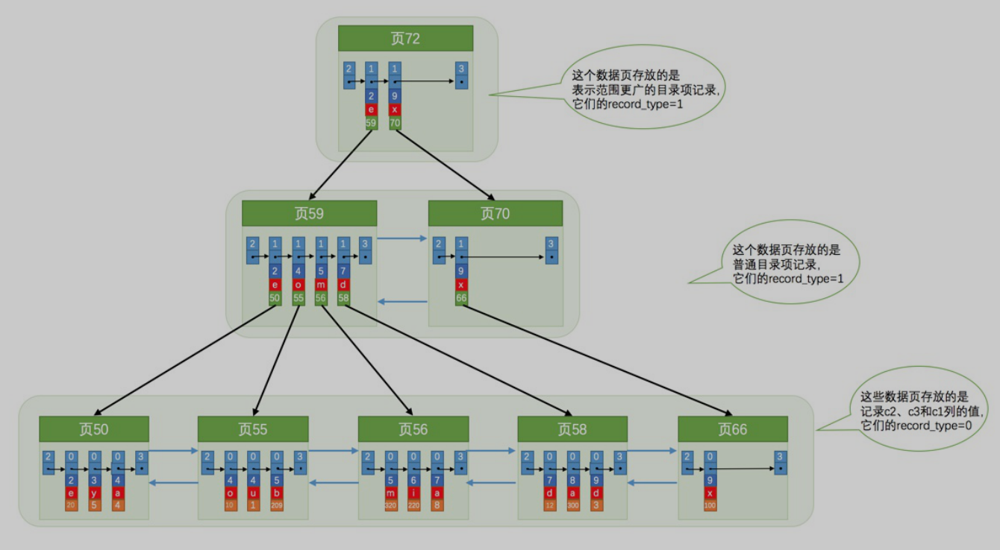

# Table of Contents

          * 
                    * 
                                              * 
                            * 
                            * 
                * 
                    * 
                                        * 
              * 
                          * 
                        * 
          * 
                * 
              * 
                      * 
          * 
                    * 
            * 
                  * 
            * 

#Mysql
##一、Mysql简介
###启动MySQL服务器程序（Linux环境）
**mysqld**
mysqld这个可执行文件就代表着MySQL服务器程序，运行这个可执行文件就可以直接启动一个服务器进程。
**ysqld_safe**
mysqld_safe是一个启动脚本，它会间接的调用mysqld，而且还顺便启动了另外一个监控进程，这个监控进程在服务器进程挂了的时候，可以帮助重启
它。另外，使用mysqld_safe启动服务器程序时，它会将服务器程序的出错信息和其他诊断信息重定向到某个文件中，产生出错日志，这样可以方便我
们找出发生错误的原因。
**mysql.server**
mysql.server也是一个启动脚本，它会间接的调用mysqld_safe，在调用mysql.server时在后边指定start参数就可以启动服务器程序了，就像这样：
mysql.server start
需要注意的是，这个 mysql.server 文件其实是一个链接文件，它的实际文件是 ../support-files/mysql.server。我使用的macOS操作系统会帮我们在bin目录
下自动创建一个指向实际文件的链接文件，如果你的操作系统没有帮你自动创建这个链接文件
###客户端和服务器的连接过程
**TCP/IP**：通过端口号
**命名管道和共享内存**：
使用命名管道来进行进程间通信
需要在启动服务器程序的命令中加上--enable-named-pipe参数，然后在启动客户端程序的命令中加入--pipe或者--protocol=pipe参数。
使用共享内存来进行进程间通信（需要服务器与客户端在同一台主机）
需要在启动服务器程序的命令中加上--shared-memory参数，在成功启动服务器后，共享内存便成为本地客户端程序的默认连接方式，不过我们也
可以在启动客户端程序的命令中加入--protocol=memory参数来显式的指定使用共享内存进行通信。
**Unix域套接字文件**：
如果我们的服务器进程和客户端进程都运行在同一台操作系统为类Unix的机器上的话，我们可以使用Unix域套接字文件来进行进程间通信。如果我们在
启动客户端程序的时候指定的主机名为localhost，或者指定了--protocol=socket的启动参数，那服务器程序和客户端程序之间就可以通过Unix域套
接字文件来进行通信了。MySQL服务器程序默认监听的Unix域套接字文件路径为/tmp/mysql.sock，客户端程序也默认连接到这个Unix域套接字文件。
如果我们想改变这个默认路径，可以在启动服务器程序时指定socket参数，就像这样：
mysqld --socket=/tmp/a.txt
这样服务器启动后便会监听/tmp/a.txt。在服务器改变了默认的UNIX域套接字文件后，如果客户端程序想通过UNIX域套接字文件进行通信的话，也需
要显式的指定连接到的UNIX域套接字文件路径，就像这样：
mysql -hlocalhost -uroot --socket=/tmp/a.txt -p
这样该客户端进程和服务器进程就可以通过路径为/tmp/a.txt的Unix域套接字文件进行通信了。

###服务器处理客户端请求过程

如果两个查询请求在任何字符上的不同（例如：空格、注释、大小写），都会导致缓存不会命中。另外，如果查询
请求中包含某些系统函数、用户自定义变量和函数、一些系统表，如 mysql、information_schema、 performance_schema 数据库中的表，那这个请求就不
会被缓存。
MySQL的缓存系统会监测涉及到的每张表，只要该表的结构或者数据被修改，如对该表使用了INSERT、
UPDATE、DELETE、TRUNCATE TABLE、ALTER TABLE、DROP TABLE或 DROP DATABASE语句，那使用该表的所有高速缓存查询都将变为无效并从高速缓存中
删除！
从MySQL 5.7.20开始，不推荐使用查询缓存，并在MySQL 8.0中删除

###常用存储引擎
存储引擎 描述
ARCHIVE 用于数据存档（行被插入后不能再修改）
BLACKHOLE 丢弃写操作，读操作会返回空内容
CSV 在存储数据时，以逗号分隔各个数据项
FEDERATED 用来访问远程表
InnoDB 具备外键支持功能的事务存储引擎
MEMORY 置于内存的表
MERGE 用来管理多个MyISAM表构成的表集合
MyISAM 主要的非事务处理存储引擎
NDB MySQL集群专用存储引擎

`存储引擎是负责对表中的数据进行提取和写入工作的，我们可以为不同的表设置不同的存储引擎，也就是说不同的表可以有不同的物
理存储结构，不同的提取和写入方式`

###字符集和比较规则
####MySQL中支持的字符集和排序规则
字符集名称 Maxlen
ascii     1
latin1    1
gb2312    2
gbk       2
utf8      3
utf8mb4   4

Maxlen 代表该种字符集表示一个字符最多需要几个字节

utf8字符集表示一个字符需要使用1～4个字节，但是我们常用的一些字符使用1～3个字节就可以表示了。而在MySQL中字符集表示一
个字符所用最大字节长度在某些方面会影响系统的存储和性能，所以设计MySQL的大叔偷偷的定义了两个概念：
utf8mb3：阉割过的utf8字符集，只使用1～3个字节表示字符。
utf8mb4：正宗的utf8字符集，使用1～4个字节表示字符

####比较规则
每种字符集对应若干种比较规则，每种字符集都有一种默认的比较规则。字符串字段的排序、大小比较就是通过比较规则比较。

MySQL有4个级别的字符集和比较规则，分别是：
服务器级别
数据库级别
表级别
列级别

我们通常都把 character_set_client 、character_set_connection、character_set_results 这三个系统变量设置成和客户端使
用的字符集一致的情况，这样减少了很多无谓的字符集转换

##二、数据在磁盘的储存结构
###行数据怎么在页内存储
1. 页是MySQL中磁盘和内存交互的基本单位，也是MySQL是管理存储空间的基本单位。
2. 指定和修改行格式的语法如下：
   CREATE TABLE 表名 (列的信息) ROW_FORMAT=行格式名称
   ALTER TABLE 表名 ROW_FORMAT=行格式名称
3. InnoDB目前定义了4种行格式
   COMPACT行格式
   具体组成如图：
   
   Redundant行格式
   具体组成如图：
   
   Dynamic和Compressed行格式
   这两种行格式类似于COMPACT行格式，只不过在处理行溢出数据时有点儿分歧，它们不会在记录的真实数据处存储字符串的前768个字节，而是把所有的字节都存储到其他页面中，只在记录的真
   实数据处存储其他页面的地址。
   另外，Compressed行格式会采用压缩算法对页面进行压缩。
   一行数据最大是64kb，而且mysql要求每页中至少存放2条数据（跟b+树结构有关，如果只有一条数据，索引就没有意义了）
   一个页一般是16KB，当记录中的数据太多，当前页放不下的时候，会把多余的数据存储到其他页中，这种现象称为行溢出。
   

###页数据
1. InnoDB为了不同的目的而设计了不同类型的页，我们把用于存放记录的页叫做数据页。
2. 一个数据页可以被大致划分为7个部分，分别是
   File Header，表示页的一些通用信息，占固定的38字节。
   Page Header，表示数据页专有的一些信息，占固定的56个字节。
   Infimum + Supremum，两个虚拟的伪记录，分别表示页中的最小和最大记录，占固定的26个字节。
   User Records：真实存储我们插入的记录的部分，大小不固定。
   Free Space：页中尚未使用的部分，大小不确定。
   Page Directory：页中的某些记录相对位置，也就是各个槽在页面中的地址偏移量，大小不固定，插入的记录越多，这个部分占用的空间越多。
   File Trailer：用于检验页是否完整的部分，占用固定的8个字节。
3. 每个记录的头信息中都有一个next_record属性，从而使页中的所有记录串联成一个单链表。
4. InnoDB会为把页中的记录划分为若干个组，每个组的最后一个记录的地址偏移量作为一个槽，存放在Page Directory中，所以在一个页中根据主键查找记录是非常快的，分为两步：
   通过二分法确定该记录所在的槽。
   通过记录的next_record属性遍历该槽所在的组中的各个记录。
5. 每个数据页的File Header部分都有上一个和下一个页的编号，所以所有的数据页会组成一个双链表。
6. 为保证从内存中同步到磁盘的页的完整性，在页的首部和尾部都会存储页中数据的校验和和页面最后修改时对应的LSN值，如果首部和尾部的校验和和LSN值校验不成功的话，就说明同步过程出现了
   问题。
   
   
   

##三、b+树索引
页和记录的关系

数据在页内是按主键大小从小到大排序的，主键如果是字符串就通过字符集的比较规则排序，前一页数据的最大记录小于后一页的最大记录
每条记录大致包含以下信息：
record_type：记录头信息的一项属性，表示记录的类型，0表示普通记录、2表示最小记录、3表示最大记录、1目录项记录（即索引记录，只存储主键值和对应的页号，是聚簇索引的情况下）
next_record：记录头信息的一项属性，表示下一条地址相对于本条记录的地址偏移量，为了方便大家理解，我们都会用箭头来表明下一条记录是谁。
各个列的值：这里只记录在index_demo表中的三个列，分别是c1、c2和c3。
其他信息：除了上述3种信息以外的所有信息，包括其他隐藏列的值以及记录的额外信

**聚簇索引**
B+树本身就是一个目录，或者说本身就是一个索引。它有两个特点：
1. 使用记录主键值的大小进行记录和页的排序，这包括三个方面的含义：
   页内的记录是按照主键的大小顺序排成一个单向链表。
   各个存放用户记录的页也是根据页中用户记录的主键大小顺序排成一个双向链表。
   存放目录项记录的页分为不同的层次，在同一层次中的页也是根据页中目录项记录的主键大小顺序排成一个双向链表。
2. B+树的叶子节点存储的是完整的用户记录。
   所谓完整的用户记录，就是指这个记录中存储了所有列的值（包括隐藏列）。
   

**二级索引**
使用记录索引列的大小进行记录和页的排序，这包括三个方面的含义：
页内的记录是按照索引列的大小顺序排成一个单向链表。
各个存放用户记录的页也是根据页中记录的索引列大小顺序排成一个双向链表。
存放目录项记录的页分为不同的层次，在同一层次中的页也是根据页中目录项记录的c2列大小顺序排成一个双向链表。
B+树的叶子节点存储的并不是完整的用户记录，而只是索引列+主键这两个列的值。
目录项记录中不再是主键+页号的搭配，而变成了索引列+页号的搭配

**联合索引**
我们也可以同时以多个列的大小作为排序规则，也就是同时为多个列建立索引，比方说我们想让B+树按照c2和c3列的大小进行排序，这个包含两层含义：
先把各个记录和页按照c2列进行排序。
在记录的c2列相同的情况下，采用c3列进行排序
为c2和c3列建立的索引的示意图如下：

我们需要注意一下几点：
每条目录项记录都由c2、c3、页号这三个部分组成，各条记录先按照c2列的值进行排序，如果记录的c2列相同，则按照c3列的值进行排序。
B+树叶子节点处的用户记录由c2、c3和主键c1列组成。
千万要注意一点，以c2和c3列的大小为排序规则建立的B+树称为联合索引，本质上也是一个二级索引。它的意思与分别为c2和c3列分别建立索引的表述是不同的，不同点如
下：
建立联合索引只会建立如上图一样的1棵B+树。
为c2和c3列分别建立索引会分别以c2和c3列的大小为排序规则建立2棵B+树。
这个过程需要大家特别注意的是：一个B+树索引的根节点自诞生之日起，便不会再移动。这样只要我们对某个表建立一个索引，那么它的根节点的页号便会被记录到某个地
方，然后凡是InnoDB存储引擎需要用到这个索引的时候，都会从那个固定的地方取出根节点的页号，从而来访问这个索引

###索引的使用
1. B+树索引在空间和时间上都有代价，所以没事儿别瞎建索引。
2. B+树索引适用于下边这些情况：
   全值匹配
   匹配左边的列
   匹配范围值
   精确匹配某一列并范围匹配另外一列
   用于排序
   用于分组
3. 在使用索引时需要注意下边这些事项：
   只为用于搜索、排序或分组的列创建索引
   为列的基数大的列创建索引
   索引列的类型尽量小
   可以只对字符串值的前缀建立索引（索引列后加（5），例如 c(5) 对前5个字符建立索引）
   只有索引列在比较表达式中单独出现才可以适用索引（不要改变索引列的值）
   为了尽可能少的让聚簇索引发生页面分裂和记录移位的情况，建议让主键拥有AUTO_INCREMENT属性。（因为需要保证主键有序，所以主键值小的记录插进去
   会发生页面分裂和记录移位，插入的时候影响性能）
   定位并删除表中的重复和冗余索引
   尽量使用覆盖索引进行查询，避免回表带来的性能损耗。
   

##四、数据目录和表空间
SHOW VARIABLES LIKE 'datadir';  显示数据目录的位置

InnoDB是如何存储表数据的？
InnoDB其实是使用页为基本单位来管理存储空间的，默认的页大小为16KB。
对于InnoDB存储引擎来说，每个索引都对应着一棵B+树，该B+树的每个节点都是一个数据页，数据页之间不必要是物理
连续的，因为数据页之间有双向链表来维护着这些页的顺序。
InnoDB的聚簇索引的叶子节点存储了完整的用户记录，也就是所谓的索引即数据，数据即索引。
为了更好的管理这些页，设计InnoDB的大叔们提出了一个表空间或者文件空间（英文名：table space或者file space）的概
念，这个表空间是一个抽象的概念，它可以对应文件系统上一个或多个真实文件（不同表空间对应的文件数量可能不同）。每
一个表空间可以被划分为很多很多很多个页，我们的表数据就存放在某个表空间下的某些页里。设计InnoDB的大叔将表空间划分
为系统表空间、独立表空间、其他类型表空间。

###表空间
区（extent）的概念
表空间中的页实在是太多了，为了更好的管理这些页面，设计InnoDB的大叔们提出了区（英文名：extent）的概念。对于16KB的页来说，连续的64个页就是一个区，也就是说一个区默认占用1MB空间大
小。不论是系统表空间还是独立表空间，都可以看成是由若干个区组成的，每256个区被划分成一组。1个区是物理上64个连续的页，这样避免的随机I/O对性能的影响

区的分类（同一类型的区通过指针相连成链表结构，头结点存放在表空间的List Base Node中）
空闲的区：现在还没有用到这个区中的任何页面。
有剩余空间的碎片区：表示碎片区中还有可用的页面。
没有剩余空间的碎片区：表示碎片区中的所有页面都被使用，没有空闲页面。
附属于某个段的区：每一个索引都可以分为叶子节点段和非叶子节点段，除此之外InnoDB还会另外定义一些特殊作用的段，在这些段中的数据量很大时将使用区来作为基本的分配单位

段（segment）的概念
叶子节点和内节点会分开存储（让叶子节点放在一块相邻的物理位置，范围查询的时候方便扫描，避免随机I/O），叶子节点为一段，内节点为一段，所以一个索引就是两段。
不同段的数据会一起插到同一个有剩余空间的碎片区，这个碎片区满了就会变成没有剩余空间的碎片区，改变区状态，然后拿一个空闲的区作为有剩余空间的碎片区。
当某个段已经占用了32个碎片区页面之后，就会以完整的区为单位来分配存储空间（附属于某个段的区吧）。

还有mysql的系统表存储了表信息、表的列信息、索引信息

还有不同类型页的结构，这里不管了，太细了。。。感觉也没必要

##五、单表访问的方法
1.使用全表扫描进行查询
这种执行方式很好理解，就是把表的每一行记录都扫一遍嘛，把符合搜索条件的记录加入到结果集就完了。不管是啥查询都可以使用这
种方式执行，当然，这种也是最笨的执行方式。
2.使用索引进行查询（具体细节还是看书）
因为直接使用全表扫描的方式执行查询要遍历好多记录，所以代价可能太大了。如果查询语句中的搜索条件可以使用到某个索引，那直
接使用索引来执行查询可能会加快查询执行的时间。使用索引来执行查询的方式五花八门，又可以细分为许多种类：
针对主键或唯一二级索引的等值查询
针对普通二级索引的等值查询
针对索引列的范围查询
直接扫描整个索引

**索引合并**
Intersection合并：两个索引返回集取交集（需要索引列等值查询，这样结果集里的数据主键是单调递增的，不清楚就回顾索引结构）
Union合并：两个索引返回集取并集（可以范围查询，因为Union合并的结果集数据比较少，排序一下也不会太耗时，没弄懂为什么数据量少一些）
合并结果集过程：
从idx_key1中获取到已经排好序的主键值：1、3、5
从idx_key2中获取到已经排好序的主键值：2、3、4
那么求交集的过程就是这样：逐个取出这两个结果集中最小的主键值，如果两个值相等，则加入最后的交集结果中，否则丢弃当前较小的主键
值，再取该丢弃的主键值所在结果集的后一个主键值来比较，直到某个结果集中的主键值用完了，如果还是觉得不太明白那继续往下看：
先取出这两个结果集中较小的主键值做比较，因为1 < 2，所以把idx_key1的结果集的主键值1丢弃，取出后边的3来比较。
因为3 > 2，所以把idx_key2的结果集的主键值2丢弃，取出后边的3来比较。
因为3 = 3，所以把3加入到最后的交集结果中，继续两个结果集后边的主键值来比较。
后边的主键值也不相等，所以最后的交集结果中只包含主键值3。

优化器会自己判断索引合并还是遍历一个索引的返回集

##六、表连接
###内连接和外连接
对于内连接的两个表，驱动表中的记录在被驱动表中找不到匹配的记录，该记录不会加入到最后的结果集，我们上边提到的连接都是所谓的内连接。
对于外连接的两个表，驱动表中的记录即使在被驱动表中没有匹配的记录，也仍然需要加入到结果集。

###连接原理
两张表连接分为驱动表和被驱动表，以left join 来说，左边为驱动表，右边为被驱动表

嵌套循环连接（Nested-Loop Join）
步骤1：选取驱动表，使用与驱动表相关的过滤条件，选取代价最低的单表访问方法来执行对驱动表的单表查询。
步骤2：对上一步骤中查询驱动表得到的结果集中每一条记录，都分别到被驱动表中查找匹配的记录。

基于块的嵌套循环连接（Block Nested-Loop Join）
现实生活中的表可不像t1、t2这种只有3条记录，成千上万条记录都
是少的，几百万、几千万甚至几亿条记录的表到处都是。内存里可能并不能完全存放的下表中所有的记录，所以在扫描表前边记录的时候后边的记录可能还在磁盘上，
等扫描到后边记录的时候可能内存不足，所以需要把前边的记录从内存中释放掉。我们前边又说过，采用嵌套循环连接算法的两表连接过程中，被驱动表可是要被访问好
多次的，如果这个被驱动表中的数据特别多而且不能使用索引进行访问，那就相当于要从磁盘上读好几次这个表，这个I/O代价就非常大了，所以我们得想办法：尽量减
少访问被驱动表的次数。
设计MySQL的大叔提出了一个join buffer的概念，join buffer就是执行连接查询前申请的一块固定大小的内存，先把若干条驱动表结果集中的
记录装在这个join buffer中，然后开始扫描被驱动表，每一条被驱动表的记录一次性和join buffer中的多条驱动表记录做匹配，因为匹配的过程都是在内存中完成
的，所以这样可以显著减少被驱动表的I/O代价。

