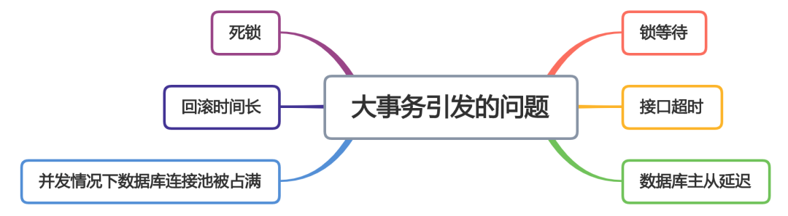

# Table of Contents

* [**大事务引发的问题**](#大事务引发的问题)
* [少用@Transactional注解](#少用transactional注解)
* [将查询(select)方法放到事务外](#将查询select方法放到事务外)
  * [新加一个Service方法(不建议)](#新加一个service方法不建议)
  * [在该Service类中注入自己 (不建议)](#在该service类中注入自己-不建议)
  * [在该Service类中使用AopContext.currentProxy()获取代理对象(推荐)](#在该service类中使用aopcontextcurrentproxy获取代理对象推荐)
* [事务中避免远程调用](#事务中避免远程调用)
* [事务中避免一次性处理太多数据](#事务中避免一次性处理太多数据)
* [非事务执行](#非事务执行)
* [异步处理](#异步处理)
* [总结](#总结)
* [参考资料](#参考资料)


# **大事务引发的问题**




> 解决办法有哪些呢?


# 少用@Transactional注解

少使用`@Transactional`注解开启事务，并不是说一定不能用它，如果项目中有些业务逻辑比较简单，而且不经常变动，使用`@Transactional`注解开启事务开启事务也无妨，因为它更简单，开发效率更高，但是千万要小心事务失效的问题。


使用`TransactionTemplate`的`编程式事务`功能自己灵活控制事务的范围，**是避免大事务问题的首选办法。**

> 个人觉得这样写，代码太不好看了，推荐第二种方法

```java
   @Autowired
   private TransactionTemplate transactionTemplate;
   
   ...
   
   public void save(final User user) {
         transactionTemplate.execute((status) => {
            doSameThing...
            return Boolean.TRUE;
         })
   }
```


# 将查询(select)方法放到事务外

## 新加一个Service方法(不建议)

每次都要建立一个太麻烦


## 在该Service类中注入自己 (不建议)

```java
@Servcie
  publicclass ServiceA {
     @Autowired
     prvate ServiceA serviceA;
  
     public void save(User user) {
           queryData1();
           queryData2();
           serviceA.doSave(user);
     }
     
     @Transactional(rollbackFor=Exception.class)
     public void doSave(User user) {
         addData1();
         updateData2();
      }
   }
```


## 在该Service类中使用AopContext.currentProxy()获取代理对象(推荐)

```java
@Servcie
  publicclass ServiceA {
  
     public void save(User user) {
           queryData1();
           queryData2();
         //也可以使用
           ((ServiceA)AopContext.currentProxy()).doSave(user);
     }
     
     @Transactional(rollbackFor=Exception.class)
     public void doSave(User user) {
         addData1();
         updateData2();
      }
   }
```


也可以使用 applicationContext.getBean(接口类.class)

```java
    @Autowired
    private ApplicationContext  applicationContext;


    public void save(final Object user) {

	TestService testService = applicationContext.getBean(TestService.class);	

    }
```


# 事务中避免远程调用

我们在接口中调用其他系统的接口是不能避免的，由于网络不稳定，这种远程调的响应时间可能比较长，如果远程调用的代码放在某个事物中，这个事物就可能是大事务。当然，远程调用不仅仅是指调用接口，还有包括：发MQ消息，或者连接redis、mongodb保存数据等。

**远程调用的代码不放在事务中如何保证数据一致性呢？这就需要建立：`重试`+`补偿机制`，达到数据`最终一致性`了。**


> 但是不复杂的项目，放一起也没啥事情


# 事务中避免一次性处理太多数据

如果一个事务中需要处理的数据太多，也会造成大事务问题。比如为了操作方便，你可能会一次批量更新1000条数据，这样会导致大量数据锁等待，特别在高并发的系统中问题尤为明显。

解决办法是分页处理，1000条数据，分50页，一次只处理20条数据，这样可以大大减少大事务的出现。


# 非事务执行

在使用事务之前，我们都应该思考一下，是不是所有的数据库操作都需要在事务中执行？


增加操作日志方法 和 `updateCount`更新统计数量方法，是可以不在事务中执行的，因为操作日志和统计数量这种业务允许少量数据不一致的情况。


# 异步处理

还有一点也非常重要，是不是事务中的所有方法都需要同步执行？我们都知道，方法同步执行需要等待方法返回，如果一个事务中同步执行的方法太多了，势必会造成等待时间过长，出现大事务问题。

看看下面这个列子：

```java
   @Autowired
   private TransactionTemplate transactionTemplate;
   
   ...
   
   public void save(final User user) {
         transactionTemplate.execute((status) => {
            order();
            delivery();
            return Boolean.TRUE;
         })
   }
```


`order`方法用于下单，`delivery`方法用于发货，是不是下单后就一定要马上发货呢？

答案是否定的。

这里发货功能其实可以走mq异步处理逻辑。


# 总结

1. 少用@Transactional注解
2. 将查询(select)方法放到事务外(推荐)
3. 事务中避免远程调用
4. 事务中避免一次性处理太多数据
5. 非事务执行
6. 异步处理


# 参考资料


