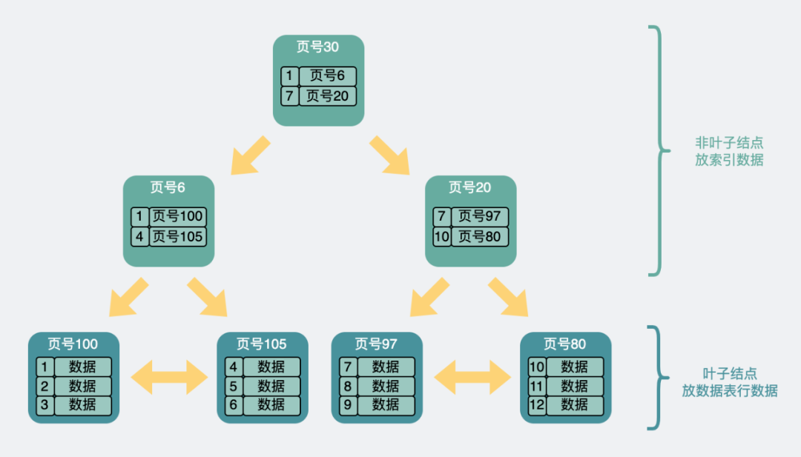
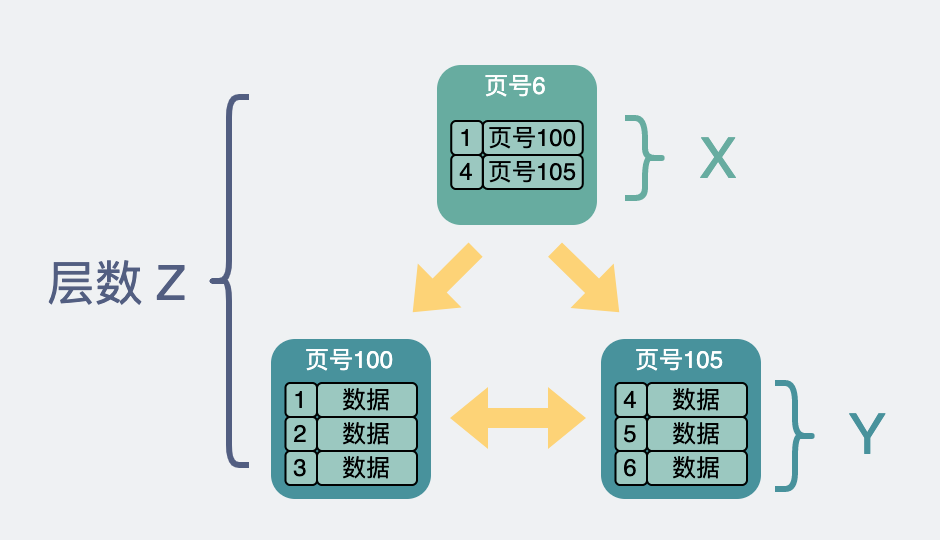
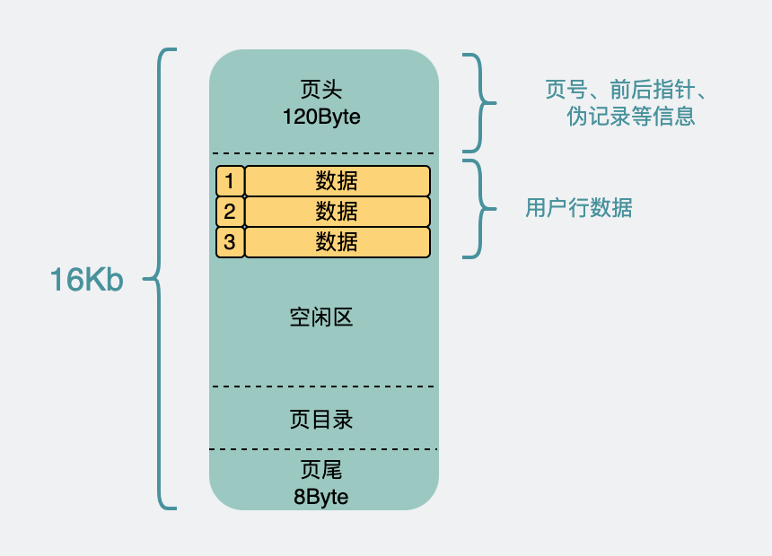

# Table of Contents

* [先看看B+树的结构](#先看看b树的结构)
* [B+树承载的记录数量](#b树承载的记录数量)
  * [x怎么算](#x怎么算)
  * [y的计算](#y的计算)
  * [行总数计算](#行总数计算)
* [行数超一亿就慢了吗？](#行数超一亿就慢了吗)
* [参考资料](#参考资料)

# 先看看B+树的结构

# B+树承载的记录数量

同样一个16k的页，非叶子节点里每一条数据都指向一个新的页，而新的页有两种可能。

- 如果是末级叶子节点的话，那么里面放的就是一行行record数据。
- 如果是非叶子节点，那么就会循环继续指向新的数据页。

假设

- 非叶子结点内指向其他内存页的指针数量为`x`
- 叶子节点内能容纳的record数量为`y`
- B+树的层数为`z`

那这棵B+树放的**行数据总量**等于 `(x ^ (z-1)) * y`。

## x怎么算

1. 主键假设是`bigint（8Byte）`，而页号在源码里叫`FIL_PAGE_OFFSET（4Byte）`，那么非叶子节点里的一条数据是`12Byte`左右。

2. 整个数据页`16k`， 页头页尾那部分数据全加起来大概`128Byte`，加上页目录毛估占`1k`吧。

3. 那剩下的**15k**除以`12Byte`，等于`1280`，也就是可以指向**x=1280页**。

## y的计算

叶子节点和非叶子节点的数据结构是一样的，所以也假设剩下`15kb`可以发挥。

叶子节点里放的是真正的行数据。假设一条行数据`1kb`，所以一页里能放**y=15行**。

> 如果当前行的数据量比较少，其实可以存放的更多行数据

## 行总数计算

回到  `(x ^ (z-1)) * y`  这个公式。

已知`x=1280`，`y=15`。

假设B+树是**两层**，那`z=2`。则是`(1280 ^ (2-1)) * 15 ≈ 2w`

假设B+树是**三层**，那`z=3`。则是`(1280 ^ (3-1)) * 15 ≈ 2.5kw`

**这个2.5kw，就是我们常说的单表建议最大行数2kw的由来。**毕竟再加一层，数据就大得有点离谱了。三层数据页对应最多三次磁盘IO，也比较合理。

# 行数超一亿就慢了吗？

上面假设单行数据用了1kb，所以一个数据页能放个15行数据。

如果我单行数据用不了这么多，比如只用了`250byte`。那么单个数据页能放60行数据。

那同样是三层B+树，单表支持的行数就是 `(1280 ^ (3-1)) * 60 ≈ 1个亿`。

你看我一个亿的数据，其实也就三层B+树，在这个B+树里要查到某行数据，最多也是三次磁盘IO。所以并不慢。

# 参考资料

https://mp.weixin.qq.com/s/iQlWgN_3IbE-Ud-_XjMNSw
