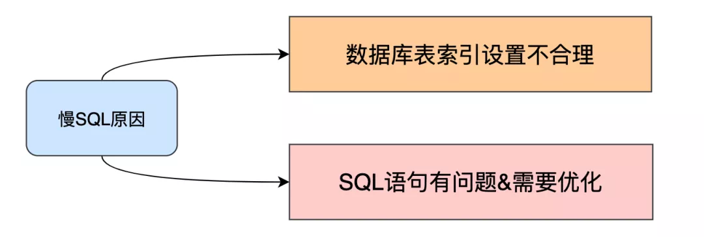

# Table of Contents

* [**慢SQL解决思路**](#慢sql解决思路)
  * [**通过慢查日志等定位那些执行效率较低的 SQL 语句**](#通过慢查日志等定位那些执行效率较低的-sql-语句)
  * [**explain 分析SQL的执行计划**](#explain-分析sql的执行计划)
  * [**show profile 分析**](#show-profile-分析)
  * [**trace**](#trace)
  * [具体步骤](#具体步骤)


# **慢SQL解决思路**


## **通过慢查日志等定位那些执行效率较低的 SQL 语句**

## **explain 分析SQL的执行计划**

​	需要重点关注 type、rows、filtered、extra。


type 由上至下，效率越来越高：

- ALL 全表扫描
- index 索引全扫描
- range 索引范围扫描，常用语<,<=,>=,between,in 等操作
- ref 使用非唯一索引扫描或唯一索引前缀扫描，返回单条记录，常出现在关联查询中
- eq_ref 类似 ref，区别在于使用的是唯一索引，使用主键的关联查询
- const/system 单条记录，系统会把匹配行中的其他列作为常数处理，如主键或唯一索引查询
- null MySQL 不访问任何表或索引，直接返回结果
- 虽然上至下，效率越来越高，但是根据 cost 模型，假设有两个索引 idx1(a, b, c),idx2(a, c)，SQL 为"select * from t where a = 1 and b in (1, 2) order by c";如果走 idx1，那么是 type 为 range，如果走 idx2，那么 type 是 ref；当需要扫描的行数，使用 idx2 大约是 idx1 的 5 倍以上时，会用 idx1，否则会用 idx2


Extra：

- **Using filesort：**MySQL 需要额外的一次传递，以找出如何按排序顺序检索行。通过根据联接类型浏览所有行并为所有匹配 WHERE 子句的行保存排序关键字和行的指针来完成排序。然后关键字被排序，并按排序顺序检索行；
- **Using temporary：**使用了临时表保存中间结果，性能特别差，需要重点优化；
- **Using index：**表示相应的 select 操作中使用了覆盖索引（Coveing Index）,避免访问了表的数据行，效率不错！如果同时出现 using where，意味着无法直接通过索引查找来查询到符合条件的数据；
- **Using index condition：**MySQL5.6 之后新增的 ICP，using index condtion 就是使用了 ICP（索引下推），在存储引擎层进行数据过滤，而不是在服务层过滤，利用索引现有的数据减少回表的数据。


## **show profile 分析**

了解 SQL 执行的线程的状态及消耗的时间。

默认是关闭的，开启语句“set profiling = 1;”

```mysql
SHOW PROFILES ;
SHOW PROFILE FOR QUERY  #{id};
```


##  **trace**

trace 分析优化器如何选择执行计划，通过 trace 文件能够进一步了解为什么优惠券选择 A 执行计划而不选择 B 执行计划。

```mysql
set optimizer_trace="enabled=on";
set optimizer_trace_max_mem_size=1000000;
select * from information_schema.optimizer_trace;
```

## 具体步骤

我们以下几个方面来进行阐述：

- 数据库表索引设置不合理
- SQL语句有问题，需要优化
- 该有其他方式实现，ES、数仓等
- 数据碎片来数据



- **索引区分度低**

假如表中有1000w记录，其中有status字段表示状态，可能90%的数据status=1，可以不将status作为索引，因为其对数据记录区分度很低。


SQL优化

- **使用连接代替子查询**

> 对于数据库来说，在绝大部分情况下，连接会比子查询更快，使用连接的方式，MySQL优化器一般可以生成更佳的执行计划，更高效地处理查询
> 而子查询往往需要运行重复的查询，子查询生成的临时表上也没有索引， 因此效率会更低。

- **LIMIT偏移量过大的优化**

> 禁止分页查询偏移量过大，如limit 100000,10

- **使用覆盖索引**
  减少select * 借助覆盖索引，减少回表查询次数。
- **多表关联查询时，小表在前，大表在后**

> 在MySQL中，执行from后的表关联查询是从左往右执行的，第一张表会涉及到全表扫描，所以将小表放在前面，先扫小表，扫描快效率较高，在扫描后面的大表，或许只扫描大表的前100行就符合返回条件并return了。

- **调整Where字句中的连接顺序**

> MySQL采用从左往右的顺序解析where子句，可以将过滤数据多的条件放在前面，最快速度缩小结果集。

- **使用小范围事务，而非大范围事务**
- **遵循最左匹配原则**
- **使用联合索引，而非建立多个单独索引**


