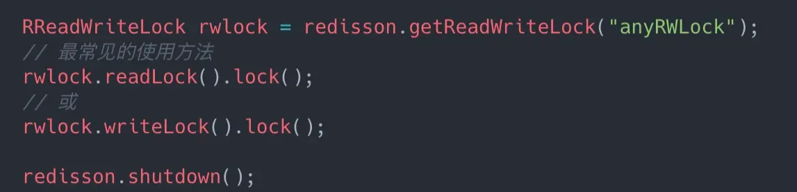

# Table of Contents

* [为什么要使用分布式读写锁？](#为什么要使用分布式读写锁)
* [如何使用](#如何使用)
* [过程](#过程)

Redisson 还支持可重入读写锁，**允许在分布式场景下，同时有多个读锁和一个写锁处于加锁状态。**

# 为什么要使用分布式读写锁？

Redis分布式锁比较繁重，当业务场景是【读多写少】的场景下时，性能是不太好的。

# 如何使用

# 过程

在读锁的时候：

1. 锁 anyRWLock 是哈希表结构
2. 加锁时，会对哈希表设置 mode 字段来表示这个锁是读锁还是写锁，`mode = read` 表示读锁
3. 加锁时，会对哈希表设置当前线程 anyRWLock 的 `UUID:ThreadId` 字段，值表示重入次数
4. 每次加锁，会额外维护一个 key 表示这次锁的超时时间，这个 key 的结构是 `{锁名字}:UUID:ThreadId:rwlock_timeout:重入次数`

在写锁的时候：

1. 锁 anyRWLock 是哈希表结构
2. 加锁时，会对哈希表设置 mode 字段来表示这个锁是读锁还是写锁，`mode = write` 表示写锁
3. 在 anyRWLock 中再额外维护一个字段 `UUID:ThreadId:write` 表示重入次数

> 主要是对Hash表中加一个**mode**字段来表示是读锁还是写锁。
>
> 注意
>
> 1. 读锁的时候，可重入已经没有意义了，是共享锁了。
