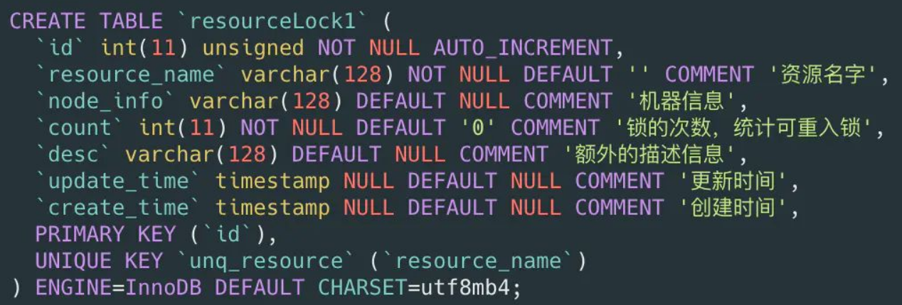
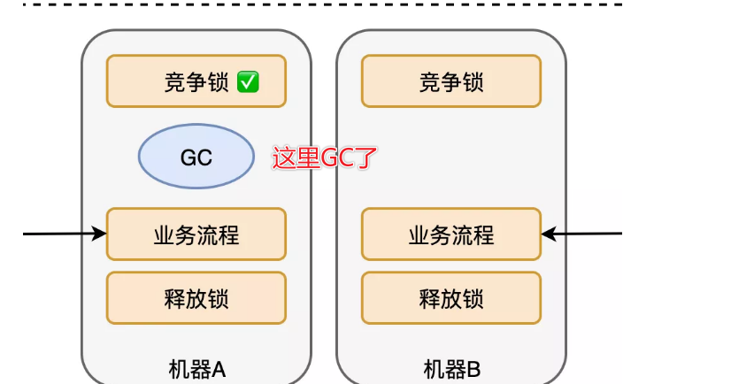

# Table of Contents

* [为什么要使用分布式锁](#为什么要使用分布式锁)
* [分布式锁具备哪些特性](#分布式锁具备哪些特性)
* [你会怎么设计分布式锁](#你会怎么设计分布式锁)
* [有哪些分布式锁](#有哪些分布式锁)
* [Mysql](#mysql)
* [Redis分布式锁](#redis分布式锁)
  * [setnx](#setnx)
  * [lua脚本](#lua脚本)
  * [Redis简单分布式锁](#redis简单分布式锁)
* [Redission](#redission)
  * [加锁](#加锁)
  * [解锁](#解锁)
  * [watchdog(看门狗)](#watchdog看门狗)
  * [整体流程](#整体流程)
  * [存在的问题](#存在的问题)
* [RedLock(可靠性)](#redlock可靠性)
* [参考资料](#参考资料)
* [相关问题](#相关问题)
  * [分布式锁一定安全吗？(NPC)](#分布式锁一定安全吗npc)
  * [如何给别人讲解Redis分布式锁？](#如何给别人讲解redis分布式锁)


# 为什么要使用分布式锁

之前是在一个JVM,后来业务发展，需要做集群，一个应用需要部署到几台机器上然后做负载均衡

那么多个进程之间的变量**不存在共享，也不具有可见性。**

为了保证一个方法或属性在高并发情况下的同一时间只能被同一个线程执行，所以我们需要使用分布式锁。


# 分布式锁具备哪些特性

+ 互斥性：锁的目的是获取资源的使用权，所以只让一个竞争者持有锁，这一点要尽可能保证；
+ 安全性：避免死锁情况发生。当一个竞争者在持有锁期间内，由于意外崩溃而导致未能主动解锁，其持有的锁也能够被正常释放，并保证后续其它竞争者也能加锁；
+ 对称性：同一个锁，加锁和解锁必须是同一个竞争者。不能把其他竞争者持有的锁给释放了，这又称为锁的可重入性。
+ 可靠性：需要有一定程度的异常处理能力、容灾能力。


# 你会怎么设计分布式锁

加锁、解锁、可重入、到期释放不然会有死锁、重试 

那怎么保证容错性？

如果是主从或者集群，解锁是不是还要通知其他节点？

如果业务执行时间比较长，锁过期时间比较断，那怎么办？


# 有哪些分布式锁

- MySql
- Zk
- Redis

# Mysql




创建一个表来存相关的数据，但是没法解决死锁的问题，需要另外启动一个定时任务来，来释放锁。


但是数据库本身性能就不好，扛不住高并发。


> 目前系统用到了分布式锁，有一种比较好的实现思路

1. 使用事务来实现过期时间，想的很不错。


# Redis分布式锁

了解分布式锁之前，先了解下基础知识。


## setnx

其实目前通常所说的setnx命令，并非单指redis的setnx key value这条命令。

一般**代指redis中对set命令加上nx参数进行使用**， set这个命令，目前已经支持这么多参数可选：

```java
SET key value [EX seconds|PX milliseconds] [NX|XX] [KEEPTTL]
XX：只有key存在时才设置
```


> SETNX 是SET IF NOT EXISTS的简写.日常命令格式是SETNX key value，如果 key不存在，则SETNX成功返回1，如果这个key已经存在了，则返回0。


因为redis版本在**2.6.12**之前，set是不支持nx参数的，如果想要完成一个锁，那么需要两条命令：

```java
setnx Test uuid
expire Test 30
```

即放入Key和设置有效期，是分开的两步，理论上会出现1刚执行完，程序挂掉，无法保证原子性。

Redis就发布了**2.6.12**版本,是一条命令可以保持原子性


##  lua脚本

lua脚本可以将一组Redis命令放在一次请求里完成，Redis会将脚本作为一个整体执行，保证了原子性


## Redis简单分布式锁


+ 加锁：可以用sentnx命令取实现

+ 过期：**set key value nx ex seconds** 

+ 解锁：先判断是否当前线程，再去删除

  > 检查锁，再释放，这些操作不是原子化的。
  > 可能锁获取时还是自己的，删除时却已经是别人的了。这可怎么办呢？
  >
  > 我们可以通过lua脚本去实现解锁，但是比较麻烦。

手动redis+Lua脚本实现分布式锁是可以的，但是别人轮子都造好了，还用自己写吗？


# Redission

Redisson是**java的redis客户端之一**，提供了一些api方便操作redis。


## 加锁

- 脚本入参

| 参数    | 示例值                                 | 含义                                                         |
| ------- | -------------------------------------- | ------------------------------------------------------------ |
| KEY个数 | 1                                      | KEY个数                                                      |
| KEYS[1] | my_first_lock_name                     | 锁名                                                         |
| ARGV[1] | 60000                                  | 持有锁的有效时间：**毫秒**                                   |
| ARGV[2] | 58c62432-bb74-4d14-8a00-9908cc8b828f:1 | **唯一标识**：获取锁时set的唯一值，实现上为redisson客户端**ID(UUID)+线程ID** |

- 脚本内容

  ```mysql
  -- 若锁不存在：则新增锁，并设置锁重入计数为1、设置锁过期时间
  if (redis.call('exists', KEYS[1]) == 0) then
      redis.call('hset', KEYS[1], ARGV[2], 1);
      redis.call('pexpire', KEYS[1], ARGV[1]);
      return nil;
  end;
   
  -- 若锁存在，且唯一标识也匹配：则表明当前加锁请求为锁重入请求，故锁重入计数+1，并再次设置锁过期时间
  if (redis.call('hexists', KEYS[1], ARGV[2]) == 1) then
      redis.call('hincrby', KEYS[1], ARGV[2], 1);
      redis.call('pexpire', KEYS[1], ARGV[1]);
      return nil;
  end;
   
  -- 若锁存在，但唯一标识不匹配：表明锁是被其他线程占用，当前线程无权解他人的锁，直接返回锁剩余过期时间
  return redis.call('pttl', KEYS[1]);
  ```

## 解锁 


- 脚本入参

| 参数    | 示例值                                      | 含义                          |
| ------- | ------------------------------------------- | ----------------------------- |
| KEY个数 | 2                                           | KEY个数                       |
| KEYS[1] | my_first_lock_name                          | 锁名                          |
| KEYS[2] | redisson_lock__channel:{my_first_lock_name} | **解锁消息PubSub频道**        |
| ARGV[1] | 0                                           | **redisson定义0表示解锁消息** |
| ARGV[2] | 30000                                       | 设置锁的过期时间；默认值30秒  |
| ARGV[3] | 58c62432-bb74-4d14-8a00-9908cc8b828f:1      | 唯一标识；同加锁流程          |

- 脚本内容

```mysql
-- 若锁不存在：则直接广播解锁消息，并返回1
if (redis.call('exists', KEYS[1]) == 0) then
    redis.call('publish', KEYS[2], ARGV[1]);
    return 1; 
end;
 
-- 若锁存在，但唯一标识不匹配：则表明锁被其他线程占用，当前线程不允许解锁其他线程持有的锁
if (redis.call('hexists', KEYS[1], ARGV[3]) == 0) then
    return nil;
end; 
 
-- 若锁存在，且唯一标识匹配：则先将锁重入计数减1
local counter = redis.call('hincrby', KEYS[1], ARGV[3], -1); 
if (counter > 0) then 
    -- 锁重入计数减1后还大于0：表明当前线程持有的锁还有重入，不能进行锁删除操作，但可以友好地帮忙设置下过期时期
    redis.call('pexpire', KEYS[1], ARGV[2]); 
    return 0; 
else 
    -- 锁重入计数已为0：间接表明锁已释放了。直接删除掉锁，并广播解锁消息，去唤醒那些争抢过锁但还处于阻塞中的线程
    redis.call('del', KEYS[1]); 
    redis.call('publish', KEYS[2], ARGV[1]); 
    return 1;
end;
 
return nil;
```


## watchdog(看门狗)

假设在一个分布式环境下，多个服务实例请求获取锁，其中服务实例1成功获取到了锁，在执行业务逻辑的过程中，服务实例突然挂掉了或者hang住了，那么这个锁会不会释放，什么时候释放？回答这个问题，自然想起来之前我们分析的lua脚本，其中第一次加锁的时候使用pexpire给锁key设置了过期时间，默认30000毫秒，由此来看如果服务实例宕机了，锁最终也会释放，其他服务实例也是可以继续获取到锁执行业务。但是要是30000毫秒之后呢，要是服务实例1没有宕机但是业务执行还没有结束，所释放掉了就会导致线程问题，这个redisson是怎么解决的呢？

>  这个就一定要实现自动延长锁有效期的机制。
> 


只要线程一加锁成功，就会启动一个`watch dog`看门狗，它是一个后台线程，会每隔10秒检查一下，如果线程1还持有锁，那么就会不断的延长锁key的生存时间。因此，Redisson就是使用watch dog解决了**「锁过期释放，业务没执行完」**问题。


## 整体流程

1、线程A和线程B两个线程同时争抢锁。线程A很幸运，最先抢到了锁。线程B在获取锁失败后，并未放弃希望，而是主动订阅了解锁消息，然后再尝试获取锁，顺便看看没有抢到的这把锁还有多久就过期，线程B就按需阻塞等锁释放。

2、线程A拿着锁干完了活，自觉释放了持有的锁，于此同时广播了解锁消息，通知其他抢锁的线程再来枪；

3、解锁消息的监听者LockPubSub收到消息后，释放自己持有的信号量；线程B就瞬间从阻塞中被唤醒了，接着再抢锁，这次终于抢到锁了！后面再按部就班，干完活，解锁


## 存在的问题


**需要特别注意的是，RedissonLock 同样没有解决 节点挂掉的时候，存在丢失锁的风险的问题。**

**而现实情况是有一些场景无法容忍的，所以 Redisson 提供了实现了redlock算法的 RedissonRedLock，RedissonRedLock 真正解决了单点失败的问题，代价是需要额外的为 RedissonRedLock 搭建Redis环境。**

**所以，如果业务场景可以容忍这种小概率的错误，则推荐使用 RedissonLock， 如果无法容忍，则推荐使用 RedissonRedLock。**


# RedLock(可靠性)

 Redis中针对此种情况，引入了[红锁](https://redis.io/topics/distlock)的概念。

>  红锁采用主节点过半机制，即获取锁或者释放锁成功的标志为：在过半的节点上操作成功。

**成本：需要单独部署Redlock集群，**

现在假设有5个Redis主节点，基本保证它们不会同时宕掉，获取锁和释放锁的过程中，客户端会执行以下操作：

1.向5个Redis申请加锁；

2.只要超过一半，也就是3个Redis返回成功，那么就是获取到了锁。如果超过一半失败，需要向每个Redis发送解锁命令；

3.由于向5个Redis发送请求，会有一定时耗，所以锁剩余持有时间，需要减去请求时间。这个可以作为判断依据，**如果剩余时间已经为0，那么也是获取锁失败；**

4.使用完成之后，向5个Redis发送解锁请求。
这种模式的好处在于，如果挂了2台Redis，整个集群还是可用的，给了运维更多时间来修复。

另外，多说一句，单点Redis的所有手段，这种多机模式都可以使用，比如为每个节点配置哨兵模式，由于加锁是一半以上同意就成功，那么如果单个节点进行了主从切换，单个节点数据的丢失，就不会让锁失效了。这样增强了可靠性。


# 参考资料

https://juejin.cn/post/6844903849115779080#heading-10


# 相关问题


## 分布式锁一定安全吗？(NPC)

这里我先说结论：由于分布式系统中的三大困境（简称NPC），所以没有完全可靠的分布式锁！


让我们来看看RedLock在NPC下的表现。


**N：Network Delay（网络延迟）**

**当分布式锁获得返回包的时间过长**，此时可能虽然加锁成功，但是已经时过境迁，锁可能很快过期。RedLock算了做了些考量，也就是前面所说的锁剩余持有时间，需要减去请求时间，如此一来，就可以一定程度解决网络延迟的问题。


**P：Process Pause（进程暂停）**

比如发生GC，获取锁之后GC了，处于GC执行中，然后锁超时。



其他锁获取，这种情况几乎无解。这时候GC回来了，那么两个进程就获取到了同一个分布式锁。

也许你会说，在GC回来之后，可以再去查一次啊？

这里有两个问题，

**首先你怎么知道GC回来了**？这个可以在做业务之前，通过时间，进行一个粗略判断，但也是很吃场景经验的；

第二，如果你判断的时候是ok的，但是判断完GC了呢？**这点RedLock是无法解决的。**

**C：Clock Drift（时钟漂移）**

如果竞争者A，获得了RedLock，在5台分布式机器上都加上锁。为了方便分析，我们直接假设5台机器都发生了时钟漂移，锁瞬间过期了。这时候竞争者B拿到了锁，此时A和B拿到了相同的执行权限。

根据上述的分析，可以看出，RedLock也不能扛住NPC的挑战，因此，单单从分布式锁本身出发，完全可靠是不可能的。要实现一个相对可靠的分布式锁机制，还是需要和业务的配合，业务本身要幂等可重入，这样的设计可以省却很多麻烦。

## 如何给别人讲解Redis分布式锁？

1. 可以先讲锁的4个特点，然后围绕4个特点进行，简单的分布式如何实现。

2. 然后过度到Redission以及看门狗

3. 然后讲到 安全性。从主从：但是可能会丢失 或者使用Wait命令，但是不一定保证

4. 然后过渡到RedLock。

5. 然后在讲分布式的3大困境:NPC。RedLock主要是不能解决GC,不过概率比较小

   

   
