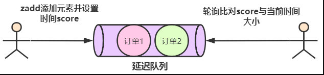

# Table of Contents


延迟队列是指把当前要做的事情，往后推迟一段时间再做。延迟队列的常见使用场景有以下几种：

- 在淘宝、京东等购物平台上下单，超过一定时间未付款，订单会自动取消；
- 打车的时候，在规定时间没有车主接单，平台会取消你的单并提醒你暂时没有车主接单；
- 点外卖的时候，如果商家在10分钟还没接单，就会自动取消订单；

在 Redis 可以使用有序集合（ZSet）的方式来实现延迟消息队列的，ZSet 有一个 Score 属性可以用来存储延迟执行的时间。

使用 zadd score1 value1 命令就可以一直往内存中生产消息。再利用 zrangebysocre 查询符合条件的所有待处理的任务， 通过循环执行队列任务即可。




```java
import redis.clients.jedis.Jedis;
import utils.JedisUtils;

import java.time.Instant;
import java.util.Set;

/**
 * 延迟队列
 */
public class DelayQueueExample {
    // zset key
    private static final String _KEY = "myDelayQueue";

    public static void main(String[] args) throws InterruptedException {
        Jedis jedis = JedisUtils.getJedis();
        // 延迟 30s 执行（30s 后的时间）
        long delayTime = Instant.now().plusSeconds(30).getEpochSecond();
        jedis.zadd(_KEY, delayTime, "order_1");
        // 继续添加测试数据
        jedis.zadd(_KEY, Instant.now().plusSeconds(2).getEpochSecond(), "order_2");
        jedis.zadd(_KEY, Instant.now().plusSeconds(2).getEpochSecond(), "order_3");
        jedis.zadd(_KEY, Instant.now().plusSeconds(7).getEpochSecond(), "order_4");
        jedis.zadd(_KEY, Instant.now().plusSeconds(10).getEpochSecond(), "order_5");
        // 开启延迟队列
        doDelayQueue(jedis);
    }

    /**
     * 延迟队列消费
     * @param jedis Redis 客户端
     */
    public static void doDelayQueue(Jedis jedis) throws InterruptedException {
        while (true) {
            // 当前时间
            Instant nowInstant = Instant.now();
            long lastSecond = nowInstant.plusSeconds(-1).getEpochSecond(); // 上一秒时间
            long nowSecond = nowInstant.getEpochSecond();
            // 查询当前时间的所有任务
            Set<String> data = jedis.zrangeByScore(_KEY, lastSecond, nowSecond);
            for (String item : data) {
                // 消费任务
                System.out.println("消费：" + item);
            }
            // 删除已经执行的任务
            jedis.zremrangeByScore(_KEY, lastSecond, nowSecond);
            Thread.sleep(1000); // 每秒轮询一次
        }
    }
}

```

