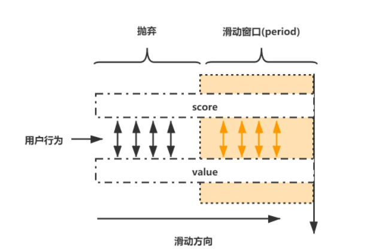

# Table of Contents

* [前提知识](#前提知识)
* [Redis自带漏桶算法](#redis自带漏桶算法)
* [Redis实现滑动窗口](#redis实现滑动窗口)


# 前提知识


+ 漏桶算法
+ 令牌桶算法

[限流算法讲解](../../I.分布式/限流实战.md)


# Redis自带漏桶算法


**在Redis4.0，已经为我们实现了限流功能，并提供了原子的限流指令，再加上Redis这个天生的分布式程序就可以完美地实现限流了**

**实现限流需要使用Redis提供的Redis-Cell模块，该模块使用的便是漏桶算法**


Redis-Cell 实现限流的方法也很简单，只需要使用一条指令 cl.throttle 即可，使用示例如下：

```text
> cl.throttle mylimit 15 30 60
1）（integer）0 # 0 表示获取成功，1 表示拒绝
2）（integer）15 # 漏斗容量
3）（integer）14 # 漏斗剩余容量
4）（integer）-1 # 被拒绝之后，多长时间之后再试（单位：秒）-1 表示无需重试
5）（integer）2 # 多久之后漏斗完全空出来
```

其中 15 为漏斗的容量，30 / 60s 为漏斗的速率。

# Redis实现滑动窗口

指定时间T内，只允许发生N次。我们可以将这个指定时间T，看成一个滑动时间窗口（定宽）。我们采用Redis的zset基本数据类型的score来圈出这个滑动时间窗口。在实际操作zset的过程中，我们只需要保留在这个滑动时间窗口以内的数据，其他的数据不处理即可。

- 每个用户的行为采用一个zset存储，score为毫秒时间戳，value也使用毫秒时间戳（比UUID更加节省内存）
- 只保留滑动窗口时间内的行为记录，如果zset为空，则移除zset，不再占用内存（节省内存）



此实现方式存在的缺点有两个：

- 使用 ZSet 存储有每次的访问记录，如果数据量比较大时会占用大量的空间，比如 60s 允许 100W 访问时；
- 此代码的执行非原子操作，先判断后增加，中间空隙可穿插其他业务逻辑的执行，最终导致结果不准确。
