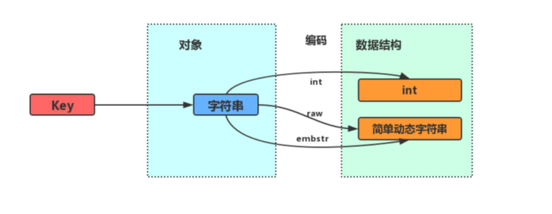

# Table of Contents

* [字符串对象](#字符串对象)
  * [编码](#编码)
  * [内存布局](#内存布局)
  * [raw 和 embstr 的区别：](#raw-和-embstr-的区别)
  * [编码的转换](#编码的转换)
* [列表对象](#列表对象)
  * [编码](#编码-1)
  * [内存布局](#内存布局-1)
* [哈希对象](#哈希对象)
  * [编码](#编码-2)
  * [内存结构](#内存结构)
  * [编码转换](#编码转换)
* [集合对象](#集合对象)
  * [编码](#编码-3)
  * [编码转换](#编码转换-1)
* [有序集合对象](#有序集合对象)
  * [编码](#编码-4)
  * [编码转换](#编码转换-2)


# 字符串对象

字符串是Redis最基本的数据类型，不仅所有key都是字符串类型，其它几种数据类型构成的元素也是字符串。注意字符串的长度不能超过<font color=red>512M</font>。

如果超过呢？会报错

```java
Exception in thread "main" redis.clients.jedis.exceptions.JedisDataException: ERR string exceeds maximum allowed size (512MB)
	at redis.clients.jedis.Protocol.processError(Protocol.java:153)
```


## 编码



字符串对象的编码可以是int，embstr或者raw。


+ `int 编码`：保存的是可以用 long 类型表示的整数值。

+ `embstr 编码`：保存长度小于44字节的字符串（redis3.2版本之前是39字节，之后是44字节）。

+ `raw 编码`：保存长度大于44字节的字符串（redis3.2版本之前是39字节，之后是44字节）。


## 内存布局


## raw 和 embstr 的区别：

其实 embstr 编码是专门用来保存短字符串的一种优化编码，raw 和 embstr 的区别：

embstr与raw都使用redisObject和sds保存数据，区别在于，<font color=red>embstr的使用只分配一次内存空间（因此redisObject和sds是连续的），而raw需要分配两次内存空间（分别为redisObject和sds分配空间）</font>。因此与raw相比，embstr的好处在于创建时少分配一次空间，删除时少释放一次空间，以及对象的所有数据连在一起，寻找方便。而embstr的坏处也很明显，如果字符串的长度增加需要重新分配内存时，整个redisObject和sds都需要重新分配空间，因此redis中的embstr实现为只读。


这里有点疑问，都是ptr指针执行 sds,为什么raw需要分配2次？？？？？

**Redis中对于浮点数类型也是作为字符串保存的，在需要的时候再将其转换成浮点数类型**。


## 编码的转换


当 int 编码保存的值不再是整数，或大小超过了long的范围时，自动转化为raw。 对于 embstr 编码，由于 Redis 没有对其编写任何的修改程序（embstr 是只读的），在对embstr对象进行修改时，都会先转化为raw再进行修改，因此，只要是修改embstr对象，修改后的对象一定是raw的，无论是否达到了44个字节。


# 列表对象

list 列表，它是简单的字符串列表，按照插入顺序排序，你可以添加一个元素到列表的头部（左边）或者尾部（右边），它的底层实际上是个链表结构。

## 编码


列表对象的编码是quicklist。 (之前版本中有linked和ziplist这两种编码。进一步的, 目前Redis定义的10个对象编码方式宏名中, 有两个被完全闲置了, 分别是: OBJ_ENCODING_ZIPMAP与OBJ_ENCODING_LINKEDLIST。 从Redis的演进历史上来看, 前者是后续可能会得到支持的编码值（代码还在）, 后者则应该是被彻底淘汰了)

## 内存布局 


# 哈希对象

哈希对象的键是一个字符串类型，值是一个键值对集合。

## 编码

哈希对象的编码可以是 ziplist 或者 hashtable；对应的底层实现有两种, 一种是ziplist, 一种是dict。

## 内存结构

+ 举列说明

```java
hset profile name "Tom"
hset profile age 25
hset profile career "Programmer"
```

如果使用ziplist，profile 存储如下：


当使用 hashtable 编码时，上面命令存储如下：


hashtable 编码的哈希表对象底层使用字典数据结构，哈希对象中的每个键值对都使用一个字典键值对。 
在前面介绍压缩列表时，我们介绍过压缩列表是Redis为了节省内存而开发的，是由一系列特殊编码的连续内存块组成的顺序型数据结构，相对于字典数据结构，<font color=red>压缩列表用于元素个数少、元素长度小的场景</font>。其优势在于集中存储，节省空间。

## 编码转换

和上面列表对象使用 ziplist 编码一样，当同时满足下面两个条件时，使用ziplist（压缩列表）编码： 

1、 列表保存元素个数小于512个

2、每个元素长度小于64字节 不能满足这两个条件的时候使用 hashtable 编码。

第一个条件可以通过配置文件中的 set-max-intset-entries 进行修改。


# 集合对象

集合对象 set 是 string 类型（整数也会转换成string类型进行存储）的无序集合。注意集合和列表的区别：集合中的元素是无序的，因此不能通过索引来操作元素；集合中的元素不能有重复。

## 编码

集合对象的编码可以是 intset 或者 hashtable; 底层实现有两种, 分别是intset和dict。 <font color=red>显然当使用intset作为底层实现的数据结构时, 集合中存储的只能是数值数据, 且必须是整数</font>; 而当使用dict作为集合对象的底层实现时,<font color=red> 是将数据全部存储于dict的键中, 值字段闲置不用</font>.

```java
SADD numbers 1 3 5
```


```java
SADD Dfruits "apple" "banana" "cherry"
```


## 编码转换


当集合同时满足以下两个条件时，使用 intset 编码：
1、集合对象中所有元素都是整数 
2、集合对象所有元素数量不超过512 
不能满足这两个条件的就使用 hashtable 编码。第二个条件可以通过配置文件的 set-max-intset-entries 进行配置。


# 有序集合对象

和上面的集合对象相比，有序集合对象是有序的。与列表使用索引下标作为排序依据不同，有序集合为每个元素设置一个分数（score）作为排序依据。

## 编码

有序集合的底层实现依然有两种, 一种是使用ziplist作为底层实现, 另外一种比较特殊,
底层使用了两种数据结构: dict与skiplist. 前者对应的编码值宏为ZIPLIST, 后者对应的编码值宏为SKIPLIST


使用ziplist来实现在序集合很容易理解, 只需要在ziplist这个数据结构的基础上做好排序与去重就可以了. 使用zskiplist来实现有序集合也很容易理解, Redis中实现的这个跳跃表似乎天然就是为了实现有序集合对象而实现的, 那么为什么还要辅助一个dict实例呢? 我们先看来有序集合对象在这两种编码方式下的内存布局, 然后再做解释: 首先是编码为ZIPLIST时, 有序集合的内存布局如下:


然后是编码为SKIPLIST时, 有序集合的内存布局如下:


说明：其实有序集合单独使用字典或跳跃表其中一种数据结构都可以实现，但是这里使用两种数据结构组合起来，原因是假如我们单独使用 字典，虽然能以 O(1) 的时间复杂度查找成员的分值，但是因为字典是以无序的方式来保存集合元素，所以每次进行范围操作的时候都要进行排序；假如我们单独使用跳跃表来实现，虽然能执行范围操作，但是查找操作有 O(1)的复杂度变为了O(logN)。因此Redis使用了两种数据结构来共同实现有序集合

## 编码转换


当有序集合对象同时满足以下两个条件时，对象使用 ziplist 编码： 
1、保存的元素数量小于128； 
2、保存的所有元素长度都小于64字节。 
不能满足上面两个条件的使用 skiplist 编码。
以上两个条件也可以通过Redis配置文件zset-max-ziplist-entries 选项和 zset-max-ziplist-value 进行修改。
