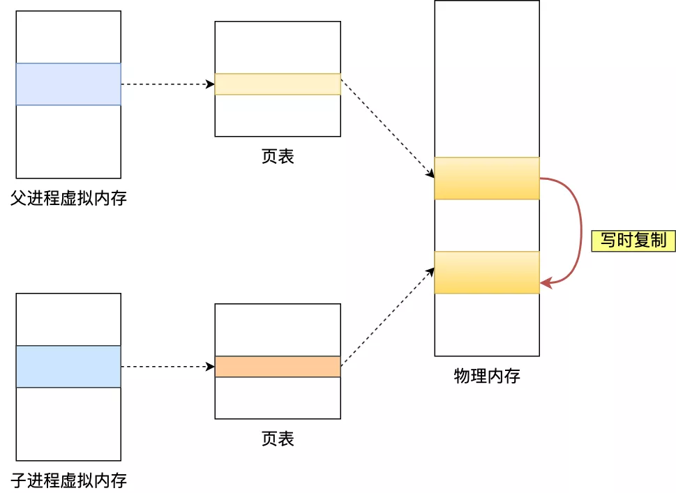
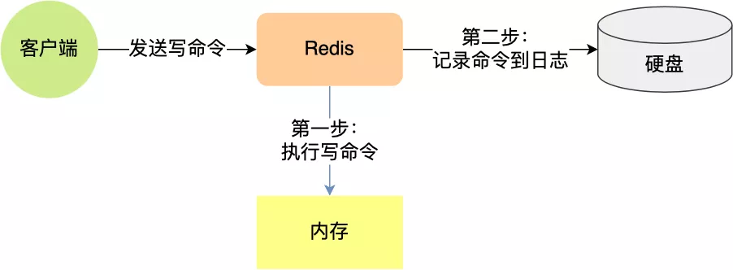
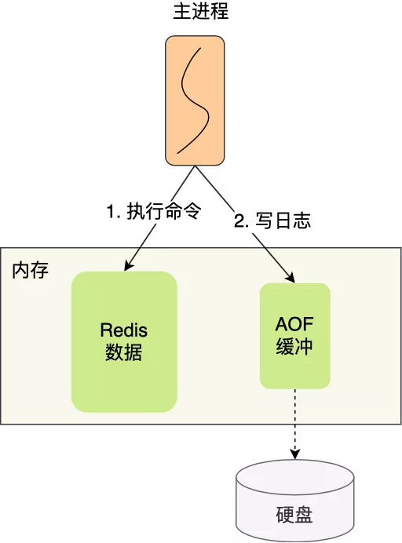
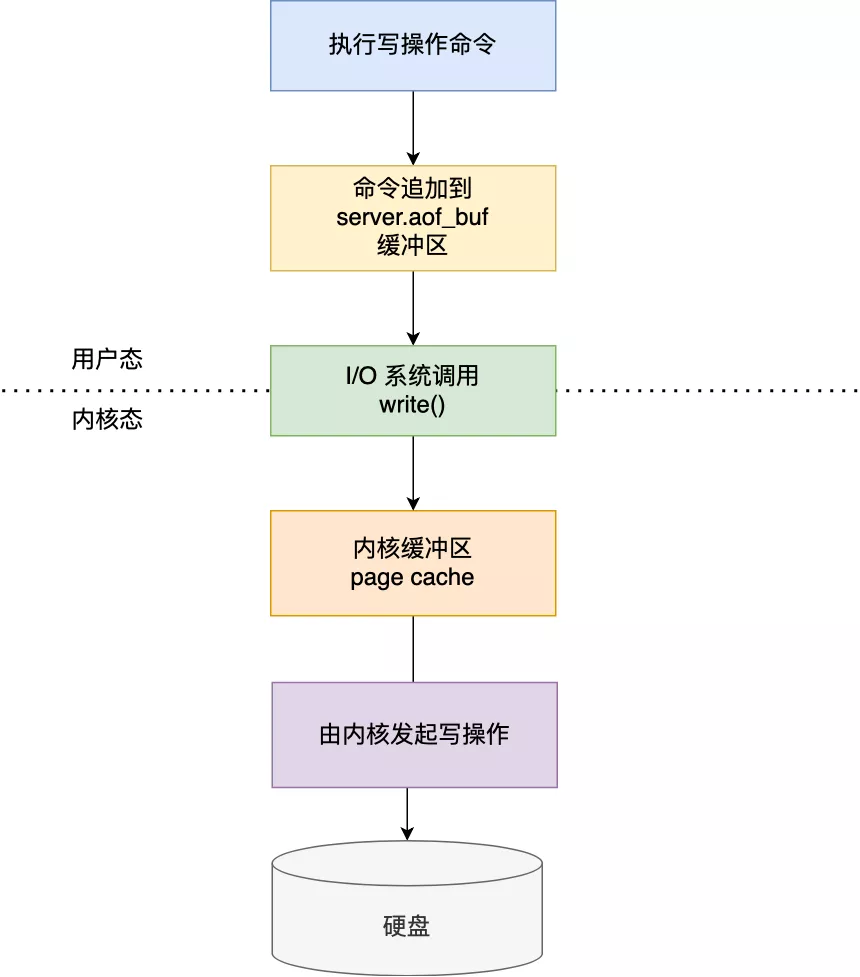
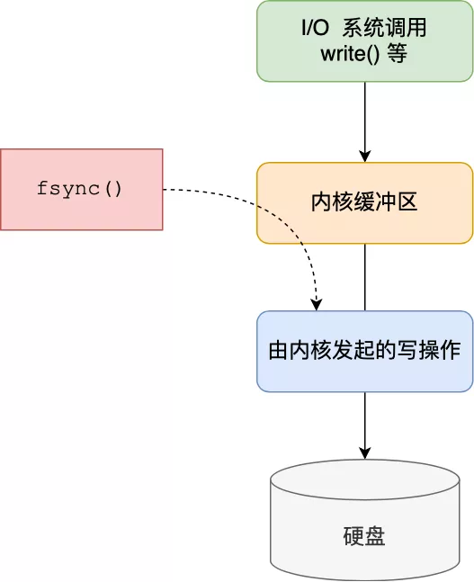
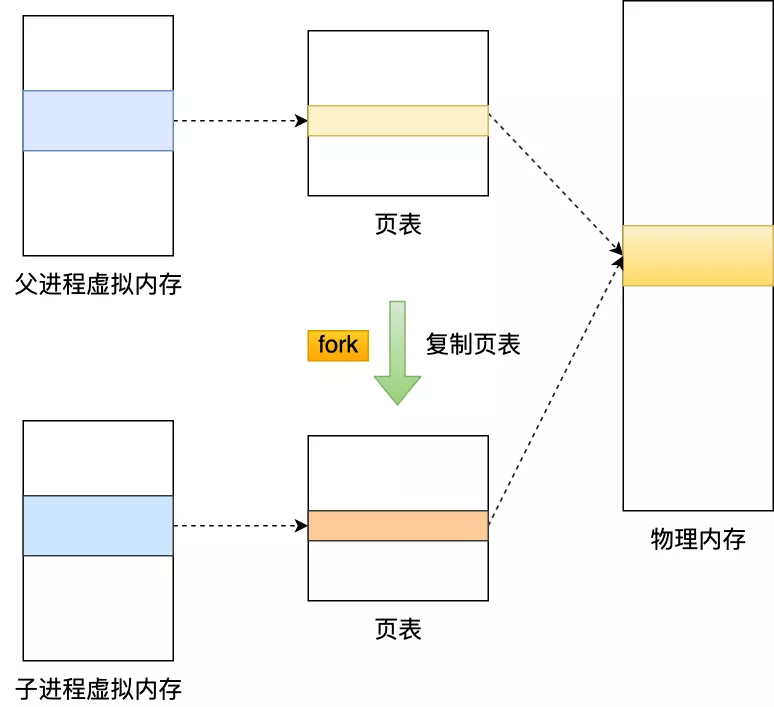
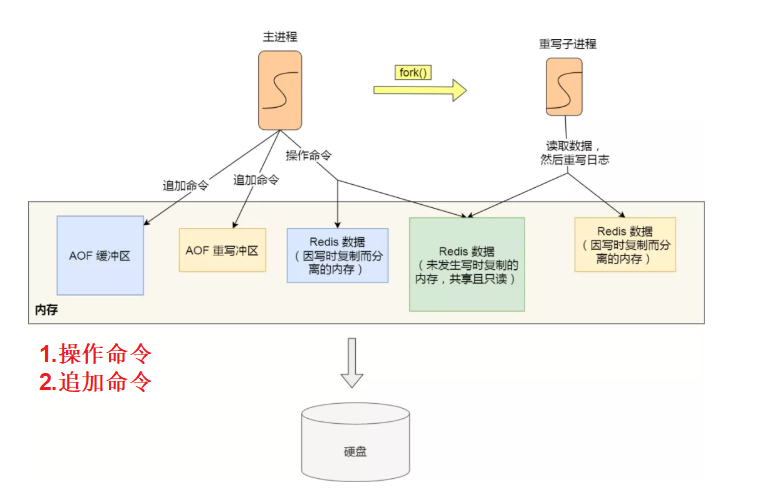

# Table of Contents

* [参考资料](#参考资料)
* [前言](#前言)
* [Redis持久化简介](#redis持久化简介)
* [RDB](#rdb)
  * [触发方式](#触发方式)
  * [执行快照时，数据能被修改吗？](#执行快照时数据能被修改吗)
  * [redis.conf中配置RDB](#redisconf中配置rdb)
  * [**其它相关配置**](#其它相关配置)
  * [RDB优缺点](#rdb优缺点)
* [AOF](#aof)
  * [为什么是写后日志](#为什么是写后日志)
  * [三种写回策略](#三种写回策略)
  * [AOF 重写机制](#aof-重写机制)
    * [AOF 后台重写（写时复制）](#aof-后台重写写时复制)
  * [总结](#总结)
  * [redis.conf中配置AOF](#redisconf中配置aof)
* [RDB和AOF(4.0)](#rdb和aof40)
* [恢复数据](#恢复数据)
* [性能与实践](#性能与实践)
* [相关问题](#相关问题)
  * [Redis单线程怎么理解？开启了子进程不就是多线程吗？](#redis单线程怎么理解开启了子进程不就是多线程吗)
  * [重写缓冲区占满了会发生什么？](#重写缓冲区占满了会发生什么)


# 参考资料

<https://mp.weixin.qq.com/s?__biz=MzUxODAzNDg4NQ==&mid=2247493808&idx=1&sn=588d318ec6e72844841d566f16acaf30&scene=21#wechat_redirect>

# 前言


为了防止数据丢失以及服务重启时能够恢复数据，Redis支持数据的持久化，主要分为两种方式，分别是RDB和AOF; 当然实际场景下还会使用这两种的混合模式。


# Redis持久化简介 

- **为什么需要持久化**？

  Redis是个基于内存的数据库。那服务一旦宕机，内存中的数据将全部丢失。

  通常的解决方案是从后端数据库恢复这些数据，但后端数据库有性能瓶颈，如果是大数据量的恢复，

  1、会对数据库带来巨大的压力，

  2、数据库的性能不如Redis。导致程序响应慢。

  所以对Redis来说，实现数据的持久化，避免从后端数据库中恢复数据，是至关重要的。


  <font color=red>总结来说，后端数据库满足不了Redis的性能要求。</font>

- **Redis持久化有哪些方式呢**？**为什么我们需要重点学RDB和AOF**？

从严格意义上说，Redis服务提供四种持久化存储方案：`RDB`、`AOF`、`虚拟内存（VM）`和　`DISKSTORE`。虚拟内存（VM）方式，从Redis Version 2.4开始就被官方明确表示不再建议使用，Version 3.2版本中更找不到关于虚拟内存（VM）的任何配置范例，Redis的主要作者Salvatore Sanfilippo还专门写了一篇论文，来反思Redis对虚拟内存（VM）存储技术的支持问题。

至于DISKSTORE方式，是从Redis Version 2.8版本开始提出的一个存储设想，到目前为止Redis官方也没有在任何stable版本中明确建议使用这用方式。在Version 3.2版本中同样找不到对于这种存储方式的明确支持。从网络上能够收集到的各种资料来看，DISKSTORE方式和RDB方式还有着一些千丝万缕的联系，不过各位读者也知道，除了官方文档以外网络资料很多就是大抄。

最关键的是目前官方文档上能够看到的Redis对持久化存储的支持明确的就只有两种方案（https://redis.io/topics/persistence）：RDB和AOF。所以本文也只会具体介绍这两种持久化存储方案的工作特定和配置要点。

这两种技术都会用各用一个日志文件来记录信息，但是记录的内容是不同的。

- AOF 文件的内容是操作命令；
- RDB 文件的内容是二进制数据。

RDB 快照就是记录某一个瞬间的内存数据，记录的是实际数据，而 AOF 文件记录的是命令操作的日志，而不是实际的数据。

# RDB

RDB 就是 Redis DataBase 的缩写，中文名为快照/内存快照。

RDB持久化是把<font color=red>当前进程数据生成快照保存到磁盘上的过程</font>，由于是某一时刻的快照，那么快照中的值要<font color=red>早于或者等于内存中的值</font>。


## 触发方式

+ 手动
  Redis 提供了两个命令来生成 RDB 文件，分别是 `save` 和 `bgsave`，**他们的区别就在于是否在「主线程」里执行：**

  + **save**:阻塞当前Redis服务器，直到RDB过程完成为止，对于<font color=red>内存 比较大的实例会造成长时间**阻塞**，线上环境不建议使用</font>

  + **bgsave**:Redis进程执行fork操作创建子进程，RDB持久化过程由子 进程负责，完成后自动结束。<font color=red>阻塞只发生在fork阶段，一般时间很短</font>。(这里指的是主进程fork子进程会阻塞主进程)

    

    具体流程如下：

    - redis客户端执行bgsave命令或者自动触发bgsave命令；
    - 主进程判断当前是否已经存在正在执行的子进程，如果存在，那么主进程直接返回；
    - 如果不存在正在执行的子进程，那么就fork一个新的子进程进行持久化数据，<font color=red>fork过程是阻塞的，fork操作完成后主进程即可执行其他操作</font>；
    - 子进程先将数据写入到临时的rdb文件中，待快照数据写入完成后再原子替换旧的rdb文件；
    - 同时发送信号给主进程，通知主进程rdb持久化完成，主进程更新相关的统计信息（info Persitence下的rdb_*相关选项）。

+ 自动

  + redis.conf中配置`save m n`，即在m秒内有n次修改时，自动触发bgsave生成rdb文件；

  + 主从复制时，从节点要从主节点进行全量复制时也会触发bgsave操作，生成当时的快照发送到从节点；

  + 执行debug reload命令重新加载redis时也会触发bgsave操作；

  + 默认情况下执行shutdown命令时，如果没有开启aof持久化，那么也会触发bgsave操作；


> 注意事项！

这里提一点，Redis 的快照是**全量快照**，**也就是说每次执行快照，都是把内存中的「所有数据」都记录到磁盘中。**

所以可以认为，执行快照是一个比较重的操作，如果频率太频繁，可能会对 Redis 性能产生影响。如果频率太低，服务器故障时，丢失的数据会更多。

通常可能设置至少 5 分钟才保存一次快照，这时如果 Redis 出现宕机等情况，则意味着最多可能丢失 5 分钟数据。

这就是 RDB 快照的缺点，在服务器发生故障时，丢失的数据会比 AOF 持久化的方式更多，因为 RDB 快照是全量快照的方式，因此执行的频率不能太频繁，否则会影响 Redis 性能，而 AOF 日志可以以秒级的方式记录操作命令，所以丢失的数据就相对更少。

## 执行快照时，数据能被修改吗？

那问题来了，执行 bgsava 过程中，由于是交给子进程来构建 RDB 文件，主线程还是可以继续工作的，此时主线程可以修改数据吗？

如果不可以修改数据的话，那这样性能一下就降低了很多。如果可以修改数据，又是如何做到到呢？

直接说结论吧，执行 bgsava 过程中，Redis 依然**可以继续处理操作命令**的，也就是数据是能被修改的。

那具体如何做到到呢？关键的技术就在于**写时复制技术（Copy-On-Write, COW）。**

执行 bgsava 命令的时候，会通过 `fork()` 创建子进程，此时子进程和父进程是共享同一片内存数据的，因为创建子进程的时候，会复制父进程的页表，但是页表指向的物理内存还是一个。


只有在发生修改内存数据的情况时，**修改数据的物理内存**才会被复制一份。未修改的数据还是共享的。



> 注意是 写的时候，子进程会复制主进程的物理内存，当主进程有修改数据时，此时子进程的物理内存时没法读取，需要同步过来。


**这样的目的是为了减少创建子进程时的性能损耗，从而加快创建子进程的速度，毕竟创建子进程的过程中，是会阻塞主线程的。**

所以，创建 bgsave 子进程后，由于共享父进程的所有内存数据，于是就可以直接读取主线程里的内存数据，并将数据写入到 RDB 文件。

当主线程对这些共享的内存数据也都是只读操作，那么，主线程和 bgsave 子进程相互不影响。

但是，如果主线程要**修改共享数据里的某一块数据**（比如键值对 `A`）时，就会发生写时复制，于是这块数据的**物理内存就会被复制一份（键值对 A'）**，然后**主线程在这个数据副本（键值对 A'）进行修改操作**。与此同时，**bgsave 子进程可以继续把原来的数据（键值对 A）写入到 RDB 文件**。

就是这样，Redis 使用 bgsave 对当前内存中的所有数据做快照，这个操作是由 bgsave 子进程在后台完成的，执行时不会阻塞主线程，这就使得主线程同时可以修改数据。

细心的同学，肯定发现了，bgsave 快照过程中，如果主线程修改了共享数据，**发生了写时复制后，RDB 快照保存的是原本的内存数据**，而主线程刚修改的数据，是被办法在这一时间写入 RDB 文件的，只能交由下一次的 bgsave 快照。

> 修改的数据，下次RDB才会同步，不像AOF,有重写缓冲区，可以继续写。

所以 Redis 在使用 bgsave 快照过程中，如果主线程修改了内存数据，不管是否是共享的内存数据，RDB 快照都无法写入主线程刚修改的数据，因为此时主线程的内存数据和子线程的内存数据已经分离了，子线程写入到 RDB 文件的内存数据只能是原本的内存数据。

**如果系统恰好在 RDB 快照文件创建完毕后崩溃了，那么 Redis 将会丢失主线程在快照期间修改的数据。**

另外，写时复制的时候会出现这么个极端的情况。

在 Redis 执行 RDB 持久化期间，刚 fork 时，主进程和子进程共享同一物理内存，但是途中主进程处理了写操作，修改了共享内存，于是当前被修改的数据的物理内存就会被复制一份。

那么极端情况下，**如果所有的共享内存都被修改，则此时的内存占用是原先的 2 倍。**

所以，针对写操作多的场景，我们要留意下快照过程中内存的变化，防止内存被占满了。


## redis.conf中配置RDB

```java

# 周期性执行条件的设置格式为
save <seconds> <changes>

# 默认的设置为：
save 900 1
save 300 10
save 60 10000

# 以下设置方式为关闭RDB快照功能
save ""
```


## **其它相关配置**

```java

# 文件名称
dbfilename dump.rdb

# 文件保存路径
dir /home/work/app/redis/data/

# 如果持久化出错，主进程是否停止写入
stop-writes-on-bgsave-error yes

# 是否压缩
rdbcompression yes

# 导入时是否检查
rdbchecksum yes
```

`dbfilename`：RDB文件在磁盘上的名称。

`dir`：RDB文件的存储路径。默认设置为“./”，也就是Redis服务的主目录。

`stop-writes-on-bgsave-error`：上文提到的在快照进行过程中，主进程照样可以接受客户端的任何写操作的特性，是指在快照操作正常的情况下。如果快照操作出现异常（例如操作系统用户权限不够、磁盘空间写满等等）时，Redis就会禁止写操作。这个特性的主要目的是使运维人员在第一时间就发现Redis的运行错误，并进行解决。一些特定的场景下，您可能需要对这个特性进行配置，这时就可以调整这个参数项。该参数项默认情况下值为yes，如果要关闭这个特性，指定即使出现快照错误Redis一样允许写操作，则可以将该值更改为no。

`rdbcompression`：该属性将在字符串类型的数据被快照到磁盘文件时，启用LZF压缩算法。Redis官方的建议是请保持该选项设置为yes，因为“it’s almost always a win”。

`rdbchecksum`：从RDB快照功能的version 5 版本开始，一个64位的CRC冗余校验编码会被放置在RDB文件的末尾，以便对整个RDB文件的完整性进行验证。这个功能大概会多损失10%左右的性能，但获得了更高的数据可靠性。所以如果您的Redis服务需要追求极致的性能，就可以将这个选项设置为no。


## RDB优缺点

+ **优点**
  + RDB文件是某个时间节点的快照，默认使用**LZF算法**进行压缩，压缩后的文件体积远远小于内存大小，适用于备份、全量复制等场景；
  + Redis加载RDB文件恢复数据要远远快于AOF方式； 为什么? 二进制文件？

+ **缺点**
  + RDB方式实<font color=red>时性不够，无法做到秒级的持久化</font>；
  + 每次调用bgsave都需要fork子进程，<font color=red>fork子进程属于重量级操作，频繁执行成本较高</font>；
  + RDB文件是二进制的，没有可读性，AOF文件在了解其结构的情况下可以手动修改或者补全；
  + 版本兼容RDB文件问题；

# AOF


Redis是“**写后**”日志，Redis先执行命令，把数据写入内存，然后才记录日志。

日志里记录的是Redis收到的每一条命令，这些命令是以**文本**形式保存。

PS: 大多数的数据库采用的是写前日志（WAL），例如MySQL，通过写前日志和两阶段提交，实现数据和逻辑的一致性


而AOF日志采用写后日志，即**先写内存，后写日志**



## 为什么是写后日志

Redis要求高性能，采用写日志有两方面好处：

- **避免额外的检查开销**：Redis 在向 AOF 里面记录日志的时候，并不会先去对这些命令进行语法检查。所以，如果先记日志再执行命令的话，日志中就有可能记录了错误的命令，Redis 在使用日志恢复数据时，就可能会出错。
- 不会阻塞当前的写操作

但这种方式存在潜在风险：

- 如果命令执行完成，写日志之前宕机了，会丢失数据。

- 主线程写磁盘压力大，导致写盘慢，阻塞后续操作。**可能会给「下一个」命令带来阻塞风险**。

  因为将命令写入到日志的这个操作也是在主进程完成的（执行命令也是在主进程），也就是说这两个操作是同步的。



认真分析一下，其实这两个风险都有一个共性，都跟「 **AOF 日志写回硬盘的时机**」有关。


## 三种写回策略

Redis 写入 AOF 日志的过程，如下图：



我先来具体说说：

1. Redis 执行完写操作命令后，会将命令追加到 `server.aof_buf` 缓冲区；
2. 然后通过 write() 系统调用，将 aof_buf 缓冲区的数据写入到 AOF 文件，此时数据并没有写入到硬盘，而是拷贝到了内核缓冲区 page cache，等待内核将数据写入硬盘；
3. 具体内核缓冲区的数据什么时候写入到硬盘，由内核决定。

Redis 提供了 3 种写回硬盘的策略，**控制的就是上面说的第三步的过程。**


在 `redis.conf` 配置文件中的 `appendfsync` 配置项可以有以下 3 种参数可填：


- **Always**，这个单词的意思是「总是」，所以它的意思是每次写操作命令执行完后，**同步将 AOF 日志数据写回硬盘；**
- **Everysec**，这个单词的意思是「每秒」，所以它的意思是每次写操作命令执行完后，先将命令写入到 AOF 文件的内核缓冲区，**然后每隔一秒将缓冲区里的内容写回到硬盘；**
- **No**，意味着不由 Redis 控制写回硬盘的时机，转交给操作系统控制写回的时机，也就是每次写操作命令执行完后，先将命令写入到 AOF 文件的内核缓冲区，**再由操作系统决定何时将缓冲区内容写回硬盘。**


这 3 种写回策略都无法能完美解决「主进程阻塞」和「减少数据丢失」的问题，因为两个问题是对立的，偏向于一边的话，就会要牺牲另外一边，原因如下：

- Always 策略的话，可以最大程度保证数据不丢失，但是由于它每执行一条写操作命令就同步将 AOF 内容写回硬盘，所以是不可避免会影响主进程的性能；
- No 策略的话，是交由操作系统来决定何时将 AOF 日志内容写回硬盘，相比于 Always 策略性能较好，但是操作系统写回硬盘的时机是不可预知的，如果 AOF 日志内容没有写回硬盘，一旦服务器宕机，就会丢失不定数量的数据。
- Everysec 策略的话，是折中的一种方式，避免了 Always 策略的性能开销，也比 No 策略更能避免数据丢失，当然如果上一秒的写操作命令日志没有写回到硬盘，发生了宕机，这一秒内的数据自然也会丢失。

大家根据自己的业务场景进行选择：

- 如果要高性能，就选择 No 策略；
- 如果要高可靠，就选择 Always 策略；
- 如果允许数据丢失一点，但又想性能高，就选择 Everysec 策略。


深入到源码后，你就会发现这三种策略只是在控制 `fsync()` 函数的调用时机。



如果想要应用程序向文件写入数据后，能立马将数据同步到硬盘，就可以调用 `fsync()` 函数，这样内核就会将内核缓冲区的数据直接写入到硬盘，等到硬盘写操作完成后，该函数才会返回。

- Always 策略就是每次写入 AOF 文件数据后，就执行 fsync() 函数；
- Everysec 策略就会创建一个异步任务来执行 fsync() 函数；
- No 策略就是永不执行 fsync() 函数;


## AOF 重写机制


AOF会记录每个写命令到AOF文件，随着时间越来越长，AOF文件会变得越来越大。

如果不加以控制，会对Redis服务器，甚至对操作系统造成影响，而且AOF文件越大，数据恢复也越慢。

为了解决AOF文件体积膨胀的问题，Redis提供<font color=red>AOF文件重写机制</font>来对AOF文件进行“瘦身”。


+ **图例解释AOF重写**

AOF 重写机制是在重写时，读取当前数据库中的所有键值对，然后将每一个键值对用一条命令记录到**「新的 AOF 文件」**，等到全部记录完后，就将**新的 AOF 文件替换掉现有的 AOF 文件**。


总结来说，就是对<font color=red>某些数据进行最终态的保留</font>。


- 为什么不复用现有文件？

因为**如果 AOF 重写过程中失败了，现有的 AOF 文件就会造成污染**，可能无法用于恢复使用。


### AOF 后台重写（写时复制）

写入 AOF 日志的操作虽然是在主进程完成的，因为它写入的内容不多，所以一般不太影响命令的操作。

但是在触发 AOF 重写时，比如当 AOF 文件大于 64M 时，就会对 AOF 文件进行重写，这时是需要读取所有缓存的键值对数据，并为每个键值对生成一条命令，然后将其写入到新的 AOF 文件，重写完后，就把现在的 AOF 文件替换掉。

这个过程其实是很耗时的，所以重写的操作不能放在主进程里。

所以，Redis 的**重写 AOF 过程是由后台子进程 bgrewriteaof 来完成的**，这么做可以达到两个好处：

- 子进程进行 AOF 重写期间，主进程可以继续处理命令请求，从而避免阻塞主进程；
- 子进程带有主进程的数据副本（*数据副本怎么产生的后面会说*），这里使用子进程而不是线程，因为如果是使用线程，多线程之间会共享内存，那么在修改共享内存数据的时候，需要通过加锁来保证数据的安全，而这样就会降低性能。而使用子进程，创建子进程时，父子进程是共享内存数据的，不过这个共享的内存只能以只读的方式，而当父子进程任意一方修改了该共享内存，就会发生「写时复制」，于是父子进程就有了独立的数据副本，就不用加锁来保证数据安全。

子进程是怎么拥有主进程一样的数据副本的呢？

主进程在通过 `fork` 系统调用生成 bgrewriteaof 子进程时，操作系统会把主进程的「**页表**」复制一份给子进程，这个页表记录着虚拟地址和物理地址映射关系，而不会复制物理内存，也就是说，两者的虚拟空间不同，但其对应的物理空间是同一个。




这样一来，子进程就共享了父进程的物理内存数据了，这样能够**节约物理内存资源**，页表对应的页表项的属性会标记该物理内存的权限为**只读**。

不过，当父进程或者子进程在向这个内存发起写操作时，CPU 就会触发**缺页中断**，这个缺页中断是由于违反权限导致的，然后操作系统会在「缺页异常处理函数」里进行**物理内存的复制**，并重新设置其内存映射关系，将父子进程的内存读写权限设置为**可读写**，最后才会对内存进行写操作，这个过程被称为「**写时复制(Copy On Write)**」。


写时复制顾名思义，**在发生写操作的时候，操作系统才会去复制物理内存**，这样是为了防止 fork 创建子进程时，由于物理内存数据的复制时间过长而导致父进程长时间阻塞的问题。

当然，操作系统复制父进程页表的时候，父进程也是阻塞中的，不过页表的大小相比实际的物理内存小很多，所以通常复制页表的过程是比较快的。

不过，如果父进程的内存数据非常大，那自然页表也会很大，这时父进程在通过 fork 创建子进程的时候，阻塞的时间也越久。

> 下面话多读几遍

所以，有两个阶段会导致阻塞父进程：

- 创建子进程的途中，由于要复制父进程的页表等数据结构，阻塞的时间跟页表的大小有关，页表越大，阻塞的时间也越长；
- 创建完子进程后，如果子进程或者父进程修改了共享数据，就会发生写时复制，这期间会拷贝物理内存，如果内存越大，自然阻塞的时间也越长；

触发重写机制后，主进程就会创建重写 AOF 的子进程，此时父子进程共享物理内存，重写子进程只会对这个内存进行只读，重写 AOF 子进程会读取数据库里的所有数据，并逐一把内存数据的键值对转换成一条命令，再将命令记录到重写日志（新的 AOF 文件）。

但是子进程重写过程中，主进程依然可以正常处理命令。

如果此时**主进程修改了已经存在 key-value，就会发生写时复制，注意这里只会复制主进程修改的物理内存数据，没修改物理内存还是与子进程共享的**。

> 多读几遍，多理解下！

所以如果这个阶段修改的是一个 bigkey，也就是数据量比较大的 key-value 的时候，这时复制的物理内存数据的过程就会比较耗时，有阻塞主进程的风险。

还有个问题，重写 AOF 日志过程中，如果主进程修改了已经存在 key-value，此时这个 key-value 数据在子进程的内存数据就跟主进程的内存数据不一致了，这时要怎么办呢？

为了解决这种数据不一致问题，Redis 设置了一个 **AOF 重写缓冲区**，这个缓冲区在创建 bgrewriteaof 子进程之后开始使用。

> Q:有了写时复制，为什么还要有AOF重写缓冲区？
>
> A:是为了在发生写时复制时的数据，也一起写入AOF文件。

在重写 AOF 期间，当 Redis 执行完一个写命令之后，它会**同时将这个写命令写入到 「AOF 缓冲区」和 「AOF 重写缓冲区」**。



也就是说，在 bgrewriteaof 子进程执行 AOF 重写期间，主进程需要执行以下三个工作:

- 执行客户端发来的命令；
- 将执行后的写命令追加到 「AOF 缓冲区」；
- 将执行后的写命令追加到 「AOF 重写缓冲区」；

**当子进程完成 AOF 重写工作**（*扫描数据库中所有数据，逐一把内存数据的键值对转换成一条命令，再将命令记录到重写日志*）后，会向主进程发送一条信号，信号是进程间通讯的一种方式，且是异步的。

主进程收到该信号后，会调用一个信号处理函数，该函数主要做以下工作：

- 将 AOF 重写缓冲区中的所有内容追加到新的 AOF 的文件中，使得新旧两个 AOF 文件所保存的数据库状态一致；
- 新的 AOF 的文件进行改名，覆盖现有的 AOF 文件。

信号函数执行完后，主进程就可以继续像往常一样处理命令了。

在整个 AOF 后台重写过程中，除了发生写时复制会对主进程造成阻塞，还有信号处理函数执行时也会对主进程造成阻塞，在其他时候，AOF 后台重写都不会阻塞主进程。


## 总结

 Redis 持久化技术中的 AOF 方法，这个方法是每执行一条写操作命令，就将该命令以追加的方式写入到 AOF 文件，然后在恢复时，以逐一执行命令的方式来进行数据恢复。

Redis 提供了三种将 AOF 日志写回硬盘的策略，分别是 Always、Everysec 和 No，这三种策略在可靠性上是从高到低，而在性能上则是从低到高。

随着执行的命令越多，AOF 文件的体积自然也会越来越大，为了避免日志文件过大， Redis 提供了 AOF 重写机制，它会直接扫描数据中所有的键值对数据，然后为每一个键值对生成一条写操作命令，接着将该命令写入到新的 AOF 文件，重写完成后，就替换掉现有的 AOF 日志。重写的过程是由后台子进程完成的，这样可以使得主进程可以继续正常处理命令。

用 AOF 日志的方式来恢复数据其实是很慢的，因为 Redis 执行命令由单线程负责的，而 AOF 日志恢复数据的方式是顺序执行日志里的每一条命令，如果 AOF 日志很大，这个「重放」的过程就会很慢了。

## redis.conf中配置AOF

**默认情况下，Redis是没有开启AOF的**，可以通过配置redis.conf文件来开启AOF持久化，关于AOF的配置如下：

```java
# appendonly参数开启AOF持久化
appendonly no

# AOF持久化的文件名，默认是appendonly.aof
appendfilename "appendonly.aof"

# AOF文件的保存位置和RDB文件的位置相同，都是通过dir参数设置的
dir ./

# 同步策略
# appendfsync always
appendfsync everysec
# appendfsync no

# aof重写期间是否同步
no-appendfsync-on-rewrite no

# 重写触发配置
auto-aof-rewrite-percentage 100
auto-aof-rewrite-min-size 64mb

# 加载aof出错如何处理
aof-load-truncated yes

# 文件重写策略
aof-rewrite-incremental-fsync yes

```


以下是Redis中关于AOF的主要配置信息：

`appendonly`：默认情况下AOF功能是关闭的，将该选项改为yes以便打开Redis的AOF功能。

`appendfilename`：这个参数项很好理解了，就是AOF文件的名字。

`appendfsync`：这个参数项是AOF功能最重要的设置项之一，主要用于设置“真正执行”操作命令向AOF文件中同步的策略。

什么叫“真正执行”呢？还记得Linux操作系统对磁盘设备的操作方式吗？ 为了保证操作系统中I/O队列的操作效率，应用程序提交的I/O操作请求一般是被放置在linux Page Cache中的，然后再由Linux操作系统中的策略自行决定正在写到磁盘上的时机。而Redis中有一个fsync()函数，可以将Page Cache中待写的数据真正写入到物理设备上，而缺点是频繁调用这个fsync()函数干预操作系统的既定策略，可能导致I/O卡顿的现象频繁 。

与上节对应，appendfsync参数项可以设置三个值，分别是：always、everysec、no，默认的值为everysec。

`no-appendfsync-on-rewrite`：always和everysec的设置会使真正的I/O操作高频度的出现，甚至会出现长时间的卡顿情况，这个问题出现在操作系统层面上，所有靠工作在操作系统之上的Redis是没法解决的。为了尽量缓解这个情况，Redis提供了这个设置项，保证在完成fsync函数调用时，不会将这段时间内发生的命令操作放入操作系统的Page Cache（这段时间Redis还在接受客户端的各种写操作命令）。

`auto-aof-rewrite-percentage`：上文说到在生产环境下，技术人员不可能随时随地使用“BGREWRITEAOF”命令去重写AOF文件。所以更多时候我们需要依靠Redis中对AOF文件的自动重写策略。Redis中对触发自动重写AOF文件的操作提供了两个设置：auto-aof-rewrite-percentage表示如果当前AOF文件的大小超过了上次重写后AOF文件的百分之多少后，就再次开始重写AOF文件。例如该参数值的默认设置值为100，意思就是如果AOF文件的大小超过上次AOF文件重写后的1倍，就启动重写操作。

`auto-aof-rewrite-min-size`：参考auto-aof-rewrite-percentage选项的介绍，auto-aof-rewrite-min-size设置项表示启动AOF文件重写操作的AOF文件最小大小。如果AOF文件大小低于这个值，则不会触发重写操作。注意，auto-aof-rewrite-percentage和auto-aof-rewrite-min-size只是用来控制Redis中自动对AOF文件进行重写的情况，如果是技术人员手动调用“BGREWRITEAOF”命令，则不受这两个限制条件左右。

# RDB和AOF(4.0)

Redis 4.0 中提出了一个**混合使用 AOF 日志和内存快照**的方法。简单来说，内存快照以一定的频率执行，在两次快照之间，使用 AOF 日志记录这期间的所有命令操作。


如下图所示，T1 和 T2 时刻的修改，用 AOF 日志记录，等到第二次做全量快照时，就可以清空 AOF 日志，因为此时的修改都已经记录到快照中了，恢复时就不再用日志了。


这个方法既能享受到 RDB 文件快速恢复的好处，又能享受到 AOF 只记录操作命令的简单优势, 实际环境中用的很多。


# 恢复数据

数据的备份、持久化做完了，我们如何从这些持久化文件中恢复数据呢？如果一台服务器上有既有RDB文件，又有AOF文件，该加载谁呢？


- redis重启时判断是否开启aof，如果开启了aof，那么就优先加载aof文件；
- 如果aof存在，那么就去加载aof文件，加载成功的话redis重启成功，如果aof文件加载失败，那么会打印日志表示启动失败，此时可以去修复aof文件后重新启动；
- 若aof文件不存在，那么redis就会转而去加载rdb文件，如果rdb文件不存在，redis直接启动成功；
- 如果rdb文件存在就会去加载rdb文件恢复数据，如加载失败则打印日志提示启动失败，如加载成功，那么redis重启成功，且使用rdb文件恢复数据；

那么为什么会优先加载AOF呢？因为AOF保存的数据更完整，通过上面的分析我们知道AOF基本上最多损失1s的数据。


# 性能与实践

通过上面的分析，我们都知道RDB的快照、AOF的重写都需要fork，这是一个重量级操作，会对Redis造成阻塞。因此为了不影响Redis主进程响应，我们需要尽可能降低阻塞。

- 降低fork的频率，比如可以手动来触发RDB生成快照、与AOF重写；
- 控制Redis最大使用内存，防止fork耗时过长；
- 使用更牛逼的硬件；
- 合理配置Linux的内存分配策略，避免因为物理内存不足导致fork失败。

在线上我们到底该怎么做？我提供一些自己的实践经验。

- 如果Redis中的数据并不是特别敏感或者可以通过其它方式重写生成数据，可以关闭持久化，如果丢失数据可以通过其它途径补回；
- 自己制定策略定期检查Redis的情况，然后可以手动触发备份、重写数据；
- 单机如果部署多个实例，要防止多个机器同时运行持久化、重写操作，防止出现内存、CPU、IO资源竞争，让持久化变为串行；
- 可以加入主从机器，利用一台从机器进行备份处理，其它机器正常响应客户端的命令；
- RDB持久化与AOF持久化可以同时存在，配合使用。


# 相关问题

##  Redis单线程怎么理解？开启了子进程不就是多线程吗？

Redis 确实是以单线程架构被大家所知，但是这个单线程指的是「**从网络 IO 处理到实际的读写命令处理**」都是由单个线程完成的，并不是说整个 Redis 里只有一个主线程。

有些命令操作可以用后台子进程执行（比如快照生成、AOF 重写）。

严格意义上说的话，Redis 4.0 之后并不是单线程架构了，除了主线程外，它也有后台线程在处理一些耗时比较长的操作，例如清理脏数据、无用连接的释放、大 Key 的删除等等。

你可能听到 Redis 6.0 版本支持了多线程技术，**不过这个并不是指多个线程同时在处理读写命令，而是使用多线程来处理 Socket 的读写**，**最终执行读写命令的过程还是只在主线程里**。

之所以采用多线程 IO 是因为Redis 处理请求时，网络处理经常是瓶颈，通过多个 IO 线程并行处理网络操作，可以提升整体处理性能。

那为什么处理操作命令的过程只在单线程里呢？

因为 Redis 不存在 CPU 成为瓶颈的情况，**主要受限于内存和网络**。

而且使用单线程的好处在于，可维护性高、实现简单。


## 重写缓冲区占满了会发生什么？

重写缓冲区是边用边申请的，也就是说是动态申请的，并不是一次性就分配好的。

如果一直分配内存，当耗尽系统的内存资源的时候，`zmalloc()` 就无法申请成功，就会打印一条日志，随后就 Redis 进程就退出了。

