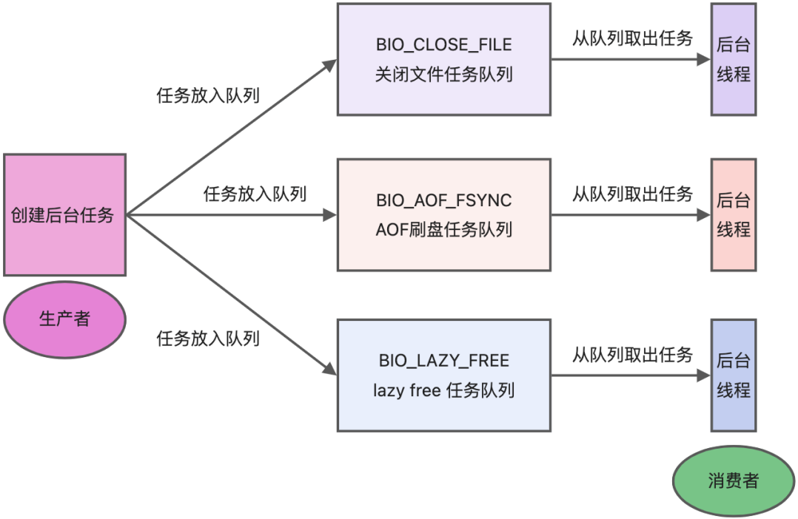
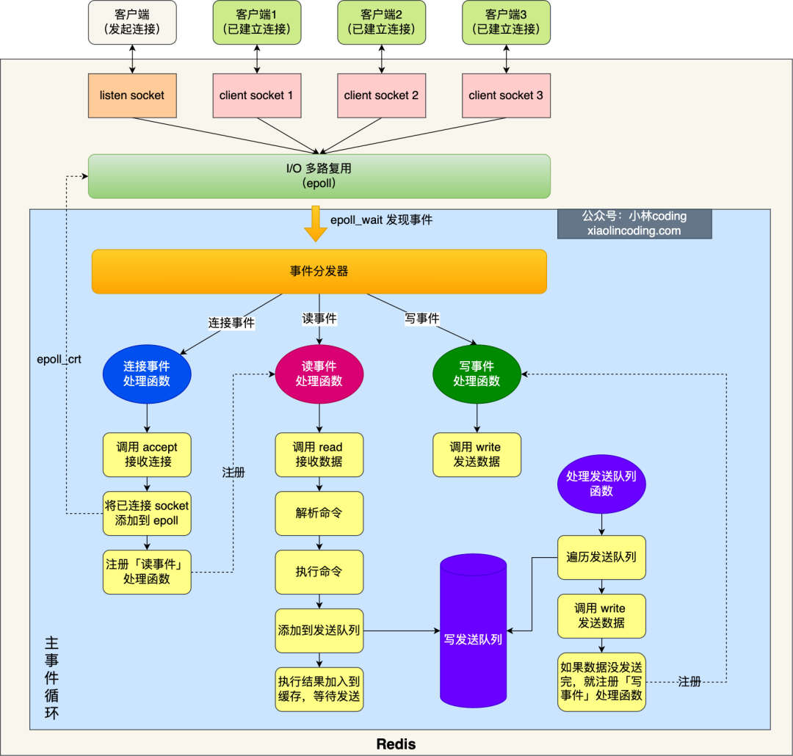
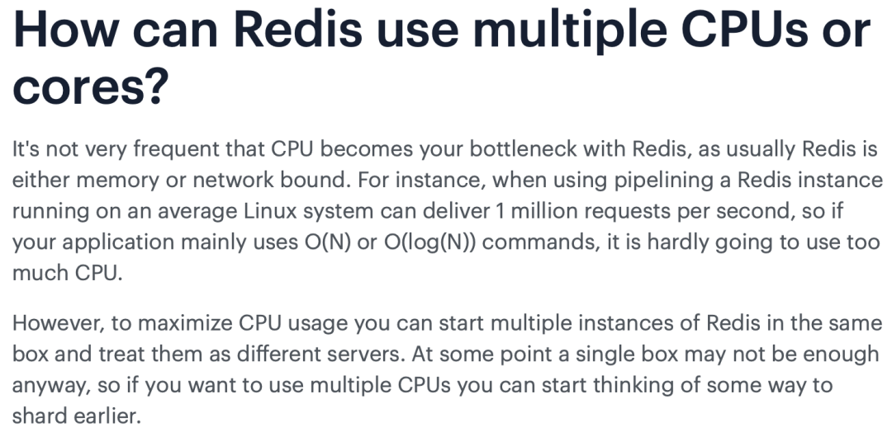

# Table of Contents

* [**Redis 是单线程吗？**](#redis-是单线程吗)
* [**Redis 单线程模式是怎样的？**](#redis-单线程模式是怎样的)
* [**Redis 采用单线程为什么还这么快？**](#redis-采用单线程为什么还这么快)
* [**Redis 6.0 之前为什么使用单线程？**](#redis-60-之前为什么使用单线程)
* [Redis 6.0 之后为什么引入了多线程？](#redis-60-之后为什么引入了多线程)
* [Redis 6.0 多线程模型](#redis-60-多线程模型)
* [总结](#总结)
* [参考资料](#参考资料)

​	

# **Redis 是单线程吗？**

**Redis 单线程指的是「接收客户端请求->解析请求 ->进行数据读写等操作->发生数据给客户端」这个过程是由一个线程（主线程）来完成的**，这也是我们常说 Redis 是单线程的原因。

但是，**Redis 程序并不是单线程的**，Redis 在启动的时候，是会**启动后台线程（BIO）**的：

- **Redis 在 2.6 版本**，会启动 2 个后台线程，分别处理关闭文件、AOF 刷盘这两个任务；
- **Redis 在 4.0 版本之后**，新增了一个新的后台线程，用来异步释放 Redis 内存，也就是 lazyfree 线程。例如执行 unlink key / flushdb async / flushall async 等命令，会把这些删除操作交给后台线程来执行，好处是不会导致 Redis 主线程卡顿。因此，当我们要删除一个大 key 的时候，不要使用 del 命令删除，因为 del 是在主线程处理的，这样会导致 Redis 主线程卡顿，因此我们应该使用 unlink 命令来异步删除大key。

之所以 Redis 为「关闭文件、AOF 刷盘、释放内存」这些任务创建单独的线程来处理，是因为这些任务的操作都是很耗时的，如果把这些任务都放在主线程来处理，那么 Redis 主线程就很容易发生阻塞，这样就无法处理后续的请求了。

后台线程相当于一个消费者，生产者把耗时任务丢到任务队列中，消费者（BIO）不停轮询这个队列，拿出任务就去执行对应的方法即可。

关闭文件、AOF 刷盘、释放内存这三个任务都有各自的任务队列：

- BIO_CLOSE_FILE，关闭文件任务队列：当队列有任务后，后台线程会调用 close(fd) ，将文件关闭；
- BIO_AOF_FSYNC，AOF刷盘任务队列：当 AOF 日志配置成 everysec 选项后，主线程会把 AOF 写日志操作封装成一个任务，也放到队列中。当发现队列有任务后，后台线程会调用 fsync(fd)，将 AOF 文件刷盘，
- BIO_LAZY_FREE，lazy free 任务队列：当队列有任务后，后台线程会 free(obj) 释放对象 / free(dict) 删除数据库所有对象 / free(skiplist) 释放跳表对象；

# **Redis 单线程模式是怎样的？**

Redis 6.0 版本之前的单线模式如下图：

**图中的蓝色部分是一个事件循环，是由主线程负责的，可以看到网络 I/O 和命令处理都是单线程。**Redis 初始化的时候，会做下面这几年事情：

- 首先，调用 epoll_create() 创建一个 epoll 对象和调用 socket() 一个服务端 socket
- 然后，调用 bind() 绑定端口和调用 listen() 监听该 socket；
- 然后，将调用 epoll_crt() 将 listen socket 加入到 epoll，同时注册「连接事件」处理函数。

初始化完后，主线程就进入到一个**事件循环函数**，主要会做以下事情：

- 首先，先调用**处理发送队列函数**，看是发送队列里是否有任务，如果有发送任务，则通过 write 函数将客户端发送缓存区里的数据发送出去，如果这一轮数据没有发生完，就会注册写事件处理函数，等待 epoll_wait 发现可写后再处理 。

- 接着，调用 epoll_wait 函数等待事件的到来：

- 

- - 如果是**连接事件**到来，则会调用**连接事件处理函数**，该函数会做这些事情：调用 accpet 获取已连接的 socket ->  调用 epoll_ctr 将已连接的 socket 加入到 epoll -> 注册「读事件」处理函数；
  - 如果是**读事件**到来，则会调用**读事件处理函数**，该函数会做这些事情：调用 read 获取客户端发送的数据 -> 解析命令 -> 处理命令 -> 将客户端对象添加到发送队列 -> 将执行结果写到发送缓存区等待发送；
  - 如果是**写事件**到来，则会调用**写事件处理函数**，该函数会做这些事情：通过 write 函数将客户端发送缓存区里的数据发送出去，如果这一轮数据没有发生完，就会继续注册写事件处理函数，等待 epoll_wait 发现可写后再处理 。

以上就是 Redis 单线模式的工作方式，如果你想看源码解析，可以参考这一篇：[为什么单线程的 Redis 如何做到每秒数万 QPS ？](https://mp.weixin.qq.com/s?__biz=MzUxODAzNDg4NQ==&mid=2247511819&idx=2&sn=b6c533071625d9f11c019f8a6c0f1b63&scene=21#wechat_redirect)

# **Redis 采用单线程为什么还这么快？**

之所以 Redis 采用单线程（网络 I/O 和执行命令）那么快，有如下几个原因：

- Redis 的大部分操作**都在内存中完成**，并且采用了高效的数据结构，因此 Redis 瓶颈可能是机器的内存或者网络带宽，而并非 CPU，既然 CPU 不是瓶颈，那么自然就采用单线程的解决方案了；
- Redis 采用单线程模型可以**避免了多线程之间的竞争**，省去了多线程切换带来的时间和性能上的开销，而且也不会导致死锁问题。
- Redis 采用了 **I/O 多路复用机制**处理大量的客户端 Socket 请求，IO 多路复用机制是指一个线程处理多个 IO 流，就是我们经常听到的 select/epoll 机制。简单来说，在 Redis 只运行单线程的情况下，该机制允许内核中，同时存在多个监听 Socket 和已连接 Socket。内核会一直监听这些 Socket 上的连接请求或数据请求。一旦有请求到达，就会交给 Redis 线程处理，这就实现了一个 Redis 线程处理多个 IO 流的效果。

# **Redis 6.0 之前为什么使用单线程？**

我们都知道单线程的程序是无法利用服务器的多核 CPU 的，那么早期 Redis 版本的主要工作（网络 I/O 和执行命令）为什么还要使用单线程呢？我们不妨先看一下Redis官方给出的FAQ。

核心意思是：**CPU 并不是制约 Redis 性能表现的瓶颈所在**，更多情况下是受到内存大小和网络I/O的限制，所以 Redis 核心网络模型使用单线程并没有什么问题，如果你想要使用服务的多核CPU，可以在一台服务器上启动多个节点或者采用分片集群的方式。

除了上面的官方回答，选择单线程的原因也有下面的考虑。

使用了单线程后，可维护性高，多线程模型虽然在某些方面表现优异，但是它却引入了程序执行顺序的不确定性，带来了并发读写的一系列问题，**增加了系统复杂度、同时可能存在线程切换、甚至加锁解锁、死锁造成的性能损耗**。

#  Redis 6.0 之后为什么引入了多线程？

虽然 Redis 的主要工作（网络 I/O 和执行命令）一直是单线程模型，但是**在 Redis 6.0 版本之后，也采用了多个 I/O 线程来处理网络请求**，**这是因为随着网络硬件的性能提升，Redis 的性能瓶颈有时会出现在网络 I/O 的处理上**。

所以为了提高网络请求处理的并行度，**Redis 6.0 对于网络请求采用多线程来处理**。**但是对于命令执行，Redis 仍然使用单线程来处理，**所以大家**不要误解** Redis 有多线程同时执行命令。

关于线程数的设置，官方的建议是如果为 4 核的 CPU，建议线程数设置为 2 或 3，如果为 8 核 CPU 建议线程数设置为 6，线程数一定要小于机器核数，线程数并不是越大越好。因此， **Redis 6.0 版本之后，**Redis 在启动的时候，默认情况下会有 6 个线程：

- Redis-server ：Redis的主线程，主要负责执行命令；
- bio_close_file、bio_aof_fsync、bio_lazy_free：三个后台线程，分别异步处理关闭文件任务、AOF刷盘任务、释放内存任务；
- io_thd_1、io_thd_2、io_thd_3：三个 I/O 线程，io-threads 默认是 4 ，所以会启动 3（4-1）个 I/O 多线程，用来分担 Redis 网络 I/O 的压力。

# Redis 6.0 多线程模型

 思路：**将主线程 IO 读写任务拆分出来给一组独立的线程处理，使得多个 socket 读写可以并行化，但是 Redis 命令还是主线程串行执行。** 

不太懂

https://zhuanlan.zhihu.com/p/393223209

# 总结

+ 6.0 版本之前，Redis 的核心网络模型一直是一个典型的单 Reactor 模型：利用 epoll/select/kqueue 等多路复用技术，在单线程的事件循环中不断去处理事件（客户端请求），最后回写响应数据到客户端： 
+ 

# 参考资料

+ https://mp.weixin.qq.com/s/apScwfXHWlh8xUS1RhMSIA
