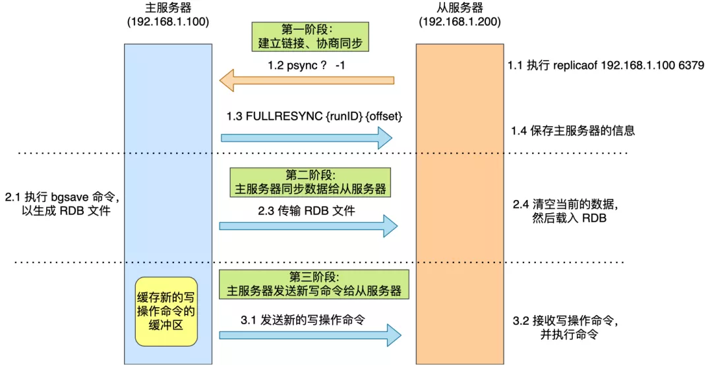
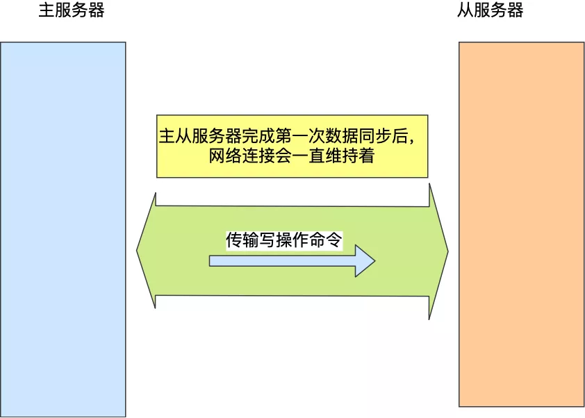
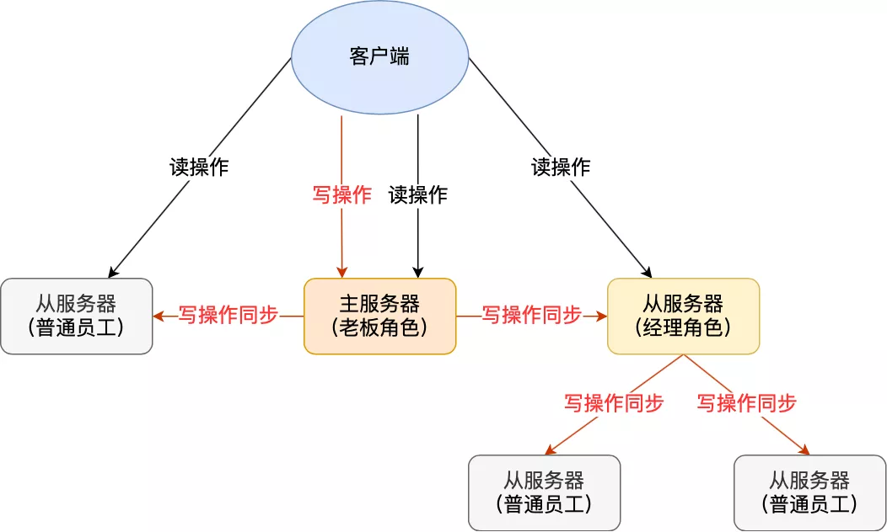
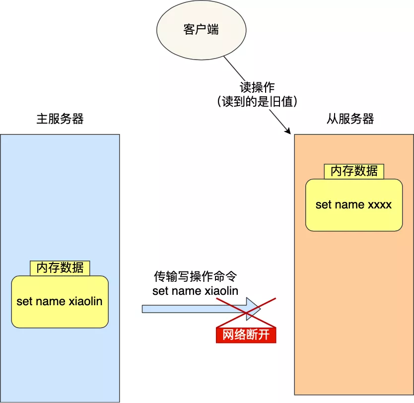
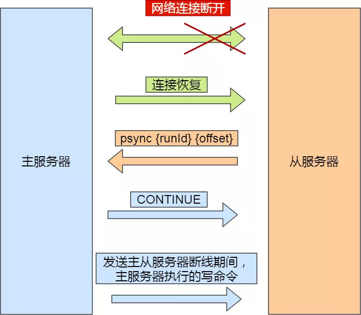
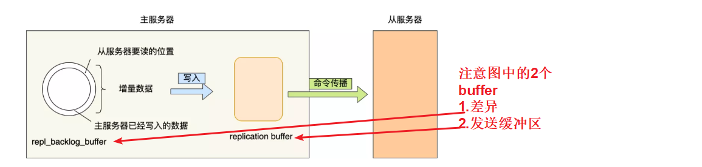
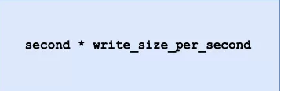

# Table of Contents

* [参考资料](#参考资料)
* [主从基本概述](#主从基本概述)
* [你会怎么设计主从？](#你会怎么设计主从)
* [第一次同步](#第一次同步)
* [命令传播](#命令传播)
* [分摊主服务器的压力](#分摊主服务器的压力)
* [增量复制](#增量复制)
* [小结](#小结)
* [更深入理解](#更深入理解)
  * [当主服务器不进行持久化时复制的安全性](#当主服务器不进行持久化时复制的安全性)
  * [为什么主从全量复制使用RDB而不使用AOF？](#为什么主从全量复制使用rdb而不使用aof)
  * [为什么还有无磁盘复制模式？](#为什么还有无磁盘复制模式)
  * [Wait命令](#wait命令)
  * [为什么还会有从库的从库的设计？](#为什么还会有从库的从库的设计)
  * [读写分离及其中的问题](#读写分离及其中的问题)


任何服务，一个节点都是不可能支撑起来的，要避免单点故障，即保证高可用，便需要冗余（副本）方式提供集群服务。

而Redis 提供了主从库模式，以保证数据副本的一致，主从库之间采用的是读写分离的方式。

Mysql kafka都是采用的类似的机制，当你理解了Redis，其他也差不多了。


# 参考资料


# 主从基本概述

主从复制，是指将一台Redis服务器的数据，复制到其他的Redis服务器。前者称为主节点(master)，后者称为从节点(slave)；<font color=red>数据的复制是单向的，只能由主节点到从节点。</font>


**主从复制的作用**主要包括：

- **数据冗余**：主从复制实现了数据的热备份，是持久化之外的一种数据冗余方式。
- **故障恢复**：当主节点出现问题时，可以由从节点提供服务，实现快速的故障恢复；实际上是一种服务的冗余。
- **负载均衡**：在主从复制的基础上，配合读写分离，可以由主节点提供写服务，由从节点提供读服务（即写Redis数据时应用连接主节点，读Redis数据时应用连接从节点），分担服务器负载；尤其是在写少读多的场景下，通过多个从节点分担读负载，可以大大提高Redis服务器的并发量。
- **高可用基石**：除了上述作用以外，主从复制还是哨兵和集群能够实施的基础，因此说主从复制是Redis高可用的基础。

主从库之间采用的是**读写分离**的方式。

- 读操作：主库、从库都可以接收；
- 写操作：首先到主库执行，然后，主库将写操作同步给从库。


# 你会怎么设计主从？

1. 首先你要先确定谁是主 谁是从库吧
2. 主库什么时候同步？是全量还是增量，还是混合？
3. 主库怎么发消息到从库？
4. 主库一直发消息是不是压力大？既要承受写的压力，又要承受发消息给从库？
5. 主库挂了怎么办？ **这个涉及到了sentinel**


基于以上的问题，我们进行Redis主从的探究


# 第一次同步


>  确定主从关系

当我们启动多个 Redis 实例的时候，它们相互之间就可以通过 replicaof（Redis 5.0 之前使用 slaveof）命令形成主库和从库的关系，之后会按照三个阶段完成数据的第一次同步。

比如，现在有服务器 A 和 服务器 B，我们在服务器 B 上执行下面这条命令：

```
# 服务器 B 执行这条命令
replicaof <服务器 A 的 IP 地址> <服务器 A 的 Redis 端口号>
```

接着，服务器 B 就会变成服务器 A 的「从服务器」，然后与主服务器进行第一次同步。

> 全量复制三个阶段

主从服务器间的第一次同步的过程可分为三个阶段：

- 第一阶段是建立链接、协商同步；
- 第二阶段是主服务器同步数据给从服务器；
- 第三阶段是主服务器发送新写操作命令给从服务器。





接下来，我在具体介绍每一个阶段都做了什么。

1. *第一阶段：建立链接、协商同步*

执行了 replicaof 命令后，从服务器就会给主服务器发送 `psync` 命令，表示要进行数据同步。

psync 命令包含两个参数，分别是**主服务器的 runID** 和**复制进度 offset**。

- runID，每个 Redis 服务器在启动时都会自动生产一个随机的 ID 来唯一标识自己。当从服务器和主服务器第一次同步时，因为不知道主服务器的 run ID，所以将其设置为 "?"。
- offset，表示复制的进度，第一次同步时，其值为 -1。

主服务器收到 psync 命令后，会用 `FULLRESYNC` 作为响应命令返回给对方。

并且这个响应命令会带上两个参数：主服务器的 runID 和主服务器目前的复制进度 offset。从服务器收到响应后，会记录这两个值。

FULLRESYNC 响应命令的意图是采用**全量复制**的方式，也就是主服务器会把所有的数据都同步给从服务器。

所以，第一阶段的工作时为了全量复制做准备。

那具体怎么全量同步呀呢？我们可以往下看第二阶段。

2. *第二阶段：主服务器同步数据给从服务器*

接着，主服务器会执行 bgsave 命令来生成 RDB 文件，然后把文件发送给从服务器。

从服务器收到 RDB 文件后，会先清空当前的数据，然后载入 RDB 文件。

这里有一点要注意，主服务器生成 RDB 这个过程是不会阻塞主线程的，也就是说 Redis 依然可以正常处理命令。

但是这期间的写操作命令并没有记录到刚刚生成的 RDB 文件中，这时主从服务器间的数据就不一致了。

那么为了保证主从服务器的数据一致性，**主服务器会将在 RDB 文件生成后收到的写操作命令，写入到 replication buffer 缓冲区里。**

3. *第三阶段：主服务器发送新写操作命令给从服务器*

在主服务器生成的 RDB 文件发送后，然后将 replication buffer 缓冲区里所记录的写操作命令发送给从服务器，然后从服务器重新执行这些操作。

至此，主从服务器的第一次同步的工作就完成了。


# 命令传播

主从服务器在完成第一次同步后，双方之间就会维护一个 TCP 连接。



后续主服务器可以通过这个连接继续将写操作命令传播给从服务器，然后从服务器执行该命令，使得与主服务器的数据库状态相同。

而且这个连接是长连接的，目的是避免频繁的 TCP 连接和断开带来的性能开销。

上面的这个过程被称为**基于长连接的命令传播**，通过这种方式来保证第一次同步后的主从服务器的数据一致性。


# 分摊主服务器的压力

> 主->从->从

Redis 也是一样的，从服务器可以有自己的从服务器，我们可以把拥有从服务器的从服务器当作经理角色，它不仅可以接收主服务器的同步数据，自己也可以同时作为主服务器的形式将数据同步给从服务器，组织形式如下图：



通过这种方式，**主服务器生成 RDB 和传输 RDB 的压力可以分摊到充当经理角色的从服务器**。

那具体怎么做到的呢？

其实很简单，我们在「从服务器」上执行下面这条命令，使其作为目标服务器的从服务器：

```
replicaof <目标服务器的IP> 6379
```

此时如果目标服务器本身也是「从服务器」，那么该目标服务器就会成为「经理」的角色，不仅可以接受主服务器同步的数据，也会把数据同步给自己旗下的从服务器，从而减轻主服务器的负担。

# 增量复制

可是，网络总是不按套路出牌的嘛，说延迟就延迟，说断开就断开。

如果主从服务器间的网络连接断开了，那么就无法进行命令传播了，这时从服务器的数据就没办法和主服务器保持一致了，客户端就可能从「从服务器」读到旧的数据。




那么问题来了，如果此时断开的网络，又恢复正常了，要怎么继续保证主从服务器的数据一致性呢？

在 Redis 2.8 之前，如果主从服务器在命令同步时出现了网络断开又恢复的情况，从服务器就会和主服务器重新进行一次全量复制，很明显这样的开销太大了，必须要改进一波。

所以，从 Redis 2.8 开始，网络断开又恢复后，从主从服务器会采用**增量复制**的方式继续同步，也就是只会把网络断开期间主服务器接收到的写操作命令，同步给从服务器。

网络恢复后的增量复制过程如下图：




主要有三个步骤：

- 从服务器在恢复网络后，会发送 psync 命令给主服务器，此时的 psync 命令里的 offset 参数不是 -1；
- 主服务器收到该命令后，然后用 CONTINUE 响应命令告诉从服务器接下来采用增量复制的方式同步数据；
- 然后主服务将主从服务器断线期间，所执行的写命令发送给从服务器，然后从服务器执行这些命令。

那么关键的问题来了，**主服务器怎么知道要将哪些增量数据发送给从服务器呢？**

答案藏在这两个东西里：

- **repl_backlog_buffer**，是一个「**环形**」缓冲区，用于主从服务器断连后，从中找到差异的数据；
- **replication offset**，标记上面那个缓冲区的同步进度，主从服务器都有各自的偏移量，主服务器使用 master_repl_offset 来记录自己「*写*」到的位置，从服务器使用 slave_repl_offset 来记录自己「*读*」到的位置。

那repl_backlog_buffer 缓冲区是什么时候写入的呢？

在主服务器进行命令传播时，不仅会将写命令发送给从服务器，还会将写命令写入到 repl_backlog_buffer 缓冲区里，因此 这个缓冲区里会保存着最近传播的写命令。

网络断开后，当从服务器重新连上主服务器时，从服务器会通过 psync 命令将自己的复制偏移量 slave_repl_offset 发送给主服务器，主服务器根据自己的 master_repl_offset 和 slave_repl_offset 之间的差距，然后来决定对从服务器执行哪种同步操作：

- 如果判断出从服务器要读取的数据还在 repl_backlog_buffer 缓冲区里，那么主服务器将采用**增量同步**的方式；
- 相反，如果判断出从服务器要读取的数据已经不存在 
  repl_backlog_buffer 缓冲区里，那么主服务器将采用**全量同步**的方式。

当主服务器在 repl_backlog_buffer 中找到主从服务器差异（增量）的数据后，就会将增量的数据写入到 replication buffer 缓冲区，这个缓冲区我们前面也提到过，它是缓存将要传播给从服务器的命令。



repl_backlog_buffer 缓行缓冲区的默认大小是 1M，并且由于它是一个环形缓冲区，所以当缓冲区写满后，主服务器继续写入的话，就会覆盖之前的数据。

因此，当主服务器的写入速度远超于从服务器的读取速度，缓冲区的数据一下就会被覆盖。

那么在网络恢复时，如果从服务器想读的数据已经被覆盖了，主服务器就会采用全量同步，这个方式比增量同步的性能损耗要大很多。

**因此，为了避免在网络恢复时，主服务器频繁地使用全量同步的方式，我们应该调整下 repl_backlog_buffer 缓冲区大小，尽可能的大一些，减少出现从服务器要读取的数据被覆盖的概率，从而使得主服务器采用增量同步的方式。**

那 repl_backlog_buffer 缓冲区具体要调整到多大呢？

repl_backlog_buffer 最小的大小可以根据这面这个公式估算。.



我来解释下这个公式的意思：

- second 为从服务器断线后重新连接上主服务器所需的平均 时间(以秒计算)。
- write_size_per_second 则是主服务器平均每秒产生的写命令数据量大小。

举个例子，如果主服务器平均每秒产生 1 MB 的写命令，而从服务器断线之后平均要 5 秒才能重新连接主服务器。

那么 repl_backlog_buffer 大小就不能低于 5 MB，否则新写地命令就会覆盖旧数据了。

当然，为了应对一些突发的情况，可以将 repl_backlog_buffer 的大小设置为此基础上的 2 倍，也就是 10 MB。

关于 repl_backlog_buffer 大小修改的方法，只需要修改配置文件里下面这个参数项的值就可以。

```java
repl-backlog-size 1mb
```


# 小结

主从复制共有三种模式：**全量复制、基于长连接的命令传播、增量复制**。

主从服务器第一次同步的时候，就是采用全量复制，此时主服务器会两个耗时的地方，分别是生成 RDB 文件和传输 RDB 文件。为了避免过多的从服务器和主服务器进行全量复制，可以把一部分从服务器升级为「经理角色」，让它也有自己的从服务器，通过这样可以分摊主服务器的压力。

第一次同步完成后，主从服务器都会维护着一个长连接，主服务器在接收到写操作命令后，就会通过这个连接将写命令传播给从服务器，来保证主从服务器的数据一致性。

如果遇到网络断开，增量复制就可以上场了，不过这个还跟 repl_backlog_size 这个大小有关系。

如果它配置的过小，主从服务器网络恢复时，可能发生「从服务器」想读的数据已经被覆盖了，那么这时就会导致主服务器采用全量复制的方式。所以为了避免这种情况的频繁发生，要调大这个参数的值，以降低主从服务器断开后全量同步的概率。


# 更深入理解

## 当主服务器不进行持久化时复制的安全性

那岂不是下一次全量复制直接给覆盖了？


在进行主从复制设置时，强烈建议在主服务器上开启持久化，当不能这么做时，比如考虑到延迟的问题，应该将实例配置为避免自动重启。


## 为什么主从全量复制使用RDB而不使用AOF？

我觉得就一句话 
RDB快啊 

假设要使用AOF做全量复制，意味着必须打开AOF功能，打开AOF就要选择**文件刷盘的策略**，选择不当会严重影响Redis性能。而RDB只有在需要定时备份和主从全量复制数据时才会触发生成一次快照。而在很多丢失数据不敏感的业务场景，其实是不需要开启AOF的。


## 为什么还有无磁盘复制模式？

Redis 默认是磁盘复制，但是**如果使用比较低速的磁盘，这种操作会给主服务器带来较大的压力**。Redis从2.8.18版本开始尝试支持无磁盘的复制。使用这种设置时，子进程直接将RDB通过网络发送给从服务器，不使用磁盘作为中间存储。

**无磁盘复制模式**：master创建一个新进程直接dump RDB到slave的socket，不经过主进程，不经过硬盘。适用于disk较慢，并且网络较快的时候。

使用`repl-diskless-sync`配置参数来启动无磁盘复制。

使用`repl-diskless-sync-delay` 参数来配置传输开始的延迟时间；master等待一个`repl-diskless-sync-delay`的秒数，如果没slave来的话，就直接传，后来的得排队等了; 否则就可以一起传。


## Wait命令

　　Redis 的复制是异步进行的，wait 指令可以让异步复制变身同步复制，确保系统的强一致性 (不严格)。wait 指令是 Redis3.0 版本以后才出现的。

```mysql
> set key value

OK

> wait 1 0

(integer) 1

```

　　wait 提供两个参数，第一个参数是从库的数量 N，第二个参数是时间 t，以毫秒为单位(为0：表示无限等待)。

它表示等待 **wait 指令之前的所有写操作**同步到 N 个从库 (也就是确保 N 个从库的同步没有滞后)，最多等待时间 t。如果时间 t=0，表示无限等待直到 N 个从库同步完成达成一致。

假设此时出现了网络分区，wait 指令第二个参数时间 t=0，主从同步无法继续进行，wait 指令会永远阻塞，Redis 服务器将丧失可用性。


##  为什么还会有从库的从库的设计？


通过分析主从库间第一次数据同步的过程，你可以看到，一次全量复制中，对于主库来说，需要完成两个耗时的操作：**生成 RDB 文件和传输 RDB 文件**。

如果从库数量很多，而且都要和主库进行全量复制的话，就会导致主库忙于 fork 子进程生成 RDB 文件，进行数据全量复制。fork 这个操作会阻塞主线程处理正常请求，从而导致主库响应应用程序的请求速度变慢。此外，传输 RDB 文件也会占用主库的网络带宽，同样会给主库的资源使用带来压力。那么，有没有好的解决方法可以分担主库压力呢？

其实是有的，这就是“主 - 从 - 从”模式。

在刚才介绍的主从库模式中，所有的从库都是和主库连接，所有的全量复制也都是和主库进行的。现在，我们可以通过“主 - 从 - 从”模式**将主库生成 RDB 和传输 RDB 的压力，以级联的方式分散到从库上**。

简单来说，我们在部署主从集群的时候，可以手动选择一个从库（比如选择内存资源配置较高的从库），用于级联其他的从库。然后，我们可以再选择一些从库（例如三分之一的从库），在这些从库上执行如下命令，让它们和刚才所选的从库，建立起主从关系。


## 读写分离及其中的问题

在主从复制基础上实现的读写分离，可以实现Redis的读负载均衡：由主节点提供写服务，由一个或多个从节点提供读服务（多个从节点既可以提高数据冗余程度，也可以最大化读负载能力）；在读负载较大的应用场景下，可以大大提高Redis服务器的并发量。下面介绍在使用Redis读写分离时，需要注意的问题。

- **延迟与不一致问题**

前面已经讲到，由于主从复制的命令传播是异步的，延迟与数据的不一致不可避免。

如果应用对数据不一致的接受程度程度较低，可能的优化措施包括：

+ 优化主从节点之间的网络环境（如在同机房部署）；

+ 监控主从节点延迟（通过offset）判断，如果从节点延迟过大，通知应用不再通过该从节点读取数据；

+ 使用集群同时扩展写负载和读负载等。

在命令传播阶段以外的其他情况下，从节点的数据不一致可能更加严重，例如连接在数据同步阶段，或从节点失去与主节点的连接时等。从节点的slave-serve-stale-data参数便与此有关：它控制这种情况下从节点的表现；如果为yes（默认值），则从节点仍能够响应客户端的命令，如果为no，则从节点只能响应info、slaveof等少数命令。该参数的设置与应用对数据一致性的要求有关；如果对数据一致性要求很高，则应设置为no。

- **数据过期问题**

在单机版Redis中，存在两种删除策略：

- `惰性删除`：服务器不会主动删除数据，只有当客户端查询某个数据时，服务器判断该数据是否过期，如果过期则删除。
- `定期删除`：服务器执行定时任务删除过期数据，但是考虑到内存和CPU的折中（删除会释放内存，但是频繁的删除操作对CPU不友好），该删除的频率和执行时间都受到了限制。

在主从复制场景下，为了主从节点的数据一致性，从节点不会主动删除数据，而是由主节点控制从节点中过期数据的删除。由于主节点的惰性删除和定期删除策略，都不能保证主节点及时对过期数据执行删除操作，因此，当客户端通过Redis从节点读取数据时，很容易读取到已经过期的数据。

**Redis 3.2中，从节点在读取数据时，增加了对数据是否过期的判断：如果该数据已过期，则不返回给客户端；将Redis升级到3.2可以解决数据过期问题。**

- **故障切换问题**

在没有使用哨兵的读写分离场景下，应用针对读和写分别连接不同的Redis节点；

当主节点或从节点出现问题而发生更改时，需要及时修改应用程序读写Redis数据的连接；

连接的切换可以手动进行，或者自己写监控程序进行切换，但前者响应慢、容易出错，后者实现复杂，成本都不算低。

- **总结**

在使用读写分离之前，可以考虑其他方法增加Redis的读负载能力：如尽量优化主节点（减少慢查询、减少持久化等其他情况带来的阻塞等）提高负载能力；使用Redis集群同时提高读负载能力和写负载能力等。如果使用读写分离，可以使用哨兵，使主从节点的故障切换尽可能自动化，并减少对应用程序的侵入。

